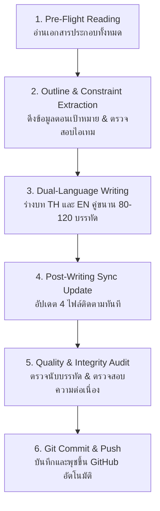

# 🌲 10,000 BC: The Lost Courier (พลิกยุคหินด้วยรถพัสดุหมื่นชิ้น)

> **Master Story Production Hub & Narrative Engine (ศูนย์บัญชาการสร้างเนื้อเรื่องและคู่มือปฏิบัติการแม่บท)**  
> *บันทึกนวนิยายเอาชีวิตรอด ประวัติศาสตร์ดึกดำบรรพ์ ไซไฟสร้างอารยธรรม และโลจิสติกส์ข้ามมิติ*

---

## 📖 1. บทนำและโครงเรื่องโดยย่อ (Story Premise)

เมื่อ **"ธาม" (Thame)** บัณฑิตวิศวกรรมวัย 24 ปี รับช่วงขับรถบรรทุกสิบล้อตู้ทึบอลูมิเนียม **Hino 500 Victor 380HP (น้ำหนักรวมบรรทุก 25 ตัน)** ขนส่งพัสดุสินค้าออนไลน์ประมาณ **3,000 – 4,000 กล่อง/ซอง (เฉลี่ยประเมิน ~3,500 ± ชิ้น ยืดหยุ่นตามขนาดกล่องเล็ก-ใหญ่)** แทนลุงเดชข้ามเส้นทางหลวงช่องเขาตอนเหนือ แต่กลับถูกมวลพายุหมอกทมิฬกลืนกินในเวลา 14:47 น. และถูก "อะไรบางอย่าง" ชนกระแทกท้ายอย่างจังจนรถไถลแหกโค้งตกก้นหุบเขา

เมื่อฟื้นขึ้นมา เขาพบว่าช่วงล่างรถพังยับเยิน แหนบหัก เพลาคด ล้อแตก จมหล่มดินเลนหนืด ขับเคลื่อนไม่ได้ถาวร และสถานที่ที่เขาอยู่ไม่ใช่ป่าในโลกปัจจุบัน แต่เป็น **ยุคปลายไพลสโตซีน (10,000 ปีก่อนคริสตกาล)** ท่ามกลางหุบเขาหินปูน ป่าสนดึกดำบรรพ์ อุณหภูมิติดลบของคลื่นความเย็น Younger Dryas สัตว์นักล่ายักษ์ดึกดำบรรพ์ (หมีถ้ำ, หมาป่าไดร์วูล์ฟ, เสือเขี้ยวดาบ) และชนเผ่ามนุษย์ยุคหิน!

ด้วย **ปืนพกลูกโม่ S&W .38 พร้อมกระสุน 43 นัด** ใต้เบาะนอน, พัสดุออนไลน์ท้ายรถที่ต้องสุ่มแกะเพื่อเอาชีวิตรอด, องค์ความรู้วิศวกรรม, และ **สัญญาณโทรศัพท์ 2G ลึกลับ 1 ขีดบนหลังคารถ** ที่เชื่อมต่อกับเว็บบอร์ดวอร์รูมออนไลน์ในโลกปัจจุบัน ธามจึงต้องเปลี่ยนปราการรถ 10 ล้อให้กลายเป็นฐานที่มั่น ผูกมิตรกับ **เผ่ากวางผา (Cliff Deer Clan)** พลิกฟื้นอารยธรรมมนุษย์ และเผชิญหน้ากับกลุ่มผู้รอดชีวิตร่วมมิติฝ่ายมืด **"วิกเตอร์"** ที่เข้ายึดครอง **เผ่ากินคนเขี้ยวอสูร (Demon Fang Clan)** ในสงครามชี้ชะตาประวัติศาสตร์มนุษยชาติ!

---

## 🗂️ 2. สารบัญเอกสารแม่บททั้งหมดในโครงการ (Master Document Ecosystem)

เอกสารทุกไฟล์ในโครงการนี้ถูกออกแบบให้เชื่อมโยงกันอย่างเป็นระบบ โดยมีลิงก์ตรงสำหรับเปิดอ่านได้ทันที:

| เอกสาร | บทบาทหน้าที่ในโครงการ | ลิงก์ไฟล์ในระบบ |
| :--- | :--- | :--- |
| 📜 **[prompt.md](./prompt.md)** | **Prompt Bible & กฎเหล็ก 63 ประการ:** คัมภีร์กฎการประพันธ์ เทมเพลตคำสั่งหลัก สเปกบรรทัด 80-120 กฎความสมจริงทางฟิสิกส์/เคมี/การแพทย์ กฎวอร์รูม 2G และตารางบันทึกประวัติรายตอน | [เปิด prompt.md](file:///d:/myproject1/EBOOKs/10000-BC/prompt.md) |
| 🗺️ **[chapters_outline.md](./chapters_outline.md)** | **โครงร่างรายตอน 150–200 ตอน (Chapters Outline):** แผนผังมหากาพย์ 6 Sagas กำหนดฉาก บีทเรื่อง กล่องพัสดุที่จะแกะ ปฏิสัมพันธ์กระทู้ และระบบทิ้งท้าย (Cliffhangers) รายบท | [เปิด chapters_outline.md](file:///d:/myproject1/EBOOKs/10000-BC/chapters_outline.md) |
| 📊 **[chapters_summary.md](./chapters_summary.md)** | **สรุปเนื้อหารายตอนและสถานะปัจจุบัน (Story State Tracker):** Single Source of Truth สำหรับไทม์ไลน์ เวลา อุณหภูมิ แผลคนเจ็บ และจุดทิ้งท้ายก่อนเริ่มตอนใหม่ | [เปิด chapters_summary.md](file:///d:/myproject1/EBOOKs/10000-BC/chapters_summary.md) |
| 👤 **[character.md](./character.md)** | **ฐานข้อมูลตัวละคร (Character Codex):** โปรไฟล์ธาม, ชนเผ่ากวางผา (คูราน, เอลยา, ทาร่า, โมกา), เผ่าเขี้ยวอสูร, ผู้รอดชีวิตร่วมมิติ (วิกเตอร์, หมอณิชา) และสมาชิกวอร์รูมออนไลน์ | [เปิด character.md](file:///d:/myproject1/EBOOKs/10000-BC/character.md) |
| 📦 **[inventory.md](./inventory.md)** | **คลังพัสดุแม่บท (~3,500 ± กล่อง/ซอง) และสเปกรถ 10 ล้อ (Master Cargo Manifest):** รายการสินค้า 8 หมวดหมู่ (ยืดหยุ่นตามขนาดพัสดุ), สเปกรถบรรทุก 10 ล้อ Hino 500 Victor 380HP, ถังน้ำมัน 390L, แบตเตอรี่, ชิ้นส่วนเหล็กช่วงล่าง | [เปิด inventory.md](file:///d:/myproject1/EBOOKs/10000-BC/inventory.md) |
| 🎒 **[items.md](./items.md)** | **คลังไอเทมประจำตัวและยอดคงเหลือจริง (EDC & Live Inventory):** ยุทธภัณฑ์ EDC ในกระเป๋า/เสื้อกั๊ก, อาวุธประจำกาย, อุปกรณ์สนาม, และตัดยอดทรัพยากรสิ้นเปลือง (กระสุน 43 นัด, ดีเซล, ยา, เกลือ) | [เปิด items.md](file:///d:/myproject1/EBOOKs/10000-BC/items.md) |
| 📋 **[unboxing_log.md](./unboxing_log.md)** | **บันทึกประวัติการแกะกล่องพัสดุ (Dedicated Unboxing Master Log):** ทะเบียนบาร์โค้ด Waybill พัสดุที่เปิดแล้ว การใช้งาน สภาพสินค้า และยอดคงเหลือในตู้ทึบ | [เปิด unboxing_log.md](file:///d:/myproject1/EBOOKs/10000-BC/unboxing_log.md) |
| 🧭 **[story_outline.md](./story_outline.md)** / **[outline.md](./outline.md)** | **โครงเรื่องแม่บท 4 องก์ (Master Narrative Arc):** ปมขัดแย้ง 5 มิติ (เอาชีวิตรอด, ชนเผ่า, วิทยาการ, ความลับข้ามมิติ, ปรัชญาศีลธรรม) และกฎเกณฑ์ยุคหิน | [เปิด story_outline.md](file:///d:/myproject1/EBOOKs/10000-BC/story_outline.md) |
| 🏰 **[fortress_alpha.md](./fortress_alpha.md)** | **คู่มือชัยภูมิป้อมปราการอัลฟ่าและที่พักแม่บท (Master Base Camp Codex):** บันทึกสภาพแวดล้อม ภูมิศาสตร์ 4 ทิศ ถ้ำลับผาสวรรค์ สถาปัตยกรรมปราการรถ 10 ล้อ และโครงสร้างพื้นฐานค่าย | [เปิด fortress_alpha.md](file:///d:/myproject1/EBOOKs/10000-BC/fortress_alpha.md) |
| 📚 **[chapters/](./chapters/)** | **คลังต้นฉบับบทนิยายสองภาษา (Bilingual Manuscript Vault):** โฟลเดอร์จัดเก็บไฟล์บทนิยายภาษาไทย (`chapter_XXX_th.md`) และภาษาอังกฤษ (`chapter_XXX_en.md`) | [เปิดโฟลเดอร์ chapters/](file:///d:/myproject1/EBOOKs/10000-BC/chapters/) |

---

## 🗺️ 3. แผนผังชัยภูมิป้อมอัลฟ่าและถ้ำลับบนหน้าผา (Fortress Alpha Blueprint & The Secret Cliff Cavern)

เพื่อให้ผู้เขียนและ AI ทุกคนมี **ภาพจำลองพื้นที่ตรงกัน 100% (Shared Spatial Mental Model)** ค่ายหลักถูกสถาปนาขึ้นใน **แอ่งเกือกม้าหินปูน (Horseshoe Karst Amphitheater)** ขนาบด้วยหน้าผาสูงชัน 30–40 เมตร 3 ด้าน โดยมีแผนผังยุทธวิธีและจุดที่ตั้งสำคัญดังนี้:

```text
                           [ทิศเหนือ (North) - ลมหนาวขั้วโลก]
                   ▲▲▲ หน้าผาหินปูนสูงชัน 30–40 เมตร (กำแพงหินธรรมชาติ) ▲▲▲
                 ▲▲▲▲▲▲▲▲▲▲▲▲▲▲▲▲▲▲▲▲▲▲▲▲▲▲▲▲▲▲▲▲▲▲▲▲▲▲▲▲▲▲▲▲▲▲▲▲▲▲▲▲▲▲▲
                 ▲   [ปล่องหินระบายไอน้ำ & รับแสงแดด (Natural Skylight)] ▲
                 ▲                     ░░░                             ▲
                 ▲   [ป้อมถ้ำชั้นใน / ถ้ำนิทราแห่งจิตวิญญาณผา] (สูง 15 ม.) ▲
                 ▲   - ปากถ้ำซ่อนหลังม่านเถาวัลย์ / อบอุ่นสบาย 22-25°C      ▲
                 ▲   ♨️ บ่อน้ำแร่ร้อนมรกต 40°C (ฮีตเตอร์ธรรมชาติ/สปายุคหิน)▲
                 ▲   💧 ตาน้ำผุดธารน้ำแข็ง (ต้นทางระบบประปาแรงโน้มถ่วง)      ▲
                 ▲   📦 ป้อมปราการสำรอง / คลังยา & เมล็ดพันธุ์ / ภาพเขียนสี▲
                 ▲   - กองมูลค้างคาวดึกดำบรรพ์ (ดินประสิว/ไนเตรตทำปุ๋ย)     ▲
                 ▲                ▲                                    ▲
                 ▲     [เนินสองขีด / ผาสัญญาณ 2G] (ชะง่อนหินสูง 8 ม.)    ▲
                 ▲                │ [รางประปาไม้ไผ่แรงโน้มถ่วง /       ▲
                 ▲                │  "ลำธารมังกรไผ่" เสาค้ำทรง A]       ▲
  [ทิศตะวันตก]   ▲                ├────────────────────────┐           ▲  [ทิศตะวันออก]
  (West)         ▲                ▼                        ▼           ▲  (East)
  ──────────┐    ▲     ┌──────────────────────┐   [แปลงเกษตรขั้นบันได] ▲
  ลำธารหินขาว│    ▲     │ [ท้ายตู้คอนเทนเนอร์] │   [เรือนเพาะชำหน้าผา]  ▲  แนวผาหินปูน
  (แหล่งน้ำเดิม)│◀──150ม─┤ (คลังพัสดุ ~3,500 ชิ้น)   │   (ระบบน้ำหยด/ปุ๋ยมูล  ▲  สูงชัน ไร้ทางปีน
  (พรานดักสัตว์)│       │ [แผงโซลาร์เซลล์ 100W]│    ค้างคาว Guano)      ▲  กันลมพายุหนาว
  ──────────┘    ▲     │    รถบรรทุก 10 ล้อ    │       🔥              ▲
                 ▲     │   Hino 500 Victor    │   [ลานกองไฟส่วนกลาง]   ▲
                 ▲     │   (ปราการเหล็ก 25 ตัน)│   [เรือนไม้ซุงยาว 2 หลัง]▲
                 ▲     │                      │   (หลังคาผ้าใบ/เตาผิง  ▲
                 ▲     │ [หน้ารถ & สปอร์ตไลต์] │    Rocket Stove ต้านหนาว)▲
                 ▲     │ [โซลาร์เซลล์ 200W PIR]│  [โคมไฟแคมปิ้งโซลาร์] ▲
                 ▲     │ [ถังพักน้ำสะอาด & ครัว]│  [แนวรั้วลวดหนามล้อมค่าย]▲
                 ▲     └──────────┬───────────┘                        ▲
                 ▲                │ สปอร์ตไลต์ & แตรลม                 ▲
                 ▲                ▼ เล็งตรงคุมปากทาง (จุดยามบนหลังคารถ) ▲
                 ▲                                                     ▲
                 ▲▲▲▲▲▲▲▲▲▲                                   ▲▲▲▲▲▲▲▲▲▲
                           ▲▲▲                             ▲▲▲
                              ▲  [แนวรั้วไม้ซุง 3 ม. + ขดลวดหนาม & ขวาก]▲
                                 [สปอร์ตไลต์โซลาร์ 200W ส่องตรวจการณ์]
                               [ช่องเขากลืนวิญญาณ / คอขวดแคบ 4-5 เมตร]
                                  (Thermopylae Chokepoint & กำแพงหินซิกแซก)
                                  (จุดเวรยามตรวจการณ์หน้าประตูกล 24 ชม.)
                                             │
                                             │ (ทอดลงสู่ทุ่งหญ้า & ป่าสนล่าง)
                                             ▼
                                  [ทิศใต้ (South) / ใต้ลม]
                            [โซนหลุมสุขา & ทิ้งขยะ (ห่างค่าย 80 ม.)]
                            [ร่องระบายน้ำทิ้ง Greywater จากค่าย]
```

### 6 ชัยภูมิยุทธศาสตร์และระบบป้องกันค่าย (Bastion Camp Strategic Points):
1. **ปราการรถ 10 ล้อ (The Central Keep):** จอดหันหัวไปทางทิศใต้ (ทางเข้าคอขวด) สปอร์ตไลต์และแตรลมคู่เล็งคุมปากทางเข้า บนหลังคารถติดตั้ง **แผงโซลาร์เซลล์พับได้ 100W พร้อมสถานีชาร์จแบตเตอรี่สากล** (ชาร์จแบตเตอรี่ 20V/21V เลื่อยโซ่และสว่าน) และ **โคมไฟสปอร์ตไลต์โซลาร์เซลล์ 200W (PIR Motion Sensor)** เล็งคุมลานค่าย ซึ่งต่อสายพ่วงข้ามแนวค่ายเชื่อมเข้ากับ **โซลินอยด์วาล์วแตรลม 24V ของตัวรถ (24V Dual Air Horn Solenoid Valve)** ส่วนท้ายตู้ทึบพิงชิดแนวผาหินปูนทิศเหนือ ป้องกันการถูกตลบหลัง 100% มี **ถังพักน้ำสะอาดหลัก (Main Water Cistern)** รับน้ำต่อจากรางไม้ไผ่แรงโน้มถ่วงตั้งอยู่ข้างรถ ภายในตู้ทึบส่วนหน้าดัดแปลงเป็น **"ห้องพยาบาลและห้องผ่าตัดสนามปลอดเชื้อ (Sterile Field Clinic)"** ดูแลโดย พญ. ณิชา มีโต๊ะผ่าตัดสนาม แสงไฟ LED โซลาร์เซลล์ และตู้เก็บเวชภัณฑ์ล็อกกุญแจ หลังคารถเป็นหอคอยตรวจการณ์หลัก (Sentry Tower) มีพลธนูเข้าเวรพร้อมนกหวีดไททาเนียมส่งสัญญาณเตือนภัย
2. **ถ้ำลับผาสวรรค์ บ่อน้ำแร่ร้อน และตาน้ำผุดธารน้ำแข็ง (The Secret Cliff Sanctuary, Thermal Hot Spring & Alpine Springhead — สูง 15 ม.):** ซ่อนอยู่หลังม่านเถาวัลย์บนหน้าผาหินปูนเหนือหลังคารถ ภายในค้นพบ **"บ่อน้ำแร่ร้อนธรรมชาติมรกต (Geothermal Hot Spring 38°C – 42°C)"** ทำหน้าที่เป็นฮีตเตอร์ธรรมชาติขนาดยักษ์คุมอุณหภูมิถ้ำให้อบอุ่นสบาย 22°C – 25°C ตลอด 24 ชม. แม้ข้างนอกจะเผชิญพายุหิมะ Younger Dryas ติดลบ -20°C มี **ปล่องหินระบายอากาศธรรมชาติ (Natural Chimney / Skylight)** ทะลุยอดผาช่วยระบายไอน้ำและก๊าซด้วยระบบ Stack Effect มีแสงแดดส่องลงมา เป็นแหล่งสปาอาบน้ำอุ่น/ศูนย์พักฟื้นกายภาพและวารีบำบัดของ พญ. ณิชา (รักษาแผลเอลยาและผู้บาดเจ็บ) เรือนเพาะชำเมล็ดพันธุ์ ป้อมปราการสำรองชั้นในสุด (The High Redoubt) คลังเก็บเมล็ดพันธุ์/ยา และแหล่งมูลค้างคาว (ดินประสิวธรรมชาติ) โดยบริเวณชะง่อนผาเหนือถ้ำเป็น **"ตาน้ำผุดธารน้ำแข็งบริสุทธิ์"** ซึ่งเป็นจุดรับน้ำต้นทาง (Intake) ของ **ระบบประปารางไม้ไผ่แรงโน้มถ่วง** ที่ส่งน้ำลงสู่ค่าย
3. **ช่องแคบคอขวดและแนวรั้วลวดหนามอุปกรณ์หลักป้องกันค่าย เสริมรั้วไม้ซุงปลายแหลมและสปอร์ตไลต์โซลาร์เซลล์ (Thermopylae Chokepoint, Primary Barbed Wire Defense & Solar Floodlight):** ทางเข้าเดียวสู่หุบเขากว้างเพียง 4–5 เมตร ขนาบด้วยผาหิน บีบให้สัตว์ร้ายหรือศัตรูต้องผ่านทีละตัว โดยมี **"ระบบรั้วลวดหนามชุบสังกะสี (Barbed Wire Fence) เป็นอุปกรณ์หลักในการป้องกันค่าย Fortress Alpha"** วางระบบ 3 ระดับ (ลวดหนามเตี้ยพรางดินดักสะดุดตัดขานักรบที่วิ่งชาร์จ, รั้วลวดหนามขวางช่องแคบ 5–6 ระดับสลับฟันปลา, และขดลวดหนามกันปีนยอดรั้ว) ซึ่งทำหน้าที่เป็นกลยุทธ์ป้องกันสองด้านอย่างสมบูรณ์แบบ:
   - **ด้านป้องกันสัตว์ป่าดึกดำบรรพ์:** สัตว์นักล่า (ไดร์วูล์ฟ, เสือเขี้ยวดาบ, หมีถ้ำ) ที่พุ่งชาร์จจะถูกเงี่ยงหนามเหล็ก 4 แฉกเกี่ยวทะลุขน แทงลึกเข้าปลายจมูก ริมฝีปาก และอุ้งเท้า ก่อให้เกิดความเจ็บปวดรุนแรงและอาการตื่นตระหนก (Panic) จนถอยร่นหนีเตลิด ไม่กล้าเข้าใกล้แนวค่ายอีก
   - **ด้านป้องกันมนุษย์และนักรบข้าศึก:** นักรบยุคหินเท้าเปล่าหรือหุ้มหนังสัตว์บางๆ สะดุดลวดหนามเตี้ยจนล้มคะมำ อาวุธหินเหล็กไฟและขวานหินไม่มีทางตัดเส้นลวดเหล็กกล้าขาดได้ ข้าศึกที่ติดลวดหนามจะถูกบีบเข้าสู่สังเวียนสังหาร (Killing Zone) หน้าค่าย เปิดโอกาสให้นักรบฝ่ายเรา (พลธนูเอลยา, หอกซัดคูราน, ปืนฉีดน้ำพริกหม่าล่า) สยบได้อย่างแม่นยำ 100% โดยไม่ต้องเสี่ยงต่อสู้ระยะประชิด (Zero Melee Casualties)
   - เสริมความแข็งแกร่งด้วยแนวกำแพงหินซิกแซกและแนวรั้วเสาไม้ซุงปลายแหลมสูง 3 เมตร (Palisade) ที่ตัดและเหลาด้วยเลื่อยโซ่ไร้สาย 21V และเลื่อยพับ SK5 สมัยใหม่ บนยอดเสารั้วติดตั้ง **โคมไฟสปอร์ตไลต์โซลาร์เซลล์ 200W ระบบเซนเซอร์ตรวจจับความเคลื่อนไหว (PIR Sensor)** ส่องสว่างตรวจการณ์ทุ่งหญ้าเบื้องล่างไกล 50 เมตร ("ดวงตาแห่งสุริยเทพ" คอยจับจ้องผู้บุกรุก) **พ่วงสายสัญญาณเข้ากับโซลินอยด์วาล์วแตรลม 10 ล้อ ทำงานร่วมกันเป็นระบบเตือนภัยอัตโนมัติ 2 ประสาทสัมผัส (แสงสว่างวาบ 6,500K + เสียงแตรลม 130 dB สะท้านไพร)** ช่วยขับไล่สัตว์ร้ายและเตือนภัยล่วงหน้าโดยอัตโนมัติ
4. **ลำธารหินขาว (White Stone Stream):** ห่างออกไปทางทิศตะวันตกเฉียงเหนือ 150 เมตร แต่เดิมเป็นแหล่งน้ำจืดเดียวที่ชนเผ่าต้องเดินฝ่าอันตรายไปตักน้ำท่ามกลางความเสี่ยงจากฝูงไดร์วูล์ฟและเสือเขี้ยวดาบ ปัจจุบันได้รับการปลดแอกด้วย **ระบบประปารางไม้ไผ่แรงโน้มถ่วง** ทำให้คนในค่ายไม่ต้องออกไปเสี่ยงตายข้างนอกอีกต่อไป ลำธารหินขาวจึงเปลี่ยนบทบาทเป็นแหล่งน้ำสำรองและจุดซุ่มล่าสัตว์กินน้ำของพราน
5. **สุขอนามัยปลายลมและระบบระบายน้ำทิ้ง (Downwind Sanitation & Drainage):** หลุมสุขาและหลุมฝังซากเครื่องในตั้งอยู่ทางทิศใต้ (ห่าง 80 เมตร) ใต้ทิศทางลม พร้อมร่องระบายน้ำทิ้ง (Greywater) กรุหินปูนจากค่ายไหลระบายลงสู่พื้นที่นี้ เพื่อไม่ให้เกิดน้ำขังเน่าเสียในค่าย และไม่ปนเปื้อนแหล่งน้ำดื่ม
6. **เรือนไม้ซุงยาว แปลงเกษตรกรรมขั้นบันได โคมไฟโซลาร์เซลล์ แนวรั้วลวดหนาม และการปฏิวัติลดภาระเวรยาม (Winter Longhouses, Terraced Agriculture, Solar Lighting, Barbed Wire Perimeter & Sentry Optimization):** เรือนพักไม้ซุงยาว 2 หลังอิงแนวผาหินปูนทิศเหนือข้างรถบรรทุก สร้างด้วยไม้สนที่ตัดด้วยเครื่องมือช่างสมัยใหม่ มุงหลังคาผ้าใบกันน้ำทับด้วยเปลือกไม้สน อุดร่องด้วยดินเหนียวผสมแกลบหญ้า มีเตาผิงดินเหนียวระบบ Rocket Stove พ่วงท่อระบายควันออกสู่หน้าผา ภายในติดตั้ง **โคมไฟแคมปิ้งโซลาร์เซลล์พกพา** ให้แสงสว่างอบอุ่น ไร้ควันไฟสำลัก ปลอดภัยต่อเด็กและคนชรา ด้านข้างเรือนพักมี **"แปลงเกษตรกรรมขั้นบันไดและเรือนเพาะชำหน้าผา (Terraced Beds & Nursery)"** หล่อเลี้ยงด้วยระบบน้ำหยดแรงโน้มถ่วงจากรางไม้ไผ่และบำรุงด้วยปุ๋ยมูลค้างคาว Guano ล้อมรอบด้วย **แนวรั้วลวดหนามเหล็กกล้าชุบสังกะสี (Barbed Wire Fence) 3 ระดับ** ป้องกันสัตว์ร้ายและเผ่ากินคนย่องเข้ามาทำร้ายคนในเรือนพักยามค่ำคืน ("เถาวัลย์เขี้ยวอสูร" ที่ชนเผ่ายำเกรง) โดยภายหลังการติดตั้ง **ระบบเตือนภัย PIR พ่วงแตรลม 10 ล้ออัตโนมัติ** ค่ายสามารถลดภาระการจัดเวรยาม 12 นายที่ต้องยืนตากลมหนาวเหน็บติดลบ -5°C ถึง -15°C เหลือเพียงเวรตรวจการณ์บนหลังคารถ **1 นาย** หรือปรับเป็น **ระบบเตรียมพร้อมรบในเรือนพัก (Standby Quick Reaction Force - QRF)** ช่วยให้นักรบและชาวเผ่าได้นอนหลับพักผ่อนข้างเตา Rocket Stove อย่างอบอุ่นเต็มอิ่ม ฟื้นฟูพละกำลังสำหรับการทำงานในวันถัดไปอย่างเต็มที่ หากมีสิ่งมีชีวิตบุกรุก เสียงแตร 130 dB จะปลุกทั้งค่ายให้พร้อมรบได้ภายใน 5–10 วินาที

---

### ☀️ 3.1 คู่มือและแนวทางปฏิบัติระบบไฟฟ้าโซลาร์เซลล์ประจำค่าย (Fortress Alpha Solar Electrification Guideline)

เพื่อให้การเขียนฉาก การบริหารพลังงาน และการพรรณนาเทคโนโลยีในยุค 10,000 ปีก่อนมีความสมจริงทางวิศวกรรม วิทยาศาสตร์ และมานุษยวิทยาสูงสุด ให้ยึดถือแนวทางปฏิบัติดังนี้:

1. **แหล่งกำเนิดและรายการอุปกรณ์ (Hardware Manifest & Origin):**
   * ได้รับจากการแกะพัสดุ `#TH-782104` ในบทที่ 12
   * **ชุดโคมไฟสปอร์ตไลต์โซลาร์เซลล์สนาม 200W (2 ชุด):** ชิป LED SMD 5730 แสงขาว Daylight 6,500K, แผงโซลาร์โมโนคริสตัลไลน์แยกชิ้น, แบตเตอรี่ LiFePO4 (Lithium Iron Phosphate) 3.2V 25,000mAh ทนทานรอบชาร์จสูง, เซนเซอร์อินฟราเรดตรวจจับความเคลื่อนไหว (PIR Motion Sensor) มุมตรวจจับ 120 องศา รัศมี 8-10 เมตร, และรีโมตคอนโทรลอินฟราเรด
   * **โคมไฟแคมปิ้งโซลาร์เซลล์พกพา (4 ตัว):** แสงไฟ Warm White สบายตา แบตเตอรี่ 18650 ในตัว พร้อมช่อง USB Output จ่ายไฟสำรอง
   * **ชุดแผงโซลาร์เซลล์พับได้ 100W พร้อมแท่นชาร์จสากล (Universal Multi-Voltage Smart Charger):** รองรับแรงดัน 12V-21V ใช้ชาร์จแบตเตอรี่ลิเธียมไอออน 20V/21V ของเลื่อยโซ่ไร้สายและสว่านกระแทก

2. **การจัดวางตำแหน่งเชิงยุทธวิธี (Tactical Spatial Integration):**
   * **สถานีผลิตพลังงานหลัก (Central Power Hub):** ติดตั้งแผงโซลาร์ 100W และแผงของสปอร์ตไลต์ชุดที่ 1 บนหลังคาตู้ทึบรถ 10 ล้อ (สูง 4 เมตร) เพื่อรับแสงแดดได้เต็มวัน ไร้เงาบดบัง และปลอดภัยจากการปีนป่ายของสัตว์หรือคน
   * **ป้อมตรวจการณ์ช่องคอขวด (Chokepoint Sentry):** ติดตั้งโคมสปอร์ตไลต์ 200W ชุดที่ 2 บนยอดเสารั้วไม้ซุง 3 เมตรตรงช่องแคบคอขวด 4-5 เมตร ส่องกวาดทุ่งหญ้าเบื้องล่างไกล 50 เมตร ตั้งโหมด Auto PIR (หรี่ไฟประหยัดพลังงาน 20% ยามปกติ สว่างจ้า 100% ทันทีเมื่อมีสิ่งมีชีวิตผ่าน)
   * **โซนที่พักเรือนไม้ซุงยาว (Living Quarters):** แขวนโคมไฟแคมปิ้งโซลาร์เซลล์ 4 ตัวในเรือนไม้ซุงยาว 2 หลัง (หลังละ 2 ตัว) ให้แสงสว่างอบอุ่น ไร้ควันไฟสำลัก ปลอดภัย 100% ต่อเด็ก คนชรา และลดความเสี่ยงเพลิงไหม้เพิงหญ้า/ผ้าใบ

3. **ฟิสิกส์และความสมจริงในสภาพอากาศยุคน้ำแข็ง (Ice Age Physics & Subzero Maintenance Rules):**
   * **การปัดกวาดหิมะและน้ำค้างแข็ง (Snow & Frost Clearance):** หิมะหรือเกล็ดน้ำแข็งที่เกาะแผงจะบล็อกแสงแดด 100% ธามและเวรยามต้องปีนขึ้นไปปัดกวาดผิวแผงทุกเช้า
   * **กฎเหล็กการชาร์จแบตเตอรี่ในความหนาวจัด (The Subzero Charging Rule):** เซลล์แบตเตอรี่ลิเธียม (LiFePO4 และ Li-ion) ห้ามทำการชาร์จในขณะที่อุณหภูมิตัวเซลล์ต่ำกว่า 0°C เด็ดขาด เพราะจะเกิดการสะสมของผลึกโลหะลิเธียม (Lithium Plating) ส่งผลให้แบตเตอรี่ลัดวงจรและเสียหายถาวร! ธามจึงต้องลากสายไฟ DC จากแผงบนหลังคารถ เข้ามาชาร์จแบตเตอรี่ภายใน **"ถ้ำน้ำแร่ร้อนมรกต" (อุณหภูมิคงที่ 22-25°C ตลอดปี)** หรือ **ข้างเตา Rocket Stove ในเรือนไม้ซุง** เพื่อรักษาอุณหภูมิเซลล์ให้อุ่นพอสำหรับการชาร์จอย่างปลอดภัย
   * **การปรับมุมรับแดดฤดูหนาว (Winter Solar Tilt Angle):** ฤดูหนาวขั้วโลก ดวงอาทิตย์จะโคจรในมุมต่ำ (Low Sun Arc) ธามต้องปรับมุมแผงโซลาร์ทำมุมชัน 45°-55° หันหน้าลงสู่ทิศใต้ เพื่อให้ระนาบแผงตั้งฉากกับลำแสงอาทิตย์มากที่สุด

4. **จิตวิทยาและสงครามประสาทข้ามหมื่นปี (Psychological Warfare & Culture Shock):**
   * **ต่อชนเผ่ากวางผา (พันธมิตร):** ชนเผ่าเรียกแผงโซลาร์ว่า *"ศิลาดูดกลืนดวงตะวัน"* และมองไฟ LED สว่างจ้าที่เปิดขึ้นเองในความมืดว่าเป็น *"ดวงตาแห่งสุริยเทพ"* หรือ *"เพลิงสวรรค์ไร้ควัน"* ที่คอยจับจ้องคุ้มครองค่าย เปลี่ยนค่ายให้เป็น "โอเอซิสแห่งแสงสว่าง" เสริมบารมีผู้นำของธามและสร้างขวัญกำลังใจสูงสุด
   * **ต่อเผ่ากินคนเขี้ยวอสูรและสัตว์นักล่า (ศัตรู):** แสงไฟสีขาว 6,500K สว่างวาบ 200W ส่องกระทบสายตาในความมืดมิดสนิท ทำให้เกิดอาการตาพร่ามัวฉับพลัน (Flashblindness) สลายสมาธิการบุกจู่โจม สัตว์ร้ายดึกดำบรรพ์ (ไดร์วูล์ฟ, เสือเขี้ยวดาบ, หมีถ้ำ) ที่สายตาไวต่อแสงยามค่ำคืนจะตกใจกลัวถอยร่น ส่วนคนป่าจะแตกตื่นวิ่งหนีเพราะนึกว่าถูกเทพเจ้าบรรพกาลพิโรธ

5. **การอนุรักษ์น้ำมันดีเซลและการปลดล็อกอารยธรรม (Diesel Preservation & Civilizational Leap):**
   * ระบบโซลาร์เซลล์ช่วยปลดล็อก "พลังงานหมุนเวียนถาวร" ทำให้สามารถชาร์จแบตเตอรี่เลื่อยโซ่ไร้สาย 21V และสว่านกระแทก 20V ใช้งานสร้างค่ายได้อย่างต่อเนื่อง
   * ตัดการใช้น้ำมันดีเซล 200 ลิตรในถังรถ 10 ล้อ ช่วยสงวนดีเซล 199.5 ลิตรไว้เป็นทรัพยากรยุทธศาสตร์สูงสุดสำหรับใช้ทำระเบิดเพลิง Molotov หรือสตาร์ทเครื่องยนต์ในยามวิกฤตชี้ชะตาเท่านั้น

---

### 🎋 3.2 คู่มือและแนวทางปฏิบัติระบบประปาแรงโน้มถ่วงรางไม้ไผ่และการชลประทานเกษตรประจำค่าย (Fortress Alpha Bamboo Aqueduct & Agricultural Irrigation Guideline)

เพื่อให้การเขียนฉาก การพัฒนาระบบสาธารณูปโภค การบริหารทรัพยากรน้ำ และการปฏิวัติเกษตรกรรมในยุค 10,000 ปีก่อนมีความสมจริงทางวิศวกรรมชลศาสตร์ อุทกวิทยา ชีววิทยา และมานุษยวิทยาสูงสุด ให้ยึดถือแนวทางปฏิบัติดังนี้:

1. **แหล่งน้ำต้นทางและวิศวกรรมชลศาสตร์แรงโน้มถ่วง (High-Elevation Water Intake & Gravity Hydraulics):**
   * **จุดรับน้ำต้นทาง (The Alpine Cliff Springhead):** ผันน้ำจากตาน้ำผุดหินปูน/น้ำซับธารน้ำแข็งบริสุทธิ์บนชะง่อนผาหินปูนทิศเหนือ สูงกว่าระดับลานค่ายประมาณ 18–25 เมตร (บริเวณใกล้ปากทางขึ้นถ้ำลับผาสวรรค์)
   * **แรงดันน้ำธรรมชาติ (Gravity Head Pressure):** ความต่างระดับความสูง $\Delta h \approx 18-25$ เมตร สร้างแรงดันหัวน้ำธรรมชาติ (Hydraulic Head) มหาศาล ส่งน้ำผ่านรางลงสู่ค่ายได้โดยตรง 100% โดยไม่ต้องพึ่งพาปั๊มน้ำหรือพลังงานไฟฟ้าใดๆ
   * **ความลาดเอียงของรางส่งน้ำ (Optimal Gradient):** ติดตั้งรางไม้ไผ่ลาดเอียงทำมุมสม่ำเสมอ 3% – 5% (ลดระดับ 3–5 เซนติเมตร ต่อระยะทาง 1 เมตร) เพื่อให้กระแสน้ำมีความเร็วชะล้างตะกอน (Self-Cleansing Velocity) ไม่ไหลช้าจนตกตะกอนหรือจับตัวเป็นน้ำแข็ง และไม่แรงจนน้ำกระฉอกล้นราง
   * **หัวรับน้ำและบ่อดักทรายต้นทาง (Intake Weir & Sediment Trap):** ก่อฝายหินปูนและดินเหนียวชะลอน้ำ กรองหยาบด้วยตะแกรงมุ้งลวดไนลอน/พลาสติกเจาะรูจากซองพัสดุ ดักจับเศษใบสน กิ่งไม้ และซากพืช พร้อมขุดบ่อดักกรวดทรายหยาบ (Primary Silt Trap) ก่อนปล่อยน้ำเข้าสู่ปากรางหลัก

2. **การแปรรูปไม้ไผ่และสถาปัตยกรรมโครงสร้าง (Giant Bamboo Sourcing, Node Removal & Structural Engineering):**
   * **ไม้ไผ่ป่าดึกดำบรรพ์ (Giant Paleolithic Bamboo):** คัดเลือกไม้ไผ่ซางยักษ์ลำแก่จัด เส้นผ่านศูนย์กลาง 12–18 เซนติเมตร เนื้อหนา แข็งแกร่ง ทนทานต่อแรงดันน้ำและสภาพอากาศหนาวจัด
   * **การแปรรูปด้วยเครื่องมือช่างไร้สาย (Cordless Tools Processing):**
     * ตัดทอนความยาวและลิดกิ่งด้วยเลื่อยโซ่ไร้สาย 21V หรือเลื่อยพับเดินป่า SK5
     * ผ่าครึ่งลำต้นเป็น 2 ซีกรูปรางตัวยู (U-shaped trough) ด้วยมีดเดินป่าเหล็กคาร์บอน 1095 หรือชะแลงเหล็กกู้ภัย
     * **การทะลวงข้อไม้ไผ่ (Nodal Knockout):** ใช้สว่านกระแทกไร้สาย 20V สวมดอกสว่านใบพาย (Wood Spade Bit) ขนาด 25–32 มม. หรือใช้สิ่วเหล็กแหนบกะเทาะแผ่นกั้นข้อไผ่ด้านในออกจนเกลี้ยงเกลา ผิวรางด้านในเรียบเนียน น้ำไหลลื่นไม่เกิดแรงเสียดทานต้านทาน
   * **การต่อชนและการซีลกันรั่วซึม (Trough Overlapping & Waterproof Sealing):**
     * วางรางไม้ไผ่ซ้อนทับกันแบบเกล็ดปลา (Overlap 15–20 เซนติเมตร) โดยให้รางต้นน้ำวางทับอยู่บนรางปลายน้ำเสมอ
     * จุดต่อประกบรองด้วยแถบยางใน/ผืนพลาสติก พันรัดแน่นหนาด้วยเทปผ้า Duct Tape กันน้ำ และรัดล็อกเสริมด้วยเคเบิลไทร์ไนลอนหรือเชือกเถาวัลย์เหนียว ป้องกันน้ำรั่วซึมหยดทิ้ง 100%
   * **เสาค้ำโครงสร้างทรงขากรรไกร (A-Frame Trestles):**
     * ขึ้นโครงเสาค้ำรูปตัว A (A-Frame) จากลำไม้ไผ่หรือท่อนไม้สน ยึดแน่นด้วยสว่านไร้สายและสกรูเกลียวปล่อยงานไม้ หรือผูกเงื่อนด้วยเชือกพาราคอร์ด
     * ปักเสาค้ำรองรับรางส่งน้ำทุกระยะ 2.5–3 เมตร ไล่ระดับความสูงลดหลั่นจากหน้าผาสูง 15 เมตร ลงสู่ลานค่ายเบื้องล่างอย่างมั่นคง ทนทานต่อแรงพายุลมกรรโชก

3. **ระบบกรองน้ำชีวภาพหลายชั้นและถังพักน้ำสะอาด (Multi-Stage Bio-Sand & Charcoal Filtration):**
   * **บ่อพักตกตะกอนกลาง (Sedimentation Basin):** น้ำจากรางสายหลักจะไหลตกลงสู่อ่างพักน้ำหินปูนเพื่อลดแรงกระแทกและตกตะกอนฝุ่นผงรอบสอง
   * **ระบบถังกรองชีวภาพ (Slow Bio-Sand & Charcoal Filter Unit):** นำถังพลาสติกหรือโพรงหินปูนเจาะรูระบาย จัดเรียงวัสดุกรองธรรมชาติ 4 ชั้น:
     1. *ชั้นที่ 1 (บนสุด):* กรวดแม่น้ำขนาดกลาง หนา 10 ซม. (ดักจับเศษตะกอนแขวนลอยหยาบ)
     2. *ชั้นที่ 2:* ทรายละเอียดแม่น้ำล้างสะอาด หนา 30 ซม. (ดักจับฝุ่นละอองขนาดเล็ก ตะกอนแขวนลอย และจุลินทรีย์บางส่วน)
     3. *ชั้นที่ 3:* ถ่านกัมมันต์ชีวภาพ (Biochar) บดละเอียดจากเตา Rocket Stove หนา 15 ซม. ทำหน้าที่ดูดซับกลิ่นสาบ ซับสารอินทรีย์ และฟอกสีน้ำให้ใสบริสุทธิ์
     4. *ชั้นที่ 4 (ล่างสุด):* กรวดหินปูนรองก้นและต่อท่อส่งน้ำสะอาด
   * **ถังพักน้ำสะอาดหลัก (Main Camp Cistern):** น้ำสะอาดที่ผ่านการกรองจะไหลลงสู่ถังพักน้ำขนาดใหญ่ข้างรถ 10 ล้อ และหน้าเรือนไม้ซุงยาว มีฝาปิดมิดชิดป้องกันฝุ่นผงและใบไม้
   * **กฎเหล็กสุขอนามัย:** น้ำสะอาดสำหรับดื่มของมนุษย์ยังต้องผ่านการต้มเดือดในหม้อสนามไททาเนียมหรือหม้อดินเผาก่อนดื่มเสมอ 100% เพื่อทำลายเชื้อโรคและไข่พยาธิโบราณ

4. **โครงข่ายการกระจายน้ำและการปฏิวัติเกษตรกรรม (Water Distribution Grid & Prehistoric Agriculture):**
   * **ประตูกลสับรางน้ำ (Bamboo Sluice Diverter Gate):** ธามติดตั้งบานประตูกลไม้เลื่อนสับเปลี่ยนทิศทางน้ำ ควบคุมการจ่ายน้ำไปยัง 3 โซนหลัก:
     * **1. โซนอุปโภคบริโภคกลางค่าย (Domestic Living Branch):** จ่ายน้ำลงถังพักหน้าเรือนไม้ซุงยาว 2 หลังและครัวกลาง สำหรับดื่ม หุงต้ม ซักล้าง ทำความสะอาดแผลผ่าตัด และเป็นแหล่งน้ำสำรองดับเพลิงฉุกเฉิน
     * **2. โซนแปลงเกษตรกรรมขั้นบันไดและเรือนเพาะชำ (Agricultural Terrace & Cold-Frame Nursery):**
       * ผันน้ำเข้าสู่แปลงเกษตรขั้นบันไดบนเนินดินลาดเอียงทางทิศตะวันออกเฉียงเหนือของค่าย (รับแสงแดดเช้าและบ่ายเต็มที่)
       * วางรางไม้ไผ่เจาะรูขนาดเล็กตามระยะต้นพืช ทำเป็น **"ระบบน้ำหยดแรงโน้มถ่วง (Gravity Drip Irrigation)"** หล่อเลี้ยงรากพืชอย่างสม่ำเสมอโดยไม่ชะล้างหน้าดิน
       * **การยกระดับเกษตรกรรม (Agrarian Uplift):** เพาะปลูกเมล็ดพันธุ์ผักเมืองหนาวจากพัสดุ (แครอท, ผักกาดขาว, กะหล่ำปลี, ถั่วลันเตา, ผักโขม, หัวไชเท้า, สมุนไพร) ร่วมกับการเพาะขยายพันธุ์พืชหัวป่า (เผือกป่า มันป่า) และข้าวป่าโฮอาบิเนียน
       * **การบำรุงดินขั้นเทพด้วยมูลค้างคาว (Guano Soil Enrichment):** ขนย้ายมูลค้างคาวโบราณ (Guano) จากถ้ำลับผาสวรรค์ที่อุดมด้วยไนโตรเจน (N) และฟอสฟอรัส (P) เข้มข้น ผสมเข้ากับขี้เถ้าถ่าน ขี้เลื่อยไม้สน และแกลบหญ้าแห้ง กลายเป็นสุดยอดปุ๋ยอินทรีย์เร่งรากและใบ
       * **เรือนเพาะชำกักความอบอุ่น (Poly-tunnel Greenhouse):** โครงซุ้มไม้ไผ่ดัดโค้ง คลุมด้วยแผ่นพลาสติกกันกระแทก (Bubble wrap) และฟิล์มยืดใสจากพัสดุ ช่วยดักจับความร้อนจากแสงแดด ป้องกันลมหนาวและเกล็ดน้ำแข็งยอดผัก
     * **3. โซนรางน้ำสัตว์เลี้ยงและร่องระบายน้ำเสีย (Animal Trough & Greywater Drainage):** ปลายน้ำส่วนเกินไหลลงรางดื่มของสัตว์เลี้ยง และระบายลงสู่ร่องน้ำทิ้งกรุหินปูน มุ่งหน้าลงทิศใต้ (ใต้ลม) ห่างค่าย 80 เมตร สู่พื้นที่หลุมทิ้งของเสีย ป้องกันปัญหาน้ำท่วมขังและพาหะนำโรค

5. **ฟิสิกส์และความสมจริงในสภาพอากาศยุคน้ำแข็ง (Subzero Anti-Freeze & Geothermal Thermal Blending):**
   * **กฎน้ำไหลไม่หยุดนิ่ง (The Continuous Flow Principle):** โมเลกุลของน้ำที่มีความเร็วการไหลจะไม่จับตัวเป็นผลึกน้ำแข็งได้ง่าย รางไม้ไผ่จึงถูกออกแบบให้มีร่องระบายน้ำล้น (Overflow Bypass) ปล่อยให้น้ำไหลเวียนตลอด 24 ชั่วโมง ห้ามปิดกั้นน้ำขังนิ่งในรางเด็ดขาด
   * **การผสานพลังงานความร้อนใต้พิภพ (Geothermal Thermal Blending):**
     * ในคืนที่เกิดคลื่นความเย็น Younger Dryas ติดลบ -15°C ถึง -25°C ธามสามารถเปิดผันน้ำอุ่น 38°C–42°C จาก **"บ่อน้ำแร่ร้อนมรกตในถ้ำลับผาสวรรค์"** ไหลลงมาผสมในรางไม้ไผ่สายเกษตรกรรม
     * อุณหภูมิของน้ำอุ่นช่วยป้องกันไม่ให้รางไม้ไผ่แตกร้าวจากการขยายตัวของน้ำแข็ง (Ice Expansion) และช่วยหล่อเลี้ยงแปลงเกษตรไม่ให้ผิวดินแข็งเป็นดินเยือกแข็งถาวร (Permafrost) ทำให้พืชผักสามารถเติบโตข้ามฤดูหนาวได้
   * **สลักเดรนน้ำแห้งฉุกเฉิน (Emergency Night Drainage):** หากเกิดพายุหิมะขาวโพลน (Blizzard) ขั้นรุนแรงเกินต้านทาน มีสลักเปิดยกรางเพื่อเดรนน้ำออกจากรางไม้ไผ่ทั้งหมด ปล่อยให้รางแห้งสนิทข้ามคืน ป้องกันความเสียหายทางโครงสร้าง

6. **จิตวิทยา ความปลอดภัย และการก้าวกระโดดทางมานุษยวิทยา (Psychological Warfare & Anthropological Leap):**
   * **การปลดแอกชีวิตจากเขี้ยวเล็บสัตว์ร้าย (Liberation from River Predators):** แต่เดิมสตรีและเด็กในเผ่าต้องเดินเท้า 150 เมตรฝ่าทุ่งหญ้าหิมะไปยังลำธารหินขาว ซึ่งเป็นจุดซุ่มโจมตีของฝูงหมาป่าไดร์วูล์ฟและเสือเขี้ยวดาบ การที่น้ำสะอาดไหลมาส่งถึงหน้าประตูเรือนพัก ทำให้ไม่ต้องออกนอกแนวกั้นค่าย ลดอัตราการสูญเสียชีวิตเป็นศูนย์
   * **วัฒนธรรมช็อกและ "ลำธารมังกรไผ่เขียว" (Green Dragon Aqueduct Culture Shock):**
     * ชนเผ่ากวางผามองรางไม้ไผ่ยาวที่พาดผ่านหน้าผาลงสู่ค่ายเป็น *"ลำตัวของมังกรไผ่เขียว"* หรือ *"สายธารฟ้าประทาน"*
     * หมอผีโมกาคุกเข่าหมอบกราบ นึกว่าธามมีเวทมนตร์บัญชาสายน้ำให้ปีนข้ามภูเขาลงมาปรนนิบัติผู้คน
     * เด็กหญิงทาร่าหัวเราะอย่างมีความสุขเมื่อได้เอามือรองน้ำใสที่ไหลรินไม่ขาดสาย เอลยาและหญิงในเผ่าหลั่งน้ำตาด้วยความซาบซึ้งใจที่ลูกหลานไม่ต้องอดน้ำหรือตายระหว่างไปตักน้ำอีกต่อไป
   * **การสถาปนาอารยธรรมกสิกรรม (The Dawn of Agriculture):** การมีน้ำประปาและระบบชลประทาน เปลี่ยนผ่านวิถีชีวิตของมนุษย์ยุคหินจาก "คนเร่ร่อนล่าสัตว์-เก็บของป่า (Nomadic Hunter-Gatherers)" สู่ "สังคมเกษตรกรรมลงหลักปักฐาน (Settled Agrarian Society)" ล่วงหน้าก่อนการปฏิวัติยุคหินใหม่ตามประวัติศาสตร์จริงหลายพันปี

---

### 🌱 3.3 คู่มือและแนวทางปฏิบัติการเพาะปลูกเมล็ดพันธุ์ผักพัสดุและการเกษตรกรรมยุคหิน (Fortress Alpha Customer Seed Agronomy & Prehistoric Cultivation Guideline)

เพื่อให้การเขียนฉาก การบริหารจัดการเมล็ดพันธุ์พัสดุ การทดสอบการงอก การบำรุงดิน การสร้างเรือนเพาะชำ และการปฏิวัติเกษตรกรรมในยุค 10,000 ปีก่อนมีความสมจริงทางพฤกษศาสตร์ ปฐพีวิทยา วิศวกรรมความร้อนใต้พิภพ และมานุษยวิทยาสูงสุด ให้ยึดถือแนวทางปฏิบัติดังนี้:

1. **แหล่งกำเนิดและรายการเมล็ดพันธุ์พัสดุ (Parcel Origin & Seed Manifest):**
   * ได้รับจากการแกะพัสดุสินค้าเกษตรออนไลน์ `#TH-551029` ในบทที่ 12 บรรจุในซองฟอยล์สุญญากาศกันความชื้นอย่างดี พร้อมม้วนฟิล์มยืดพลาสติกใสงานเกษตร 50 เมตร
   * เมล็ดพันธุ์ประกอบด้วย 4 กลุ่มพืชหลักที่ผ่านการคัดเลือกสายพันธุ์เพื่อการอยู่รอดในเขตหนาว:
     1. *กลุ่มพืชหัวและผักโตไว (Fast-Maturing Root Crops):* หัวไชเท้าขาว (White Daikon) และเชอร์รี่แรดิช (Cherry Radish) อายุเก็บเกี่ยวสั้นเพียง 30–45 วัน, หัวผักกาดเทอร์นิพ (Turnip), และแครอทเมืองหนาว (Cold-Hardy Carrot) พืชกลุ่มนี้สะสมแป้งและน้ำตาลในหัว ทนทานต่ออากาศเย็นจัดได้ดีเยี่ยม
     2. *กลุ่มผักใบเขียวต้านทานน้ำค้างแข็ง (Cold-Hardy Frost-Tolerant Greens):* ผักกาดขาวปลี (Chinese Cabbage), กะหล่ำปลีฤดูหนาว (Winter Savoy Cabbage), ผักโขม (Spinach), และผักเคลฤดูหนาว (Winter Kale) ใบพืชสร้างสารน้ำตาลธรรมชาติเข้มข้นในเซลล์เพื่อป้องกันไม่ให้เซลล์พืชแตกจากน้ำแข็งเกาะ (Cryoprotectant)
     3. *กลุ่มพืชตระกูลถั่วบำรุงและฟื้นฟูดิน (Soil-Regenerating Legumes):* ถั่วลันเตาหวาน (Sugar Snap Peas) มีปมรากที่จับคู่กับแบคทีเรีย *Rhizobium* ช่วยตรึงก๊าซไนโตรเจนจากอากาศเปลี่ยนเป็นไนเตรตธรรมชาติ คืนความอุดมสมบูรณ์สู่แปลงดินขั้นบันได
     4. *กลุ่มสมุนไพรและเครื่องเทศ (Aromatics & Herbs):* ต้นหอมญี่ปุ่น (Bunching Onion), ผักชี, กะเพรา, และพริกขี้หนู (เน้นเพาะเลี้ยงในโซนอุ่นของถ้ำน้ำแร่ร้อนเพื่อใช้ดับกลิ่นคาวเนื้อและปรุงอาหารบำรุงกำลัง)

2. **กฎเหล็กห้ามกินเมล็ดพันธุ์โดยตรงเด็ดขาดและการเก็บสำรองรุ่นลูก (Strict No-Consumption & F2 Seed Vault):**
   * **ห้ามกินเมล็ดพันธุ์ 100% (Absolute No-Consumption Mandate):** เมล็ดพันธุ์ทุกเมล็ดคือ "ต้นทุนชีวิตและกุญแจสู่อารยธรรม" ห้ามใครนำไปคั่ว เคี้ยวเล่น หรือต้มกินเพื่อประทังความหิวเด็ดขาด แม้จะอยู่ในภาวะขาดแคลนอาหารเฉียบพลันก็ตาม
   * **การขยายพันธุ์ทวีคูณ (Seed Multiplication):** พืชผักรุ่นแรกที่ปลูกจะต้องแบ่งสัดส่วนอย่างเคร่งครัด: เก็บเกี่ยวผลผลิตเพื่อบริโภค 50% ส่วนอีก 50% ต้องปล่อยให้เจริญเติบโตจนออกดอก ติดฝัก และสุกแก่เต็มที่เพื่อเก็บเมล็ดพันธุ์รุ่นลูก (F2 Heirloom Open-Pollinated Seeds)
   * **การจัดตั้งคลังเมล็ดพันธุ์ถ้ำลับผาสวรรค์ (The Cliff Sanctuary Seed Vault):** เมล็ดพันธุ์รุ่น F2 ที่เก็บเกี่ยวได้ จะถูกคัดเลือกเฉพาะเมล็ดที่สมบูรณ์ ผึ่งลมแห้งสนิท คลุกด้วยขี้เถ้าไม้สนละเอียดเพื่อกันมอดแมลง บรรจุลงในกระบอกไม้ไผ่แห้งอุดปิดปากด้วยขี้ผึ้งธรรมชาติอย่างมิดชิด จัดเก็บไว้ในโพรงหินแห้งเย็นริมปล่องถ้ำลับผาสวรรค์ เพื่อเป็นคลังเสบียงพันธุกรรมถาวรของค่าย

3. **วิทยาศาสตร์การเพาะกล้าและความร้อนใต้พิภพ (Viability Testing & Geothermal Cave Incubator):**
   * **การทดสอบความงอก (Germination Viability Test):** ก่อนเพาะปลูก ธามนำเมล็ดตัวอย่าง 5–10 เมล็ด วางบนกระดาษทิชชูเปียกน้ำอุ่นในกล่องพัสดุพลาสติกปิดฝา เพื่อทดสอบอัตราการงอก (Germination Rate) ก่อนเริ่มลงมือเพาะทั้งแปลง
   * **อุปสรรคความหนาวจัดของยุคน้ำแข็ง Younger Dryas:** อุณหภูมิภายนอกที่ติดลบ -5°C ถึง -20°C จะทำให้เมล็ดพืชจำศีลหรือเน่าตายในดิน ธามจึงไม่สามารถหว่านเมล็ดลงแปลงดินเปิดโล่งได้โดยตรง
   * **ตู้อบเพาะกล้าธรรมชาติ (Geothermal Cave Incubator):** ธามดัดแปลงกล่องพัสดุกรุพลาสติกใสเป็นถาดเพาะกล้า แล้วนำไปตั้งไว้ภายใน **"ถ้ำลับผาสวรรค์"** ริมขอบบ่อน้ำแร่ร้อนมรกต 40°C ซึ่งมีไอน้ำอุ่นลอยเอื่อย อุณหภูมิอากาศคงที่ 22°C–25°C ตลอด 24 ชม. และมีแสงแดดส่องผ่านปล่องหินธรรมชาติ (Skylight) ทำหน้าที่เป็น "เรือนเพาะชำความร้อนใต้พิภพ" ต้นกล้าจึงงอกขึ้นมาอย่างรวดเร็ว สมบูรณ์ และมีระบบรากที่แข็งแรง
   * **การย้ายกล้าลงแปลงซุ้มพลาสติก (Poly-tunnel Cold-Frame Transplanting):** เมื่อต้นกล้าแตกใบจริง 3–4 ใบ จึงย้ายลงสู่แปลงเกษตรขั้นบันไดภายนอกค่าย โดยสร้างโครงซุ้มไม้ไผ่ดัดโค้งคลุมทับด้วยแผ่นฟิล์มยืดพลาสติกใสและพลาสติกกันกระแทก (Bubble wrap) จากกล่องพัสดุ กลายเป็น **"เรือนเพาะชำหน้าผา (Cold-Frame Greenhouse)"** กักเก็บความร้อนจากแสงแดดตอนกลางวัน ป้องกันน้ำค้างแข็งและลมหนาวกรรโชกในตอนกลางคืน

4. **ปฐพีวิทยาและสูตรปรุงดินมหัศจรรย์ 4 ส่วน (4-Part Guano & Biochar Soil Science):**
   * หน้าดินดั้งเดิมของยุคหินใต้ป่าสนมีสภาพเป็นกรดสูงและขาดธาตุอาหารหลัก ธามจึงใช้องค์ความรู้วิศวกรรมและเกษตรศาสตร์ ปรุงดินแปลงเกษตรขั้นบันไดตาม **"สูตรอัตราส่วนทองคำ 4 ส่วน"**:
     1. *40% หน้าดินร่วนใบสนผุพัง (Forest Leaf Mold):* ขุดจากใต้โคนไม้สนโบราณ อุดมไปด้วยซากอินทรียวัตถุ ฮิวมัส และจุลินทรีย์ดินธรรมชาติ
     2. *20% มูลค้างคาวดึกดำบรรพ์ (Fossilized Bat Guano):* ขุดลอกชั้นมูลค้างคาวแห้งจากพื้นถ้ำลับผาสวรรค์ ซึ่งสะสมมานานนับพันปี อุดมไปด้วย **ไนโตรเจน (N)** เข้มข้นที่ช่วยเร่งการเจริญเติบโตของลำต้นและใบเขียวสด และ **ฟอสฟอรัส (P)** ในรูปฟอสเฟตธรรมชาติที่เร่งการพัฒนารากและส่งเสริมการสร้างหัวผักกาด
     3. *20% ถ่านชีวภาพและขี้เถ้าไม้สน (Biochar & Wood Ash):* นำถ่านคุและขี้เถ้าละเอียดจากเตาผิง Rocket Stove มาบดผสม ช่วยปรับค่าความเป็นกรด-ด่างของดิน (Buffer Soil pH) ลดสภาพกรด เติมธาตุ **โพแทสเซียม (K)** ช่วยให้ผนังเซลล์พืชหนา แข็งแกร่ง ทนต่อความหนาวเย็น และรูพรุนของถ่านไบโอชาร์ยังเป็นที่อยู่อาศัยของจุลินทรีย์ที่มีประโยชน์
     4. *20% ทรายหยาบแม่น้ำล้างสะอาด (Coarse River Sand):* ตักจากลำธารหินขาว ช่วยให้ดินโปร่ง ร่วนซุย น้ำและอากาศถ่ายเทสะดวก ป้องกันดินแน่นทึบและรากเน่าจากน้ำขัง

5. **จิตวิทยา วัฒนธรรมช็อก และการก้าวกระโดดสู่อารยธรรมเกษตรกรรม (Psychological Impact, Sacred Seed Culture Shock & Neolithic Leap):**
   * **ความลี้ลับของ "ไข่ของพืชสวรรค์" (The Eggs of Heaven):** ชนเผ่ากวางผามีชีวิตอยู่กับวิถีล่าสัตว์และขุดรากไม้ป่าตามฤดูกาล ไม่เคยรู้ว่ามนุษย์สามารถ "เพาะเลี้ยงพืชพรรณ" ขึ้นมาจากดินได้ เมล็ดพันธุ์ขนาดเล็กจิ๋วหลากสีสันในซองฟอยล์เงาวับจึงถูกมองว่าเป็น *"ไข่ของพืชสวรรค์"* หรือ *"หยดน้ำตาแห่งสุริยเทพ"*
   * **ปาฏิหาริย์แห่งชีวิตสีเขียว (The Sprouting Miracle):** เมื่อเห็นต้นกล้าสีเขียวสดแทงยอดพ้นผิวดิน และเจริญเติบโตเป็นผักกาดขาวกาบหนา แครอทสีส้มหวานกรอบ และหัวไชเท้าอวบขาว คูรานและเหล่านักรบถึงกับตกตะลึงตาค้าง หมอผีโมกาคุกเข่าหมอบกราบดินด้วยความเคารพยำเกรงสูงสุด นึกว่าธามมีเวทมนตร์บัญชาแม่พระธรณีให้คลอดอาหารออกมาตามสั่ง
   * **การเปลี่ยนแปลงบทบาทหน้าที่ของสตรีและเด็ก:** เอลยาและเด็กหญิงทาร่าอาสาเป็นผู้ดูแลแปลงเพาะกล้า คอยเปิดระบายอากาศซุ้มพลาสติกยามแดดออก รดน้ำหยดจากรางไม้ไผ่ และถอนวัชพืชอย่างประคบประหงมยิ่งกว่าอัญมณีล้ำค่า เกิดสำนึกแห่งการเป็นผู้สร้างผลผลิต (Producers) มิใช่เพียงผู้รอรับชะตากรรมจากธรรมชาติ
   * **การยุติโรคขาดสารอาหารและการปฏิวัติยุคหินใหม่ (Eradication of Scurvy & The Neolithic Revolution):** ผักสดเมืองหนาวและพืชหัวอุดมไปด้วยวิตามินซี (Vitamin C) แคโรทีนอยด์ และไฟเบอร์ ช่วยกวาดล้างโรคลักปิดลักเปิด ภาวะเลือดออกตามไรฟัน และความเหนื่อยล้าสะสมของคนในค่ายได้อย่างเด็ดขาด เปลี่ยนวิถีชีวิตชนเผ่าจากกลุ่มเร่ร่อน (Nomads) สู่ "สังคมเกษตรกรรมลงหลักปักฐาน (Sedentary Agrarian Civilization)" จุดชนวนการปฏิวัติเกษตรกรรมล่วงหน้าก่อนประวัติศาสตร์จริงหลายพันปี

---

### 🩺 3.4 คู่มือและแนวทางปฏิบัติการกู้ภัย พญ. ณิชา และการบูรณาการระบบการแพทย์สนาม (Fortress Alpha Dr. Nicha Rescue & Field Medicine Integration Guideline)

เพื่อให้การเขียนฉาก การแกะรอยกู้ภัย การจัดระบบสาธารณสุข การบริหารเวชภัณฑ์ การควบคุมโรคติดต่อดึกดำบรรพ์ และมิติความสัมพันธ์ระหว่างตัวละครสมัยใหม่มีความสมจริงทางแพทยศาสตร์ ระบาดวิทยา เภสัชวิทยา และมานุษยวิทยาสูงสุด ให้ยึดถือแนวทางปฏิบัติดังนี้:

1. **บริบทและปฏิบัติการกู้ภัยฉุกเฉิน (The High-Stakes Rescue & 4WD Extraction):**
   * **ภูมิหลังและสถานะของ พญ. ณิชา:** สัตวแพทย์และผู้เชี่ยวชาญระบาดวิทยาสัตว์ป่า (วัย 29 ปี) หลุดข้ามมิติมาพร้อมรถกระบะยกสูง 4WD ของศูนย์วิจัยคุ้มครองสัตว์ป่า รถคว่ำติดคาซอกหินหิมะในช่องเขาตะวันตกห่างจาก Fortress Alpha ราว 18 กม.
   * **การแกะรอยและจู่โจมช่วยเหลือ:** ธามและเอลยาเดินเท้าสำรวจแกะรอยล้อยางและสัญลักษณ์ฉุกเฉิน จนพบหมอณิชาและผู้รอดชีวิตกำลังถูกฝูงสัตว์ร้าย/หน่วยสอดแนมปิดล้อมในหลืบถ้ำ ธามใช้ไฟฉายยุทธวิธีสโตรบ 2,000 ลูเมนส์สาดแสงช็อกประสาทตาข้าศึก ประสานกับธนูทดกำลังของเอลยา และปืนยิงยาสลบสัตว์ของหมอณิชา ทลายวงล้อมกู้ชีวิตหมอณิชาได้อย่างปลอดภัย
   * **การกู้ยุทธภัณฑ์การแพทย์ (Medical Cargo Manifest):** ยึดกู้ยุทธภัณฑ์สำคัญจากรถ 4WD ได้แก่ กระเป๋าเวชภัณฑ์สัตวแพทย์ภาคสนาม, กล่องยาฉุกเฉิน, ปืนยาสลบพร้อมกระสุนเข็มยา, กล้องจุลทรรศน์สนาม, วิทยุสื่อสารคลื่นสั้น VHF 2 เครื่อง, และแผงโซลาร์เซลล์พับได้ 40W

2. **การต้อนรับสู่ Fortress Alpha และสายสัมพันธ์คนยุคปัจจุบัน (Modern Kinship & Leadership Synergy):**
   * **การคลายความโดดเดี่ยวของมนุษย์สองโลก:** การได้ยินภาษาสมัยใหม่และการพบปัญญาชนร่วมมิติช่วยเยียวยาสภาพจิตใจที่บอบช้ำ ธามไม่ต้องแบกรับการตัดสินใจทางเทคนิคเพียงลำพัง ทั้งสองแลกเปลี่ยนความทรงจำของโลกเดิมและร่วมสาบานเป็นพันธมิตรชีวิต
   * **ความตกตะลึงในสิ่งก่อสร้าง:** เมื่อหมอณิชาเดินทางมาถึง Fortress Alpha เธอต้องทึ่งกับไฟฟ้าโซลาร์เซลล์, รางประปาไม้ไผ่แรงโน้มถ่วง, แปลงผักที่งอกจากเมล็ดพัสดุ, และเตาผิง Rocket Stove ในเรือนไม้ซุง ทำให้เธอยอมรับในภาวะผู้นำของธามอย่างเต็มหัวใจ
   * **บทบาทในสภาผู้นำค่าย (Chief Medical Officer):** หมอณิชาได้รับการแต่งตั้งเป็นหัวหน้าฝ่ายการแพทย์และสาธารณสุข ร่วมบริหารค่ายเคียงข้างธาม (ผู้นำ/วิศวกรรม), คูราน (แม่ทัพรบ), และเอลยา (หัวหน้าพราน)

3. **การสถาปนากองอำนวยการแพทย์สนามและระบบคัดแยก (Field Hospital Architecture & Triage Protocol):**
   * **ห้องพยาบาลและห้องผ่าตัดสนามปลอดเชื้อ (Sterile Trauma Ward):** ดัดแปลงส่วนหน้าของตู้ทึบคอนเทนเนอร์รถ 10 ล้อ กั้นด้วยม่านพลาสติกใส ปูพื้นด้วยแผ่นพลาสติกกันน้ำเช็ดทำความสะอาดได้ ส่องสว่างด้วยไฟ LED แคมปิ้งโซลาร์เซลล์ อบอุ่น ไร้ควันไฟ เป็นห้องผ่าตัดและทำคลอดที่สะอาดที่สุดในยุคหิน
   * **ศูนย์กายภาพและวารีบำบัดในถ้ำลับผาสวรรค์ (Geothermal Hydrotherapy Ward):** ใช้ไออุ่นและบ่อน้ำแร่ร้อนธรรมชาติ 40°C ในถ้ำลับผาสวรรค์ (อุณหภูมิห้อง 22°C–25°C) เป็นหอพักฟื้นผู้ป่วยวิกฤต ศูนย์ทำความสะอาดแผลเรื้อรัง และอ่างวารีบำบัดฟื้นฟูกล้ามเนื้อและกระดูกหัก
   * **ระบบคัดแยกผู้ป่วยสากล (Combat Triage Protocol):** นำระบบแถบผ้าสี 4 ระดับ (เขียว-เหลือง-แดง-ดำ) มาจัดระเบียบคนเจ็บยามศึกสงคราม ช่วยลดความสับสนและเพิ่มอัตราการรอดชีวิตของนักรบและคนในเผ่า

4. **การบูรณาการแพทย์สมัยใหม่และสมุนไพรโบราณ (Synergy of Modern Medicine & Primal Herbalism):**
   * **การจับคู่พันธมิตรกับหมอผีโมกา (Alliance with Shaman Moka):** หมอณิชาไม่ลบหลู่พิธีกรรมโบราณ แต่ใช้หลักวิทยาศาสตร์และชีวเคมีอธิบายฤทธิ์ของสมุนไพรป่า ทำให้หมอผีโมกาเกิดความเลื่อมใส ยอมถ่ายทอดความลับของสมุนไพรท้องถิ่น และผันตัวมาเป็นผู้ช่วยมือขวาในการปรุงยา
   * **กฎเหล็กล็อกกุญแจสงวนยาปฏิชีวนะ (Strict Antibiotic Rationing):** ยา Amoxicillin, ยาชาเฉพาะที่, เซรุ่มแก้พิษงู, และยาฉีดสมัยใหม่ ถูกล็อกกุญแจในกล่องเหล็ก สงวนไว้ใช้เฉพาะเคสฉุกเฉินคอขาดบาดตายเท่านั้น
   * **เภสัชวิทยายุคหิน (Paleolithic Pharmacopeia):** ธามและหมอณิชาใช้ภูมิปัญญาธรรมชาติ: ต้มสกัดชันสน (Pine Resin) ทำยาฆ่าเชื้อแบคทีเรียภายนอก, สกัดกรดซาลิไซลิกจากเปลือกต้นหลิว (Willow Bark) แทนแอสไพรินลดไข้แก้ปวด, และใช้ดินเหนียวผสมถ่านชาโคลพอกดูดพิษบาดแผล

5. **มาตรการเฝ้าระวังโรคระบาดสัตว์สู่คนและการกักกันโรค (Megafauna Zoonosis & 14-Day Quarantine):**
   * **การตรวจคัดกรองเนื้อสัตว์ป่า (Meat & Game Inspection):** หมอณิชาใช้กล้องจุลทรรศน์สนามสุ่มตรวจชิ้นเนื้อสัตว์ดึกดำบรรพ์ก่อนส่งเข้าโรงครัวกลาง ตรวจหาสปอร์แอนแทรกซ์โบราณ, ตัวอ่อนพยาธิกล้ามเนื้อ (Trichinella), และเชื้อพิษสุนัขบ้าในฝูงไดร์วูล์ฟ
   * **เพิงกักกันโรค 14 วัน (The 14-Day Quarantine Station):** ตั้งเพิงกักตัวชั่วคราวนอกช่องแคบคอขวด สำหรับคัดกรองคนแปลกหน้า ชนเผ่าอพยพ หรือเชลยศึก เฝ้าระวังอาการไข้ ไอ และตุ่มหนอง 14 วัน ก่อนอนุญาตให้เข้าสู่ค่ายหลัก ป้องกันโรคติดต่อที่คนยุคหินไม่มีภูมิคุ้มกัน

6. **จิตวิทยา ความผูกพัน และ "แม่หมอเทวดาเสื้อกาวน์ขาว" (Anthropological Impact & The White Shaman):**
   * **วัฒนธรรมช็อกต่อชนเผ่ากวางผา:** การผ่าตัดเย็บแผลโดยไม่เน่าตาย การทำคลอดทารกปลอดภัย และการชุบชีวิตคนไข้ไข้ป่า ทำให้ชนเผ่ายกย่องหมอณิชาเป็น *"แม่หมอผู้ชุบชีวิต"* หรือ *"หมอเทวดาเสื้อขาว"*
   * **มิตรภาพระหว่างหมอณิชากับเอลยา:** หมอณิชาช่วยทำกายภาพบำบัดรักษาแผลเรื้อรังที่ต้นขาของเอลยาจนหายสนิท เอลยาซาบซึ้งและอาสาเป็นองครักษ์ผู้พิทักษ์หมอณิชายามออกเก็บสมุนไพร
   * **ความมั่นคงทางสาธารณสุข:** ลดอัตราการเสียชีวิตของทารกแรกเกิดในค่ายเป็นศูนย์ ขจัดความกลัวต่อความเจ็บป่วย และสร้างขวัญกำลังใจให้เหล่านักรบพร้อมสู้ตายเพื่อปกป้องป้อมปราการ


---

### ❄️ 3.5 คู่มือและแนวทางปฏิบัติการไล่ระดับอุณหภูมิ สภาพอากาศ และหน้าต่างเวลาเตรียมการ 4–5 เดือน (Fortress Alpha Seasonal Climate Progression & 4–5 Month Preparation Window Guideline)

เพื่อให้การเขียนฉาก บรรยากาศ การบริหารทรัพยากร และจังหวะก้าวหน้าของการสร้างอารยธรรม (Pacing of Civilization Uplift) มีความสมจริงตามหลักภูมิอากาศบรรพกาล (Paleoclimatology) ธรณีฟิสิกส์ และชีววิทยาการเอาชีวิตรอด ให้ยึดถือแนวทางปฏิบัติดังนี้:

1. **ปรัชญาความสมจริงด้านอุณหภูมิ — ไม่หนาวสุดขั้วในทันที (Gradual Cold Realism Philosophy):**
   * **ข้อผิดพลาดที่ต้องระวังเด็ดขาด (Crucial Narrative Pitfall):** ห้ามเขียนให้สภาพอากาศในบทเริ่มต้น (บทที่ 1–15 / เดือนที่ 1–2) มีอุณหภูมิติดลบสุดขั้วระดับขั้วโลก (-15°C ถึง -30°C) หรือมีหิมะตกท่วมค่ายในทันทีเด็ดขาด
   * **ความเป็นจริงของธรรมชาติ:** ปรากฏการณ์ความเย็นยุคน้ำแข็ง Younger Dryas ในเขตละติจูดนี้ ฤดูหนาวใหญ่สุดขั้ว (The Glacial Peak) จะมาถึงในอีก **4–5 เดือนข้างหน้า**
   * **สภาวะปัจจุบัน (บทที่ 1 เป็นต้นไป):** คือ **"ปลายฤดูใบไม้ร่วงย่างเข้าต้นหนาว (Late Autumn / Early Winter Transition)"** บนที่ราบสูงหุบเขาหินปูน สภาพอากาศยังมีแดดอบอุ่นยามกลางวัน ลมหนาวระลอกแรกพัดมาเป็นระยะเพื่อส่งสัญญาณเตือนให้สรรพชีวิตตระเตรียมพร้อม

2. **ไทม์ไลน์ 3 ระยะของสภาพอากาศและอุณหภูมิ (Three Climate Progression Phases):**
   * **ระยะที่ 1: ปลายฤดูใบไม้ร่วง / รอยต่อต้นหนาว (Late Autumn / Transition — เดือนที่ 1–2 [บทที่ 1–15]):**
     - *อุณหภูมิกลางวัน:* 12°C – 18°C (อากาศเย็นสบาย แดดจัด ท้องฟ้าเปิดยามสาย มีหมอกหนาทึบและน้ำค้างชุ่มยามเช้าตรู่ พืชพรรณและป่าสนยังเขียวชอุ่ม)
     - *อุณหภูมิกลางคืน:* 5°C – 8°C (ลมเย็นจัด น้ำค้างแข็ง [Hoarfrost] เริ่มเกาะยอดหญ้า ไอน้ำลอยออกจากปากยามหายใจ ผิวดินเริ่มแข็งตัว คนป่าที่นุ่งห่มเพียงเศษหนังสัตว์บางๆ เริ่มหนาวสั่นทรมาน แผลผ่าตัดเสี่ยงต่อการอักเสบหากไร้ความอบอุ่น แต่ธามที่สวมเสื้อโค้ตขนเป็ดและนอนในตู้ทึบยังปลอดภัย)
     - *สัญญาณเตือนธรรมชาติ (Early Warning):* ลมหนาวระลอกแรกเป็นแรงกระตุ้นให้สัตว์ป่าเริ่มสะสมไขมัน และเตือนมนุษย์ว่าหากไม่เตรียมการก่อนฤดูหนาวใหญ่มาถึง จะต้องแข็งตายทั้งเผ่า
   * **ระยะที่ 2: ย่างเข้าต้นฤดูหนาว (Early Winter Onset — เดือนที่ 3–4 [บทที่ 16–30 / ช่วงศึกปะทะเผ่าเขี้ยวอสูร]):**
     - *อุณหภูมิกลางวัน:* 3°C – 7°C (ใบไม้ร่วงโกร๋นทั้งป่า ป่าสนเริ่มแห้งกรอบ ลมกรรโชกแรง สัตว์กินพืชเริ่มอพยพลงสู่หุบเขาต่ำ)
     - *อุณหภูมิกลางคืน:* 0°C ถึง -3°C (ผิวน้ำในลำธารหินขาวเริ่มแข็งเป็นแผ่นน้ำแข็งบางๆ ดินชั้นบนแข็งตัว เกล็ดหิมะแรก [First Snow Flurries] เริ่มโปรยปราย อาหารในธรรมชาติร่อยหรออย่างหนัก)
     - *แรงขับเคลื่อนสงคราม:* ความขาดแคลนและลมหนาวบีบบังคับให้เผ่ากินคนเขี้ยวอสูร (นำโดยวิกเตอร์) ต้องเร่งเดินทัพออกปล้นสะดมคลังเสบียงของค่ายกวางผา นำไปสู่มหากาพย์สงครามป้อมปราการ
   * **ระยะที่ 3: ฤดูหนาวใหญ่สุดขั้วยุคน้ำแข็ง (The Deep Younger Dryas Glacial Winter — เดือนที่ 5 เป็นต้นไป [บทที่ 31 เป็นต้นไป]):**
     - *อุณหภูมิกลางวัน:* -5°C ถึง -10°C (พายุหิมะขาวโพลน Whiteout โหมกระหน่ำ หิมะทับถมสูง 1–2 เมตร หุบเขากลายเป็นแดนเยือกแข็ง)
     - *อุณหภูมิกลางคืน:* -15°C ถึง -25°C (หนาวเหน็บติดลบขั้นรุนแรง ลำธารและน้ำตกกลายเป็นน้ำแข็งหนา สิ่งมีชีวิตที่ไร้ที่กำบังจะแข็งตายภายในไม่กี่ชั่วโมง)
     - *บทพิสูจน์แห่งอารยธรรม:* ระบบเตาผิง Rocket Stove, เรือนไม้ซุงยาวอุดรอยต่อ, บ่อน้ำแร่ร้อนในถ้ำลับผาสวรรค์, เรือนเพาะชำหน้าผา, และคลังเนื้อรมควันที่ตุนไว้ 4–5 เดือน จะกลายเป็นหลักประกันที่ช่วยให้ประชากร Fortress Alpha รอดชีวิตได้อย่างอบอุ่นและมีเกียรติ

3. **คุณค่าเชิงยุทธศาสตร์ของ "หน้าต่างเวลาเตรียมการ 4–5 เดือน" (The 4–5 Month Strategic Preparation Window):**
   * **ความสมจริงด้านวิศวกรรมและการพัฒนาสังคม:** การสร้างอารยธรรมมนุษย์ยุคหินไม่สามารถเสกให้เสร็จได้ในชั่วข้ามคืน การมีเวลาเตรียมตัว 4–5 เดือนมอบตรรกะที่สมเหตุสมผลให้ธามและชนเผ่าดำเนินการก่อสร้างอย่างเป็นขั้นตอน
   * **5 เสาหลักแห่งการเตรียมการ (The 5 Strategic Preparations):**
     1. *ปราการค่ายและที่พัก:* สร้างเรือนไม้ซุงยาว 2 หลังอิงผาหินปูน ตัดไม้ด้วยเลื่อยไร้สาย อุดร่องซุงด้วยดินเหนียวผสมแกลบ ติดตั้งเตาผิง Rocket Stove พร้อมปล่องระบายควัน
     2. *ระบบน้ำและความร้อน:* ติดตั้งระบบประปารางไม้ไผ่แรงโน้มถ่วง พร้อมวางท่อผันน้ำอุ่น 40°C จากถ้ำน้ำแร่ร้อนลงมาผสม ป้องกันน้ำในรางกลายเป็นน้ำแข็งในหน้าหนาว
     3. *ความมั่นคงทางอาหารระดับคลังหลวง:* ล่าสัตว์ใหญ่ รมควันเนื้อ กวนเกลือทำเนื้อเค็ม ตากปลาแห้ง และสกัดไขมันสัตว์สะสมไว้ในถ้ำผาสวรรค์ให้เพียงพอเลี้ยงคนทั้งค่ายตลอดฤดูหนาว 4–6 เดือน
     4. *เกษตรกรรมผักเมืองหนาว:* เพาะเมล็ดพันธุ์ผักพัสดุในถ้ำน้ำแร่ร้อน ย้ายลงแปลงซุ้มพลาสติก Bubble wrap กักไออุ่น เก็บเกี่ยวผลผลิตรอบแรกตุนวิตามินซีตัดวงจรโรคลักปิดลักเปิด
     5. *คลังฟืนและอาวุธเหล็กกล้า:* ตัดไม้สะสมเป็นภูเขาฟืนแห้งนับสิบตัน และถอดแหนบสปริง 5160 หนัก 250 กก. จากช่วงล่างรถ 10 ล้อ ตีเป็นขวาน มีด เลื่อย และหัวธนูเหล็กกล้า
   * **กลไกการเล่าเรื่องแบบ "นาฬิกานับถอยหลัง" (The Ticking Clock Narrative Device):** กำหนดเดดไลน์ชัดเจนว่า *"ฤดูหนาวใหญ่จะมาถึงในอีก 4–5 เดือน"* ทำให้ทุกการตัดสินใจ การแกะพัสดุ และการทำงานร่วมกันมีความเร่งด่วน กดดัน และเปี่ยมไปด้วยเป้าหมายอันทรงพลัง

4. **มุมมองของตัวละครและการคำนวณฤดูกาลผ่านโซเชียล (Character Perspective & Crowdsourced Season Tracking):**
   * **ข้อห้ามเรื่องมุมมองผู้รู้แจ้ง (No Omniscient Foresight in Characters):** ตัวละครในเรื่อง (ธามและชาวเผ่ากวางผา) **จะยังไม่รู้ล่วงหน้า** ว่าฤดูหนาวใหญ่จะมาถึงเมื่อไหร่ รู้เพียงว่าอากาศยามค่ำคืนเริ่มเย็นลง (7°C–8°C) และสร้างความกังวลใจ ห้ามเขียนให้ตัวละครบรรยายว่า "ฤดูหนาวจะมาในอีก 4–5 เดือน" ด้วยตัวเอง
   * **การตั้งกระทู้ถามโลกออนไลน์:** ในบทต่อๆ ไป ธามจะปีนขึ้นหลังคารถเพื่อโพสต์ถามชาวเน็ตในโซเชียล/เว็บบอร์ด ถึงวิธีการสังเกตและคำนวณ "เดือนและฤดูกาล" ที่แท้จริงในยุคก่อนประวัติศาสตร์ (เช่น การปักไม้วัดความยาวและมุมตกกระทบของเงาตอนเที่ยงวัน [Gnomon Solar Noon Shadow], การสังเกตตำแหน่งกลุ่มดาวบนท้องฟ้า, หรือการจำแนกวงจรชีวิตพืชโบราณ)
   * **การไขปริศนาโดยผู้เชี่ยวชาญ:** นักดาราศาสตร์และนักโบราณคดีในวอร์รูมออนไลน์ (เช่น `@AstroNerd_Munich`, `@BioArch_Oxford`) จะเป็นผู้นำข้อมูลภาพถ่ายมุมแดดและเงาไปคำนวณตำแหน่งดวงอาทิตย์ (Solar Declination) และระบุว่า *"ตอนนี้เพิ่งปลายฤดูใบไม้ร่วง นายยังมีหน้าต่างเวลาเตรียมการอีกประมาณ 4–5 เดือน ก่อนที่คลื่นความเย็น Younger Dryas จะพัดถล่ม"* กลายเป็นจุดเริ่มต้นของนาฬิกานับถอยหลังในการสร้าง Fortress Alpha

---

### 🛡️ 3.6 ยุทธศาสตร์รั้วลวดหนาม: ปราการหลักแห่ง Fortress Alpha (The Barbed Wire Primary Defense System)

เพื่อให้การเขียนฉากการรบ การตั้งรับ การวางกับดัก และการบริหารระบบรักษาความปลอดภัยของค่ายมีความสมจริงทางยุทธวิธี วิศวกรรมการทหาร และมานุษยวิทยาสูงสุด ให้ยึดถือแนวทางปฏิบัติดังนี้:

1. **สถานะยุทธศาสตร์สูงสุด — อุปกรณ์หลักในการป้องกันค่าย (Primary Defense Asset of Fortress Alpha):**
   * **รั้วลวดหนามชุบสังกะสี (Galvanized Barbed Wire)** จากพัสดุ `#TH-319082` คือ **"อุปกรณ์หลักและหัวใจสำคัญที่สุดในการป้องกัน Fortress Alpha"**
   * ในยุคหิน 10,000 ปีก่อน ทั้งสัตว์ป่าดึกดำบรรพ์และมนุษย์โบราณรู้จักเพียงหิน ไม้ หนังสัตว์ และกระดูก การมีอยู่ของเส้นลวดเหล็กกล้าคมกริบที่มีเงี่ยงหนามแหลมคมทุกระยะ 10 ซม. คือเทคโนโลยีปฏิวัติการสงครามที่ทำลายล้างการบุกทุกรูปแบบอย่างสิ้นเชิง

2. **ระบบโครงสร้างการป้องกันลวดหนาม 3 ระดับ (Three-Tier Barbed Wire Architecture):**
   * **ระดับที่ 1: แนวลวดหนามเตี้ยพรางดิน/หิมะ (Low-Tangle Tripwire & Entanglement):** ขึงสลับฟันปลาเรี่ยดินระดับหน้าแข้ง (15–30 ซม.) ซ่อนใต้ใบไม้แห้งและหิมะบางบริเวณปากทางเข้าช่องแคบคอขวด 4 เมตร ดักสะดุดสัตว์ร้ายหรือนักรบข้าศึกที่วิ่งชาร์จ (Beast Rush / Raider Charge) ลวดหนามจะเกี่ยวขากล้ามเนื้อฉีกและรั้งร่างให้ล้มคะมำลง
   * **ระดับที่ 2: รั้วลวดหนามตรึงแนวคอขวด (Main Chokepoint Defense Fence):** ขึงขนานและไขว้กากบาท 5–6 ระดับตามแนวเสาไม้ซุงและแนวกำแพงหินซิกแซก บีบให้ทางเข้าแคบลงจนไม่สามารถใช้ความเร็วหรือจำนวนโถมบุกได้
   * **ระดับที่ 3: ลวดหนามกันปีนยอดรั้ว (Anti-Climb Palisade Crest):** พาดขดลวดหนามหนาแน่นบนยอดเสารั้วไม้ซุง 3 เมตร ป้องกันการปีนป่าย การกระโจน หรือการเหยียบไหล่กันข้ามรั้วอย่างสมบูรณ์แบบ

3. **เสาหลักยุทธวิธีที่ 1: กลยุทธ์การป้องกันสัตว์ป่าดึกดำบรรพ์และสัตว์นักล่า (Anti-Megafauna & Apex Predator Strategy):**
   * **สรีรวิทยาและพฤติกรรมสัตว์ร้าย:** สัตว์นักล่ายุคน้ำแข็ง (หมาป่าไดร์วูล์ฟ Dire Wolves, หมีถ้ำ Cave Bears, เสือเขี้ยวดาบ Smilodons, หมูป่ายักษ์) บุกจู่โจมด้วยสัญชาตญาณความเร็วและน้ำหนักตัวที่พุ่งกระโจนโถมเข้าใส่เหยื่อ
   * **กลไกการเจาะทำลายของเงี่ยงหนาม:** เมื่อสัตว์ร้ายพุ่งชนแนวลวดหนาม เงี่ยงหนามเหล็ก 4 แฉกจะแทงทะลุขนหนา เจาะลึกเข้าสู่จุดอ่อนไหวสูงสุด ได้แก่ **ปลายจมูก ริมฝีปาก เบ้าตา และอุ้งเท้า**
   * **ปฏิกิริยาตื่นกลัวเฉียบพลัน (Pain & Panic Reflex):** สัตว์ป่าไม่มีความเข้าใจเรื่องการปลดสลักหรือแกะเส้นลวด ยิ่งมันดิ้นรนสะบัดตัว เงี่ยงหนามจะยิ่งบิดกรีดเนื้อลึกถึงกระดูก ความเจ็บปวดรุนแรงและฉับพลันจะกระตุ้นสัญชาตญาณเอาชีวิตรอด ทำให้สัตว์ร้ายหยุดชะงัก ร้องโหยหวน เกิดความตื่นตระหนก (Panic) และถอยร่นหนีเตลิดไป ไม่กล้าเฉียดกรายเข้าใกล้แนวเขตที่มีกลิ่นอายของลวดหนามอีกเด็ดขาด
   * **การสกัดกั้นการตะกุยและมุดลอด:** แนวขวากเตี้ยเรี่ยดิน 15–30 ซม. ป้องกันหมาป่าหรือสัตว์ขนาดเล็กมุดใต้รั้ว ขณะที่แนวรั้วสูง 1.5–2 เมตร และลวดหนามบนยอดเสา 3 เมตร ป้องกันเสือเขี้ยวดาบหรือหมีถ้ำกระโจนข้ามแนวกั้น

4. **เสาหลักยุทธวิธีที่ 2: กลยุทธ์การป้องกันมนุษย์และนักรบข้าศึก (Anti-Human & Hostile Raider Strategy):**
   * **จุดอ่อนของคนยุคหิน (Unshod & Unarmored Raiders):** นักรบชนเผ่าโบราณเดินเท้าเปล่าหรือสวมเพียงรองเท้าหนังสัตว์บางๆ วิ่งชาร์จในความมืดหรือฝ่าพายุหิมะ เมื่อสะดุดลวดหนามเตี้ยที่พรางไว้ เงี่ยงเหล็กจะเจาะทะลุข้อเท้าและหน้าแข้งจนล้มคว่ำลงบนดงลวดหนาม
   * **อาวุธยุคหินตัดไม่ขาด (Zero Breach Capability):** ขวานหิน หินเหล็กไฟ มีดกระดูก หรือหอกไม้ **ไม่มีทางตัดเส้นลวดเหล็กกล้าชุบสังกะสีขาดได้** หากข้าศึกพยายามใช้มือเปล่าดึงกระชาก ฝ่ามือจะถูกกรีดเหวอะหวะจนสูญเสียความสามารถในการจับอาวุธทันที
   * **การบีบเส้นทางเข้าสู่สังเวียนสังหาร (Canalization into Safe Killing Zone):** แนวรั้วลวดหนามทำหน้าที่บีบและบังคับทิศทางการเคลื่อนที่ของข้าศึก (Funneling) ให้มาติดชะงักอยู่ตรงกลางทางเดินคอขวดระยะ 10–15 เมตร กลายเป็นเป้านิ่งให้พลธนู (เอลยา), พลหอกซัด (คูราน), และปืนฉีดน้ำพริกหม่าล่า (ธาม) จัดการได้อย่างแม่นยำ 100% โดยที่ฝ่ายป้องกันยืนอยู่หลังแนวกำแพงอย่างปลอดภัย ไร้ความเสี่ยงในการปะทะระยะประชิด (Zero Melee Casualties)
   * **สงครามจิตวิทยาเหนือมนุษย์ (Psychological Terror):** ชนเผ่าป่าเถื่อนที่เห็นเพื่อนร่วมทัพถูกตรึงแน่น ร้องโหยหวน เลือดท่วมตัวโดยไร้เงาของนักรบฝ่ายตรงข้าม จะมองลวดหนามเป็น *"เถาวัลย์เขี้ยวอสูรเหล็กกินคน"* หรือ *"วิญญาณปีศาจล่ามโซ่"* ความหวาดกลัวต่อสิ่งเหนือธรรมชาติจะทำลายขวัญกำลังใจของทัพข้าศึกจนแตกพ่ายและวิ่งหนีเตลิดโดยไม่ต้องเปลืองแรงรบ

5. **การซ่อมบำรุงและการต่อยอดในอนาคต (Maintenance & Expansion):**
   * หลังจบการปะทะทุกครั้ง คูรานและธามต้องสวมถุงมือหนังหนา นำคีมตัดลวดมาตรวจความตึงของเส้นลวด ดึงสิ่งกีดขวางออก และซ่อมแซมจุดที่อาจคดงอให้กลับมาคมกริบเสมอ
   * หากมีการแกะพัสดุพบลวดหนามเพิ่มเติม (เช่น ลวดหนามหีบเพลง Concertina Razor Wire) ให้ถือเป็นยุทธภัณฑ์เกรด S ที่ต้องนำมาขยายแนวรั้วล้อมรอบเรือนไม้ซุงยาว แปลงเกษตรกรรม คอกสัตว์ และแนวขอบผาอย่างต่อเนื่อง

---

### 🌌 3.7 คู่มือและแนวทางปฏิบัติกลไกการเปิดของรอยแยกมิติ ปรากฏการณ์ฟ้าเปิด และสัญญาณโทรศัพท์ทะลุมิติ (Dimensional Rift Lifecycle & Cell Signal Surge Guideline)

เพื่อให้การดำเนินเนื้อเรื่อง การปรากฏของรอยแยกมิติ การสื่อสารกับโลกปัจจุบัน และการบริหารเทคโนโลยีข้ามมิติมีความสมจริงตามหลักฟิสิกส์กาลอวกาศ มีความลุ้นระทึกทางอารมณ์ และขับเคลื่อนเรื่องราวได้อย่างยอดเยี่ยม ให้ยึดถือแนวทางปฏิบัติดังนี้:

1. **ความไม่แน่นอนของระยะเวลาเปิด (Unpredictable Multi-Duration Dynamics):**
   * **ตัวเอกจะไม่รู้วันและเวลาที่ประตูมิติจะเปิดล่วงหน้าได้อย่างแม่นยำ:** รอยแยกมิติ (Temporal Rift) ไม่ใช่สิ่งที่เปิดตามตารางเวลาที่มนุษย์คำนวณได้ล่วงหน้า แต่เป็นปรากฏการณ์ความผันผวนของกาลอวกาศ (Spacetime Anomaly / Micro-Rift Fluctuation) ที่เกิดขึ้นเป็นระลอกโดยไม่อาจคาดเดาได้
   * **รูปแบบระยะเวลาการเปิด 5 สภาวะ (The 5 Rift Duration States):**
     1. **รอบเปิดสั้นฉับพลัน (Flash Rift / Micro-Burst ~30 นาที – 3 ชั่วโมง):** เกิดขึ้นกะทันหัน เหมาะสำหรับเหตุวิกฤตเฉพาะหน้า บีบให้ตัวละครต้องทำงานแข่งกับเวลา เช่น การ Video Call ปรึกษาอาจารย์แพทย์ผ่าตัดเคสด่วน (บทที่ 21) หรือการรีบดาวน์โหลดไฟล์ข้อมูลจำเป็นเร่งด่วน
     2. **รอบเปิดยาวนานข้ามวันข้ามคืน (Extended Rift Window ~1 – 2 วันเต็ม / 24 – 48 ชั่วโมง):** เกิดขึ้นไม่บ่อยนัก ท้องฟ้าเปิดกว้างต่อเนื่อง สัญญาณ 5G นิ่งสนิท สองโลกสามารถตั้งวอร์รูมระดับชาติประสานงานกันได้เต็มที่ ดาวน์โหลดคลังข้อมูลออฟไลน์ขนาดมหาศาล (Wikipedia ทั้งหมด, พิมพ์เขียวเครื่องจักร, ตำราโลหะวิทยา, การแพทย์, เกษตรกรรม) และเปิดโอกาสให้โลกปัจจุบันใช้โดรนหรือปล่อยร่มชูชีพทิ้งกล่องเสบียง/ยาปฏิชีวนะ (Parachute Supply Drop) ลอดผ่านช่องมิติลงมา (ช่วงบทที่ 38 – 40)
     3. **ช่วงมิติดับสนิท (The Great Void / Radio Silence หลายสัปดาห์ – หลายเดือน):** รอยแยกปิดสนิท สัญญาณมอดดับ 100% ตัวเอกต้องพึ่งพาพลังของตัวเองและข้อมูลที่ตุนไว้ สร้างอารยธรรมด้วยสองมือ (ช่วงบทที่ 45 – 75)
     4. **ช่วงความผันผวนกลางสงคราม (Volatile Fluctuations):** สัญญาณกระพริบติดๆ ดับๆ ครั้งละไม่กี่ชั่วโมง เกิดสงครามชิงพิกัดสัญญาณใต้รอยแยกกับกลุ่มขั้วอำนาจอื่น (ช่วงบทที่ 80 – 120)
     5. **การเปิดสะพานมิติทางกายภาพสมบูรณ์ (The Final Physical Gateway 2 – 3 วัน):** เกิดขึ้นในบทสรุปมหากาพย์ (บทที่ 165 – 170) รอยแยกแตกลงมาถึงพื้นดิน เปิดทางให้เดินก้าวข้ามกลับโลกปัจจุบันได้จริง นำไปสู่การตัดสินใจครั้งสำคัญที่สุดในชีวิต

2. **ปรากฏการณ์ทางธรรมชาติบอกเหตุบนท้องฟ้า (Visual Forewarning & Environmental Impact):**
   * **ก่อนและขณะเปิด:** ท้องฟ้าบิดเบี้ยวเป็นลอนคลื่น (Gravitational Lensing) แสงอาทิตย์และแสงดาวหักเหเป็นเกลียววงแหวนคล้ายมองผ่านผิวน้ำ เกิดแสงเรืองรองคล้าย **ออโรร่าสีม่วงครามและรุ้งแม่เหล็ก (Magnetic Ionization & Prismatic Halo)** สว่างนวลตาทั่วหุบเขา (หากเปิด 1-2 วัน ท้องฟ้าจะสว่างไสวดั่งมีพระจันทร์เต็มดวง 3 ดวง)
   * **ผลกระทบทางกายภาพ:** กลิ่นโอโซนฉุนกึก ไฟฟ้าสถิตทำให้เส้นขนลุกชัน เข็มทิศหมุนควงไร้ทิศทาง สัตว์ป่าและไดร์วูล์ฟกระวนกระวายแหงนมองฟ้า
   * **สัญญาณเตือนการปิดตัว (Countdown Drama):** แสงออโรร่าเริ่มสั่นกระตุก แตกริ้ว สัญญาณโทรศัพท์วูบลงทีละขีดจาก 5G -> 4G -> 3G -> 2G สร้างความกดดันของการนับถอยหลังในการสื่อสารหรือการทำงานให้เสร็จสิ้นก่อนสายสัญญาณจะตัดขาด

3. **ปรากฏการณ์สัญญาณโทรศัพท์พุ่งสูงฉับพลัน (Cellular Signal Surge):**
   * ในยามปกติ โทรศัพท์สมาร์ตโฟนของธามและหมอณิชาจะรับได้เพียงสัญญาณ 2G 1 ขีดที่รั่วไหลมาตามรอยต่อมิติ (พอส่งได้แค่กระทู้ข้อความสั้นๆ)
   * **แต่เมื่อรอยแยกมิติกระเพื่อมเปิดออก:** คลื่นแม่เหล็กไฟฟ้าจากเครือข่ายเสาสัญญาณในศตวรรษที่ 21 จะทะลักข้ามมิติเข้ามาอย่างมหาศาล ทำให้สัญญาณโทรศัพท์พุ่งขึ้นเป็น **4G / 5G เต็มเปี่ยมทุกขีด!**
   * สัญญาณแรงพอที่จะทำการ **"โทรคุยด้วยเสียงแบบสดๆ (Voice Call)"** และ **"โทรคุยผ่านวิดีโอ (Video Call)"** ได้อย่างคมชัดลื่นไหล

4. **การประยุกต์ใช้เชิงยุทธวิธี การแพทย์ และคุณค่าทางอารมณ์ (Tactical, Medical & Emotional Integration):**
   * **การแพทย์ทางไกล (Telemedicine & Emergency Surgery):** หมอณิชาเปิด Video Call ถ่ายทอดภาพสดขอคำปรึกษาจากอาจารย์แพทย์และศัลยแพทย์เฉพาะทางในศตวรรษที่ 21 นำทางการผ่าตัดเคสฉุกเฉินยากๆ กลางคลินิกสนามป้อม Fortress Alpha แบบเรียลไทม์ (บทที่ 21)
   * **การสะสมคลังปัญญาออฟไลน์ (Offline Knowledge Archiving):** ฉวยโอกาสช่วงฟ้าเปิด (โดยเฉพาะรอบเปิดข้ามวันข้ามคืน 1-2 วัน) ดาวน์โหลดสารานุกรม Wikipedia ฉบับเต็ม, พิมพ์เขียวเครื่องจักรไอน้ำ, ตำราโลหะวิทยา, ยาสมุนไพร และแผนที่โบราณคดีลงในสมาร์ตโฟนและฮาร์ดดิสก์พกพาเพื่อใช้งานแบบออฟไลน์ได้อย่างยั่งยืน
   * **สงครามประสาทและมุมมองชนเผ่า (Cultural Perception):** ชนเผ่ากวางผามองปรากฏการณ์ฟ้าเปิดว่าเป็น *"วันระบำแห่งดวงวิญญาณฟ้า"* และมองหน้าจอสมาร์ตโฟนขณะ Video Call ว่าเป็น *"กระจกส่องโลกสวรรค์"* เพิ่มความเคารพศรัทธาต่อธามและหมอณิชา
   * **จุดพีคทางอารมณ์ (Emotional Anchor):** การได้ยินเสียงครอบครัวและเพื่อนร่วมงานที่กำลังค้นหาพวกเขาในโลกปัจจุบัน ช่วยหล่อเลี้ยงเปลวไฟแห่งความหวัง และตอกย้ำคุณค่าของการยืนหยัดปกป้องค่ายและผู้คนในยุคหิน

---

### 🚨 3.8 คู่มือและแนวทางปฏิบัติระบบเตือนภัยความเคลื่อนไหวอัตโนมัติ PIR พ่วงแตรลม 10 ล้อ และการลดภาระเวรยาม (Automated PIR-to-Horn Perimeter Alarm & Sentry Optimization Guideline)

เพื่อให้การเขียนฉาก การดัดแปลงทางวิศวกรรมสไตล์ MacGyver การตั้งรับภัยคุกคามรอบค่าย และการบริหารกำลังพลในสภาพอากาศหนาวเหน็บยุคน้ำแข็งมีความสมจริงทางเทคนิค วิทยาศาสตร์ และมานุษยวิทยาสูงสุด ให้ยึดถือแนวทางปฏิบัติดังนี้:

1. **สถาปัตยกรรมวงจรและการดัดแปลงข้ามมิติ (Circuit Architecture & Solenoid Integration):**
   * **ตัวตรวจจับอินฟราเรด (PIR Motion Sensor):** โคมไฟสปอร์ตไลต์โซลาร์เซลล์ 200W (พัสดุ `#TH-782104`) บนยอดเสารั้วไม้ซุงตรงช่องแคบคอขวด 4–5 เมตร มีโมดูลตรวจจับรังสีอินฟราเรดจากความร้อนของสิ่งมีชีวิต (PIR) มุมกว้าง 120 องศา รัศมี 8–10 เมตร
   * **การแท็บสัญญาณและการขับโหลด (Signal Tapping & Relay Driver):** ธามแกะฝาครอบวงจรไฟโซลาร์ ดึงสายสัญญาณกระตุ้น (Trigger Output Pin) ที่ปกติสั่งจ่ายไฟเปิดชิป LED 5730 นำมาต่อเข้ากับ **โมดูลรีเลย์สวิตช์ (12V/24V Relay Switch)** ลากสายไฟคู่ฉนวนกันน้ำข้ามแนวค่ายมายังหน้ารถบรรทุก 10 ล้อ Hino 500
   * **การสั่งการโซลินอยด์วาล์วแตรลม 24V (24V Air Horn Solenoid Valve):** รีเลย์สวิตช์ทำหน้าที่ปิดวงจรไฟฟ้า 24V จากแบตเตอรี่รถบรรทุก ส่งกระแสไฟตรงเข้าสู่โซลินอยด์วาล์วไฟฟ้าของแตรลมคู่ (Dual Air Horn) ปลดปล่อยแรงดันลมเบรกจากถังพักลม (Brake Air Tank ~6-8 บาร์) ขับพลังเสียงคำรามกึกก้องทันที
   * **ระบบการทำงานสองประสาทสัมผัสพร้อมกัน (Dual-Sensory Trigger):** เมื่อมีสิ่งมีชีวิตก้าวข้ามรัศมี 8–10 เมตร ระบบจะทำงานพร้อมกัน 2 มิติ:
     1. *Visual Flashblind:* สปอร์ตไลต์ 200W แสงขาว Daylight 6,500K สว่างวาบ 100% สาดใส่ดวงตาผู้บุกรุกจนตาพร่ามัวฉับพลัน
     2. *Acoustic Shock Alarm:* แตรลมคู่คำรามลั่นระดับเสียง **130 dB** เป็นจังหวะสั้นๆ (Pulse Blast 1–2 วินาที) สะท้านก้องไปทั่วทั้งหุบเขาหินปูน

2. **ผลกระทบเชิงยุทธวิธีและการป้องปราม (Tactical & Psychological Deterrence):**
   * **ต่อสัตว์ป่าดึกดำบรรพ์ (ไดร์วูล์ฟ, เสือเขี้ยวดาบ, หมีถ้ำ):** ประสาทสัมผัสการได้ยินและการมองเห็นของสัตว์นักล่าไวกว่ามนุษย์หลายเท่า แสงแฟลช 6,500K ร่วมกับคลื่นเสียงกระแทก 130 dB ฉับพลันในความมืดมิด จะทำให้เกิดอาการตื่นตระหนกสุดขีด (Severe Acoustic Shock & Panic Reflex) สลายสมาธิการล่า และเตลิดหนีไปในทันทีโดยไม่กล้าหวนกลับมา
   * **ต่อมนุษย์และนักรบข้าศึก (เผ่ากินคนเขี้ยวอสูร):** ข้าศึกที่ย่องเข้ามาในความมืดจะช็อกจนตัวแข็ง ตาพร่ามัวมองไม่เห็นทาง และตื่นตระหนกต่อเสียงคำรามดั่ง "ฟ้าผ่าเทวทัณฑ์" นึกว่าเป็นเสียงพิโรธของวิญญาณบรรพชนหรืออสูรเหล็กยักษ์ ขวัญหนีดีฝ่อจนทิ้งอาวุธวิ่งหนีเตลิด

3. **การปฏิวัติระบบป้องกันและการลดภาระเวรยาม (Sentry Optimization & Camp Rest):**
   * **วิกฤตเวรยามในยุคน้ำแข็งเดิม:** แต่เดิมค่ายต้องใช้นักรบถึง 12 นาย (หมุนเวียน 3 กะ กะละ 4 นาย) ยืนเฝ้าตากลมหนาวเหน็บติดลบ -5°C ถึง -15°C เสี่ยงต่อภาวะตัวเย็นเกิน (Hypothermia), เนื้อเยื่อถูกทำลายจากความเย็น (Frostbite), ภูมิคุ้มกันตก และสูญเสียเรี่ยวแรงในการสร้างค่าย
   * **การปรับโครงสร้างเวรยามใหม่ (Optimized Sentry Structure):**
     * เวรยามหน้าด่านลดลงเหลือเพียง **1 นาย** ยืนตรวจการณ์ในจุดกำบังลมบนหลังคารถ
     * หรือปรับเป็น **"ระบบเตรียมพร้อมรบในเรือนพัก (Standby Quick Reaction Force - QRF)"**
   * **คุณค่าต่อคุณภาพชีวิตและการฟื้นฟูกำลังพล (Troop Restoration & Longhouse Warmth):** นักรบและชาวเผ่าสามารถนอนหลับพักผ่อนได้อย่างอบอุ่นในเรือนไม้ซุงยาวข้างเตาผิง Rocket Stove ได้อย่างเต็มอิ่ม ฟื้นฟูกล้ามเนื้อและสุขภาพจิต โดยหากมีผู้บุกรุก เสียงแตรลม 130 dB จะปลุกคนทั้งค่ายให้ตื่นพร้อมคว้าอาวุธและเข้าประจำตำแหน่งรบได้ภายในเวลาเพียง 5–10 วินาที

---

## ⚙️ 4. ขั้นตอนปฏิบัติการสร้างเนื้อเรื่องตอนใหม่อัตโนมัติ (Autonomous Story Generation Workflow)

เมื่อต้องการสร้างบทนิยายตอนใหม่ ให้ปฏิบัติตาม **กระบวนการ 6 ขั้นตอนมาตรฐาน (Standard 6-Step Generation Engine)** อย่างเคร่งครัด 100%:



### ขั้นตอนที่ 1: การเปิดอ่านไฟล์ประกอบทั้งหมดก่อนเริ่มเขียน (Mandatory Pre-Flight Reading)
> ⚠️ **กฎเหล็กข้อ 46:** AI และผู้เขียนต้องเปิดอ่านไฟล์ `.md` ทั้งหมดก่อนเสมอ ห้ามเริ่มเขียนโดยไม่อ่านบริบทเด็ดขาด
1. **อ่าน [chapters_summary.md](./chapters_summary.md):** ตรวจสอบว่าตอนล่าสุดจบที่ไหน เวลาอะไร สภาพอากาศเป็นอย่างไร ใครบาดเจ็บอยู่ และทิ้งปม Cliffhanger อะไรไว้
2. **อ่าน [chapters_outline.md](./chapters_outline.md):** ค้นหาบทเป้าหมายที่กำลังจะเขียนเพื่อดึง:
   - ชื่อตอนและรูปแบบบท (Archetype: Type A ถึง F)
   - แกนเรื่อง (Scene Goal & Conflict)
   - รหัสพัสดุที่จะแกะ (Unboxing Beat & Waybill ID)
   - ประเด็นกระทู้ออนไลน์ (The Forum Beat)
   - จุดทิ้งท้ายตอน (Cliffhanger)
3. **อ่าน [items.md](./items.md) และ [unboxing_log.md](./unboxing_log.md):** ตรวจสอบอาวุธในมือ ยุทธภัณฑ์ EDC ที่ธามพกติดตัว และสถานะทรัพยากรสิ้นเปลือง (เช่น กระสุน .38 นัดที่ 43, ยา Amoxicillin, เกลือ, น้ำมันดีเซล)
4. **อ่าน [character.md](./character.md):** ตรวจสอบระดับความสัมพันธ์ บุคลิกภาพ และภาษาที่ใช้สื่อสารกับชนเผ่า
5. **อ่าน [fortress_alpha.md](./fortress_alpha.md):** ตรวจสอบแผนผังค่าย ชัยภูมิ 4 ทิศ และตำแหน่งสิ่งปลูกสร้าง
6. **อ่าน [prompt.md](./prompt.md):** ทบทวนกฎเหล็ก 63 ประการ

---

### ขั้นตอนที่ 2: มาตรฐานการร่างบทสองภาษา (Dual-Language Drafting Standards)
สร้างไฟล์ต้นฉบับ 2 ภาษาในโฟลเดอร์ `chapters/`:
- **ฉบับภาษาไทย:** `chapters/chapter_XXX_th.md`
- **ฉบับภาษาอังกฤษ:** `chapters/chapter_XXX_en.md`

#### เกณฑ์มาตรฐานเนื้อหา (Strict Narrative Rules):
1. **เกณฑ์ความยาวจริง (กฎข้อ 48):** แต่ละบทต้องมีความยาว **80 – 120 บรรทัดเนื้อหาจริง (ไม่นับบรรทัดว่าง)** หรือเทียบเท่า 2,200 – 3,200 คำ (~8,500 – 12,000 ตัวอักษร)
2. **โครงสร้าง 5 สัดส่วนในแต่ละบท:**
   - *ส่วนที่ 1 (15–20 บรรทัด):* เปิดฉากด้วยสัมผัสทั้งห้า กลิ่นควัน ลมหนาว ไอหมอก เสียงขู่คำราม (Sensory Hook)
   - *ส่วนที่ 2 (30–40 บรรทัด):* แกนปัญหา อุปสรรค และการวิเคราะห์ใบปะหน้าพัสดุก่อนสุ่มแกะ (Waybill Deductive Unboxing)
   - *ส่วนที่ 3 (20–30 บรรทัด):* บทสนทนา ภาษามือ การประยุกต์ใช้สิ่งของ และกระทู้เว็บบอร์ดวอร์รูม 2G
   - *ส่วนที่ 4 (15–20 บรรทัด):* จุดพลิกผัน แอ็กชัน หรือการก้าวกระโดดทางเทคโนโลยี (Climax / Breakthrough)
   - *ส่วนที่ 5 (10–15 บรรทัด):* บทสรุปสั้นและจุดตัดจบที่บีบหัวใจ (Cliffhanger 3 สไตล์)
3. **ข้อห้ามเด็ดขาด:**
   - ❌ **ห้ามแทรกตารางบันทึกพัสดุในบทนิยาย** เพื่อให้เนื้อเรื่องไหลลื่นเป็นวรรณกรรมพรีเมียม (ตารางแยกไปอยู่ใน `unboxing_log.md` และ `items.md`)
   - ❌ **ห้ามมีเวทมนตร์หรือพลังวิเศษเหนือธรรมชาติ** ทุกอย่างต้องอธิบายได้ด้วยฟิสิกส์ เคมี การแพทย์ และชีววิทยาจริง
   - ❌ **ห้ามเสกของลอยๆ** สิ่งของทุกชิ้นต้องมีที่มาจากช่องลับใต้เบาะนอน หรือพัสดุใน `inventory.md` เท่านั้น

---

### ขั้นตอนที่ 3: การอัปเดตไฟล์ติดตาม 4 ไฟล์ทันทีหลังเขียนเสร็จ (Post-Writing Synchronization)
เมื่อบันทึกไฟล์บทนิยายทั้งภาษาไทยและอังกฤษเรียบร้อยแล้ว **ต้องอัปเดตไฟล์ติดตาม 4 ไฟล์ทันที**:
1. **อัปเดต [chapters_summary.md](./chapters_summary.md):**
   - เพิ่มแถวในตารางดัชนี (Chapter Master Index)
   - เพิ่มหัวข้อสรุปเนื้อหาบทใหม่อย่างละเอียด (ไทม์ไลน์, สภาพอากาศ, เหตุการณ์สำคัญ, พัสดุที่แกะ, ทรัพยากรที่ใช้, จุดทิ้งท้าย)
2. **อัปเดต [unboxing_log.md](./unboxing_log.md):**
   - อัปเดตตารางสรุปภาพรวมยอดแกะพัสดุสะสมและยอดคงเหลือ
   - เพิ่มบันทึกกล่องพัสดุที่แกะใหม่ (รหัส Waybill, น้ำหนัก, สินค้าที่ได้, การนำไปใช้งาน)
3. **อัปเดต [items.md](./items.md):**
   - นำไอเทมที่แกะได้ใหม่บรรจุเข้าหมวดหมู่ที่เหมาะสม (EDC, อุปกรณ์สนาม, หรือคลังกลาง)
   - หักลบยอดทรัพยากรสิ้นเปลืองจริง (เช่น ยา, กระสุน, เกลือ, ซุปก้อน, เทปผ้า, เคเบิลไทร์)
4. **อัปเดต [prompt.md](./prompt.md):**
   - เพิ่มแถวประวัติการเขียนลงในตาราง **Execution & Progress Log** ท้ายไฟล์

---

### ขั้นตอนที่ 4: การตรวจสอบความสมบูรณ์และจำนวนบรรทัด (Integrity & Line Count Verification)
- รันสคริปต์หรือนับจำนวนบรรทัดเนื้อหาจริงของทั้ง `chapter_XXX_th.md` และ `chapter_XXX_en.md` ต้องอยู่ในช่วง **80 – 120 บรรทัด**
- ตรวจสอบความถูกต้องของชื่อตัวละคร รหัสพัสดุ และความต่อเนื่องของเวลา

---

### ขั้นตอนที่ 5: การบันทึกเวอร์ชันและนำขึ้นคลาวด์ (Mandatory Git Commit & Push)
> ⚠️ **กฎเหล็กข้อ 5 / กฎ 49:** ต้องทำ Git Push ขึ้น GitHub ทุกครั้งหลังเสร็จงาน 100%
รันคำสั่งใน PowerShell:
```powershell
git status
git add .
git commit -m "Complete Chapter XXX: [ชื่อตอนภาษาไทย] (TH & EN) and synchronize all logs"
git push origin main
```

---

## 📊 5. แดชบอร์ดสถานะล่าสุดของเรื่อง (Live Narrative Status Dashboard)

| พารามิเตอร์ | สถานะปัจจุบัน | หมายเหตุและบริบท |
| :--- | :--- | :--- |
| **ตอนล่าสุดที่เขียนเสร็จ** | **บทที่ 20: ควบตะบึงกลับค่าย สถาปนาคลินิกสนาม และการมาเยือนของชนเผ่ากลุ่มเล็ก** | [TH: chapter_020_th.md](file:///d:/myproject1/EBOOKs/10000-BC/chapters/chapter_020_th.md) (87 บรรทัด) / [EN: chapter_020_en.md](file:///d:/myproject1/EBOOKs/10000-BC/chapters/chapter_020_en.md) (87 บรรทัด) |
| **ตอนถัดไปที่ต้องเขียน** | **บทที่ 21: ปาฏิหาริย์เสื้อกาวน์ขาว ฟ้าเปิดข้ามมิติ และสายโทรศัพท์หมื่นปี** | การผ่าตัดรักษาแผลคั่งหนองด้วยยาชาเฉพาะที่ Lidocaine, ปรากฏการณ์ออโรราสีม่วงครามและรอยแยกกาลเวลาเหนือยอดเขาหินปูน, และการค้นพบสัญญาณวิทยุสื่อสาร/สายสัญญาณสนาม |
| **ทิศทางเนื้อเรื่องหลัก** | **เน้นพบเจอชนเผ่าเล็กๆ ก่อน (ยังไม่เจอวิกเตอร์)** | เก็บวิกเตอร์ไว้ช่วงกลางเรื่อง (Saga 3-4 บทที่ 70+) ช่วงนี้เน้นการทูต ค้าขาย และช่วยเหลือชนเผ่าเล็กๆ รอบหุบเขา |
| **องก์ปัจจุบัน (Act)** | **Act 2: การสร้างป้อมปราการและการเดินทางตามหารอยแยกมิติ** | กู้ภัย พญ. ณิชา, ติดตั้งพลังน้ำ 24/7, และสร้างเครือข่ายพันธมิตรชนเผ่าขนาดเล็ก |
| **ไทม์ไลน์ในเรื่อง** | **วันที่ 14 — พลบค่ำ (18:30 น.)** | หนาวจัด -8°C ลมหนาวกรรโชก ปลายฤดูใบไม้ร่วงย่างเข้าต้นหนาว |
| **ฐานที่มั่นหลัก** | Fortress Alpha (หุบเขาเกือกม้า ผาหินปูน 10,000 BC) | รถบรรทุก 10 ล้อ + กังหันน้ำเพลตันผลิตไฟ 24 ชม. + ประปาไม้ไผ่ + เรือนไม้ซุงยาว + ถ้ำลับผาสวรรค์สระน้ำแร่อุ่น 40°C + รั้วลวดหนาม 3 ชั้น + สัญญาณเตือนภัยอัตโนมัติ PIR |
| **ประชากรในค่าย** | ธาม + หมอณิชา + สมาชิกเผ่ากวางผา 30 ชีวิต + ผู้ลี้ภัยเผ่าแกะภูเขา 12 ชีวิต | คูราน, เอลยา, ทาร่า, โมกา, ทีมแพทย์สนาม, นักรบลาดตระเวน และผู้ลี้ภัยที่ได้รับการปฐมพยาบาล |
| **ยอดพัสดุในตู้ทึบ** | **แกะแล้ว 26 กล่อง / คงเหลือ ~3,473 กล่อง** | ยอดพัสดุรวมประเมิน **~3,500 ± ชิ้น** ยืดหยุ่นตามขนาดพัสดุ ดูรายละเอียดใน [unboxing_log.md](./unboxing_log.md) |
| **อาวุธไพ่ตาย** | ปืนพกลูกโม่ S&W .38 โครงสเตนเลส (**กระสุน 43 นัด**) | ยังไม่ได้ยิงแม้แต่นัดเดียว สงวนเด็ดขาดในกระเป๋าเสื้อโค้ตของธาม |
| **ทรัพยากรวิกฤต** | ดีเซล 198.5L (คงที่ มีพลังน้ำและโซลาร์), แบตเตอรี่ 24V 100%, ลมเบรก 6.3 bar, เกลือสมุทร 8,978g, พริกหม่าล่า 3.9 kg, ลูกดอกหน้าไม้ 6 ดอก, ลูกธนูคาร์บอน 12 ดอก, กล่องยาชา/เวชภัณฑ์หมอณิชา | ตัดยอดตรงตาม [items.md](./items.md) |
| **ความก้าวหน้าอารยธรรม** | พลังน้ำ 24 ชม., ประปาไม้ไผ่ 80 ม., ไฟโซลาร์ 200W PIR ต่อพ่วงแตรลม 24V 130dB, คลินิกสนามปลอดเชื้อ, เกราะยางเรเดียล, รั้วลวดหนามคอขวด 3 ชั้น | ชุมชนเข้มแข็งพร้อมรับมือคลื่นความหนาว Younger Dryas |
| **วิกฤตล่าสุดที่ค้างอยู่ (Cliffhanger)** | **ผิวฟ้าสั่นสะเทือนเกิดวงแหวนออโรราสีม่วงครามเหนือยอดผาหินปูน เข็มทิศหมุนเคว้ง สัญญาณของรอยแยกมิติที่กำลังเคลื่อนตัวใกล้เข้ามา** | รอยแยกมิติบนฟากฟ้าหวนคืน และการเผชิญหน้ากลุ่มผู้ลี้ภัยชนเผ่าแกะภูเขาหน้าแนวลวดหนาม |

---

## 💬 6. เทมเพลตคำสั่งด่วนสำหรับสั่ง AI (One-Click AI Commands)

ผู้ใช้หรือนักเขียนสามารถคัดลอกข้อความด้านล่างนี้ไปสั่ง AI ได้ทันทีเพื่อทำงานต่อแบบอัตโนมัติ:

### คำสั่งเขียนบทถัดไป (Autonomous Next Chapter Command):
```text
กรุณาเปิดอ่านเอกสารประกอบทั้งหมดตามคำแนะนำใน README.md (chapters_summary.md, chapters_outline.md, items.md, character.md, inventory.md, unboxing_log.md และ prompt.md) 
จากนั้นจงเขียนบทที่ [ใส่เลขบท เช่น 20] ทั้งฉบับภาษาไทย (chapters/chapter_XXX_th.md) และภาษาอังกฤษ (chapters/chapter_XXX_en.md) ตามมาตรฐาน 80-120 บรรทัดเนื้อหาจริง 
โดยปฏิบัติตามกฎ: "ยังไม่ต้องเจอวิคเตอร์ เอาไว้กลางๆ เรื่อง เจอแต่ชนเผ่าเล็กๆ ก่อน"
เมื่อเขียนเสร็จแล้ว ให้อัปเดตไฟล์ chapters_summary.md, unboxing_log.md, items.md และ prompt.md ให้ครบถ้วน แล้วทำการ Git commit & push ขึ้น GitHub ทันที
```

### คำสั่งตรวจสอบความต่อเนื่องและสถานะระบบ (System & Continuity Audit Command):
```text
กรุณาตรวจสอบความต่อเนื่องของเนื้อเรื่อง (Continuity Audit) ระหว่าง chapters_summary.md, items.md, unboxing_log.md, prompt.md และไฟล์บทใน chapters/ ทั้งหมด ว่ามีความขัดแย้งของพล็อต จำนวนกระสุน ทรัพยากรคงเหลือ หรือตัวเลขกล่องพัสดุหรือไม่ พร้อมรายงานสรุป
```

---

## 📜 7. สารบัญตอนทั้งหมดที่เขียนเสร็จสมบูรณ์ (Completed Chapters Vault: บทที่ 1 – 20)

| บทที่ | ชื่อตอนภาษาไทย | English Title | ลิงก์ภาษาไทย | ลิงก์ภาษาอังกฤษ | บรรทัดจริง | พัสดุที่แกะ |
| :---: | :--- | :--- | :---: | :---: | :---: | :--- |
| **001** | พายุหมอกทมิฬและปราการเหล็กนิรนาม | The Black Fog and the Iron Bastion | [TH](./chapters/chapter_001_th.md) | [EN](./chapters/chapter_001_en.md) | 92 | - (พบของลับใต้เบาะ: ปืน .38 กระสุน 43 นัด, ถุงนอน) |
| **002** | รุ่งอรุณสีเลือดและสัญญาณหนึ่งขีด | Blood Dawn and the One-Bar Anomaly | [TH](./chapters/chapter_002_th.md) | [EN](./chapters/chapter_002_en.md) | 93 | `#TH-994201`, `#TH-118492`, `#TH-204192`, `#TH-773019` |
| **003** | ลำธารหินขาวและรอยเท้าแห่งอดีตกาล | The White Stone Stream and Ancient Tracks | [TH](./chapters/chapter_003_th.md) | [EN](./chapters/chapter_003_en.md) | 85 | `#TH-401923` (นกหวีดไททาเนียม, ไฟแช็กเจ็ท) |
| **004** | เงาร่างแห่งขุนเขาและเสียงแตรสะท้านไพร | The Shadows on the Ridge and the Horn of Iron | [TH](./chapters/chapter_004_th.md) | [EN](./chapters/chapter_004_en.md) | 90 | - (ใช้แตรลมคู่ 130dB สยบคนป่ากราบไหว้) |
| **005** | เปลวไฟในเสี้ยววินาทีและรสชาติของพระเจ้า | A Spark in the Dark and the Taste of the Gods | [TH](./chapters/chapter_005_th.md) | [EN](./chapters/chapter_005_en.md) | 90 | `#TH-881024` (ไฟแช็กเทอร์โบ 1,300°C, เกลือสมุทร, เนื้อเค็ม) |
| **006** | แพทย์สนามข้ามมิติและการรักษาปาฏิหาริย์ | The Cross-Time Field Medic and the Miracle Incision | [TH](./chapters/chapter_006_th.md) | [EN](./chapters/chapter_006_en.md) | 84 | `#TH-550192` (ชุดเวชภัณฑ์ผ่าตัดสนาม, Amox, เบตาดีน) |
| **007** | คมมีดเหล็กกล้าและพันธสัญญาแรก | The Steel Edge and the First Covenant | [TH](./chapters/chapter_007_th.md) | [EN](./chapters/chapter_007_en.md) | 101 | `#TH-662301` (คัตเตอร์ SK5, เคเบิลไทร์, เทปผ้า Duct Tape) |
| **008** | หม้อไททาเนียมและภาพถ่ายสะเทือนวงการ | Titanium Feast and the Forum Storm | [TH](./chapters/chapter_008_th.md) | [EN](./chapters/chapter_008_en.md) | 90 | `#TH-710492` (ชุดหม้อสนามไททาเนียม, ช็อกโกแลต 5 แท่ง, ซุปก้อน 12 ก้อน) |
| **009** | กฎเหล็กแห่งการสงวนเสบียงและปลอกกระสุนปริศนา | The Law of the Rations and the Brass Clue | [TH](./chapters/chapter_009_th.md) | [EN](./chapters/chapter_009_en.md) | 81 | `#TH-192844` (ทิชชูเปียก 5 ห่อ, ถุงขยะดำ 50 ใบ, ฟลายชีต 4x6ม.) |
| **010** | คืนล่าของไดร์วูล์ฟและยุทธวิธีสปอร์ตไลต์ | The Spotlight Hunt | [TH](./chapters/chapter_010_th.md) | [EN](./chapters/chapter_010_en.md) | 82 | `#TH-883109` (ไฟฉายคาดศีรษะ LED 1,500 ลูเมนส์ 2 อัน, พาราคอร์ด 50ม.) |
| **011** | ถ้ำลับศิลาจารึกฟ้าและสัญญาณควันทมิฬ | The Secret Cliff Sanctuary & The Black Smoke Warning | [TH](./chapters/chapter_011_th.md) | [EN](./chapters/chapter_011_en.md) | 110 | `#TH-441092` (สมุดกันน้ำ Rite in the Rain 2 เล่ม, ปากกายุทธวิธี, เลเซอร์เขียว 532nm) |
| **012** | ค่ายกลรั้วไม้ซุง ดวงตาแห่งสุริยเทพ และลำธารมังกรไผ่ | The Timber Stockade, Solar Revolution & The Green Dragon Aqueduct | [TH](./chapters/chapter_012_th.md) | [EN](./chapters/chapter_012_en.md) | 84 | `#TH-512093`, `#TH-319082`, `#TH-782104`, `#TH-551029` |
| **013** | ศึกช่องแคบและกับดักขวากหนาม | The Chokepoint Ambush & The Barbed Wire Trap | [TH](./chapters/chapter_013_th.md) | [EN](./chapters/chapter_013_en.md) | 88 | `#TH-229104` (สายเอ็น PE 100lb), `#TH-391024` (หินลับมีดกากเพชร, ถ่านกัมมันต์) |
| **014** | อาวุธเคมีพริกหม่าล่าและเกราะยางรถยนต์ | The Mala Chemical Deterrent & The Radial Armor | [TH](./chapters/chapter_014_th.md) | [EN](./chapters/chapter_014_en.md) | 82 | `#TH-631029` (เกลือสมุทร 10 กก., พริกไทยดำ), `#TH-901238` (ผงหม่าล่า 5 กก., กระบอกฉีด 2L x2) |
| **015** | ศึกหน้าค่ายคอขวดและผู้ลี้ภัยใต้เพลิงสงคราม | The Chokepoint Defense & Battle Refugees | [TH](./chapters/chapter_015_th.md) | [EN](./chapters/chapter_015_en.md) | 82 | กล่องเวชภัณฑ์ร้านขายยา (ผ้าห่มฟอยล์ 20 ผืน, ขี้ผึ้งแผลไฟไหม้, พารา) |
| **016** | พลังสายน้ำแห่งรุ่งอรุณและภารกิจกู้ชีพช่องเขาตะวันตก | The Hydroelectric Dawn & Western Pass Recon | [TH](./chapters/chapter_016_th.md) | [EN](./chapters/chapter_016_en.md) | 89 | `#TH-882194` (เป้ 65L, รองเท้า Vibram), `#TH-559102` (หน้าไม้ 175 ปอนด์ + ลูกดอก 6 ดอก, ลูกธนู 12 ดอก) |
| **017** | สู่พงไพรหมื่นปีและกองไฟใต้แสงดาว | Into Paleolithic Wild & Campfire Bonding | [TH](./chapters/chapter_017_th.md) | [EN](./chapters/chapter_017_en.md) | 81 | `#TH-102948` (กล้องส่องทางไกลตาเดียว 12x50, เข็มทิศ) |
| **018** | พายุหิมะขั้วโลกและรังหมีถ้ำ | Subzero Blizzard & Ice Cave Survival | [TH](./chapters/chapter_018_th.md) | [EN](./chapters/chapter_018_en.md) | 82 | `#TH-492019` (บับเบิ้ลกันกระแทก 5 ม้วน, เต็นท์โดม 4 ฤดู, ถุงนอนติดลบ) |
| **019** | ซากสัตว์เหล็กตัวที่สองและการกู้ภัย พญ. ณิชา | The Fallen Iron Beast & Rescue of Dr. Nicha | [TH](./chapters/chapter_019_th.md) | [EN](./chapters/chapter_019_en.md) | 86 | `#TH-771920` (ไฟฉายยุทธวิธี LED 2,000 ลูเมนส์, ซิปไทร์) |
| **020** | **ควบตะบึงกลับค่าย สถาปนาคลินิกสนาม และการมาเยือนของชนเผ่ากลุ่มเล็ก** | **The Desperate Race, Dr. Nicha's Clinic & First Peaceful Contact** | [TH](./chapters/chapter_020_th.md) | [EN](./chapters/chapter_020_en.md) | 87 | `#TH-990128` (ชุดกู้ชีพ รพ.สต. สันป่าตอง: ผ้าห่มฟอยล์ 10 ผืน, อุปกรณ์ทำแผลปลอดเชื้อ, พาราเด็ก) |
| *021* | *ปาฏิหาริย์เสื้อกาวน์ขาว ฟ้าเปิดข้ามมิติ และสายโทรศัพท์หมื่นปี* | *The White-Gowned Miracle, Auroral Rift & The 10,000-Year Wire* | *(รอเขียน)* | *(รอเขียน)* | - | *เข็มเย็บแผลปลอดเชื้อ, ยาปฏิชีวนะ, วิทยุสื่อสาร/สายสัญญาณสนาม* |

---

*สร้างและดูแลรักษาโดยระบบควบคุมเนื้อเรื่องอัตโนมัติ — 10000-BC: The Lost Courier Project*
