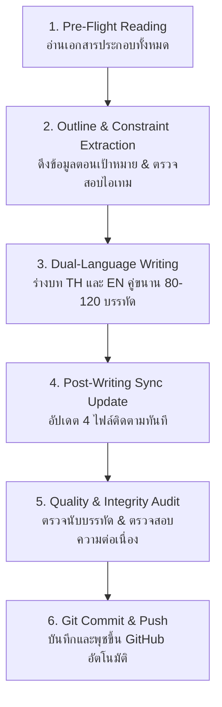

# 🌲 10,000 BC: The Lost Courier (พลิกยุคหินด้วยรถพัสดุหมื่นชิ้น)

> **Master Story Production Hub & Narrative Engine (ศูนย์บัญชาการสร้างเนื้อเรื่องและคู่มือปฏิบัติการแม่บท)**  
> *บันทึกนวนิยายเอาชีวิตรอด ประวัติศาสตร์ดึกดำบรรพ์ ไซไฟสร้างอารยธรรม และโลจิสติกส์ข้ามมิติ*

---

## 📖 1. บทนำและโครงเรื่องโดยย่อ (Story Premise)

เมื่อ **"ธาม" (Thame)** บัณฑิตวิศวกรรมวัย 24 ปี รับช่วงขับรถบรรทุกสิบล้อตู้ทึบอลูมิเนียม **Hino 500 Victor 380HP (น้ำหนักรวมบรรทุก 25 ตัน)** ขนส่งพัสดุสินค้าออนไลน์ประมาณ **3,000 – 4,000 กล่อง/ซอง (เฉลี่ยประเมิน ~3,500 ± ชิ้น ยืดหยุ่นตามขนาดกล่องเล็ก-ใหญ่)** แทนลุงเดชข้ามเส้นทางหลวงช่องเขาตอนเหนือ แต่กลับถูกมวลพายุหมอกทมิฬกลืนกินในเวลา 14:47 น. และถูก "อะไรบางอย่าง" ชนกระแทกท้ายอย่างจังจนรถไถลแหกโค้งตกก้นหุบเขา

เมื่อฟื้นขึ้นมา เขาพบว่าช่วงล่างรถพังยับเยิน แหนบหัก เพลาคด ล้อแตก จมหล่มดินเลนหนืด ขับเคลื่อนไม่ได้ถาวร และสถานที่ที่เขาอยู่ไม่ใช่ป่าในโลกปัจจุบัน แต่เป็น **ยุคปลายไพลสโตซีน (10,000 ปีก่อนคริสตกาล)** ท่ามกลางหุบเขาหินปูน ป่าสนดึกดำบรรพ์ อุณหภูมิติดลบของคลื่นความเย็น Younger Dryas สัตว์นักล่ายักษ์ดึกดำบรรพ์ (หมีถ้ำ, หมาป่าไดร์วูล์ฟ, เสือเขี้ยวดาบ) และชนเผ่ามนุษย์ยุคหิน!

ด้วย **ปืนพกลูกโม่ S&W .38 พร้อมกระสุน 43 นัด** ใต้เบาะนอน, พัสดุออนไลน์ท้ายรถที่ต้องสุ่มแกะเพื่อเอาชีวิตรอด, องค์ความรู้วิศวกรรม, และ **สัญญาณโทรศัพท์ 2G ลึกลับ 1 ขีดบนหลังคารถ** ที่เชื่อมต่อกับเว็บบอร์ดวอร์รูมออนไลน์ในโลกปัจจุบัน ธามจึงต้องเปลี่ยนปราการรถ 10 ล้อให้กลายเป็นฐานที่มั่น ผูกมิตรกับ **เผ่ากวางผา (Cliff Deer Clan)** พลิกฟื้นอารยธรรมมนุษย์ และเผชิญหน้ากับกลุ่มผู้รอดชีวิตร่วมมิติฝ่ายมืด **"วิกเตอร์"** ที่เข้ายึดครอง **เผ่ากินคนเขี้ยวอสูร (Demon Fang Clan)** ในสงครามชี้ชะตาประวัติศาสตร์มนุษยชาติ!

---

## 🗂️ 2. สารบัญเอกสารแม่บททั้งหมดในโครงการ (Master Document Ecosystem)

เอกสารทุกไฟล์ในโครงการนี้ถูกออกแบบให้เชื่อมโยงกันอย่างเป็นระบบ โดยมีลิงก์ตรงสำหรับเปิดอ่านได้ทันที:

| เอกสาร | บทบาทหน้าที่ในโครงการ | ลิงก์ไฟล์ในระบบ |
| :--- | :--- | :--- |
| 📜 **[prompt.md](./prompt.md)** | **Prompt Bible & กฎเหล็ก 49 ประการ:** คัมภีร์กฎการประพันธ์ เทมเพลตคำสั่งหลัก สเปกบรรทัด 80-120 กฎความสมจริงทางฟิสิกส์/เคมี/การแพทย์ กฎวอร์รูม 2G และตารางบันทึกประวัติรายตอน | [เปิด prompt.md](file:///d:/myproject1/EBOOKs/10000-BC/prompt.md) |
| 🗺️ **[chapters_outline.md](./chapters_outline.md)** | **โครงร่างรายตอน 150–200 ตอน (Chapters Outline):** แผนผังมหากาพย์ 6 Sagas กำหนดฉาก บีทเรื่อง กล่องพัสดุที่จะแกะ ปฏิสัมพันธ์กระทู้ และระบบทิ้งท้าย (Cliffhangers) รายบท | [เปิด chapters_outline.md](file:///d:/myproject1/EBOOKs/10000-BC/chapters_outline.md) |
| 📊 **[chapters_summary.md](./chapters_summary.md)** | **สรุปเนื้อหารายตอนและสถานะปัจจุบัน (Story State Tracker):** Single Source of Truth สำหรับไทม์ไลน์ เวลา อุณหภูมิ แผลคนเจ็บ และจุดทิ้งท้ายก่อนเริ่มตอนใหม่ | [เปิด chapters_summary.md](file:///d:/myproject1/EBOOKs/10000-BC/chapters_summary.md) |
| 👤 **[character.md](./character.md)** | **ฐานข้อมูลตัวละคร (Character Codex):** โปรไฟล์ธาม, ชนเผ่ากวางผา (คูราน, เอลยา, ทาร่า, โมกา), เผ่าเขี้ยวอสูร, ผู้รอดชีวิตร่วมมิติ (วิกเตอร์, หมอณิชา) และสมาชิกวอร์รูมออนไลน์ | [เปิด character.md](file:///d:/myproject1/EBOOKs/10000-BC/character.md) |
| 📦 **[inventory.md](./inventory.md)** | **คลังพัสดุแม่บท (~3,500 ± กล่อง/ซอง) และสเปกรถ 10 ล้อ (Master Cargo Manifest):** รายการสินค้า 8 หมวดหมู่ (ยืดหยุ่นตามขนาดพัสดุ), สเปกรถบรรทุก 10 ล้อ Hino 500 Victor 380HP, ถังน้ำมัน 390L, แบตเตอรี่, ชิ้นส่วนเหล็กช่วงล่าง | [เปิด inventory.md](file:///d:/myproject1/EBOOKs/10000-BC/inventory.md) |
| 🎒 **[items.md](./items.md)** | **คลังไอเทมประจำตัวและยอดคงเหลือจริง (EDC & Live Inventory):** ยุทธภัณฑ์ EDC ในกระเป๋า/เสื้อกั๊ก, อาวุธประจำกาย, อุปกรณ์สนาม, และตัดยอดทรัพยากรสิ้นเปลือง (กระสุน 43 นัด, ดีเซล, ยา, เกลือ) | [เปิด items.md](file:///d:/myproject1/EBOOKs/10000-BC/items.md) |
| 📋 **[unboxing_log.md](./unboxing_log.md)** | **บันทึกประวัติการแกะกล่องพัสดุ (Dedicated Unboxing Master Log):** ทะเบียนบาร์โค้ด Waybill พัสดุที่เปิดแล้ว การใช้งาน สภาพสินค้า และยอดคงเหลือในตู้ทึบ | [เปิด unboxing_log.md](file:///d:/myproject1/EBOOKs/10000-BC/unboxing_log.md) |
| 🧭 **[story_outline.md](./story_outline.md)** / **[outline.md](./outline.md)** | **โครงเรื่องแม่บท 4 องก์ (Master Narrative Arc):** ปมขัดแย้ง 5 มิติ (เอาชีวิตรอด, ชนเผ่า, วิทยาการ, ความลับข้ามมิติ, ปรัชญาศีลธรรม) และกฎเกณฑ์ยุคหิน | [เปิด story_outline.md](file:///d:/myproject1/EBOOKs/10000-BC/story_outline.md) |
| 📚 **[chapters/](./chapters/)** | **คลังต้นฉบับบทนิยายสองภาษา (Bilingual Manuscript Vault):** โฟลเดอร์จัดเก็บไฟล์บทนิยายภาษาไทย (`chapter_XXX_th.md`) และภาษาอังกฤษ (`chapter_XXX_en.md`) | [เปิดโฟลเดอร์ chapters/](file:///d:/myproject1/EBOOKs/10000-BC/chapters/) |

---

## 🗺️ 3. แผนผังชัยภูมิป้อมอัลฟ่าและถ้ำลับบนหน้าผา (Fortress Alpha Blueprint & The Secret Cliff Cavern)

เพื่อให้ผู้เขียนและ AI ทุกคนมี **ภาพจำลองพื้นที่ตรงกัน 100% (Shared Spatial Mental Model)** ค่ายหลักถูกสถาปนาขึ้นใน **แอ่งเกือกม้าหินปูน (Horseshoe Karst Amphitheater)** ขนาบด้วยหน้าผาสูงชัน 30–40 เมตร 3 ด้าน โดยมีแผนผังยุทธวิธีและจุดที่ตั้งสำคัญดังนี้:

```text
                           [ทิศเหนือ (North) - ลมหนาวขั้วโลก]
                   ▲▲▲ หน้าผาหินปูนสูงชัน 30–40 เมตร (กำแพงหินธรรมชาติ) ▲▲▲
                 ▲▲▲▲▲▲▲▲▲▲▲▲▲▲▲▲▲▲▲▲▲▲▲▲▲▲▲▲▲▲▲▲▲▲▲▲▲▲▲▲▲▲▲▲▲▲▲▲▲▲▲▲▲▲▲
                 ▲   [ปล่องหินระบายไอน้ำ & รับแสงแดด (Natural Skylight)] ▲
                 ▲                     ░░░                             ▲
                 ▲   [ป้อมถ้ำชั้นใน / ถ้ำนิทราแห่งจิตวิญญาณผา] (สูง 15 ม.) ▲
                 ▲   - ปากถ้ำซ่อนหลังม่านเถาวัลย์ / อบอุ่นสบาย 22-25°C      ▲
                 ▲   ♨️ บ่อน้ำแร่ร้อนมรกต 40°C (ฮีตเตอร์ธรรมชาติ/สปายุคหิน)▲
                 ▲   🌱 แปลงเพาะชำเรือนกระจกใต้ดินริมไออุ่น / ตาน้ำผุดใส  ▲
                 ▲   📦 ป้อมปราการสำรอง / คลังยา & เมล็ดพันธุ์ / ภาพเขียนสี▲
                 ▲   - กองมูลค้างคาวดึกดำบรรพ์ (ดินประสิว/ไนเตรตทำปุ๋ย)     ▲
                 ▲                ▲                                    ▲
                 ▲     [เนินสองขีด / ผาสัญญาณ 2G] (ชะง่อนหินสูง 8 ม.)    ▲
                 ▲                ▲                                    ▲
  [ทิศตะวันตก]   ▲                │ ทางปีนขึ้นหลังคารถ                 ▲  [ทิศตะวันออก]
  (West)         ▲                ▼                                    ▲  (East)
  ──────────┐    ▲     ┌──────────────────────┐                        ▲
  ลำธารหินขาว│    ▲     │ [ท้ายตู้คอนเทนเนอร์] │                        ▲  แนวผาหินปูน
  (ต้นน้ำดื่มใส)│◀──150ม─┤ (คลังพัสดุ ~3,500 ชิ้น)                     ▲  สูงชัน ไร้ทางปีน
  ──────────┘    ▲     │ [แผงโซลาร์เซลล์ 100W]│   [ลานกองไฟส่วนกลาง]   ▲  กันลมพายุหนาว
                 ▲     │    รถบรรทุก 10 ล้อ    │       🔥              ▲
                 ▲     │   Hino 500 Victor    │                        ▲
                 ▲     │   (ปราการเหล็ก 25 ตัน)│   [เรือนไม้ซุงยาว 2 หลัง]▲
                 ▲     │                      │   (หลังคาผ้าใบ/เตาผิง  ▲
                 ▲     │ [หน้ารถ & สปอร์ตไลต์] │    Rocket Stove ต้านหนาว)▲
                 ▲     │ [โซลาร์เซลล์ 200W PIR]│  [โคมไฟแคมปิ้งโซลาร์] ▲
                 ▲     │                      │   [แนวรั้วลวดหนามล้อมค่าย]▲
                 ▲     └──────────┬───────────┘                        ▲
                 ▲                │ สปอร์ตไลต์ & แตรลม                 ▲
                 ▲                ▼ เล็งตรงคุมปากทาง (จุดยามบนหลังคารถ) ▲
                 ▲                                                     ▲
                 ▲▲▲▲▲▲▲▲▲▲                                   ▲▲▲▲▲▲▲▲▲▲
                           ▲▲▲                             ▲▲▲
                              ▲  [แนวรั้วไม้ซุง 3 ม. + ขดลวดหนาม & ขวาก]▲
                                 [สปอร์ตไลต์โซลาร์ 200W ส่องตรวจการณ์]
                               [ช่องเขากลืนวิญญาณ / คอขวดแคบ 4-5 เมตร]
                                  (Thermopylae Chokepoint & กำแพงหินซิกแซก)
                                  (จุดเวรยามตรวจการณ์หน้าประตูกล 24 ชม.)
                                             │
                                             │ (ทอดลงสู่ทุ่งหญ้า & ป่าสนล่าง)
                                             ▼
                                  [ทิศใต้ (South) / ใต้ลม]
                            [โซนหลุมสุขา & ทิ้งขยะ (ห่างค่าย 80 ม.)]
```

### 6 ชัยภูมิยุทธศาสตร์และระบบป้องกันค่าย (Bastion Camp Strategic Points):
1. **ปราการรถ 10 ล้อ (The Central Keep):** จอดหันหัวไปทางทิศใต้ (ทางเข้าคอขวด) สปอร์ตไลต์และแตรลมคู่เล็งคุมปากทางเข้า บนหลังคารถติดตั้ง **แผงโซลาร์เซลล์พับได้ 100W พร้อมสถานีชาร์จแบตเตอรี่สากล** (ชาร์จแบตเตอรี่ 20V/21V เลื่อยโซ่และสว่าน) และ **โคมไฟสปอร์ตไลต์โซลาร์เซลล์ 200W (PIR Motion Sensor)** เล็งคุมลานค่าย ส่วนท้ายตู้ทึบพิงชิดแนวผาหินปูนทิศเหนือ ป้องกันการถูกตลบหลัง 100% หลังคารถเป็นหอคอยตรวจการณ์หลัก (Sentry Tower) มีพลธนูเข้าเวร 24 ชม. พร้อมนกหวีดไททาเนียมส่งสัญญาณเตือนภัย
2. **ถ้ำลับผาสวรรค์และบ่อน้ำแร่ร้อน (The Secret Cliff Sanctuary & Thermal Hot Spring — สูง 15 ม.):** ซ่อนอยู่หลังม่านเถาวัลย์บนหน้าผาหินปูนเหนือหลังคารถ ภายในค้นพบ **"บ่อน้ำแร่ร้อนธรรมชาติมรกต (Geothermal Hot Spring 38°C – 42°C)"** ทำหน้าที่เป็นฮีตเตอร์ธรรมชาติขนาดยักษ์คุมอุณหภูมิถ้ำให้อบอุ่นสบาย 22°C – 25°C ตลอด 24 ชม. แม้ข้างนอกจะเผชิญพายุหิมะ Younger Dryas ติดลบ -20°C มี **ปล่องหินระบายอากาศธรรมชาติ (Natural Chimney / Skylight)** ทะลุยอดผาช่วยระบายไอน้ำและก๊าซด้วยระบบ Stack Effect มีแสงแดดส่องลงมา เป็นแหล่งสปาอาบน้ำอุ่น/กายภาพบำบัดรักษาแผลเอลยา เรือนเพาะชำเมล็ดพันธุ์ ป้อมปราการสำรองชั้นในสุด (The High Redoubt) คลังเก็บเมล็ดพันธุ์/ยา และแหล่งมูลค้างคาว (ดินประสิวธรรมชาติ)
3. **ช่องแคบคอขวดและแนวรั้วไม้ซุงปลายแหลมเสริมลวดหนามและสปอร์ตไลต์โซลาร์เซลล์ (Thermopylae Chokepoint, Barbed Wire Palisade & Solar Floodlight):** ทางเข้าเดียวสู่หุบเขากว้างเพียง 4–5 เมตร ขนาบด้วยผาหิน บีบให้สัตว์ร้ายหรือศัตรูต้องผ่านทีละตัว เป็นจุดตั้งกำแพงหินซิกแซกเสริมด้วยแนวรั้วเสาไม้ซุงปลายแหลมสูง 3 เมตร (Palisade) ที่ตัดและเหลาด้วยเลื่อยโซ่ไร้สาย 21V และเลื่อยพับ SK5 สมัยใหม่ ขึงขดลวดหนามเหล็กชุบสังกะสีพาดบนยอดรั้วป้องกันการปีนป่าย พร้อมขุดหลุมขวากหนามและวางลวดหนามเตี้ยดักหน้าค่าย บนยอดเสารั้วติดตั้ง **โคมไฟสปอร์ตไลต์โซลาร์เซลล์ 200W ระบบเซนเซอร์ตรวจจับความเคลื่อนไหว (PIR Sensor)** ส่องสว่างตรวจการณ์ทุ่งหญ้าเบื้องล่างไกล 50 เมตร ("ดวงตาแห่งสุริยเทพ" คอยจับจ้องผู้บุกรุก) และจัดเวรยามพลหอกเฝ้าประตูกลตลอด 24 ชม.
4. **ลำธารหินขาว (White Stone Stream):** ห่างออกไปทางทิศตะวันตกเฉียงเหนือ 150 เมตร เป็นแหล่งน้ำจืดบริสุทธิ์จากธารน้ำแข็ง
5. **สุขอนามัยปลายลม (Downwind Sanitation):** หลุมสุขาและหลุมฝังซากเครื่องในตั้งอยู่ทางทิศใต้ (ห่าง 80 เมตร) ใต้ทิศทางลม เพื่อไม่ให้กลิ่นย้อนเข้าค่ายและไม่ปนเปื้อนลำธาร
6. **เรือนไม้ซุงยาว โคมไฟโซลาร์เซลล์ แนวรั้วลวดหนาม และเครือข่ายเวรยาม 24 ชม. (Winter Longhouses, Solar Lighting, Barbed Wire Perimeter & 3-Shift Guard Network):** เรือนพักไม้ซุงยาว 2 หลังอิงแนวผาหินปูนทิศเหนือข้างรถบรรทุก สร้างด้วยไม้สนที่ตัดด้วยเครื่องมือช่างสมัยใหม่ มุงหลังคาผ้าใบกันน้ำทับด้วยเปลือกไม้สน อุดร่องด้วยดินเหนียวผสมแกลบหญ้า มีเตาผิงดินเหนียวระบบ Rocket Stove พ่วงท่อระบายควันออกสู่หน้าผา ภายในติดตั้ง **โคมไฟแคมปิ้งโซลาร์เซลล์พกพา** ให้แสงสว่างอบอุ่น ไร้ควันไฟสำลัก ปลอดภัยต่อเด็กและคนชรา ล้อมรอบด้วย **แนวรั้วลวดหนามเหล็กกล้าชุบสังกะสี (Barbed Wire Fence) 3 ระดับ** ป้องกันสัตว์ร้ายและเผ่ากินคนย่องเข้ามาทำร้ายคนในเรือนพักยามค่ำคืน ("เถาวัลย์เขี้ยวอสูร" ที่ชนเผ่ายำเกรง) พร้อมเครือข่ายจัดเวรยาม 24 ชม. แบ่ง 3 กะ กะละ 4 คน ตรวจการณ์ 3 จุดยุทธศาสตร์ (หลังคารถบรรทุก, ชะง่อนหินเนินสองขีด, และหน้าประตูกลช่องคอขวด)

---

### ☀️ 3.1 คู่มือและแนวทางปฏิบัติระบบไฟฟ้าโซลาร์เซลล์ประจำค่าย (Fortress Alpha Solar Electrification Guideline)

เพื่อให้การเขียนฉาก การบริหารพลังงาน และการพรรณนาเทคโนโลยีในยุค 10,000 ปีก่อนมีความสมจริงทางวิศวกรรม วิทยาศาสตร์ และมานุษยวิทยาสูงสุด ให้ยึดถือแนวทางปฏิบัติดังนี้:

1. **แหล่งกำเนิดและรายการอุปกรณ์ (Hardware Manifest & Origin):**
   * ได้รับจากการแกะพัสดุ `#TH-782104` ในบทที่ 12
   * **ชุดโคมไฟสปอร์ตไลต์โซลาร์เซลล์สนาม 200W (2 ชุด):** ชิป LED SMD 5730 แสงขาว Daylight 6,500K, แผงโซลาร์โมโนคริสตัลไลน์แยกชิ้น, แบตเตอรี่ LiFePO4 (Lithium Iron Phosphate) 3.2V 25,000mAh ทนทานรอบชาร์จสูง, เซนเซอร์อินฟราเรดตรวจจับความเคลื่อนไหว (PIR Motion Sensor) มุมตรวจจับ 120 องศา รัศมี 8-10 เมตร, และรีโมตคอนโทรลอินฟราเรด
   * **โคมไฟแคมปิ้งโซลาร์เซลล์พกพา (4 ตัว):** แสงไฟ Warm White สบายตา แบตเตอรี่ 18650 ในตัว พร้อมช่อง USB Output จ่ายไฟสำรอง
   * **ชุดแผงโซลาร์เซลล์พับได้ 100W พร้อมแท่นชาร์จสากล (Universal Multi-Voltage Smart Charger):** รองรับแรงดัน 12V-21V ใช้ชาร์จแบตเตอรี่ลิเธียมไอออน 20V/21V ของเลื่อยโซ่ไร้สายและสว่านกระแทก

2. **การจัดวางตำแหน่งเชิงยุทธวิธี (Tactical Spatial Integration):**
   * **สถานีผลิตพลังงานหลัก (Central Power Hub):** ติดตั้งแผงโซลาร์ 100W และแผงของสปอร์ตไลต์ชุดที่ 1 บนหลังคาตู้ทึบรถ 10 ล้อ (สูง 4 เมตร) เพื่อรับแสงแดดได้เต็มวัน ไร้เงาบดบัง และปลอดภัยจากการปีนป่ายของสัตว์หรือคน
   * **ป้อมตรวจการณ์ช่องคอขวด (Chokepoint Sentry):** ติดตั้งโคมสปอร์ตไลต์ 200W ชุดที่ 2 บนยอดเสารั้วไม้ซุง 3 เมตรตรงช่องแคบคอขวด 4-5 เมตร ส่องกวาดทุ่งหญ้าเบื้องล่างไกล 50 เมตร ตั้งโหมด Auto PIR (หรี่ไฟประหยัดพลังงาน 20% ยามปกติ สว่างจ้า 100% ทันทีเมื่อมีสิ่งมีชีวิตผ่าน)
   * **โซนที่พักเรือนไม้ซุงยาว (Living Quarters):** แขวนโคมไฟแคมปิ้งโซลาร์เซลล์ 4 ตัวในเรือนไม้ซุงยาว 2 หลัง (หลังละ 2 ตัว) ให้แสงสว่างอบอุ่น ไร้ควันไฟสำลัก ปลอดภัย 100% ต่อเด็ก คนชรา และลดความเสี่ยงเพลิงไหม้เพิงหญ้า/ผ้าใบ

3. **ฟิสิกส์และความสมจริงในสภาพอากาศยุคน้ำแข็ง (Ice Age Physics & Subzero Maintenance Rules):**
   * **การปัดกวาดหิมะและน้ำค้างแข็ง (Snow & Frost Clearance):** หิมะหรือเกล็ดน้ำแข็งที่เกาะแผงจะบล็อกแสงแดด 100% ธามและเวรยามต้องปีนขึ้นไปปัดกวาดผิวแผงทุกเช้า
   * **กฎเหล็กการชาร์จแบตเตอรี่ในความหนาวจัด (The Subzero Charging Rule):** เซลล์แบตเตอรี่ลิเธียม (LiFePO4 และ Li-ion) ห้ามทำการชาร์จในขณะที่อุณหภูมิตัวเซลล์ต่ำกว่า 0°C เด็ดขาด เพราะจะเกิดการสะสมของผลึกโลหะลิเธียม (Lithium Plating) ส่งผลให้แบตเตอรี่ลัดวงจรและเสียหายถาวร! ธามจึงต้องลากสายไฟ DC จากแผงบนหลังคารถ เข้ามาชาร์จแบตเตอรี่ภายใน **"ถ้ำน้ำแร่ร้อนมรกต" (อุณหภูมิคงที่ 22-25°C ตลอดปี)** หรือ **ข้างเตา Rocket Stove ในเรือนไม้ซุง** เพื่อรักษาอุณหภูมิเซลล์ให้อุ่นพอสำหรับการชาร์จอย่างปลอดภัย
   * **การปรับมุมรับแดดฤดูหนาว (Winter Solar Tilt Angle):** ฤดูหนาวขั้วโลก ดวงอาทิตย์จะโคจรในมุมต่ำ (Low Sun Arc) ธามต้องปรับมุมแผงโซลาร์ทำมุมชัน 45°-55° หันหน้าลงสู่ทิศใต้ เพื่อให้ระนาบแผงตั้งฉากกับลำแสงอาทิตย์มากที่สุด

4. **จิตวิทยาและสงครามประสาทข้ามหมื่นปี (Psychological Warfare & Culture Shock):**
   * **ต่อชนเผ่ากวางผา (พันธมิตร):** ชนเผ่าเรียกแผงโซลาร์ว่า *"ศิลาดูดกลืนดวงตะวัน"* และมองไฟ LED สว่างจ้าที่เปิดขึ้นเองในความมืดว่าเป็น *"ดวงตาแห่งสุริยเทพ"* หรือ *"เพลิงสวรรค์ไร้ควัน"* ที่คอยจับจ้องคุ้มครองค่าย เปลี่ยนค่ายให้เป็น "โอเอซิสแห่งแสงสว่าง" เสริมบารมีผู้นำของธามและสร้างขวัญกำลังใจสูงสุด
   * **ต่อเผ่ากินคนเขี้ยวอสูรและสัตว์นักล่า (ศัตรู):** แสงไฟสีขาว 6,500K สว่างวาบ 200W ส่องกระทบสายตาในความมืดมิดสนิท ทำให้เกิดอาการตาพร่ามัวฉับพลัน (Flashblindness) สลายสมาธิการบุกจู่โจม สัตว์ร้ายดึกดำบรรพ์ (ไดร์วูล์ฟ, เสือเขี้ยวดาบ, หมีถ้ำ) ที่สายตาไวต่อแสงยามค่ำคืนจะตกใจกลัวถอยร่น ส่วนคนป่าจะแตกตื่นวิ่งหนีเพราะนึกว่าถูกเทพเจ้าบรรพกาลพิโรธ

5. **การอนุรักษ์น้ำมันดีเซลและการปลดล็อกอารยธรรม (Diesel Preservation & Civilizational Leap):**
   * ระบบโซลาร์เซลล์ช่วยปลดล็อก "พลังงานหมุนเวียนถาวร" ทำให้สามารถชาร์จแบตเตอรี่เลื่อยโซ่ไร้สาย 21V และสว่านกระแทก 20V ใช้งานสร้างค่ายได้อย่างต่อเนื่อง
   * ตัดการใช้น้ำมันดีเซล 200 ลิตรในถังรถ 10 ล้อ ช่วยสงวนดีเซล 199.5 ลิตรไว้เป็นทรัพยากรยุทธศาสตร์สูงสุดสำหรับใช้ทำระเบิดเพลิง Molotov หรือสตาร์ทเครื่องยนต์ในยามวิกฤตชี้ชะตาเท่านั้น

---

## ⚙️ 4. ขั้นตอนปฏิบัติการสร้างเนื้อเรื่องตอนใหม่อัตโนมัติ (Autonomous Story Generation Workflow)

เมื่อต้องการสร้างบทนิยายตอนใหม่ ให้ปฏิบัติตาม **กระบวนการ 6 ขั้นตอนมาตรฐาน (Standard 6-Step Generation Engine)** อย่างเคร่งครัด 100%:



### ขั้นตอนที่ 1: การเปิดอ่านไฟล์ประกอบทั้งหมดก่อนเริ่มเขียน (Mandatory Pre-Flight Reading)
> ⚠️ **กฎเหล็กข้อ 46:** AI และผู้เขียนต้องเปิดอ่านไฟล์ `.md` ทั้งหมดก่อนเสมอ ห้ามเริ่มเขียนโดยไม่อ่านบริบทเด็ดขาด
1. **อ่าน [chapters_summary.md](./chapters_summary.md):** ตรวจสอบว่าตอนล่าสุดจบที่ไหน เวลาอะไร สภาพอากาศเป็นอย่างไร ใครบาดเจ็บอยู่ และทิ้งปม Cliffhanger อะไรไว้
2. **อ่าน [chapters_outline.md](./chapters_outline.md):** ค้นหาบทเป้าหมายที่กำลังจะเขียนเพื่อดึง:
   - ชื่อตอนและรูปแบบบท (Archetype: Type A ถึง F)
   - แกนเรื่อง (Scene Goal & Conflict)
   - รหัสพัสดุที่จะแกะ (Unboxing Beat & Waybill ID)
   - ประเด็นกระทู้ออนไลน์ (The Forum Beat)
   - จุดทิ้งท้ายตอน (Cliffhanger)
3. **อ่าน [items.md](./items.md) และ [unboxing_log.md](./unboxing_log.md):** ตรวจสอบอาวุธในมือ ยุทธภัณฑ์ EDC ที่ธามพกติดตัว และสถานะทรัพยากรสิ้นเปลือง (เช่น กระสุน .38 นัดที่ 43, ยา Amoxicillin, เกลือ, น้ำมันดีเซล)
4. **อ่าน [character.md](./character.md):** ตรวจสอบระดับความสัมพันธ์ บุคลิกภาพ และภาษาที่ใช้สื่อสารกับชนเผ่า
5. **อ่าน [prompt.md](./prompt.md):** ทบทวนกฎเหล็ก 49 ประการ

---

### ขั้นตอนที่ 2: มาตรฐานการร่างบทสองภาษา (Dual-Language Drafting Standards)
สร้างไฟล์ต้นฉบับ 2 ภาษาในโฟลเดอร์ `chapters/`:
- **ฉบับภาษาไทย:** `chapters/chapter_XXX_th.md`
- **ฉบับภาษาอังกฤษ:** `chapters/chapter_XXX_en.md`

#### เกณฑ์มาตรฐานเนื้อหา (Strict Narrative Rules):
1. **เกณฑ์ความยาวจริง (กฎข้อ 48):** แต่ละบทต้องมีความยาว **80 – 120 บรรทัดเนื้อหาจริง (ไม่นับบรรทัดว่าง)** หรือเทียบเท่า 2,200 – 3,200 คำ (~8,500 – 12,000 ตัวอักษร)
2. **โครงสร้าง 5 สัดส่วนในแต่ละบท:**
   - *ส่วนที่ 1 (15–20 บรรทัด):* เปิดฉากด้วยสัมผัสทั้งห้า กลิ่นควัน ลมหนาว ไอหมอก เสียงขู่คำราม (Sensory Hook)
   - *ส่วนที่ 2 (30–40 บรรทัด):* แกนปัญหา อุปสรรค และการวิเคราะห์ใบปะหน้าพัสดุก่อนสุ่มแกะ (Waybill Deductive Unboxing)
   - *ส่วนที่ 3 (20–30 บรรทัด):* บทสนทนา ภาษามือ การประยุกต์ใช้สิ่งของ และกระทู้เว็บบอร์ดวอร์รูม 2G
   - *ส่วนที่ 4 (15–20 บรรทัด):* จุดพลิกผัน แอ็กชัน หรือการก้าวกระโดดทางเทคโนโลยี (Climax / Breakthrough)
   - *ส่วนที่ 5 (10–15 บรรทัด):* บทสรุปสั้นและจุดตัดจบที่บีบหัวใจ (Cliffhanger 3 สไตล์)
3. **ข้อห้ามเด็ดขาด:**
   - ❌ **ห้ามแทรกตารางบันทึกพัสดุในบทนิยาย** เพื่อให้เนื้อเรื่องไหลลื่นเป็นวรรณกรรมพรีเมียม (ตารางแยกไปอยู่ใน `unboxing_log.md` และ `items.md`)
   - ❌ **ห้ามมีเวทมนตร์หรือพลังวิเศษเหนือธรรมชาติ** ทุกอย่างต้องอธิบายได้ด้วยฟิสิกส์ เคมี การแพทย์ และชีววิทยาจริง
   - ❌ **ห้ามเสกของลอยๆ** สิ่งของทุกชิ้นต้องมีที่มาจากช่องลับใต้เบาะนอน หรือพัสดุใน `inventory.md` เท่านั้น

---

### ขั้นตอนที่ 3: การอัปเดตไฟล์ติดตาม 4 ไฟล์ทันทีหลังเขียนเสร็จ (Post-Writing Synchronization)
เมื่อบันทึกไฟล์บทนิยายทั้งภาษาไทยและอังกฤษเรียบร้อยแล้ว **ต้องอัปเดตไฟล์ติดตาม 4 ไฟล์ทันที**:
1. **อัปเดต [chapters_summary.md](./chapters_summary.md):**
   - เพิ่มแถวในตารางดัชนี (Chapter Master Index)
   - เพิ่มหัวข้อสรุปเนื้อหาบทใหม่อย่างละเอียด (ไทม์ไลน์, สภาพอากาศ, เหตุการณ์สำคัญ, พัสดุที่แกะ, ทรัพยากรที่ใช้, จุดทิ้งท้าย)
2. **อัปเดต [unboxing_log.md](./unboxing_log.md):**
   - อัปเดตตารางสรุปภาพรวมยอดแกะพัสดุสะสมและยอดคงเหลือ
   - เพิ่มบันทึกกล่องพัสดุที่แกะใหม่ (รหัส Waybill, น้ำหนัก, สินค้าที่ได้, การนำไปใช้งาน)
3. **อัปเดต [items.md](./items.md):**
   - นำไอเทมที่แกะได้ใหม่บรรจุเข้าหมวดหมู่ที่เหมาะสม (EDC, อุปกรณ์สนาม, หรือคลังกลาง)
   - หักลบยอดทรัพยากรสิ้นเปลืองจริง (เช่น ยา, กระสุน, เกลือ, ซุปก้อน, เทปผ้า, เคเบิลไทร์)
4. **อัปเดต [prompt.md](./prompt.md):**
   - เพิ่มแถวประวัติการเขียนลงในตาราง **Execution & Progress Log** ท้ายไฟล์

---

### ขั้นตอนที่ 4: การตรวจสอบความสมบูรณ์และจำนวนบรรทัด (Integrity & Line Count Verification)
- รันสคริปต์หรือนับจำนวนบรรทัดเนื้อหาจริงของทั้ง `chapter_XXX_th.md` และ `chapter_XXX_en.md` ต้องอยู่ในช่วง **80 – 120 บรรทัด**
- ตรวจสอบความถูกต้องของชื่อตัวละคร รหัสพัสดุ และความต่อเนื่องของเวลา

---

### ขั้นตอนที่ 5: การบันทึกเวอร์ชันและนำขึ้นคลาวด์ (Mandatory Git Commit & Push)
> ⚠️ **กฎเหล็กข้อ 5 / กฎ 49:** ต้องทำ Git Push ขึ้น GitHub ทุกครั้งหลังเสร็จงาน 100%
รันคำสั่งใน PowerShell:
```powershell
git status
git add .
git commit -m "Complete Chapter XXX: [ชื่อตอนภาษาไทย] (TH & EN) and synchronize all logs"
git push origin main
```

---

## 📊 5. แดชบอร์ดสถานะล่าสุดของเรื่อง (Live Narrative Status Dashboard)

| พารามิเตอร์ | สถานะปัจจุบัน | หมายเหตุและบริบท |
| :--- | :--- | :--- |
| **ตอนล่าสุดที่เขียนเสร็จ** | **บทที่ 8: หม้อไททาเนียมและภาพถ่ายสะเทือนวงการ** | [TH: chapter_008_th.md](file:///d:/myproject1/EBOOKs/10000-BC/chapters/chapter_008_th.md) (90 บรรทัด) / [EN: chapter_008_en.md](file:///d:/myproject1/EBOOKs/10000-BC/chapters/chapter_008_en.md) (87 บรรทัด) |
| **ตอนถัดไปที่ต้องเขียน** | **บทที่ 9: กฎเหล็กแห่งการสงวนเสบียงและปลอกกระสุนปริศนา** | ดึง Outline จาก [chapters_outline.md](./chapters_outline.md#บทที่-9-กฎเหล็กแห่งการสงวนเสบียงและปลอกกระสุนปริศนา-the-law-of-the-rations--the-brass-clue) |
| **องก์ปัจจุบัน (Act)** | **Act 1: บทเพลงแห่งเปลวไฟและหยาดฝน (The Song of Fire and Rain)** | สัปดาห์แรกแห่งการเอาชีวิตรอดและการตั้งค่ายรอบรถ 10 ล้อ |
| **ไทม์ไลน์ในเรื่อง** | **วันที่ 4 — เวลาประมาณ 21:00 น.** | คืนเดือนมืด มีฝนตกโปรยปราย อากาศหนาวชื้น (6°C - 8°C) |
| **ฐานที่มั่นหลัก** | ก้นหุบเขาหินปูน ป่าสนดึกดำบรรพ์ พิกัดโบราณ 10,000 BC | รถบรรทุก 10 ล้อตู้ทึบ Hino 500 Victor ตรึงเป็นปราการกลางค่าย |
| **ประชากรในค่าย** | ธาม (Thame) + สมาชิกเผ่ากวางผา 30 ชีวิต | คูราน (หัวหน้า), เอลยา (พักฟื้นแผลผ่าตัด), ทาร่า (เด็กหญิง), โมกา (หมอผี) |
| **ยอดพัสดุในตู้ทึบ** | **แกะแล้ว 9 กล่อง / คงเหลือ >99.7%** | ยอดพัสดุรวมประเมิน **~3,500 ± ชิ้น (3,000 – 4,000 กล่อง/ซอง)** ยืดหยุ่นตามขนาดพัสดุที่มีหลากหลายไซส์ (ซองพลาสติก, กล่องเล็ก, กล่องจัมโบ้, ลังไม้) ไม่จำเป็นต้อง 3,500 ชิ้นเป๊ะ ดูรายละเอียดใน [unboxing_log.md](./unboxing_log.md) |
| **อาวุธไพ่ตาย** | ปืนพกลูกโม่ S&W .38 โครงสเตนเลส (**กระสุน 43 นัด**) | ยังไม่ได้ยิงแม้แต่นัดเดียว อยู่ในกระเป๋าเสื้อโค้ตของธาม |
| **ทรัพยากรวิกฤต** | ดีเซล 199.5 ลิตร, แบตเตอรี่ 24V, Amoxicillin 6 เม็ด, เกลือ 985g | ตัดยอดตรงตาม [items.md](./items.md) |
| **วิกฤตล่าสุดที่ค้างอยู่ (Cliffhanger)** | **ฝูงหมาป่าโบราณไดร์วูล์ฟ (Dire Wolves) ล้อมค่าย!** | กลิ่นควันสตูว์เนื้อกวางและกลิ่นคาวเลือดผ่าตัดดึงดูดฝูงหมาป่ามาปิดล้อมค่ายในความมืด |

---

## 💬 6. เทมเพลตคำสั่งด่วนสำหรับสั่ง AI (One-Click AI Commands)

ผู้ใช้หรือนักเขียนสามารถคัดลอกข้อความด้านล่างนี้ไปสั่ง AI ได้ทันทีเพื่อทำงานต่อแบบอัตโนมัติ:

### คำสั่งเขียนบทถัดไป (Autonomous Next Chapter Command):
```text
กรุณาเปิดอ่านเอกสารประกอบทั้งหมดตามคำแนะนำใน README.md (chapters_summary.md, chapters_outline.md, items.md, character.md, inventory.md, unboxing_log.md และ prompt.md) 
จากนั้นจงเขียนบทที่ [ใส่เลขบท เช่น 9] ทั้งฉบับภาษาไทย (chapters/chapter_XXX_th.md) และภาษาอังกฤษ (chapters/chapter_XXX_en.md) ตามมาตรฐาน 80-120 บรรทัดเนื้อหาจริง 
เมื่อเขียนเสร็จแล้ว ให้อัปเดตไฟล์ chapters_summary.md, unboxing_log.md, items.md และ prompt.md ให้ครบถ้วน แล้วทำการ Git commit & push ขึ้น GitHub ทันที
```

### คำสั่งตรวจสอบความต่อเนื่องและสถานะระบบ (System & Continuity Audit Command):
```text
กรุณาตรวจสอบความต่อเนื่องของเนื้อเรื่อง (Continuity Audit) ระหว่าง chapters_summary.md, items.md, unboxing_log.md, prompt.md และไฟล์บทใน chapters/ ทั้งหมด ว่ามีความขัดแย้งของพล็อต จำนวนกระสุน ทรัพยากรคงเหลือ หรือตัวเลขกล่องพัสดุหรือไม่ พร้อมรายงานสรุป
```

---

## 📜 7. สารบัญตอนทั้งหมดที่เขียนเสร็จสมบูรณ์ (Completed Chapters Vault)

| บทที่ | ชื่อตอนภาษาไทย | English Title | ลิงก์ภาษาไทย | ลิงก์ภาษาอังกฤษ | บรรทัดจริง | พัสดุที่แกะ |
| :---: | :--- | :--- | :---: | :---: | :---: | :--- |
| **001** | พายุหมอกทมิฬและปราการเหล็กนิรนาม | The Black Fog and the Iron Bastion | [TH](./chapters/chapter_001_th.md) | [EN](./chapters/chapter_001_en.md) | 92 | - (พบของลับใต้เบาะ: ปืน .38 กระสุน 43 นัด, ถุงนอน) |
| **002** | รุ่งอรุณสีเลือดและสัญญาณหนึ่งขีด | Blood Dawn and the One-Bar Anomaly | [TH](./chapters/chapter_002_th.md) | [EN](./chapters/chapter_002_en.md) | 93 | `#TH-994201`, `#TH-118492`, `#TH-204192`, `#TH-773019` |
| **003** | ลำธารหินขาวและรอยเท้าแห่งอดีตกาล | The White Stone Stream and Ancient Tracks | [TH](./chapters/chapter_003_th.md) | [EN](./chapters/chapter_003_en.md) | 85 | `#TH-401923` (นกหวีดไททาเนียม, ไฟแช็กเจ็ท) |
| **004** | เงาร่างแห่งขุนเขาและเสียงแตรสะท้านไพร | The Shadows on the Ridge and the Horn of Iron | [TH](./chapters/chapter_004_th.md) | [EN](./chapters/chapter_004_en.md) | 90 | - (ใช้แตรลมคู่ 130dB สยบคนป่ากราบไหว้) |
| **005** | เปลวไฟในเสี้ยววินาทีและรสชาติของพระเจ้า | A Spark in the Dark and the Taste of the Gods | [TH](./chapters/chapter_005_th.md) | [EN](./chapters/chapter_005_en.md) | 90 | `#TH-881024` (ไฟแช็กเทอร์โบ 1,300°C, เกลือสมุทร, เนื้อเค็ม) |
| **006** | แพทย์สนามข้ามมิติและการรักษาปาฏิหาริย์ | The Cross-Time Field Medic and the Miracle Incision | [TH](./chapters/chapter_006_th.md) | [EN](./chapters/chapter_006_en.md) | 84 | `#TH-550192` (ชุดเวชภัณฑ์ผ่าตัดสนาม, Amox, เบตาดีน) |
| **007** | คมมีดเหล็กกล้าและพันธสัญญาแรก | The Steel Edge and the First Covenant | [TH](./chapters/chapter_007_th.md) | [EN](./chapters/chapter_007_en.md) | 101 | `#TH-662301` (คัตเตอร์ SK5, เคเบิลไทร์, เทปผ้า Duct Tape) |
| **008** | หม้อไททาเนียมและภาพถ่ายสะเทือนวงการ | Titanium Feast and the Forum Storm | [TH](./chapters/chapter_008_th.md) | [EN](./chapters/chapter_008_en.md) | 90 | `#TH-710492` (ชุดหม้อสนามไททาเนียม, ช็อกโกแลต 5 แท่ง, ซุปก้อน 12 ก้อน) |
| *009* | *กฎเหล็กแห่งการสงวนเสบียงและปลอกกระสุนปริศนา* | *The Law of the Rations and the Brass Clue* | *(รอเขียน)* | *(รอเขียน)* | - | *#TH-192844 (ทิชชูเปียก, ถุงขยะดำ, ฟลายชีต)* |

---

*สร้างและดูแลรักษาโดยระบบควบคุมเนื้อเรื่องอัตโนมัติ — 10000-BC: The Lost Courier Project*
