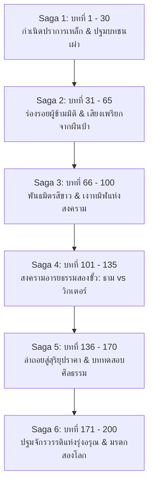

# โครงร่างบทนิยายรายตอน (Chapters Outline Master Guide) — 10000-BC (พลิกยุคหินด้วยรถพัสดุหมื่นชิ้น)

> 📖 **คำชี้แจง:** เอกสารฉบับนี้เป็น **Single Source of Truth สำหรับโครงเรื่องรายบท (Chapter-by-Chapter Master Outline)** ของมหากาพย์นวนิยายความยาว 150 – 200 ตอน ครอบคลุมทั้ง **6 มหากาพย์ (6 Sagas)** โดยจัดทำรายละเอียดระดับฉาก ยุทธวิธี พัสดุที่แกะ (Unboxing Beats) ปฏิสัมพันธ์กับชาวเน็ต (Forum Beats) การบริหารทรัพยากร (Cargo & Consumables Log) และระบบตัดจบ (Cliffhangers) สอดคล้องกับ [outline.md](file:///d:/myproject1/EBOOKs/10000-BC/outline.md), [character.md](file:///d:/myproject1/EBOOKs/10000-BC/character.md), [items.md](file:///d:/myproject1/EBOOKs/10000-BC/items.md), และ [prompt.md](file:///d:/myproject1/EBOOKs/10000-BC/prompt.md) อย่างเคร่งครัด 100%
> 
> 📌 **กฎเหล็กแม่บทก่อนเริ่มเขียนทุกบท (Mandatory All-.md Pre-Reading Rule — กฎข้อที่ 46 & 48):**
> 1. ก่อนเริ่มร่างหรือเขียนบทใดๆ ผู้เขียนและ AI **ต้องเปิดอ่านไฟล์ Markdown (.md) ทั้งหมดในโครงการก่อนเสมอเป็นกฎเหล็ก** (ได้แก่ `chapters_summary.md`, `chapters_outline.md`, `items.md`, `character.md`, `inventory.md`, `outline.md`, `story_outline.md`, `prompt.md` และบทก่อนหน้าใน `chapters/`) เพื่อเชื่อมต่อบริบท ไทม์ไลน์ และสถานะไอเทมอย่างสมบูรณ์แบบ 100% ป้องกันการหลุดลืมหรือเกิดช่องโหว่ความต่อเนื่องเด็ดขาด
> 2. **มาตรฐานความยาวต่อบท (กฎข้อที่ 48):** แต่ละตอนต้องมีความยาวเนื้อหาจริง **80 – 120 บรรทัด (ไม่นับบรรทัดว่าง)** หรือเทียบเท่า **2,200 – 3,200 คำ (~8,500 – 12,000 ตัวอักษร)** ห้ามตัดจบห้วนเด็ดขาด

---

## 🗺️ ภาพรวมโครงสร้าง 6 มหากาพย์ (The 6-Saga Roadmap: 150 – 200 ตอน)

---

## 🌌 วัฏจักรการเปิดของรอยแยกมิติและสัญญาณมือถือ (The Dimensional Rift Lifecycle & Multi-Duration Surge Architecture)

* **ความไม่แน่นอนของระยะเวลาเปิด (Unpredictable Multi-Duration Dynamics):**
  * รอยแยกมิติ (Temporal Rift) ไม่ได้เปิดตามตารางเวลาที่ตายตัว แต่เป็นปรากฏการณ์ความผันผวนของกาลอวกาศ (Spacetime Fluctuation) ที่คาดเดาไม่ได้ แต่ละครั้งอาจเปิดในระยะเวลาที่แตกต่างกันอย่างสิ้นเชิง:
    1. **การเปิดสั้นแบบฉับพลัน (Flash Rift / Micro-Burst ~30 นาที – 3 ชั่วโมง):** เหมาะสำหรับวิกฤตเฉพาะหน้า สัญญาณ 5G ทะลักช่วงสั้นๆ บีบให้ตัวละครต้องตัดสินใจแข่งกับเวลา เช่น การ Video Call ปรึกษาอาจารย์แพทย์ผ่าตัดเคสฉุกเฉิน หรือรีบกวาดดาวน์โหลดเอกสารจำเป็น (เช่น บทที่ 21)
    2. **การเปิดยาวนานข้ามวันข้ามคืน (Extended Rift Window ~1 – 2 วันเต็ม / 24 – 48 ชั่วโมง):** เกิดขึ้นไม่บ่อยนัก ท้องฟ้าจะเปิดกว้าง สัญญาณ 5G เสถียรสูงต่อเนื่อง เปิดโอกาสให้สื่อสารระดับทางการ ประสานงานตั้งวอร์รูมร่วมสองโลก ดาวน์โหลดคลังข้อมูลวิชาการขนาดมหึมา (Wikipedia ออฟไลน์, พิมพ์เขียวเครื่องจักรไอน้ำ, โลหะวิทยา, แผนที่ดาวเทียมโบราณคดี) และเปิดโอกาสให้โลกปัจจุบันส่ง **โดรนสำรวจขนาดเล็ก หรือปล่อยแคปซูลพัสดุยังชีพติดร่มชูชีพ (Parachute Supply Drop)** ลอดผ่านช่องมิติลงมา (เช่น ช่วงบทที่ 38 – 40)
    3. **ช่วงมิติดับสนิท (The Great Void / Radio Silence หลายสัปดาห์ – หลายเดือน):** รอยแยกปิดสนิท สัญญาณมอดดับ 100% ตัวเอกต้องพึ่งพาพลังของตัวเองและข้อมูลที่ตุนไว้ สร้างอารยธรรมด้วยสองมือ (ช่วงบทที่ 45 – 75)
    4. **ช่วงความผันผวนกลางสงคราม (Volatile Fluctuations):** สัญญาณกระพริบติดๆ ดับๆ ครั้งละไม่กี่ชั่วโมง เกิดสงครามชิงพิกัดสัญญาณใต้รอยแยกกับกลุ่มขั้วอำนาจอื่น (ช่วงบทที่ 80 – 120)
    5. **การเปิดสะพานมิติทางกายภาพสมบูรณ์ (The Final Physical Gateway 2 – 3 วัน):** เกิดขึ้นในบทสรุปมหากาพย์ (บทที่ 165 – 170) รอยแยกแตกลงมาถึงพื้นดิน เปิดทางให้เดินก้าวข้ามกลับโลกปัจจุบันได้จริง นำไปสู่การตัดสินใจครั้งสำคัญที่สุดในชีวิต
* **ปรากฏการณ์ทางธรรมชาติบอกเหตุบนท้องฟ้า (Visual Forewarning & Environmental Impact):**
  * **ก่อนและขณะเปิด:** ท้องฟ้าบิดเบี้ยวเป็นลอนคลื่น (Gravitational Lensing) แสงอาทิตย์และแสงดาวหักเหเป็นเกลียววงแหวนคล้ายมองผ่านผิวน้ำ เกิดแสงเรืองรองคล้าย **ออโรร่าสีม่วงครามและรุ้งแม่เหล็ก (Magnetic Ionization & Prismatic Halo)** สว่างนวลตาทั่วหุบเขา (หากเปิด 1-2 วัน ท้องฟ้าจะสว่างไสวดั่งมีพระจันทร์เต็มดวง 3 ดวง)
  * **ผลกระทบทางกายภาพ:** กลิ่นโอโซนฉุนกึก ไฟฟ้าสถิตทำให้เส้นขนลุกชัน เข็มทิศหมุนควงไร้ทิศทาง สัตว์ป่าและไดร์วูล์ฟกระวนกระวายแหงนมองฟ้า
  * **สัญญาณเตือนการปิดตัว:** แสงออโรร่าเริ่มสั่นกระตุก แตกริ้ว สัญญาณโทรศัพท์วูบลงทีละขีดจาก 5G -> 4G -> 3G -> 2G สร้างความกดดันของการนับถอยหลัง (Countdown Drama)
* **คุณค่าต่อวรรณศิลป์และเนื้อเรื่อง (Narrative Value):**
  * แก้ปัญหาความสมจริงทางวิทยาศาสตร์: อธิบายได้ว่าทำไม Fortress Alpha ถึงพัฒนาเทคโนโลยีได้ก้าวกระโดด เพราะอาศัยช่วงที่ฟ้าเปิด 1-2 วันในการดาวน์โหลดพิมพ์เขียวและตำรามาศึกษาแบบออฟไลน์
  * มุมมองของคนโบราณ: ชนเผ่ากวางผามองปรากฏการณ์ฟ้าเปิดว่าเป็น *"วันระบำแห่งดวงวิญญาณฟ้า"* และมองหน้าจอ Video Call ว่าเป็น *"กระจกส่องโลกสวรรค์"*

---

# ภาคที่ 1 (Saga 1): กำเนิดปราการเหล็กและปฐมบทชนเผ่า (บทที่ 1 – 30)

---

### องค์ที่ 1: การมาถึงและการเผชิญหน้าครั้งแรก (Act 1: The Arrival & First Contact)

#### บทที่ 1: พายุหมอกทมิฬและปราการเหล็กนิรนาม (The Black Fog and the Iron Bastion)
* **Archetype:** Type A (Primal Combat & Thriller)
* **Scene Goal:** เปิดตัวธาม บัณฑิตวิศวกรรมวัย 24-25 ปี ถือใบขับขี่ ท.2 ไม่ใช่คนขับมือใหม่ แต่เคยขับรถสิบล้อส่งของแทน "ลุงเดช" มาแล้วหลายครั้งจนชำนาญทางและรู้ระบบรถทุกจุด รับช่วงขับเที่ยวบ่ายเร่งด่วนข้ามช่องเขาแทนลุงเดชที่ป่วยไส้ติ่งอักเสบกะทันหันก่อนออกรถไม่กี่ชั่วโมง, ปรากฏการณ์พายุหมอกทมิฬม้วนตัวถล่มช่องเขากลืนแสงอาทิตย์จนท้องฟ้ามืดมิดสนิทผิดธรรมชาติราวกับเที่ยงคืน (เวลา 14:47 น.), จังหวะที่ทัศนวิสัยมืดบอด มี "อะไรบางอย่าง" พุ่งเข้าชนท้ายรถอย่างจังจนรถหมุนคว้างไถลแหกโค้งรูดลงตามแนวลาดเขาลงสู่ก้นหุบเขา, ในตอนแรกธามยังไม่รู้ว่าตนเองย้อนมิติมา นึกว่าเกิดอุบัติเหตุรถไถลตกไหล่ทางธรรมดา ฟื้นขึ้นมาในช่วงพลบค่ำที่ค่อนข้างมืดและแสงสุดท้ายของวันกำลังจะดับลง ก้าวลงไปสำรวจความเสียหายช่วงล่างและพัสดุในตู้ทึบ, เมื่อสัตว์ร้ายยักษ์ (หมีถ้ำ 1 ตัน) ย่างสามขุมเข้ามา ธามมีสติหนีกลับขึ้นมาหลบในห้องโดยสาร และในวิกฤตเฉียดตายนั้นเอง ด้วยความที่รู้ตำแหน่งของมีค่าและยุทธภัณฑ์ฉุกเฉินของลุงเดชเป็นอย่างดี จึงเอื้อมไปปลดสลักช่องเก็บของลับใต้เบาะนอน (Sleeper Cab) ค้นพบ: ถุงนอนกันหนาวติดลบ (Sub-zero Sleeping Bag -15°C) ช่วยชีวิตจากความหนาวเฉียบพลันในคืนแรก, มีดโบวี่ 10 นิ้ว, และปืนพกลูกโม่ .38 Special พร้อมกระสุน 43 นัด ซึ่งกลายเป็นอาวุธไพ่ตายฉุกเฉินใบสุดท้าย กุมปืนเตรียมสู้ในถุงนอนจนหมีล่าถอยไป
* **Conflict:** รถบรรทุก 10 ล้อหนัก 25 ตันตกกระแทกอย่างรุนแรงผ่านรอยแยกมิติ **ช่วงล่างพังยับเยิน แหนบหน้า 2 ตับและแหนบหลังเพลาคู่หักสะบั้น เพลาขับคดงอ ล้อหน้าบิดเบี้ยวจนขับเคลื่อนไม่ได้โดยสิ้นเชิง** รถติดหล่มเลนแข็ง อุณหภูมิต่ำกว่าจุดเยือกแข็ง โทรศัพท์ขึ้น No Service นาฬิกามือถือเดินบอกเวลา 17:52 น. (สลบไปเกือบ 3 ชม. หลังชนตอน 14:47 น.) ขณะที่คอนโซลรถดับค้างที่ 14:47 น. หมีถ้ำยักษ์หนัก 1 ตันเข้าขูดกรีดตู้เหล็ก
* **Resolution:** ธามใช้ถุงนอนของคนขับเก่าห่อตัวป้องกันภาวะ Hypothermia มือขวากุมด้ามปืนพก .38 ที่บรรจุ 5 นัดในโม่ไว้แน่นอย่างมีสติ ไม่ผลีผลามยิงเพราะรู้ว่ากระสุน 43 นัดนี้คือไพ่ตายชีวิตที่จะเสียเปล่าไม่ได้เด็ดขาด ตู้เหล็กกล้าคอนเทนเนอร์รับแรงกระแทกได้ ปักหลักเป็นปราการถาวรใจกลางยุคหิน
* **Cargo Log:** น้ำมันดีเซล 0.5L (ทดสอบสตาร์ท เหลือ 199.5L), ถ่านไฟฉาย 10 นาที, กระสุนปืนพก .38 ตรวจนับได้ 43 นัด (ยังไม่ได้ยิง)
* **Cliffhanger (Stakes):** เสียงคำรามของหมีถ้ำจางไป ทิ้งรอยกรงเล็บลึก 3 รอยบนแผ่นเหล็ก ธามกุมปืนพกและชะแลงเหล็กกู้ภัยรอคอยรุ่งสางในความมืด

#### บทที่ 2: รุ่งอรุณสีเลือดและสัญญาณหนึ่งขีด (Blood Dawn and the One-Bar Anomaly)
* **Archetype:** Type D & E (Mystery, Exploration & First Forum Anomaly)
* **Scene Goal:** มุดสำรวจความเสียหายช่วงล่าง ยืนยันว่ารถขับไม่ได้ถาวร สุ่มแกะพัสดุ 3 กล่องแรก และการค้นพบสัญญาณปริศนาบนหลังคารถ
* **Humor & Beats:** มุก Deadpan ธามบ่นเรื่องเป็นเด็กจบใหม่ยังไม่ได้งานประจำแถมต้องมาติดค้างในยุคหิน ส่งของเลทข้ามหมื่นปีจะโดนตัดเกรดคนขับและหักดาวในแอป, ความลุ้นเปิดกล่องกาชาพัสดุ
* **Unboxing Beat:**
  * `#TH-994201` (กล่องยาว 2.4 กก.): แกะได้ **เสื้อโค้ตขนเป็ดแท้ (Goose Down Parka)** สวมใส่ป้องกันลมหนาวเฉียบพลันได้ทันท่วงที
  * `#TH-118492` (กล่องเล็ก 0.8 กก.): แกะได้ **มีดเดินป่าเหล็กคาร์บอนสูง (Bushcraft Knife)** คมกริบพร้อมปลอกพกพา
  * `#TH-773019` (ซองพลาสติก 0.5 กก.): แกะได้ **พาวเวอร์แบงก์โซลาร์เซลล์ 20,000 mAh** ช่วยต่อลมหายใจให้โทรศัพท์มือถือ
* **The Forum Beat:** เมื่อปีนขึ้นไปตรวจบนหลังคาตู้ทึบในม่านหมอกเช้า จู่ๆ โทรศัพท์สั่นเตือน: *สัญญาณเด้งขึ้นมา 1 ขีด!* ธามเปิดเว็บบอร์ดสากลตั้งกระทู้ด้วยมือสั่นเทา: *"ช่วยด้วยครับ รถบรรทุก 10 ล้อขนพัสดุตกเขาหลุดมาที่ไหนไม่รู้ หมอกหนา หนาวจัด ช่วงล่างพังยับ ล้อแตก ขับไม่ได้ มีตัวอะไรไม่รู้เท่าหมีควายแต่ใหญ่กว่าสามเท่าเพิ่งมาตะกุยตู้ทึบ"*
* **Cliffhanger (Forum & Stakes):** คอมเมนต์แรกเด้งขึ้นมา: `@TrollMaster_99: "เปิดตัวเกมเอาชีวิตรอดใหม่เหรอพี่? ภาพตู้เหล็กโคตรเนียน ขอพิกัดเซิร์ฟเวอร์หน่อย!"` พร้อมกับสายตาธามที่มองเห็นทัศนียภาพเวิ้งว้างของป่าสนไทกาโบราณและเงาร่างฝูงกวางยักษ์ไอริช ยืนยันว่าติดอยู่ในยุคน้ำแข็ง 10,000 BC เพียงลำพัง!

#### บทที่ 3: ลำธารหินขาวและรอยเท้าแห่งอดีตกาล (The White Stone Stream and Ancient Tracks)
* **Archetype:** Type D & E (Wilderness Recon, Survival Logistics & Prehistoric Ecology)
* **Scene Goal:** ออกสำรวจพื้นที่รอบฐานที่มั่น ค้นหาแหล่งน้ำจืดธรรมชาติ และตรวจพบร่องรอยสัตว์ดึกดำบรรพ์
* **Recon Beats:**
  * ธามเตรียมพร้อมยุทธภัณฑ์ EDC: เสื้อโค้ตขนเป็ดแท้, มีด 1095, ชะแลงเหล็กกู้ภัย 3.5 กก., กระติกน้ำสุญญากาศสเตนเลส 1.5L ของลุงเดช, และปืนพก .38 โครงสเตนเลสในกระเป๋าเสื้อโค้ต
  * ตรวจรอยแผลกรงเล็บ 3 รอยบนประตูเหล็ก และพบรอยอุ้งตีนสัตว์นักล่ายักษ์ (หมีถ้ำ *Ursus spelaeus*) กว้างเกือบ 40 ซม. ประทับลึกในดินเลนแข็ง
  * เดินลัดเลาะซอกหินปูน 150 เมตร ค้นพบ **ลำธารหินขาว** น้ำใสราวกระจก อุณหภูมิ 2-3°C ไหลผ่านชั้นหินปูนโดโลไมต์ มีกุ้งน้ำจืดดึกดำบรรพ์ ตักน้ำใส่กระติกเต็ม 1.5L
  * ตรวจพบรอยหากินของกวางยักษ์ไอริช และรอยอุ้งตีนสดใหม่ของสัตว์ตระกูลแมวยักษ์ (เสือเขี้ยวดาบ/สิงโตถ้ำ) พร้อมเสียงกิ่งไม้หักในป่าสน ธามถอยร่นเชิงยุทธวิธีกลับมายังรถอย่างปลอดภัย
* **Unboxing Beat:** แกะ `#TH-401923` (ชุดอุปกรณ์ยังชีพเดินป่าของเจ้าหน้าที่อุทยานดอยอินทนนท์): ได้ **นกหวีดเดินป่าโลหะไททาเนียมแรงดันเสียงสูง (High-Pitch Titanium Survival Whistle 120dB)** ร้อยสายพาราคอร์ดคล้องคอ, **ไฟแช็กแก๊สกันลมเปลวไฟเจ็ทเทอร์โบ 2 อัน** นำไปวางไว้ที่คอนโซลหน้ารถ, แท่งจุดไฟเฟอร์โรเซเรียม, ผ้าห่มฟอยล์กู้ภัยฉุกเฉิน, และเชือกพาราคอร์ด 550
* **Resolution:** กลับถึงป้อมปราการรถ 10 ล้ออย่างปลอดภัย ได้น้ำจืดธรรมชาติสำรองไว้ต้ม และได้อุปกรณ์ส่งสัญญาณเสียงเตือนภัยคล้องคอ ส่วนไฟแช็กเจ็ทพร้อมใช้งานในห้องโดยสาร
* **Cliffhanger (Mystery & Stakes):** ปีนขึ้นหลังคารถรับสัญญาณ 2G และตรวจสายตา พลันเหลือบเห็นมนุษย์โบราณ 3 คนถือหอกหินและธนูยืนจ้องลงมาจากสันเขาหินปูน 200 เมตร!

#### บทที่ 4: เงาร่างแห่งขุนเขาและเสียงแตรสะท้านไพร (Shadows and the Thunder Horn)
* **Archetype:** Type A & C (First Contact & Primal Misunderstanding)
* **Scene Goal:** การเผชิญหน้ากลุ่มนักล่าเผ่ากวางผา (คูราน และ เอลยา) ที่สะกดรอยตามหมีถ้ำมา
* **Humor & Beats:** ชาวเน็ตสายเกรียนแนะให้กดแตรไล่ แต่แพทย์สนามและผู้เชี่ยวชาญบุชคราฟต์เตือนสติว่าคนท้องถิ่นคือทางรอดเดียว ห้ามขับไล่เด็ดขาด! แต่เมื่อเอลยาตกใจเงื้อธนูจะยิงใส่ ธามจึงต้องใช้แตรสั้น 1 จังหวะและไฟหน้าเพื่อ Shock & Halt หยุดยั้งลูกศร
* **Resolution:** ธามบิดสวิตช์กด **แตรลมคู่ 10 ล้อ (>130 dB)** สั้นๆ หนักแน่น 1 ครั้ง พร้อมสาดไฟหน้าฮาโลเจนคู่ สยบลูกศรของเอลยาจนชะงักค้างและคูรานคุกเข่าลงตกตะลึง ธามไม่บีบไล่ซ้ำ แต่ก้าวลงมายกมือเปล่าแสดงไมตรีจิต และใช้นกหวีดไททาเนียม `#TH-401923` ส่งสัญญาณสงบศึก
* **Unboxing Beat:** (ใช้นกหวีดไททาเนียมที่แกะแล้วในบทที่ 3)
* **Cargo Log:** ไฟแบตเตอรี่ 24V (กดแตร 1 วินาที + สาดไฟ 5 วินาที), ลมเบรกลดลง 0.4 บาร์ (เหลือ 7.1 บาร์)
* **Cliffhanger (Mystery):** เอลยายังคงเกร็งธนูไม้ดัดคุมเชิงด้วยความหวาดระแวงแต่ไม่ยิง ธามกางมือเปล่าส่งสัญญาณสันติภาพและถ่ายรูปไว้ 1 ใบก่อนสัญญาณ 2G ดับลง

#### บทที่ 5: เปลวไฟในเสี้ยววินาทีและรสชาติของพระเจ้า (The Instant Flame and the White Gold)
* **Archetype:** Type C (Culture Shock, Food & Instant Flame)
* **Scene Goal:** เจรจาด้วยภาษากาย มอบเปลวไฟจากไฟแช็กและเกลือบริสุทธิ์
* **Humor & Wholesome:** หมอผีโมกากลัวไฟแช็กจนแทบหงายหลัง พอแตะเกลือบริสุทธิ์กับเนื้อเค็ม คูรานซาบซึ้งจนน้ำตาซึม ยกย่องเป็น "รสชาติของพระเจ้า"
* **Unboxing Beat:**
  * `#TH-881205` (กล่องอาหาร): แกะได้ **เกลือสมุทรบริสุทธิ์ 1 กก.** และ **เนื้อแดดเดียวอบแห้ง (Beef Jerky) 3 ซอง**
  * (ไฟแช็กแก๊สกันลมเจ็ทเทอร์โบ 2 ชิ้น มาจากกล่องกู้ภัย `#TH-401923` ที่แกะไว้แล้วในบทที่ 3)
* **Resolution:** เปลวไฟในเสี้ยววินาทีและเกลือบริสุทธิ์สร้างไมตรีจิต มิตรภาพเริ่มต้นขึ้น
* **Cliffhanger (Stakes):** เอลยาล้มพับลงกับพื้น เลือดสีคล้ำไหลซึมจากต้นขา—แผลเขี้ยวสัตว์ติดเชื้อรุนแรงจนเนื้อเริ่มเน่า (Severe Sepsis)!

#### บทที่ 6: แพทย์สนามข้ามมิติและการรักษาปาฏิหาริย์ (The Trauma Medic of Two Worlds)
* **Archetype:** Type F (Medical Miracle & Crowdsourced Trauma Surgery)
* **Scene Goal:** รักษาแผลติดเชื้อของเอลยาด้วยคำแนะนำของผู้เชี่ยวชาญออนไลน์
* **Unboxing Beat:** แกะ `#TH-339102`: ได้ **ชุดกล่องปฐมพยาบาลฉุกเฉิน, ยา Amoxicillin 500mg, ยาพาราเซตามอล, เบตาดีน, ใบมีดผ่าตัดสเตอร์ไรล์ และผ้าก๊อซ**
* **The Forum Beat:** `@CombatMedic_US` สั่งการฉุกเฉิน: *"อย่าเพิ่งเย็บปิดสนิท! ต้องกรีดระบายหนอง ล้างเบตาดีนเจือจาง ให้ Amoxicillin ทันที 1,000mg แล้วตามด้วย 500mg ทุก 8 ชม.!"*
* **Resolution:** ธามปฏิบัติตามอย่างเคร่งครัด กรีดระบายหนอง ล้างแผล พยาบาลเอลยาในตู้ทึบจนไข้ลดลง
* **Cliffhanger (Forum Bomb):** เอลยาฟื้นขึ้นมา สบตาด้วยความศรัทธา ในกระทู้ `@BioArch_Oxford` เริ่มทัก: *"เดี๋ยวนะ... สร้อยกระดูกสัตว์ที่คอผู้หญิงในรูป... นั่นมันฟันของ Canis dirus (ไดร์วูล์ฟ) ชัดๆ!"* พร้อมกับเสาควันสงครามของเผ่าเขี้ยวอสูรพุ่งขึ้นทางทิศใต้!

#### บทที่ 7: คมมีดเหล็กกล้าและพันธสัญญาแรก (The Carbon Steel Pact)
* **Archetype:** Type B & C (Engineering, Cutters & Clan Migration Pact)
* **Scene Goal:** สาธิตการใช้มีดเหล็กกล้า และทำข้อตกลงอพยพเผ่ามาตั้งหลักรอบรถ
* **Humor & Beats:** คนป่ามองมีดคัตเตอร์ SK5 ด้ามเหล็กเป็น "กรงเล็บอสูรพับได้" ธามกรีดแล่หนังสัตว์โชว์อย่างชิลล์ๆ
* **Unboxing Beat:** แกะ `#TH-662301`: ได้ **มีดคัตเตอร์งานช่าง SK5 พร้อมใบมีด 20 ใบ, เคเบิลไทร์ขนาดใหญ่ 100 เส้น, เทปผ้า Duct Tape 2 ม้วน**
* **Resolution:** คูรานตกลงนำคนในเผ่า 30 ชีวิตอพยพมาตั้งแคมป์ล้อมรอบรถ 10 ล้อเพื่อพึ่งพาปราการเหล็ก
* **Cliffhanger (Stakes):** ขบวนผู้อพยพเดินทางมาถึง แต่บนยอดเขามีสายตาดุร้ายของสอดแนมจากเผ่าเขี้ยวอสูรจับจ้องอยู่

#### บทที่ 8: หม้อไททาเนียมและภาพถ่ายสะเทือนวงการ (The Titanium Pot and Extinct Flora)
* **Archetype:** Type C & E (Titanium Pot Feast, Extinct Flora Viral Post)
* **Scene Goal:** งานเลี้ยงสตูว์เนื้อในหม้อแคมปิ้ง และการจุดประเด็นทางวิทยาศาสตร์ในโลกปัจจุบัน
* **Humor & Wholesome:** เด็กหญิงทาร่าตาโตเมื่อได้ชิมซุปต้มสุกอุ่นๆ มิตรภาพรอบกองไฟ
* **Unboxing Beat:** แกะ `#TH-710492`: ได้ **ชุดหม้อสนามไททาเนียมเดินป่า, ช็อกโกแลตบาร์พลังงานสูง 5 แท่ง, ซุปก้อนเข้มข้น 1 กล่อง**
* **The Forum Beat:** ภาพถ่ายหม้อต้มเนื้อติดพืชใบหยักสีเทา: `@BioArch_Oxford` โพสต์เตือนสติชาวเน็ต: *"พืชข้างหลังคือ Dryas octopetala สายพันธุ์ดึกดำบรรพ์ที่สูญพันธุ์แถบนี้ไปเกือบหมื่นปีแล้ว เจ้าของกระทู้อยู่ที่ไหนกันแน่?!"*
* **Cliffhanger (Stakes):** เสียงหอนโหยหวนของฝูงหมาป่าไดร์วูล์ฟดังประสานขึ้นรอบค่ายในคืนเดือนมืด

#### บทที่ 9: กฎเหล็กแห่งการสงวนเสบียงและปลอกกระสุนปริศนา (The Law of the Rations & The Brass Clue)
* **Archetype:** Type B & D (Camp Sanitation, Rations & The First Modern Relic)
* **Scene Goal:** วางระบบควบคุมทรัพยากร สุขอนามัย สเก็ตช์แผนผังที่ตั้งค่าย และการค้นพบเบาะแสผู้รอดชีวิตคนอื่นชิ้นแรก
* **The Camp Blueprint & Cartography Beat:** ธามใช้ถ่านไฟสเก็ตช์ **"แผนที่ยุทธวิธีฉบับแรกของมนุษยชาติ (Tactical Map of Fortress Alpha)"** ลงบนกระดาษลังลูกฟูก: กำหนดผังแอ่งเกือกม้าหินปูน (Horseshoe Amphitheater), ทางเข้าคอขวด 4-5 เมตรทิศใต้ (Thermopylae Chokepoint), ลำธารหินขาวทิศตะวันตกเฉียงเหนือ 150 ม., จุดขุดหลุมสุขาใต้ลมทิศใต้ 80 ม., และสังเกตเห็นแนวหน้าผาหินปูนสูง 30-40 เมตรด้านหลังรถที่มีม่านเถาวัลย์บังรอยแยกหิน
* **The Forum Season Query Beat:** สัมผัสลมหนาวกลางดึก (7°C–8°C) ทำให้ธามเริ่มวิตกกังวลว่าตนไม่รู้เลยว่าตอนนี้คือเดือนหรือฤดูกาลใด และฤดูหนาวใหญ่จะมาเยือนเมื่อไหร่ จึงตั้งกระทู้ถามโซเชียล: *"ช่วยด้วยครับ จะรู้ได้ยังไงว่าตอนนี้อยู่ในเดือนหรือฤดูอะไรในโลกดึกดำบรรพ์?"* มีนักดาราศาสตร์ `@AstroNerd_Munich` มาแนะนำให้ปักไม้วัดความยาวและองศาเงาตอนเที่ยงวัน (Gnomon) เพื่อคำนวณตำแหน่งดวงอาทิตย์และนับถอยหลังสู่ฤดูหนาว
* **The Modern Relic Hook:** พรานเอลยานำซากกวางที่พบในแนวรอยเลื่อนธารน้ำแข็งมาให้ธามดู... ปรากฏว่ามี **ปลอกกระสุนทองเหลือง 9 มม. (Spent 9mm Casing)** ตกค้างอยู่! ธามใจเต้นระทึก ตระหนักว่าไม่ได้มีแค่ตนคนเดียวที่หลุดมิติมา!
* **Humor & Beats:** คนป่าได้ลองใช้ทิชชูเปียกกลิ่นแอปเปิ้ลเขียว ดมกันทั้งค่ายคิดว่าเป็นใบไม้วิเศษ
* **Unboxing Beat:** แกะ `#TH-192844`: ได้ **ทิชชูเปียกสูตรฆ่าเชื้อแบคทีเรีย 5 ห่อ, ถุงขยะดำหนาพิเศษ 50 ใบ, ผืนผ้ายางฟลายชีตกันฝน 4x6 เมตร**
* **Resolution:** ธามสอนการขุดหลุมสุขาห่างจากแหล่งน้ำ ขึงผ้ายางรองน้ำฝน และจัดเวรยามป้องกันค่าย
* **Cliffhanger (Mystery):** ลมหนาวกรรโชกและน้ำค้างแข็งระลอกแรก (First Frost Warning) พร้อมเสียงขู่คำรามของฝูงไดร์วูล์ฟที่เริ่มคืบคลานเข้าประชิดแนวค่าย

#### บทที่ 10: คืนล่าของไดร์วูล์ฟและยุทธวิธีสปอร์ตไลต์ (The Spotlight Hunt)
* **Archetype:** Type A (Primal Combat & Thriller)
* **Scene Goal:** ขับไล่ฝูงหมาป่าดึกดำบรรพ์ด้วยระบบไฟรถยนต์และอุปกรณ์แคมปิ้ง
* **Conflict:** หมาป่าไดร์วูล์ฟ 10 ตัวล้อมค่าย หอกหินเอาไม่อยู่
* **Unboxing Beat:** แกะ `#TH-883109`: ได้ **ไฟฉายคาดศีรษะ LED ปรับซูมได้ 2 อัน, เชือกพาราคอร์ด 550 ยาว 50 เมตร**
* **Resolution:** ธามสตาร์ทเครื่อง สาดสปอร์ตไลต์คู่หน้าตาพร่า กดแตรลมคำรามลั่น เอลยายิงธนูสังหารจ่าฝูง ฝูงหมาป่าแตกตื่นเตลิดหนี
* **Cargo Log:** น้ำมันดีเซล 1 ลิตร (คงเหลือ 198.5 ลิตร), ไฟแบตเตอรี่ 24V (5 นาที)
* **Cliffhanger (Discovery Hook):** หมาป่าตัวที่ตายมีปลอกคอหนังสัตว์และหอกกระดูกมนุษย์ปักอยู่—พวกมันถูกฝึกมาโดยเผ่าเขี้ยวอสูร!

#### บทที่ 11: ถ้ำลับศิลาจารึกฟ้าและสัญญาณควันทมิฬ (The Secret Cliff Sanctuary & The Black Smoke Warning)
* **Archetype:** Type D & E (The Secret Cave Sanctuary, Cave Paintings, Forum Alarm)
* **Scene Goal:** การค้นพบถ้ำลับบนหน้าผาหลังค่าย ป้อมปราการสำรอง หลุมหลบภัยหนาวขั้วโลก และรับรู้ภัยสงครามจากเผ่ากินคนเขี้ยวอสูร
* **The Secret Cave Discovery Beat:** ธามกับเอลยาปีนสำรวจแนวผาหินปูนด้านหลังรถ 10 ล้อ สังเกตเห็นลมไออุ่นพัดโชยออกมาจากซอกเถาวัลย์ดึกดำบรรพ์สูง 15 เมตร เหนือหลังคารถ:
  * บุกเบิกทางขึ้นค้นพบ **"ถ้ำลับผาสวรรค์ / ถ้ำนิทราแห่งจิตวิญญาณผา"**: ภายในโถงถ้ำโอ่โถง อบอุ่นสบาย 22°C – 25°C ด้วย **"บ่อน้ำแร่ร้อนธรรมชาติมรกต (Geothermal Hot Spring 38°C – 42°C)"** ที่ทำหน้าที่เสมือนฮีตเตอร์ยักษ์หล่อเลี้ยงถ้ำสู้ลมหนาวขั้วโลก
  * ธามใช้ทักษะวิศวกรตรวจการหมุนเวียนอากาศ ค้นพบ **ปล่องหินระบายอากาศธรรมชาติ (Natural Chimney / Skylight)** ทะลุยอดผา ดูดระบายไอน้ำและก๊าซออกสู่ฟ้าด้วย Stack Effect ทำให้มีแสงแดดส่องกระทบผิวน้ำมรกตและมีอากาศหายใจบริสุทธิ์
  * เอลยาได้แช่น้ำแร่บำบัดกล้ามเนื้อและแผลผ่าตัดฟื้นตัวรวดเร็ว, มีแปลงดินอุ่นริมบ่อพร้อมทำเรือนเพาะชำใต้ดิน, ป้อมปราการสำรองชั้นในสุด (The High Redoubt) และคลังเก็บเมล็ดพันธุ์/ยา
  * ค้นพบกองมูลค้างคาวดึกดำบรรพ์ (แหล่งดินประสิว/ไนเตรตธรรมชาติ สำหรับปุ๋ยและดินปืนในอนาคต)
  * ที่ผนังถ้ำด้านใน ค้นพบ **ภาพเขียนสีโบราณ (Cave Art):** รอยพิมพ์ฝ่ามือสีแดง (Hand Stencils), สัตว์ยักษ์ดึกดำบรรพ์ และสัญลักษณ์วงกลมมืดมิดคล้ายสุริยุปราคา/รอยแยกมิติ
* **Unboxing Beat:** แกะ `#TH-441092`: ได้ **สมุดโน้ตกันน้ำ All-Weather, ปากกายุทธวิธี, ไฟฉายเลเซอร์พอยเตอร์สีเขียวแรงสูง** (นำมาใช้วัดพิกัดและสเก็ตช์แผนผังภายในถ้ำลับ)
* **The Forum Beat:** ธามโพสต์ภาพถ่ายภาพเขียนผนังถ้ำและรอยแผลหอกกระดูกขึ้นกระทู้: `@BioArch_Oxford` สั่นสะเทือนวงการ ยืนยันภาพเขียนโบราณหมื่นปี พร้อมคำเตือนภัยสงครามด่วนจากผู้เชี่ยวชาญสนาม: *"ควันดำทางทิศเหนือนั่นคือสัญญาณเผ่ากินคนเร่ร่อน พวกมันกำลังเคลื่อนพล นายต้องเตรียมค่ายกลป้องกันเดี๋ยวนี้!"*
* **Cliffhanger (Modern Mystery):** กระทู้เริ่มติดเทรนด์คนอ่านหลักหมื่นคน โลกปัจจุบันเริ่มตามหาพิกัดรถบรรทุกที่หายสาบสูญ ขณะที่บนยอดผาสูง ลมพายุหิมะเริ่มคำรามก้อง!

---

### องค์ที่ 2: การสร้างป้อมปราการและการเดินทางตามหารอยแยกมิติ (Act 2: Fortification & The Rift Expedition)

#### บทที่ 12: ค่ายกลรั้วไม้ซุง ดวงตาแห่งสุริยเทพ และลำธารมังกรไผ่ (The Timber Stockade, Solar Revolution & The Green Dragon Aqueduct)
* **Archetype:** Type B & C (Engineering, Heavy Construction, Barbed Wire, Solar Electrification, Bamboo Aqueduct & Modern Tool Culture Shock)
* **Scene Goal:** สถาปนาค่ายปราการถาวร (The Bastion Camp), ปฏิวัติการตัดไม้ด้วยเครื่องมือช่างไร้สายสมัยใหม่, สร้างเรือนไม้ซุงยาวต้านหนาวอิงผาหินปูน, ขึงรั้วลวดหนามเหล็กป้องกันโซนที่พักและแนวกั้นค่าย, ติดตั้งระบบไฟสปอร์ตไลต์โซลาร์เซลล์ส่องสว่างค่ายและสถานีชาร์จพลังงานแสงอาทิตย์, สร้างระบบประปาแรงโน้มถ่วงรางไม้ไผ่ผันน้ำจากหน้าผาลงสู่ค่ายและแปลงเกษตรกรรมขั้นบันได, และวางระบบเวรยามป้องกัน 24 ชั่วโมง สกัดกั้นภัยคุกคามจากเผ่ากินคนเขี้ยวอสูร
* **Unboxing Beat:**
  * แกะพัสดุ `#TH-512093`:
    * **เลื่อยโซ่ไร้สาย 21V มอเตอร์ไร้แปรงถ่าน (Cordless Mini Chainsaw 6 นิ้ว)** พร้อมแบตเตอรี่ลิเธียมไอออน 2 ก้อน และโซ่สำรอง
    * **เลื่อยพับเดินป่างานหนักใบเลื่อยเหล็กกล้า SK5 ญี่ปุ่น 2 ปื้น** (ฟันเลื่อย 3 คม ตัดแต่งกิ่งและซอยไม้เร็วขึ้น 5 เท่า)
    * **ขวานด้ามไฟเบอร์กลาสเหล็กคาร์บอนสูง (High-Carbon Forged Steel Axe) 1 เล่ม**
    * **สว่านกระแทกไร้สาย 20V พร้อมชุดดอกสว่านเจาะไม้ ดอกสว่านใบพาย 10-32 มม. และสกรูเกลียวปล่อยงานไม้ 2 กล่อง (รวม 200 ตัว)**
  * แกะพัสดุ `#TH-319082`:
    * **ม้วนลวดหนามเหล็กกล้าชุบสังกะสีทนสนิม (Galvanized Barbed Wire) 2 ม้วนใหญ่ (ยาวรวม 150 เมตร)**
    * **ถุงมือหนังแท้สำหรับงานช่างและขึงลวดหนาม 2 คู่** (หนาพิเศษป้องกันลวดบาดทะลุ)
    * **คีมตัดลวด/ผูกเหล็กงานหนัก 1 อัน**
  * แกะพัสดุ `#TH-782104`:
    * **ชุดโคมไฟสปอร์ตไลต์โซลาร์เซลล์สนาม 200W (Solar LED Floodlights) 2 ชุด:** พร้อมแผงโซลาร์โมโนคริสตัลไลน์แยกชิ้น, แบตเตอรี่ LiFePO4 ในตัว, เซนเซอร์ตรวจจับความเคลื่อนไหว (PIR Motion Sensor), และรีโมตควบคุม
    * **โคมไฟแคมปิ้งโซลาร์เซลล์พกพา (Solar Camping Lanterns) 4 ตัว:** มีแผงโซลาร์และพอร์ต USB จ่ายไฟ แขวนให้แสงสว่างในเรือนไม้ซุงยาว
    * **ชุดแผงโซลาร์เซลล์พับได้ 100W พร้อมแท่นชาร์จแบตเตอรี่สากล (Universal Battery Solar Charger):** รองรับการชาร์จแบตเตอรี่ 20V/21V ของเลื่อยโซ่และสว่านกระแทก ช่วยให้ค่ายมีพลังงานไฟฟ้าหมุนเวียนถาวรโดยไม่ต้องพึ่งน้ำมันดีเซลในถังรถ 10 ล้อ
  * แกะพัสดุ `#TH-551029`:
    * **ชุดซองเมล็ดพันธุ์ผักเมืองหนาว 10 ชนิด (แครอท, ผักกาดขาว, กะหล่ำปลี, ถั่วลันเตา, ผักโขม, หัวผักกาด, สมุนไพร)**
    * **ม้วนฟิล์มยืดพลาสติกใสงานเกษตร 50 เมตร** (นำมาคลุมซุ้มไม้ไผ่ทำเรือนเพาะชำหน้าผาและแปลงคลุมดินกันหนาว)
* **The Modern Woodcutting Miracle Beat (ปาฏิหาริย์การตัดไม้ข้ามหมื่นปี):**
  * ในยุคหิน การโค่นต้นสนยักษ์ 1 ต้นต้องใช้พราน 3-4 คน ผลัดกันเอาก้อนหินกะเทาะหรือจุดไฟสุมโคนต้นนาน 2-3 วัน
  * ธามเสียบแบตเตอรี่ 21V กดสวิตช์เลื่อยโซ่ไร้สาย เสียงหวีดร้องความเร็วรอบสูงของมอเตอร์ทำให้ชนเผ่าสะดุ้งโหยง นึกว่าเป็น "เสียงคำรามของปีศาจเหล็กกล้าตัวจิ๋ว"
  * ธามจรดคมโซ่เข้ากับลำต้นสนยักษ์—เศษขี้เลื่อยวูบกระจายเป็นสาย เพียงไม่ถึง 2 นาที ลำต้นสนสูงเสียดฟ้าล้มครืนเสียงสนั่นป่า!
  * ชนเผ่าตกตะลึงตาค้าง คูรานกับเหล่านักรบถึงกับเข่าอ่อนทรุดลงกราบ มองเลื่อยโซ่เป็น "เขี้ยวปีศาจกลืนกินต้นไม้"
  * ธามส่งมอบเลื่อยพับ SK5 ให้คูรานและพรานหนุ่มทดลองใช้ ฟันเลื่อยสามมิติกัดเนื้อไม้อย่างลื่นไหล พรานป่าส่งเสียงเฮลั่น รูดตัดแต่งกิ่งไม้ด้วยความเร็วเหนือกว่าขวานหินร้อยเท่า
* **The Winter Longhouse Construction Beat (การสร้างเรือนไม้ซุงยาวต้านหนาว):**
  * สถาปนิกและผู้เชี่ยวชาญ Bushcraft ออนไลน์ `@TacticalBuilder` และ `@VikingBushcraft` วาดผังค่ายกลและแบบเรือนพัก:
    * สร้าง **เรือนไม้ซุงยาว (Winter Longhouses)** 2 หลัง ขนาด 6x10 เมตร อิงแนวกำแพงผาหินปูนทิศเหนือ (ขนาบข้างรถ 10 ล้อ) ใช้หน้าผาเป็นผนังกันพายุหนาวธรรมชาติ
    * เสาและคานเข้าเดือยบากไม้ (Saddle Notch) ยึดแน่นด้วยสว่านไร้สายและสกรูเหล็กกล้า
    * หลังคาลาดเทมุงด้วยผ้าใบกันน้ำ PE ผืนใหญ่ปูทับด้วยเปลือกไม้สนและกิ่งสนหนาแน่น กันหิมะถล่ม
    * อุดร่องระหว่างซุงสนด้วยดินเหนียวผสมแกลบหญ้าแห้งและขี้เถ้า (Chinking & Daubing) ตัดลมหนาวได้สนิท
    * ภายในสร้าง **"เตาผิงดินเหนียวระบบ Rocket Stove"** ก่อด้วยหินปูนและดินเหนียว พ่วงท่อระบายควันออกสู่แนวผา ท่อความร้อนเลื้อยใต้แคร่นอนยกพื้นดินอัด พร้อมแขวนโคมไฟแคมปิ้งโซลาร์เซลล์ส่องสว่างไร้ควันไฟ ให้ความอบอุ่นแก่เด็ก คนชรา และคนเจ็บในค่าย
* **The Barbed Wire Perimeter Beat (การขึงรั้วลวดหนามเหล็กป้องกันที่พักและค่ายกล):**
  * ธามและคูรานสวมถุงมือหนังหนา ขึงลวดหนามป้องกัน 3 จุดยุทธศาสตร์:
    1. **ขึงล้อมกรอบโซนที่พัก (Living Quarters Perimeter):** ปักเสาไม้สนขึงลวดหนาม 3 ระดับ (ระดับแข้ง เอว อก) ล้อมรอบเรือนไม้ซุงยาว 2 หลัง และปากทางขึ้นสู่ถ้ำลับผาสวรรค์ ป้องกันไม่ให้สัตว์นักล่าหรือหน่วยสอดแนมเผ่ากินคนย่องเข้ามาทำร้ายเด็ก ผู้หญิง และคนเจ็บยามค่ำคืน
    2. **ขึงเสริมบนยอดแนวรั้วไม้ซุงปลายแหลม (Palisade Crest):** ขึงพาดตามแนวด้านบนของรั้วไม้ซุงตรงช่องคอขวด 4-5 เมตร ปิดกั้นการปีนป่ายข้ามแนวกั้น
    3. **แนวขวากลวดหนามเตี้ยหน้าประตูกล (Entanglement Trap):** ขึงลวดหนามระดับเข่าสลับฟันปลาซ่อนในพุ่มไม้แห้ง ดักเกี่ยวขาผู้บุกรุก
  * **Primal Culture Shock & "เถาวัลย์เขี้ยวอสูร":** พรานหนุ่มเผลอเอามือเปล่าแตะถูกหนามเหล็กจนเลือดซิบ คูรานทดลองโยนท่อนไม้ติดหนังสัตว์ใส่ ปรากฏว่าหนามเหล็กเหนียวเกี่ยวหนังสัตว์ขาดวิ่นดึงไม่ออก ชนเผ่าพากันตื่นกลัวและยำเกรง เรียกมันว่า **"เถาวัลย์เขี้ยวอสูร"** หรือ **"เถาวัลย์เหล็กกลืนเนื้อ"**
* **The Solar Sun-Eye & Electrification Beat (ระบบไฟโซลาร์เซลล์และ "ดวงตาแห่งสุริยเทพ"):**
  * ธามติดตั้งแผงโซลาร์เซลล์ไว้บนหลังคาตู้ทึบรถ 10 ล้อเพื่อรับแดดเต็มวัน ชนเผ่ามองแผ่นผลึกสีน้ำเงินเข้มเป็น *"ศิลาดูดกลืนดวงตะวัน"*
  * ติดตั้งโคมสปอร์ตไลต์ 200W ตัวแรกไว้บนหลังคารถ (เล็งคุมลานกลางค่าย) และตัวที่สองไว้ที่ยอดเสารั้วไม้ซุงตรงช่องคอขวด (เล็งส่องทุ่งหญ้าหน้าค่าย) ตั้งโหมดเซนเซอร์ตรวจจับความเคลื่อนไหว (PIR)
  * ยามค่ำคืน เมื่อคูรานเดินตรวจเวรยามผ่านหน้าช่องคอขวด โคมไฟ LED สว่างวาบขึ้นมาเองโดยอัตโนมัติ แสงสีขาวจ้า 6,500K สาดส่องสว่างไกล 50 เมตร ชนเผ่าสะดุ้งตกใจกรูดลงกราบ นึกว่าเป็น **"ดวงตาแห่งสุริยเทพ"** หรือ **"เพลิงสวรรค์ไร้ควัน"** ที่คอยจับจ้องคุ้มครองค่าย
  * ในเรือนไม้ซุงยาว เด็กๆ และคนชรานั่งล้อมวงใต้โคมไฟโซลาร์เซลล์แสงสีนวลตา อบอุ่น ปลอดควันไฟสำลัก ไม่ต้องกลัวไฟไหม้เพิงหญ้า
  * ธามนำแบตเตอรี่เลื่อยโซ่ 21V เสียบเข้าแท่นชาร์จโซลาร์เซลล์ ไฟสถานะสีแดงเปลี่ยนเป็นเขียว ยืนยันการมีพลังงานไฟฟ้าหมุนเวียนใช้ตัดไม้และสร้างค่ายได้อย่างยั่งยืนโดยไม่ต้องสตาร์ทเครื่องยนต์สูบน้ำมันดีเซล
* **The Bamboo Aqueduct & Terraced Agriculture Beat (ระบบประปารางไม้ไผ่แรงโน้มถ่วงและการปฏิวัติเกษตรกรรม):**
  * **แรงดันน้ำธรรมชาติข้ามผาสูง:** ธามสังเกตเห็นตาน้ำผุดธารน้ำแข็งบริสุทธิ์บนชะง่อนผาเหนือถ้ำลับสูง 18-25 เมตร ความต่างระดับน้ำสร้างแรงดันหัวน้ำธรรมชาติ (Gravity Head) จึงริเริ่มโครงการประปาแห่งแรกของประวัติศาสตร์มนุษยชาติ
  * **การแปรรูปรางไม้ไผ่ด้วยเครื่องมือช่างไร้สาย:**
    * พรานป่าช่วยกันตัดไม้ไผ่ซางยักษ์ลำแก่จัดขนาด 15 ซม. ธามใช้มีดเดินป่า 1095 และชะแลงผ่าครึ่งเป็นรางตัวยู
    * ใช้สว่านกระแทกไร้สาย 20V สวม **ดอกสว่านใบพาย (Wood Spade Bit 32 มม.)** เจาะกะเทาะทะลวงข้อไม้ไผ่ด้านในจนเกลี้ยงเกลา ผิวเรียบเนียน น้ำไหลลื่นไม่สะดุด
    * วางรางไม้ไผ่ซ้อนทับแบบเกล็ดปลา Overlap 20 ซม. ซีลรอยต่อด้วยเทปผ้า Duct Tape และรัดด้วยเคเบิลไทร์ ติดตั้งบนเสาค้ำทรงเอ (A-Frame Trestles) ลาดเอียง 3-5% ทอดลงมาจากหน้าผาหินปูนเข้าสู่ค่าย
  * **ระบบกรองชีวภาพ 3 ชั้นและถังพักน้ำ:** ผ่านบ่อดักทราย เข้าสู่ถังกรอง 4 ชั้น (กรวด ทราย ถ่านกัมมันต์ Biochar บดละเอียดจากเตา Rocket Stove ช่วยดูดกลิ่นสาบและซับสารพิษ) ลงสู่ถังพักน้ำสะอาดข้างรถ 10 ล้อ และหน้าเรือนไม้ซุง
  * **การชลประทานเกษตรกรรมขั้นบันได (Terraced Agriculture):**
    * ต่อรางไม้ไผ่แยกสาขาและเจาะรูเป็น **"ระบบน้ำหยดแรงโน้มถ่วง"** หล่อเลี้ยงแปลงเกษตรขั้นบันไดบนเนินดินลาดเอียงทิศตะวันออก
    * เพาะปลูกเมล็ดพันธุ์ผักเมืองหนาว (แครอท, ผักกาดขาว, กะหล่ำปลี, ถั่วลันเตา, สมุนไพร) ร่วมกับพืชหัวป่า โดยปรุงดินด้วย **มูลค้างคาวไนโตรเจนสูง (Guano)** จากถ้ำลับผาสวรรค์
    * ขึ้นโครงซุ้มไม้ไผ่คลุมฟิล์มพลาสติกใสทำ **เรือนเพาะชำหน้าผา (Cold-Frame Greenhouse)** ป้องกันลมหนาวและน้ำค้างแข็ง
  * **Culture Shock & "ลำธารมังกรไผ่เขียว":** ชนเผ่าตื่นตะลึงตาค้างที่เห็นสายน้ำสะอาดไหลมาส่งถึงหน้าเรือนพักโดยไม่ต้องเดินเสี่ยงตาย 150 เมตรไปตักที่ลำธารหินขาวท่ามกลางเขี้ยวเล็บไดร์วูล์ฟ ชนเผ่าเรียกรางไม้ไผ่ว่า *"ลำธารมังกรไผ่เขียว"* หรือ *"สายธารฟ้าประทาน"* หมอผีโมกาคุกเข่าหมอบกราบ ทาร่าหัวเราะอย่างมีความสุขที่ได้เอามือรองน้ำใส
* **The Perimeter Defense & Guard Deployment Beat (การวางกำลังป้องกันและจัดเวรยาม 24 ชั่วโมง):**
  * **แนวรั้วไม้ซุงปลายแหลม (Timber Spike Palisade สูง 3 เมตร):** ตั้งเรียงรายประสานกับ **แนวกำแพงหินซิกแซก** ที่ช่องคอขวด 4-5 เมตร (Thermopylae Chokepoint) เสริมด้วยแม่แรงไฮดรอลิก 10 ตัน ชะแลงเหล็ก และสายสลิงลากรถ ช่วยงัดหินก้อนยักษ์ปิดมุมอับ ขุดหลุมขวากไม้ปลายแหลมลนไฟดักหน้าแนวกั้น มีสปอร์ตไลต์โซลาร์เซลล์ช่วยส่องสว่างทุ่งหญ้าเบื้องล่าง
  * ธามวางระบบป้องกันและสายการบังคับบัญชาแบบทหารร่วมกับคูราน:
    * จัดนักรบ 12 นาย แบ่งเป็น **3 กะ กะละ 4 นาย (หมุนเวียนเวรยามทุก 8 ชั่วโมง ตลอด 24 ชม.)**
    * **จุดตรวจการณ์ที่ 1 (หลังคารถ 10 ล้อ):** พลธนูตรวจการณ์มุมสูง คอยสังเกตการณ์ สแตนด์บายสปอร์ตไลต์และแตรลม มีนกหวีดไททาเนียมเป่าเตือนภัย
    * **จุดตรวจการณ์ที่ 2 (ชะง่อนหินเนินสองขีด / จุดรับสัญญาณ 2G):** จุดซุ่มยิงตรวจการณ์ระยะไกล มองเห็นความเคลื่อนไหวจากทิศเหนือและทุ่งหญ้าเบื้องล่าง
    * **จุดตรวจการณ์ที่ 3 (แนวกั้นหน้าช่องคอขวด):** พลหอก 2 นาย ยืนเฝ้าหลังประตูกลรั้วไม้ซุงและแนวกำแพงหิน คอยคัดกรองคนเข้า-ออก โดยมีไฟสปอร์ตไลต์โซลาร์เซลล์คอยส่องตรวจตรา
* **The Forum Beat:** ธามส่งรูปมุมกว้างของค่ายที่มีไฟโซลาร์เซลล์สว่างไสว และรางน้ำไม้ไผ่ที่พาดผ่านผาหินลงสู่ค่ายขึ้นกระทู้: สมาชิกสาย Bushcraft และวิศวกรรมชลศาสตร์ `@OffGrid_Prepper`, `@Hydraulic_Guru` และ `@AstroNerd_Munich` ตื่นเต้นมาก ชี้ว่านี่คือการปฏิวัติเกษตรกรรมและพลังงานหมุนเวียนล่วงหน้าก่อนประวัติศาสตร์จริงหลายพันปี พร้อมแนะนำเทคนิคการเปิดน้ำล้นตลอด 24 ชม. ไม่ให้รางเป็นน้ำแข็ง
* **Resolution & Morale Boost:** แสงสว่างจากโซลาร์เซลล์และสายน้ำไหลรินถึงหน้าเรือนพัก เปลี่ยนค่ายกวางผาให้กลายเป็น "โอเอซิสแห่งชีวิตและความอุดมสมบูรณ์" ชนเผ่ากวางผามีขวัญกำลังใจสูงสุด พร้อมรับมือภัยสงคราม Younger Dryas
* **Cargo Log:** เลื่อยโซ่ไร้สาย 21V (ใช้งาน แบตเตอรี่ชาร์จเต็ม 100% จากโซลาร์เซลล์), สว่านกระแทกไร้สาย 20V (ใช้งาน แบต 100%), ดอกสว่านใบพาย 32 มม. (ใช้งาน), สกรูไม้ใช้ไป 56 ตัว (เหลือ 144 ตัว), เลื่อยพับ SK5 2 ปื้น (แจกจ่ายใช้งาน), ขวานคาร์บอน (ใช้งาน), แม่แรงไฮดรอลิก 10 ตัน (ใช้งาน), สายสลิง 10 ม. (ใช้งาน), ลวดหนามชุบสังกะสีใช้ไป 120 ม. (เหลือ 30 ม.), ถุงมือหนัง 2 คู่ (ใช้งาน), คีมตัดลวด (ใช้งาน), สปอร์ตไลต์โซลาร์เซลล์ 200W (ติดตั้ง 2 ชุด แบต 100%), โคมไฟแคมปิ้งโซลาร์ (ติดตั้ง 4 ตัวในเรือนพัก), แท่นชาร์จโซลาร์ 100W (ติดตั้งบนหลังคารถ), เมล็ดพันธุ์ผักเมืองหนาว (เริ่มเพาะกล้า), ฟิล์มยืดพลาสติกใส 50 ม. (คลุมเรือนเพาะชำ)

#### บทที่ 13: คันธนูหมุนไฟและโรงรมควันเนื้อ (The Bow Drill & The Salt Vault)
* **Archetype:** Type B & C (Friction Fire Knowledge Transfer & Food Preservation)
* **Scene Goal:** ถ่ายทอดวิชาการจุดไฟโบราณก่อนไฟแช็กจะหมด และการสร้างโรงรมควันถนอมเนื้อรับมือฤดูหนาว
* **Unboxing Beat:** แกะ `#TH-229104` (สายเอ็นตกปลาถัก PE 8 เส้น แรงดึง 100 ปอนด์) และ `#TH-631029` (ถุงสูญญากาศใส่อาหาร, เกลือสมุทร 10 กก., ผงพริกไทยดำและเครื่องเทศ)
* **The Forum Beat:** `@VikingBushcraft` สอนสูตรคันธนูหมุนไม้ (Bow Drill) ละเอียดทุกขั้นตอน ใช้สายเอ็นตกปลาทำสายธนู ธามสอนเอลยาจนจุดไฟติดสำเร็จด้วยมือตนเองโดยไม่ต้องพึ่งไฟแช็ก พร้อมคำแนะนำเชฟออนไลน์เรื่องสัดส่วนเกลือ 3% ต่อน้ำหนักเนื้อ และการคุมควันไม้สนไม่ให้ขม
* **Resolution:** ชนเผ่าได้ไฟที่ยั่งยืน และโรงรมควันแห่งแรกถูกสร้างขึ้น เสบียงเนื้อเค็มเพียงพอเลี้ยงคนทั้งค่ายตลอดฤดูหนาว

#### บทที่ 14: อาวุธเคมีพริกหม่าล่าและเกราะยางรถยนต์ (Chemical Defense and Tire Armor)
* **Archetype:** Type B & C (MacGyver Comedy & Primal Innovation)
* **Scene Goal:** ประดิษฐ์อาวุธป้องกันตัวระยะประชิดจากของในตู้พัสดุ
* **Humor & Beats:** ปืนฉีดน้ำสงกรานต์สีนีออนฉูดฉาดข้ามมิติหมื่นปี ยิงลำน้ำพริกแรงดันสูงไกล 10 เมตร คูรานทึ่งใน "ท่อพ่นน้ำเพลิงพิษ" ชนะระยะหอกซัดข้าศึก
* **Unboxing Beat:** แกะ `#TH-901238` (พริกหม่าล่าและพริกป่นฮาลาปินโญเข้มข้น 5 ถุงใหญ่ 5 กก. จากร้านชาบู) และแกะ `#TH-440182` (ปืนฉีดน้ำสงกรานต์อัดลมขนาดใหญ่ 2.5L 2 กระบอก จากร้านขายของเล่นเทศกาล) นำมาประยุกต์ D.I.Y. ร่วมกัน
* **Resolution:** นำเศษยางเรเดียลจากยางอะไหล่ที่ฉีกขาดมาตัดเย็บเป็นเกราะหน้าอกกันคมหอกหินให้เอลยาและคูราน

#### บทที่ 15: การปฏิวัติคลังพัสดุและผู้อพยพใต้เพลิงสงคราม (The Warehouse Revolution, Refugees & Triage)
* **Archetype:** Type B & F (Logistics Management, Refugee Triage, Space Blankets & Community Growth)
* **Scene Goal:** จัดระเบียบคัดแยกคลังพัสดุ 3,500 กล่องในตู้สิบล้อด้วยวิศวกรรมโลจิสติกส์ รับมือผู้อพยพ 30 คนจากเผ่ากวางขาวที่ถูกเผาทำลาย และตั้งห้องพยาบาลสนามคัดแยก Triage
* **The Logistics & Cargo Sorting Beat (การปฏิวัติคลังพัสดุของเด็กวิศวะโลจิสติกส์):**
  * ธามใช้ทักษะวิศวกรรมโลจิสติกส์และการจัดการคลังสินค้า (Warehouse & Inventory Management) แก้ปัญหา "การงมเข็มในมหาสมุทร"
  * เกณฑ์เอลยา ทาร่า และชาวเผ่ามาร่วมกันจัดผังตู้ทึบใหม่: เปิด **ทางเดินกลาง (Central Aisle กว้าง 80 ซม.)** และจัดแบ่งโซนพัสดุ 4 สี (Color-Coded 4-Zone Matrix) ตามใบปะหน้า Waybill และสัญลักษณ์หน้ากล่อง:
    1. **Zone Red (ยุทธวิธี/เวชภัณฑ์ฉุกเฉิน/ยา/สารเคมี):** วางบล็อกหน้าสุดใกล้ประตูท้ายรถ หยิบใช้ได้ใน 5 วินาที
    2. **Zone Blue (เครื่องมือช่าง/ฮาร์ดแวร์ DIY/อุปกรณ์เดินป่า/โซลาร์เซลล์):** จัดเรียงตามผนังฝั่งขวา
    3. **Zone Green (อาหารแห้ง/เครื่องปรุง/เกลือ/เมล็ดพันธุ์ผัก):** จัดเรียงตามผนังฝั่งซ้าย ยกขึ้นพ้นพื้นป้องกันความชื้น
    4. **Zone Yellow (เสื้อผ้า/เครื่องนุ่งห่มกันหนาว/ของเบ็ดเตล็ด):** จัดไว้ในส่วนลึกสุดของตู้คอนเทนเนอร์
  * **Culture Shock, Wholesome Moments & Two-Way Skill Exchange (การแลกเปลี่ยนทักษะสองทาง):**
    * เด็กหญิงทาร่าช่วยแปะสติกเกอร์สีและจัดเรียงกล่อง ชนเผ่าทึ่งในสัญลักษณ์รูปแก้วแตก (Fragile) รูปเปลวไฟ และรูปร่มกันน้ำ โดยคิดว่าเป็น "ยันต์พิทักษ์กล่องศักดิ์สิทธิ์"
    * **The Language Bridge Beat:** ทาร่าและเอลยาชี้กล่องสีแดงและหยิบผ้าพันแผลขึ้นมา ธามสอนคำว่า *"ยา"* และ *"แผล"* ขณะที่ทาร่าสอนคำว่า *"มอร์ (Mor - บาดเจ็บ)"* และ *"ลูม (Loom - ปลอดภัย/อบอุ่น)"* ทาร่าพยายามออกเสียงเลียนแบบธามว่า *"ยา... ลูม... ขอบคุณ!"* สร้างรอยยิ้มและบรรยากาศอบอุ่นคลายความตึงเครียดก่อนสงคราม
    * **Thame's Primal Apprenticeship (ธามเรียนรู้วิชาพรานโบราณจากเอลยา):** เอลยาสอนธามใช้นิ้วแตะดินและดมกลิ่นลมหนาวเพื่อจำแนกกลิ่นสาบสัตว์ป่า และสอนวิธีสังเกตรอยหักของกิ่งสนและรอยเท้าบนคราบน้ำค้างแข็ง ธามบันทึกและฝึกฝนจนเริ่มมีสัญชาตญาณระแวดระวังภัยแบบคนป่า
    * ธามเจอใบปะหน้าสินค้าเบ็ดเตล็ดประหลาด (เช่น ชุดนอนมาสคอต, วิกผมแฟนซี, เครื่องนวดคอ) สร้างเสียงหัวเราะร่วมกัน
  * พื้นที่ส่วนหน้าของตู้ทึบที่เคลียร์โล่ง ถูกปรับเป็น **"ห้องพยาบาลและผ่าตัดสนามปลอดเชื้อ (Sterile Triage Ward)"** เตรียมรับมือคนเจ็บ
* **The Weapon Crafting & Fortification Armament Beat (การประดิษฐ์อาวุธเสริมเขี้ยวเล็บค่าย):**
  * ใน Zone Blue (ฮาร์ดแวร์/เครื่องมือช่าง) ธามพบ **เศษลวดหนามชุบสังกะสีที่เหลือ 30 เมตร** และ **กล่องตะปูเกลียว/สกรูเหล็กคาร์บอน**
  * ธามร่วมมือกับคูรานประดิษฐ์อาวุธชุดใหม่ติดมือให้เหล่านักรบ:
    1. **"หอกไม้ไผ่พันลวดหนาม (Barbed-Wire Bamboo Pike)":** พันลวดหนามเหล็ก 5 รอบที่ปลายด้ามไม้ไผ่ซางยักษ์ รัดด้วยเคเบิลไทร์ กลายเป็นหอกหนามสยองขวัญที่แทงแล้วฉีกกระชากกล้ามเนื้อศัตรู
    2. **"กระบองหัวตะปู (Reinforced Spiked Club)":** ฝังตะปูและสกรูเกลียวปล่อยรอบท่อนไม้สนเนื้อแข็ง เพิ่มแรงกระแทกและบดขยี้เกราะกระดูกของเผ่าเขี้ยวอสูร
    3. บรรจุน้ำยาพริกหม่าล่าสำรองใส่ขวดพลาสติกพร้อมหัวฉีดฉุกเฉิน มอบให้เอลยาและเวรยามพกติดตัว
  * ชนเผ่ามีขวัญกำลังใจพุ่งสูงเมื่อเห็นอาวุธเหล็กกล้าที่น่าเกรงขาม
* **The Environmental Hazard & Frozen Aqueduct Crisis (ภัยธรรมชาติและความหนาวฉับพลัน):**
  * **Younger Dryas Polar Snap (-4°C):** ลมหนาวขั้วโลกกรรโชกเฉียบพลัน น้ำค้างแข็งเกาะขาวโพลน ผิวน้ำในรางไม้ไผ่ประปาเริ่มจับตัวเป็นเกล็ดน้ำแข็งแข็งตัวอุดตันท่อ เสี่ยงต่อการแตกปริและขาดแคลนน้ำสะอาด
  * ธามและคูรานต้องเร่งแก้วิกฤตสภาพแวดล้อม: ใช้เทปฟอยล์อะลูมิเนียมหุ้มข้อต่อจุดเสี่ยง และขุดร่องดินก่อไฟสุมใต้รางไม้ไผ่เพื่อสร้างกระแสไอร้อน (Thermal Convection) ประคับประคองให้น้ำไหลเวียนตลอดคืนตามคำแนะนำของผู้เชี่ยวชาญ
* **The Refugee Influx & Beast Attack Beat (ผู้อพยพและการโจมตีของสัตว์ร้าย):**
  * ผู้อพยพ 30 คนจากเผ่ากวางขาวหนีตายจากการถูกเผาหมู่บ้านและฝ่าพายุหนาวจนเกิดภาวะตัวเย็นเกิน (Hypothermia) และแผลไฟไหม้ กำลังถูก **ฝูงหมาป่าไดร์วูล์ฟหิวโซ 4 ตัว** สะกดรอยไล่ล่ากัดกินขบวนหลังประชิดหน้าด่านช่องแคบ
  * **Beast Repulsion Action:** ธามคว้า **สเปรย์พริกหม่าล่าอัดแรงดัน** ที่ทำไว้ในบทที่ 14 สาดละอองสีส้มใส่ฝูงหมาป่า พร้อมกับไฟสปอร์ตไลต์โซลาร์ 200W PIR สว่างวาบ ฝูงหมาป่าแสบตาแสบจมูกร้องเอ๋งเตลิดหนี ช่วยคุ้มกันผู้อพยพทุกคนเข้าสู่ค่ายได้อย่างปลอดภัย
  * **The Crowdsourced Herbal Anesthetic Beat (การแพทย์สมุนไพรทดแทน):** มีผู้อพยพบาดเจ็บหนักจากแผลไฟไหม้พุพองและกระดูกร้าว แต่ยาชาและมอร์ฟีนในพัสดุไม่มี! ธามรีบเช็กกระทู้ 2G ด่วน: `@PharmaGuy_Tokyo` และ `@TraumaNurse_Philly` แนะนำให้หมอผีโมกานำ **"เปลือกต้นหลิว (Willow Bark) ต้มเคี่ยวกับยางไม้สน"** สกัดสารซาลิไซลิกบรรเทาปวดร่วมกับความเย็นของน้ำค้างแข็งทำหน้าที่เป็น **"ยาชาธรรมชาติเฉพาะที่ (Herbal Local Anesthetic)"** ระงับปวดได้อย่างน่าทึ่ง ก่อนทาขี้ผึ้งและพันผ้าก๊อซ
  * ธามและโมกาใช้ระบบคัดแยกผู้ป่วยสากล (Triage Protocol เขียว-เหลือง-แดง-ดำ) โดยหยิบเวชภัณฑ์จาก Zone Red ได้ทันท่วงที
* **Unboxing Beat:** แกะ `#TH-310492` (จาก Zone Red ที่ระบุตำแหน่งได้ทันที): ได้ **ผ้าห่มฟอยล์ฉุกเฉินกู้ภัย (Space Blankets) 20 ผืน, ขี้ผึ้งทาแผลไฟไหม้, ยาปฏิชีวนะสำรอง, และชุดทำแผลปลอดเชื้อ**
* **Humor & Wholesome:** ผู้อพยพห่มผ้าฟอยล์สีเงินวาววับสะท้อนแสงไฟ ดูเหมือน "กองทัพมนุษย์อวกาศยุคหิน" ได้รับความอบอุ่นและอาหารแห้งประทังชีวิต
* **Resolution:** ชุมชนเติบโตเป็นป้อมปราการขนาดย่อม 60 คน รอดพ้นทั้งภัยหนาว Younger Dryas, สัตว์ร้ายไดร์วูล์ฟ และพร้อมระบบคลังสินค้าที่หยิบสิ่งของได้แม่นยำในยามสงคราม

#### บทที่ 16: พลังสายน้ำแห่งรุ่งอรุณและตำนานสัตว์เหล็กตัวที่สอง (The Hydroelectric Dawn & The Second Iron Beast Legend)
* **Archetype:** Type B & D (Engineering & Prehistoric Lore: Alternator Hydro-Power, Base Electrification & Expedition Setup)
* **Scene Goal:** แก้ปัญหาพลังงานแสงอาทิตย์ไม่พอใช้ในคืนฤดูหนาว Younger Dryas และรองรับผู้อพยพ 60 ชีวิต ด้วยการสร้าง "เครื่องกำเนิดไฟฟ้าพลังน้ำ 24 ชม." จากไดชาร์จรถสิบล้อ ก่อนฟังเบาะแสสัตว์เหล็กตัวที่สองจากผู้อพยพเผ่ากวางขาวและจัดทัพสำรวจ
* **The Hydroelectric Alternator Engineering Beat (มหากาพย์สร้างไฟฟ้าพลังน้ำ 24/7):**
  * **ปัญหาความมั่นคงทางพลังงาน:** จำนวนประชากรพุ่งเป็น 60 ชีวิต แดดฤดูหนาวสั้นและท้องฟ้าครึ้ม แผงโซลาร์ 100W ผลิตไฟได้ไม่เพียงพอ หากสัตว์ร้ายหรือข้าศึกบุกยามดึก แบตเตอรี่อาจหมดลงกลางคัน ธามต้องการ **"พลังงานไฟฟ้าที่เสถียรทั้งวันทั้งคืน"**
  * **การถอดประกอบและดัดแปลงไดนาโมรถ:** ธามมุดเปิดฝากระโปรงห้องเครื่อง Hino 500 Victor ใช้ประแจถอด **ไดชาร์จ 24V 60A (Alternator)** ออกจากเครื่องยนต์ดีเซล (เนื่องจากเครื่องยนต์ไม่ได้ใช้ขับเคลื่อนแล้ว แหนบหัก เพลาคด) โดยไดชาร์จมีตัวควบคุมแรงดัน (IC Regulator) ในตัว
  * **The Forum Beat & Crowdsourced Hydro Advice:** ธามโพสต์ถามวิธีดัดแปลงไดชาร์จรถกับรอบกังหันน้ำ:
    * `@HydroPower_DIY`: *ไดชาร์จรถยนต์ต้องการรอบหมุนอย่างน้อย 1,200–1,800 RPM ถึงจะคัตอินผลิตไฟ! กังหันน้ำหมุนช้าแค่ 40–60 RPM คุณต้องใช้ระบบรอกทดรอบสองชั้น (Two-Stage Pulley Step-Up Ratio 1:30) ดัดแปลงมู่เล่ย์เครื่องยนต์กับสายพานพัดลมรถสิบล้อ!*
    * `@DieselMech_Detroit`: *กระแสน้ำตกจากรางประปาหน้าผา 18 เมตรของคุณมีหัวน้ำ (Head) สูงมาก ใช้ท่อไม้ไผ่บีบปลายให้เป็นหัวฉีดแรงดันสูง (Pelton Jet Nozzle) ยิงอัดใส่ใบพัดกังหัน จะได้แรงบิดมหาศาล!*
  * **การสร้างกังหันน้ำและระบบทดรอบ:**
    * ธามร่วมมือกับคูรานและเหล่านักรบ ตัดไม้ไผ่ซางยักษ์ผ่าเป็นจอกดักน้ำ ประกอบเข้ากับแกนไม้สนกลมและแผ่นกระดานเป็น **กังหันน้ำแรงดันสูง (Micro-Hydro Pelton Wheel)**
    * ติดตั้งระบบมู่เล่ย์ทดรอบสองชั้น เชื่อมสายพานพัดลมรถบรรทุกเข้ากับแกนมู่เล่ย์ไดชาร์จ 24V
    * ผันสายน้ำตกแรงดันสูงจากปลายรางประปาไม้ไผ่ผาสวรรค์ฉีดอัดใบกังหัน: กังหันหมุนหวืออย่างทรงพลัง ขับไดชาร์จหมุนทะลุ 1,500 RPM
    * หลอดไฟ LED และโคมไฟสปอร์ตไลต์สว่างจ้าขึ้นทันที กระแสไฟ 24V วิ่งชาร์จแบตเตอรี่รถและแบตเตอรี่สำรองอย่างต่อเนื่อง 24 ชั่วโมงทั้งวันทั้งคืน!
  * **Primal Culture Shock & Wholesome:** คนป่าทั้ง 60 คนมองกระแสน้ำที่หมุนกังหันไม้แล้วสร้างแสงสว่างเจิดจ้าไร้ควันไฟด้วยความตื่นตะลึง คูรานและผู้อพยพเผ่ากวางขาวต่างพากันคุกเข่าลงกราบสายน้ำและธาม ยกย่องให้เป็น *"เจ้าแห่งสายน้ำและดวงตะวันนิรันดร์ (Lord of Water & Eternal Sun)"* ค่ายอบอุ่น ปลอดภัย และสว่างไสวดุจอัญมณีกลางคืนเหน็บหนาว
* **The Clue & Lore of the Second Beast (เบาะแสสัตว์เหล็กตัวที่สอง):**
  * ผู้อพยพเผ่ากวางขาวที่ได้รับการรักษา เล่าเรื่องประหลาดให้ธามฟังว่า ในหุบเขาธารน้ำแข็งตะวันตกไกลออกไป 3-4 วัน มี **"สัตว์เหล็กยักษ์ตัวที่สอง"** สีน้ำเงินเข้ม พลิกคว่ำส่งเสียงร้องและมีกลิ่นไหม้แปลกประหลาด มีรอยล้อยาง 4 ล้อ!
  * ธามใจเต้นระทึก ตรวจเช็กสัญญาณ 2G พบ `@AstroNerd_Munich` ร่วมยืนยันว่าพิกัดช่องเขาตะวันตกมีคลื่นแม่เหล็กมิติตกค้างจริง
  * ธามตัดสินใจจัดทัพสำรวจร่วมกับเอลยา โดยมอบหมายให้คูรานคุม Fortress Alpha ที่ตอนนี้มีทั้งรั้วหนาม เกราะยาง อาวุธเหล็ก และระบบไฟฟ้าพลังน้ำที่สมบูรณ์แบบ
* **Unboxing Beat:** แกะ `#TH-882194` & `#TH-559102` (Zone Blue): ได้ **เป้เดินป่า 65L, รองเท้าเทรคกิ้งพื้นหนึบ Vibram, เข็มทิศแมกนีเซียม, หน้าไม้ล่าสัตว์คอมพาวด์ 175 ปอนด์ + ลูกดอก 6 ดอก (สำหรับธาม), และลูกธนูคาร์บอนหัวเหล็ก 12 ดอก (สำหรับเอลยา)**
* **Resolution:** ค่าย Fortress Alpha สถาปนาระบบไฟฟ้าพลังน้ำ 24/7 สำเร็จเป็นแห่งแรกในยุคหิน ธามและเอลยาพร้อมเป้สัมภาระก้าวเท้าออกจากค่ายมุ่งหน้าสู่ช่องเขาตะวันตกเพื่อตามหารถคันที่สอง!

#### บทที่ 17: สู่พงไพรหมื่นปีและกองไฟใต้แสงดาว (Into the Paleolithic Wild & Campfire Bonding)
* **Archetype:** Type D & C (Wilderness Trekking, Prehistoric Flora/Fauna & Campfire Bonding)
* **Scene Goal:** การผจญภัยวันแรกๆ ลุยป่าสนไทกาโบราณ ข้ามธารน้ำแข็งแตกร้าว และความผูกพันลึกซึ้งริมกองไฟ
* **Wilderness & Environmental Hazard Beat:** ธามและเอลยาเดินป่าลัดเลาะหน้าผาหินปูนและป่าสนไทกาดึกดำบรรพ์ เผชิญ **รอยแยกธารน้ำแข็ง (Hidden Crevasse)** ที่มีสะพานหิมะบางปกคลุม ธามใช้ไม้เท้าเดินป่ากระทุ้งตรวจพบก่อนเกือบพลัดตกลงไปในเหวลึก และต้องลุยข้าม **ลำธารน้ำแข็งละลายที่เย็นจัดจนตะคริวกินขา (Near-Freezing Meltwater)** ธามใช้เชือกพาราคอร์ดและระบบรอกพยุงช่วยชีวิตกันอย่างทุลักทุเล
* **Campfire Bonding:** ยามค่ำคืนกลางป่าเปลี่ยว ก่อไฟด้วยแท่งแมกนีเซียมและคันธนูหมุนไม้ ธามใช้หม้อไททาเนียมต้มสตูว์เนื้อเค็มและชงกาแฟร้อนแบ่งกับเอลยา เอลยาทึ่งในรสชาติ ทั้งสองคุยเปิดอกใต้ท้องฟ้าดวงดาวหมื่นปีก่อน ธามสอนเรื่องดาวเหนือและระบบดวงดาว ส่วนเอลยาสอนสัญชาตญาณฟังเสียงลมและดมกลิ่นสัตว์นักล่า
* **Unboxing Beat:** แกะพัสดุพกพา `#TH-102948`: ได้ **กล้องส่องทางไกลตาเดียว (Monocular Telescope 12x50) พร้อมเข็มทิศเลนส์และไฟฉาย LED ฉุกเฉิน** ช่วยส่องสำรวจเส้นทางข้ามสันเขาหินปูน
* **Cliffhanger:** กล้องส่องทางไกลจับภาพควันไฟลอยขึ้นจากหุบเขาลึกข้างหน้า พร้อมลมหนาวที่พัดแรงขึ้นอย่างผิดปกติ

#### บทที่ 18: พายุหิมะขั้วโลกและรังหมีถ้ำ (The Subzero Blizzard & The Ice Cave Survival)
* **Archetype:** Type D & F (Extreme Weather Survival, Subzero Blizzard & Bubble Wrap Miracle)
* **Scene Goal:** เอาชีวิตรอดจากพายุลมหนาวและเกล็ดหิมะฉับพลันบนช่องเขาสูง (Alpine Freeze) อุณหภูมิดิ่งติดลบ (-10°C ถึง -15°C ลมกรรโชก Wind Chill เยือกแข็ง) ในถ้ำหินร่วมกับภัยหมีถ้ำ
* **Conflict & Extreme Cold:** พายุหิมะขาวโพลน (Whiteout) พัดถล่มฉับพลัน อุณหภูมิดิ่งลงต่ำกว่าจุดเยือกแข็ง ลมกรรโชกแรงจนก้าวเดินไม่ได้ ธามและเอลยาต้องรีบหาที่หลบภัยในโพรงถ้ำหิน แต่กลับพบรอยเล็บและกลิ่นสาบของหมีถ้ำจำศีลอยู่ด้านในลึก
* **Tactical Survival:** ธามใช้ผงพริกหม่าล่าโปรยสกัดกลิ่นและปิดกั้นโพรงด้านในของหมีถ้ำ จากนั้นแกะพัสดุยังชีพ `#TH-492019`: พบ **ม้วนบับเบิ้ลพลาสติกกันกระแทก 5 ม้วนใหญ่, เต็นท์โดมเดินป่า 4 ฤดู, ถุงนอนขนเป็ดติดลบ, และผ้าห่มฟอยล์กู้ภัย Space Blanket**
* **The Insulation Miracle:** ธามนำบับเบิ้ลกันกระแทกมาบุผนังหินและปูพื้น กักเก็บความร้อนร่วมกับผ้าห่มฟอยล์และถุงนอนขนเป็ด ทั้งสองกอดประคองกันต้านทานลมหนาวสุดขั้วจนรอดชีวิตมาได้อย่างปาฏิหาริย์ เอลยาทึ่งในวิทยาการ "ฟองอากาศกักความอบอุ่น"
* **Resolution:** พายุหิมะสงบลง ทิ้งแผ่นดินขาวโพลนสุดลูกหูลูกตา ทั้งสองก้าวออกจากถ้ำเตรียมมุ่งหน้าสู่ช่องเขาเป้าหมาย

#### บทที่ 19: ซากสัตว์เหล็กตัวที่สองและการกู้ภัย พญ. ณิชา (The Fallen Iron Beast & The Rescue of Dr. Nicha)
* **Archetype:** Type D & A (Discovery of the Second Wreckage, Dr. Nicha Extraction & Beast Fang Infiltration)
* **Scene Goal:** บุกถึงช่องเขาเป้าหมาย ค้นพบซากรถกระบะ 4WD ยกสูง และปฏิบัติการกู้ภัยฉุกเฉินช่วยชีวิต พญ. ณิชา จากวงล้อมสัตว์ร้าย
* **The Grand Discovery & Rescue Beat:**
  * ในซอกธารน้ำแข็งแตกร้าว ธามและเอลยาค้นพบ **ซากรถกระบะ 4WD ยกสูง** พลิกคว่ำติดคาซอกหิน ตรวจพบรอยล้อยางและรอยสัญลักษณ์ฉุกเฉินบนแผ่นหินนำทางสู่หลืบถ้ำหินหิมะ
  * ณ ปากถ้ำ **พญ. ณิชา (สัตวแพทย์และนักระบาดวิทยาสัตว์ป่า วัย 29 ปี)** กำลังถือปืนยาสลบสัตว์ยิงสกัดฝูงไดร์วูล์ฟหิวโซและหน่วยสอดแนมที่ปิดล้อมอยู่อย่างสิ้นหวัง กระสุนยาสลบเหลือเพียงนัดเดียว!
  * ธามและเอลยาเปิดฉากจู่โจมฉับพลัน ธามแกะพัสดุ `#TH-771920`: ได้ **ไฟฉายยุทธวิธี LED แสงสโตรบ 2,000 ลูเมนส์ และสายรัดซิปไทร์** สาดแสงสโตรบเข้าตาฝูงสัตว์ร้ายจนตาพร่ามัวแตกตื่น เอลยายิงธนูคาร์บอนคุ้มกัน หมอณิชาลั่นไกยาสลบปลิดชีพจ่าฝูง กู้ชีวิตหมอณิชาและยึดกระเป๋าเวชภัณฑ์สัตว์ป่าสำคัญได้อย่างปาฏิหาริย์
  * **The Emotional Meeting:** น้ำตาและความโล่งอกของคนยุคปัจจุบันสองคนที่ได้พบกันกลางโลกหมื่นปีก่อน หมอณิชาส่งมอบกล่องยาและปืนยาสลบเข้าร่วมทัพ
* **The Monolith Anomaly & Raider Threat:**
  * บนยอดผาเสาหินทมิฬใกล้กัน ธามตรวจพบสนามพลังงานประจุไฟฟ้าสีม่วงครามตกค้างของ **รอยแยกมิติ (Temporal Rift)** และกลิ่นโอโซน สัญญาณมือถือพุ่งเป็น 4G ชั่วขณะ ท้องฟ้าบิดเบี้ยวเป็นลอนคลื่นสีรุ้ง ยืนยันว่ารอยแยกมิติเปิดกระเพื่อมเป็นระลอกในชั้นบรรยากาศโดยไม่อาจคาดเดาวันเวลาเปิดที่แน่นอนได้ล่วงหน้า!
  * ขณะเดียวกัน เอลยาส่องกล้องมองหุบเขาเบื้องล่าง—กลุ่มนักรบ **เผ่ากินคนเขี้ยวอสูรยี่สิบกว่าคน** กำลังประกอบพิธีบูชายัญเตรียมเคลื่อนพลบุกถล่มค่ายในอีกไม่กี่วัน!
* **Resolution:** ค้นพบความจริงสองด้าน: ความหวังในการติดต่อกลับบ้านและรอยแยกมิติมีอยู่จริง แต่ค่าย Fortress Alpha กำลังจะถูกบุกโจมตี!

#### บทที่ 20: ควบตะบึงกลับค่าย สถาปนาคลินิกสนาม และการมาเยือนของชนเผ่ากลุ่มเล็ก (The Desperate Race, Dr. Nicha's Clinic & First Peaceful Contact)
* **Archetype:** Type B & F (Engineering Innovation, Sentry Optimization & Emergency Medical Refugee)
* **Scene Goal:** ธาม เอลยา และหมอณิชาเร่งเดินทางกลับ Fortress Alpha ตรวจความพร้อมของรั้วลวดหนามอุปกรณ์หลักป้องกันค่าย สถาปนาระบบตรวจจับความเคลื่อนไหว PIR พ่วงแตรลม 10 ล้อเพื่อลดภาระเวรยาม ตั้งห้องพยาบาลสนามปลอดเชื้อ และรับมือสัญญาณเตือนภัยแรกจากการมาเยือนของชนเผ่าเล็กๆ ที่หนีหนาวมา
* **The Return & Camp Welcome:**
  * ธาม เอลยา และหมอณิชาเดินทางฝ่าลมหนาวกลับมาถึง Fortress Alpha ทันเวลา
  * **Barbed Wire Perimeter Check:** ธามและคูรานสวมถุงมือหนังเดินตรวจแนวรั้วลวดหนาม 3 ระดับรอบคอขวดและที่พักทันที ตรวจความตึงของลวดหนามสังกะสีและแนวดักสะดุดเตี้ย ยืนยันความพร้อม 100% ในฐานะ "อุปกรณ์หลักป้องกันค่าย" ทั้งดักสัตว์ป่าและสกัดกั้นคนบุกรุก
  * ชนเผ่ากวางผาต้อนรับหมอณิชาอย่างอบอุ่น คูรานและทาร่าเข้ามาทักทาย หมอณิชาตะลึงกับแสงไฟโซลาร์เซลล์ ประปาไม้ไผ่ และเตาผิง Rocket Stove ในค่าย
  * หมอณิชาตรวจแผลคูรานและผู้บาดเจ็บในค่าย ใช้ยาชาเฉพาะที่และชุดผ่าตัดปลอดเชื้อรักษาเศษหินที่ฝังในแผลได้สำเร็จ ได้รับการแต่งตั้งเป็น **หัวหน้าฝ่ายการแพทย์และสาธารณสุข (Chief Medical Officer)**
  * จัดตั้ง **"ห้องพยาบาลสนามปลอดเชื้อ"** ในตู้คอนเทนเนอร์รถ 10 ล้อ และศูนย์วารีบำบัดในถ้ำลับผาสวรรค์
* **MacGyver Engineering: ระบบตรวจจับความเคลื่อนไหว PIR พ่วงแตรลม 10 ล้อ และการลดภาระเวรยาม (Automated PIR-to-Horn Perimeter Alarm & Sentry Optimization):**
  * ธามสังเกตเห็นเหล่านักรบเวรยามต้องยืนตากลมหนาวเหน็บติดลบ (-5°C ถึง -10°C) อ่อนล้าและเสี่ยงต่อการเจ็บป่วย จึงลงมือดัดแปลงวงจรไฟฟ้าข้ามมิติ:
  * นำโมดูลตรวจจับอินฟราเรด (PIR Motion Sensor) ของโคมไฟโซลาร์เซลล์ 200W บนเสารั้วคอขวด ต่อสายพ่วงสัญญาณทริกเกอร์ผ่านรีเลย์สวิตช์ ลากสายไฟข้ามค่ายมาเชื่อมเข้ากับ **โซลินอยด์วาล์วแตรลมคู่ 24V ของรถบรรทุก 10 ล้อ Hino 500**
  * เมื่อมีสิ่งมีชีวิตเข้ามาในรัศมี 8–10 เมตร ระบบจะจุดระเบิด 2 สัมผัสอัตโนมัติ: ไฟ 200W Daylight 6,500K สว่างวาบทำลายสายตา (Flashblind) + แตรลม 130 dB ลั่นสะท้านไพรเป็นจังหวะ Pulse Blast ขับไล่สัตว์ร้ายและข้าศึก
  * **การปฏิวัติลดภาระเวรยาม:** ปรับลดเวรยาม 12 นาย (3 กะ กะละ 4 นาย) เหลือเพียงเวรตรวจการณ์บนหลังคารถ **1 นาย** หรือปรับเป็น **ระบบเตรียมพร้อมรบในเรือนพัก (Standby Quick Reaction Force - QRF)** ช่วยให้นักรบและชาวเผ่าได้นอนหลับพักผ่อนข้างเตา Rocket Stove อย่างอบอุ่นเต็มอิ่ม ฟื้นฟูกำลังวังชาได้อย่างเต็มที่
* **Strategic Situation & First Alarm Trigger (สัญญาณเตือนภัยแรก & ชนเผ่าแกะภูเขา):**
  * ข่าวกรองยืนยันว่า ทัพใหญ่เผ่าเขี้ยวอสูรยังคงติดพายุหิมะในช่องเขาแดนใต้ห่างไกล (วิกเตอร์และกองกำลังหลักยังอยู่ห่างออกไป ไม่มีการเผชิญหน้าในตอนนี้ เก็บไว้ช่วงกลางเรื่อง)
  * ยามพลบค่ำ ระบบเตือนภัย PIR พ่วงแตรลมลั่นกึกก้องสะท้านหุบเขาเป็นครั้งแรก! ปลุกทั้งค่ายให้ตื่นคว้าอาวุธพร้อมรบใน 5 วินาที
  * แต่เมื่อส่องไฟตรวจสอบ พบว่าไม่ใช่สัตว์ร้าย แต่เป็น **"ชนเผ่าแกะภูเขา (Mountain Sheep Clan)"** ชนเผ่าเร่ร่อนขนาดเล็ก 10-12 ชีวิต (คนแก่ ผู้หญิง เด็ก) ที่หนาวสั่น อดอยาก ตกใจเสียงแตรจนคุกเข่าหมอบกราบขอลี้ภัยและขอพึ่งพิง
* **Unboxing Beat:** แกะ `#TH-990128`: ได้ **กล่องเวชภัณฑ์เสริม, ผ้าห่มฟอยล์กู้ภัย 10 ผืน, และชุดเครื่องมือทำแผลปลอดเชื้อ** ช่วยกู้ชีพคนป่วยของชนเผ่าเล็ก
* **Resolution:** Fortress Alpha สถาปนาระบบป้องกันอัตโนมัติสำเร็จ และแสดงบทบาทเป็น "โอเอซิสแห่งมนุษยธรรม" สร้างมิตรภาพข้ามเผ่าพันธุ์อย่างงดงาม

#### บทที่ 21: ปาฏิหาริย์เสื้อกาวน์ขาว ฟ้าเปิดข้ามมิติ และสายโทรศัพท์หมื่นปี (The White Shaman Miracle, The Sky Rift & The Ten-Millennium Call)
* **Archetype:** Type F & E (Medical Integration, Telemedicine Video Call & Offline Data Archiving)
* **Scene Goal:** หมอณิชารักษาคนป่วยวิกฤตของชนเผ่าแกะภูเขาและค่าย เกิดปรากฏการณ์รอยแยกมิติกระเพื่อมบนท้องฟ้า สัญญาณ 5G พุ่งสูง ทำ Video Call ปรึกษาอาจารย์แพทย์ผ่าตัดสดๆ และดาวน์โหลดฐานข้อมูลออฟไลน์
* **The Medical Miracle & Shaman Synergy:**
  * หมอณิชาและหมอผีโมการ่วมมือกันรักษาเด็กหญิงและคนชราเผ่าแกะภูเขาที่ติดเชื้อทางเดินหายใจและแผลหิมะกัด (Frostbite)
  * มีคนไข้วิกฤตหนึ่งรายที่ต้องรับการผ่าตัดช่องท้อง/แผลลึกฉุกเฉิน ซึ่งอุปกรณ์และยาในยุคหินมีจำกัด
* **The Bizarre Sky & The 5G Surge:**
  * ยามค่ำคืนเหนือ Fortress Alpha จู่ๆ ท้องฟ้าเกิดการบิดเบี้ยวของมวลอากาศ แสงดาวสั่นไหวและมีแสงออโรร่าสีม่วงครามหมุนวนเป็นเกลียววงแหวนประหลาด กลิ่นโอโซนและไฟฟ้าสถิตฟุ้งกระจาย สัตว์ป่าแหงนมองฟ้า
  * เสาสัญญาณมือถือของธามและหมอณิชาพุ่งปรี๊ดเป็น **5G เต็มเปี่ยมทุกขีด!** เสียงแจ้งเตือนข้อความรัวระงมดั่งปืนกล
* **The Video Call of the Century (การผ่าตัดผ่านวิดีโอคอลข้ามหมื่นปี):**
  * หมอณิชาตัดสินใจต่อ **Video Call** ไปยังอาจารย์แพทย์/ศัลยแพทย์รุ่นพี่ในโรงพยาบาลยุคปัจจุบัน ปลายสายตกตะลึงที่เห็นหมอณิชายังมีชีวิตอยู่!
  * อาจารย์แพทย์ช่วยวิเคราะห์ภาพแผลผ่านกล้องมือถือและให้คำแนะนำขั้นตอนการดัดแปลงเครื่องมือผ่าตัดฉุกเฉินแบบเรียลไทม์ ทำให้หมอณิชาผ่าตัดช่วยชีวิตคนไข้ได้สำเร็จท่ามกลางความตื่นตะลึงของคนโบราณ
* **Offline Data Archiving & Emotional Peak:**
  * ธามรีบฉวยโอกาสทอง 20 นาที สั่งดาวน์โหลดฐานข้อมูลสารานุกรม Wikipedia ฉบับสมบูรณ์แบบออฟไลน์, คู่มือโลหะวิทยา, ยาสมุนไพร และแผนที่ลงเครื่อง
  * ธามและหมอณิชาได้พูดคุยสั้นๆ กับคนในโลกปัจจุบัน ยืนยันว่าพวกเขายังปลอดภัย ก่อนที่แสงออโรร่าบนฟ้าจะค่อยๆ สลายตัว สัญญาณโทรศัพท์วูบดับลง ทิ้งไว้ซึ่งความหวังและความรู้ล้ำค่า
* **Unboxing Beat:** แกะ `#TH-331829`: ได้ **ฮาร์ดดิสก์พกพา/แฟลชไดรฟ์ความจุสูง, พาวเวอร์แบงก์ความจุสูง และสายชาร์จถักไนลอน** ไว้สำรองข้อมูลล้ำค่า
* **Resolution:** ค่าย Fortress Alpha ได้รับความรู้ทางการแพทย์และฐานข้อมูลวิทยาการสมัยใหม่อย่างเต็มรูปแบบ ความศรัทธาต่อแม่หมอเสื้อขาวและธามพุ่งแตะจุดสูงสุด

#### บทที่ 22: คลังปัญญาออฟไลน์ เสียงกลองศึกมารเขี้ยว และแนวรบช่องแคบ (The Offline Codex, Demon Drums & The Chokepoint Front)
* **Archetype:** Type A (Chokepoint Defense & Psychological Warfare)
* **Scene Goal:** รับมือทัพหน้านักรบเผ่ามารเขี้ยว 20+ นายด้วยยุทธวิธีตั้งรับช่องแคบและการทำลายขวัญจิตวิทยาด้วยอุปกรณ์จากโลกปัจจุบัน
* **Tactical & MacGyver Beats:**
  * ธามใช้แอป Kiwix ค้นข้อมูลยุทธวิธีป้องกันคอขวดแบบเธอร์โมพีลีและสงครามจิตวิทยาจาก SSD 2TB
  * แกะพัสดุ `#TH-618029`: พลุดอกไม้ไฟ 12 นัด (12-Shot Aerial Display Cake), พลุสัญญาณฉุกเฉินสีแดง 4 แท่ง, โทรโข่งอัดเสียงพร้อมไซเรน 50W
  * เซนเซอร์ PIR สั่งงานระบบอัตโนมัติ: สปอร์ตไลต์ 200W Daylight 6,500K ส่องสว่าง Flashblind + แตรลม 10 ล้อ 130 dB ลั่นกึกก้อง ข้าศึกตาพร่ามัวสะดุดขวากลวดหนามเตี้ยสลับฟันปลาจนบาดเจ็บระเนนระนาด
  * ธามประกาศผ่านโทรโข่ง 50W เป็น "มหาเทพแห่งสายฟ้าและสุริยัน" ก่อนจุดชนวนพลุดอกไม้ไฟ 12 นัดและพลุแฟลร์กู้ภัยสีแดงระเบิดแสงสีสว่างจ้าบนฟ้า ข้าศึกแตกตื่นหนีเตลิดทิ้งอาวุธ
* **Resolution & Intel:** ค่ายกำชัยชนะโดยไม่มีใครบาดเจ็บ (Zero Melee Casualties, Zero Ammo Expended) ช่วยเหลือเชลยศึกหนุ่มติดลวดหนาม หมอณิชาล้างแผลจนเชลยซาบซึ้งและเปิดเผยข่าวกรอง: ทัพใหญ่จอมทัพกราก 100+ หอกกำลังติดพายุหิมะ จะยกพลมาใน 2-3 วัน

#### บทที่ 23: เงาร่างพรานป่าสนและการทูตหม้อต้ม (The Pine Nomads & The Titanium Diplomacy)
* **Archetype:** Type C & E (Wilderness Recon, Culture Shock & Soup Diplomacy)
* **Scene Goal:** ผูกมิตรกับกลุ่มพรานเร่ร่อนแห่งป่าสน 8 คน เพื่อสร้างเครือข่ายสอดแนมการเดินทัพของข้าศึก
* **The Encounter & Titanium Diplomacy Beat:**
  * รุ่งสางหลังศึกช่องแคบ เอลยาตรวจพบความเคลื่อนไหว ธามและเอลยาลาดตระเวนพบกลุ่มพรานป่าสน 8 คน นำโดย "บอร์ก" ซุ่มมองค่ายด้วยความหวาดระแวง
  * ธามใช้ "การทูตหม้อต้ม": ต้มสตูว์เนื้อกวางรมควันในหม้อสนามไททาเนียม จุดไฟด้วยไฟแช็กเจ็ท ใส่ซุปก้อน และโปรยเกลือสมุทรบริสุทธิ์ ส่งกลิ่นหอมฟุ้งดึงดูดพรานป่า
  * บอร์กและเหล่าพรานป่าชิมน้ำซุปร้อนและเกลือสมุทรแท้ เกิดความเลื่อมใสศรัทธา ยอมรับไมตรีจิต
  * ธามมอบเกลือสมุทร 500 กรัม, แท่งจุดไฟเฟอร์โรเซเรียมสำรอง และเนื้อรมควัน แลกกับพันธสัญญาเลือด ให้พรานป่าสนทำหน้าที่เป็น "หูและตา" คอยรายงานการเคลื่อนพลของทัพใหญ่กราก
* **Resolution & Warning Hook:** สถาปนาพันธมิตรกลุ่มที่สามสำเร็จ แต่บอร์กส่งคำเตือนสำคัญ: ในทัพของกรากมี "นักรบหน้าขาวถือแท่งเหล็กพ่นไฟสังหารคนระยะร้อยก้าว" (วิกเตอร์หรือลูกสมุนมือขวาเข้าร่วมทัพใหญ่แล้ว)

#### บทที่ 24: การปะทะโจรป่าชนเผ่าเร่ร่อนและค่ายกลลวดหนาม (The Rogue Skirmish & Barbed Wire Trap)
* **Archetype:** Type A & B (Minor Skirmish, Non-Lethal Defense & Community Protection)
* **Scene Goal:** ป้องกันค่ายจากการลักขโมยของกลุ่มโจรป่าเร่ร่อนกลุ่มเล็ก (7-10 คน) โดยสำแดงพลังของ "ยุทธศาสตร์รั้วลวดหนามสยบมนุษย์ (Anti-Human Barbed Wire Doctrine)"
* **Conflict:** โจรป่าเร่ร่อนเท้าเปล่าย่องเข้ามาในความมืดยามดึก หวังข้ามแนวกั้นเพื่อขโมยเสบียง
* **Trap Activation & Anti-Human Doctrine in Action:**
  * โจรป่าวิ่งฝ่าความมืดสะดุดเข้ากับแนวดักสะดุดลวดหนามเตี้ยพรางหิมะ (ระดับ 1) เงี่ยงหนามเจาะข้อเท้าจนล้มคว่ำลงบนแนวดงลวดหนาม อาวุธหินตัดเส้นลวดเหล็กกล้าไม่ขาด พยายามดึงด้วยมือเปล่าจนฝ่ามือเหวอะหวะ ร้องโหยหวนด้วยความหวาดกลัว "เถาวัลย์อสูรกินคน"
  * ลวดหนามบีบข้าศึกเข้าสู่ช่องทางคอขวด (Killing Zone) หน้าค่าย ไฟสปอร์ตไลต์ PIR สว่างวาบ ธามและคูรานฉีดน้ำพริกหม่าล่าสาดเข้าตาจนพวกที่เหลือยอมจำนนศิโรราบทั้งหมดโดยไม่ต้องยิงกระสุนปืนหรือเสี่ยงฟันดาบระยะประชิด
  * ธามไม่ประหาร แต่ให้หมอณิชาทำแผล อบรม และเสนอให้ทำงานสร้างค่ายแลกอาหาร ชนเผ่าเล็กๆ ยิ่งศรัทธาในความยุติธรรมและอานุภาพของปราการลวดหนาม

#### บทที่ 25: เตาอบดินผาสวรรค์และการปฏิวัติความอบอุ่น (The Cave Oven & Thermal Expansion)
* **Archetype:** Type B & C (Base Expansion, Geothermal Agriculture & Winter Preparation)
* **Scene Goal:** พัฒนาถ้ำลับผาสวรรค์และขยายเรือนพักรองรับประชากรเครือข่ายชนเผ่าเล็กๆ เตรียมรับคลื่นความหนาว Younger Dryas
* **Base Upgrades:**
  * ขยายแปลงเกษตรซุ้มพลาสติกริมบ่อน้ำแร่ร้อนในถ้ำลับ สร้างเตาอบดินเหนียว (Earth Oven) เพื่ออบขนมปังและถนอมอาหาร
  * หมอณิชาวิจัยพืชสมุนไพรพื้นบ้านร่วมกับชาวเผ่า เพื่อเตรียมคลังยาสมุนไพรต้านไข้หวัดยุคน้ำแข็ง
* **Resolution:** เครือข่ายชนเผ่าเล็กๆ ในหุบเขาเริ่มรวมตัวกันเป็นชุมชนพันธมิตรที่มั่นคง อบอุ่น และพร้อมรับมือความหนาวเย็น

#### บทที่ 26: สหพันธ์หุบเขาเกือกม้าและการรวมพลังชนเผ่าเล็ก (The Horseshoe Valley Coalition)
* **Archetype:** Type C & B (Peace Treaty, Small Tribal Coalition & Civilization Foundation)
* **Scene Goal:** สถาปนาพันธมิตรชนเผ่าเล็กๆ 3-4 เผ่า (ประชากรรวม ~60-70 คน) วางกฎระเบียบร่วมกัน และยืนหยัดสู้วิกฤตธรรมชาติอย่างมั่นคง

---

### องค์ที่ 4: รุ่งอรุณแห่งอารยธรรมและมรดกนิรันดร์ (Act 4: Dawn of the New Age)

#### บทที่ 27: พัสดุกล่องสุดท้ายและความจริงจากโลกเดิม (The Empty Manifest & The Modern Hunt)
* **Archetype:** Type E & C (Empty Manifest, Modern Scientific Confirmation, Final Legacy Prep)
* **Scene Goal:** พัสดุในตู้เริ่มร่อยหรอ ทางการในโลกปัจจุบันแถลงข่าวคดียานพาหนะทะลุมิติ
* **The Forum Beat:** รัฐบาลและสถาบันวิจัยนานาชาติแถลงข่าวยืนยันการตรวจพบคลื่นแม่เหล็กไฟฟ้าแปลกประหลาดที่เชื่อมต่อกับสัญญาณโทรศัพท์ของธาม กระทู้กลายเป็นประวัติศาสตร์หน้าใหม่ของโลก มีหน่วยงานเสนอแนวทางช่วยเหลือและถามว่าทำไมเขาไม่ข้ามช่องมิติกลับมา ธามพิมพ์ตอบกระทู้ด้วยถ้อยคำสงบและหนักแน่นว่า ตนได้เลือกแล้วที่จะอยู่ที่นี่ เพราะที่นี่มีครอบครัว มีคนที่เขารัก และมีอนาคตที่เขาสามารถสร้างด้วยสองมือ
* **Resolution:** กล่องพัสดุกระดาษลูกฟูกที่แกะหมดแล้วถูกนำไปทำเชื้อไฟและปุ๋ยหมัก ธามจัดระเบียบตู้คอนเทนเนอร์เป็นห้องบัญชาการถาวร

#### บทที่ 28: เมล็ดพันธุ์แห่งอนาคตและการปฏิวัติเกษตรกรรม (The First Harvest & Seed Manifest)
* **Archetype:** Type B & D (Agricultural Revolution, Heirloom Seeds, Irrigation Channels)
* **Scene Goal:** เริ่มต้นการเพาะปลูกธัญพืชแห่งแรกของโลก
* **Unboxing Beat:** แกะกล่องพัสดุหมวดเกษตรที่เก็บรักษาไว้อย่างดี `#TH-582910`: พบ **เมล็ดพันธุ์ข้าวสาลีอินทรีย์, ข้าวบาร์เลย์, เมล็ดถั่วแขก, มะเขือเทศทนหนาว และปุ๋ยอินทรีย์อัดเม็ด**
* **The Forum Beat:** นักปฐพีวิทยาแนะนำวิธีปรับหน้าดิน การไถพรวน และการทำคลองส่งน้ำ ธามนำเมล็ดพันธุ์ลงแปลงเพาะปลูก เกิดทุ่งเกษตรกรรมแห่งแรกในยุค 10,000 ปีก่อนคริสตกาล

#### บทที่ 29: เตาหลอมโลหะแห่งแรกจากซากช่วงล่าง 10 ล้อ (The Primitive Blast Furnace)
* **Archetype:** Type B (High-Tech Primitive Metallurgy & Industrial Leap)
* **Scene Goal:** การก้าวกระโดดสู่ยุคโลหกรรมก่อนประวัติศาสตร์จริง
* **The Forum Beat:** แบบแปลนเตาหลอมดินเหนียวอุณหภูมิสูงจาก `@VikingBushcraft` ใช้เครื่องเป่าลมหนังสัตว์
* **Resolution:** ธามและช่างในเผ่าถอดชิ้นส่วนช่วงล่างรถ 10 ล้อที่พังเสียหาย—เพลาขับคู่ที่คดงอ, กระทะล้อเหล็กหนา, และแหนบสปริง 5160 ทั้งหมด—มาหลอมและตีขึ้นรูปเป็นหัวคันไถ ขวานถากไม้ และเคียวเกี่ยวข้าวเหล็กกล้าชุดแรกของมวลมนุษยชาติ

#### บทที่ 30: สัญญาณสุดท้ายและแท่นบูชาหมื่นปี (The Final Transmission & Eternal Bastion)
* **Archetype:** Type E & C (Grand Finale, The Closing Rift & The Monument of Eternity)
* **Scene Goal:** สัญญาณมือถือดับลงอย่างถาวร และบทสรุปแห่งตำนาน
* **The Forum Beat:** แบตเตอรี่โทรศัพท์เหลือ 1% สัญญาณรอบ 10,000 ปีกำลังจะขาดหายถาวร ธามยืนเคียงข้างเอลยาบนหลังคารถบรรทุก 10 ล้อ ทอดสายตามองดูชุมชนที่เติบโต ทุ่งข้าวสาลีสีทองกว้างใหญ่ เคียงข้างกำแพงหินมหึมา และโครงสร้างตู้รถบรรทุก 10 ล้อที่ถูกยกขึ้นเป็นเทวสถานศักดิ์สิทธิ์ใจกลางเมือง ธามโพสต์ภาพและข้อความอำลาสุดท้าย: *"ถึงทุกคนที่ต่อสู้เคียงข้างผมมาตลอดหนึ่งปีเต็ม... ไม่ต้องออกตามหาผมอีกต่อไป ผมไม่ได้หลงทาง แต่ผมได้พบบ้านที่แท้จริงของผมแล้ว ลาก่อนโลกเก่า... ยินดีต้อนรับสู่อนาคต"*
* **Resolution:** กระทู้ถูกล็อกและบันทึกเป็นมรดกโลก โครงเหล็กรถบรรทุก 10 ล้อยืนหยัดข้ามหมื่นปี กลายเป็นแท่นบูชาเทวะที่ให้กำเนิดอารยธรรมแรกของมนุษยชาติอย่างสมบูรณ์แบบ

---

# ภาคที่ 2 – 6 (Sagas 2 – 6): ผังมหากาพย์ตอนที่ 31 – 200 (The Epic Blueprint)

---

## 🌲 Saga 2: ร่องรอยผู้ข้ามมิติและเสียงเพรียกจากผืนป่า (บทที่ 31 – 65)
* **แก่นเรื่องหลัก:** การขยายอาณาเขตและการแกะรอยปริศนาผู้รอดชีวิตคนอื่น (Exploration, Mystery Relics & Settlement Expansion)
* **หมุดหมายสำคัญ (Key Milestones):**
  * **บทที่ 31 – 37:** การสำรวจลุ่มน้ำและป่าสนไทกาตอนเหนือ ก่อตั้งสถานีสังเกตการณ์แนวหน้า แกะพัสดุหมวดเครื่องมือช่างและเชือกกู้ภัย
  * **บทที่ 38:** การค้นพบ **ปลอกกระสุนทองเหลือง 9 มม.** ชิ้นที่สองในซอกหิน ยืนยันร่องรอยการต่อสู้ของมนุษย์ยุคปัจจุบัน
  * **บทที่ 39 – 47:** การประดิษฐ์เกวียนล้อไม้เสริมตลับลูกปืนจากเศษอะไหล่รถ 10 ล้อ เพื่อลำเลียงแร่หินและท่อนซุงสร้างกำแพงชั้นที่สอง
  * **บทที่ 48:** พบซากกวางไอริชถูกยิงด้วย **ลูกปรายลูกซอง 00 Buckshot** ในป่าลึก บ่งชี้ว่ามีกลุ่มคนติดอาวุธปืนลูกซองล่าสัตว์อยู่ในพื้นที่
  * **บทที่ 49 – 57:** ปะทะฝูงเสือเขี้ยวดาบ (Smilodon) ธามใช้คันธนูทดกำลังและปืนลูกโม่ .38 ยิงสกัดหยุดการชาร์จในเสี้ยววินาที (ใช้กระสุนไป 1 นัด คงเหลือ 42 นัด)
  * **บทที่ 58 – 65:** วิทยุสื่อสารมือถือที่แกะจากกล่องพัสดุรับสัญญาณคลื่นสั้นแทรกเข้ามาเป็นเสียงขอความช่วยเหลือของหญิงสาว (พญ. ณิชา) นำไปสู่การจัดทัพกู้ภัยครั้งใหญ่

---

## ⚕️ Saga 3: พันธมิตรสีขาวและเงาทมิฬแห่งสงคราม (บทที่ 66 – 100)
* **แก่นเรื่องหลัก:** การกู้ภัย พญ. ณิชา, การเผชิญหน้าขั้วอำนาจวิกเตอร์ และวิกฤตโรคระบาดดึกดำบรรพ์ (The White Medic, The Iron Warlord & Zoonosis Crisis)
* **หมุดหมายสำคัญ (Key Milestones):**
  * **บทที่ 66 – 71:** ธามและเอลยาฝ่าดงหิมะเข้าช่วยเหลือ **พญ. ณิชา** จากซากรถ SUV 4WD ที่ติดในซอกผา ช่วยรักษาเจ้าหน้าที่วิจัยที่รอดชีวิต
  * **บทที่ 72 – 75:** รวมศูนย์การแพทย์สนาม หมอณิชานำชุดตรวจโรค กล้องจุลทรรศน์สนาม และวัคซีนสัตว์ป่ามาติดตั้งในตู้คอนเทนเนอร์รถ 10 ล้อ
  * **บทที่ 76 – 85:** การเปิดตัว **วิกเตอร์ (Victor)** อดีตทหารรับจ้างที่ยึดรถตู้เรือนจำหุ้มเกราะ ขึ้นเป็นผู้นำจอมเผด็จการของเผ่าเขี้ยวอสูร กวาดต้อนเชลยศึกและผลิตอาวุธสงคราม
  * **บทที่ 86 – 94:** วิกฤตโรคระบาดสัตว์ป่าสู่คน (Megafauna Zoonosis) คุกคามค่ายกวางผา หมอณิชาและธามใช้ยาปฏิชีวนะและการกักกันโรค (Quarantine) ช่วยชีวิตผู้คนนับร้อย
  * **บทที่ 95 – 100:** การปะทะแนวหน้าครั้งแรกกับกองหน้าของวิกเตอร์ ธามและพวกพ้องยึด **ปืนลูกซอง Remington 870** พร้อมกระสุน 6 นัดจากสมุนวิกเตอร์มาได้

---

## ⚔️ Saga 4: สงครามอารยธรรมสองขั้ว (บทที่ 101 – 135)
* **แก่นเรื่องหลัก:** ยุทธการหักหาญระหว่างสองขั้วอุดมการณ์โลกใหม่ (Total Ideological War: Bastion Alliance vs. Iron Warlord)
* **หมุดหมายสำคัญ (Key Milestones):**
  * **บทที่ 101 – 110:** วิกเตอร์นำกองทัพผสมคนป่าและนักโทษเข้าปิดล้อมป้อมอัลฟ่า ใช้ปืนและระเบิดขวดหวังชิงตู้พัสดุ 3,500 ชิ้น
  * **บทที่ 111 – 115:** ธามนำทีมลอบช่วยเหลือ **ครอบครัวพลเรือน (ลุงสมบูรณ์ & หนูน้อยมีนา)** จากรถ Crossover นำมาอยู่ในค่ายอย่างปลอดภัย ลุงสมบูรณ์มอบกล้องส่องทางไกล 10x42 ให้ค่าย
  * **บทที่ 116 – 125:** สงครามค่ายกล: ธามใช้หน้าไม้แหนบสปริง 5160, กับดักลวดสลิงสะดุด, และปืนลูกโม่ .38 ยิงดวลหยุดยั้งการบุกของวิกเตอร์ (ใช้กระสุนไป 3 นัด คงเหลือ 39 นัด)
  * **บทที่ 126 – 135:** กระสุนปืนของฝ่ายวิกเตอร์เริ่มหมดลง บีบให้วิกเตอร์ต้องถอยร่น เกิดสมดุลแห่งเทคโนโลยีที่ทั้งสองฝ่ายต้องสู้กันด้วยยุทธวิธีและอาวุธเหล็กกล้า

---

## 🌑 Saga 5: ล่าถอยสู่สุริยุปราคาและบททดสอบทางศีลธรรม (บทที่ 136 – 170)
* **แก่นเรื่องหลัก:** การรุกคืบสู่ถิ่นศัตรู, การคำนวณสุริยุปราคา และเดิมพันสองโลก (The Monolith Offensive & The Ultimate Moral Dilemma)
* **หมุดหมายสำคัญ (Key Milestones):**
  * **บทที่ 136 – 145:** พันธมิตรหุบเขาสัตว์เหล็กเคลื่อนทัพใหญ่ รุกคืบเข้าทลายฐานที่มั่นของวิกเตอร์ วิกเตอร์ถอยร่นไปยังยอดเขาเสาหินทมิฬ
  * **บทที่ 146 – 155:** วอร์รูมชาวเน็ตคำนวณพิกัดดาราศาสตร์ล่วงหน้า ยืนยันว่ารอยแยกมิติจะเปิดออกเป็นครั้งสุดท้ายในช่วงสุริยุปราคาเต็มดวง
  * **บทที่ 156 – 165:** ศึกประจันหน้ากลางพายุหิมะบนสันเขาเสาหินทมิฬ วิกเตอร์คลั่งจนจุดไฟเผาค่ายตนเองหวังทำลายทุกคน
  * **บทที่ 166 – 170:** รอยแยกมิติเปิดออกเหนือยอดเขา ฉายภาพเมืองใหญ่ในศตวรรษที่ 21 ธามเผชิญหน้ากับบททดสอบจิตใจครั้งสุดท้าย และเลือกที่จะหันหลังให้ประตูมิติเพื่อสู้เคียงบ่าเคียงไหล่กับเอลยาและครอบครัวใหม่

---

## 👑 Saga 6: ปฐมจักรวรรดิแห่งรุ่งอรุณและมรดกสองโลก (บทที่ 171 – 200)
* **แก่นเรื่องหลัก:** เผด็จศึกขั้นเด็ดขาด, สารอำลาข้ามมิติ และการสถาปนามหาอารยธรรมแรกของมนุษยชาติ (The Final Victory & The Dawn of Civilization)
* **หมุดหมายสำคัญ (Key Milestones):**
  * **บทที่ 171 – 180:** ศึกดวลตัวต่อตัวระหว่างธามกับวิกเตอร์ ธามใช้ไหวพริบและปืนลูกโม่ .38 นัดชี้ชะตาพิชิตวิกเตอร์ ปลดปล่อยชนเผ่าทั้งหมดจากแอกทรราชย์
  * **บทที่ 181 – 188:** การจัดระเบียบดินแดน สถาปนา **"พันธมิตรหุบเขาสัตว์เหล็ก (The Iron Beast Federation)"** รวมทุกชนเผ่ากว่า 1,000 คนเข้าด้วยกัน
  * **บทที่ 189 – 195:** การปฏิวัติอุตสาหกรรมยุคหิน: การสร้างกังหันน้ำ เตาหลอมโลหะถาวร แปลงเกษตรกรรมขั้นบันได และโรงเรียนสอนหนังสือแห่งแรก
  * **บทที่ 196 – 199:** สัญญาณมือถือขึ้นขีดสุดท้าย ธามส่งข้อความ ภาพถ่าย และเอกสารประวัติศาสตร์ชุดสุดท้ายสู่เว็บบอร์ดโลกปัจจุบัน ก่อนสัญญาณและแบตเตอรี่จะดับสนิทตลอดกาล
  * **บทที่ 200 (บทอวสาน):** รุ่งอรุณแห่งสหัสวรรษใหม่: ตู้รถบรรทุก 10 ล้อถูกยกขึ้นเป็นเทวสถานศักดิ์สิทธิ์ใจกลางมหานครหิน ธามและเอลยายืนเคียงข้างกันมองดูอารยธรรมที่รุ่งโรจน์ของมนุษยชาติที่จะยืนหยัดข้ามหมื่นปี
