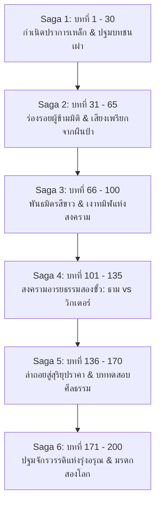

# โครงร่างบทนิยายรายตอน (Chapters Outline Master Guide) — 10000-BC (พลิกยุคหินด้วยรถพัสดุหมื่นชิ้น)

> 📖 **คำชี้แจง:** เอกสารฉบับนี้เป็น **Single Source of Truth สำหรับโครงเรื่องรายบท (Chapter-by-Chapter Master Outline)** ของมหากาพย์นวนิยายความยาว 150 – 200 ตอน ครอบคลุมทั้ง **6 มหากาพย์ (6 Sagas)** โดยจัดทำรายละเอียดระดับฉาก ยุทธวิธี พัสดุที่แกะ (Unboxing Beats) ปฏิสัมพันธ์กับชาวเน็ต (Forum Beats) การบริหารทรัพยากร (Cargo & Consumables Log) และระบบตัดจบ (Cliffhangers) สอดคล้องกับ [outline.md](file:///d:/myproject1/EBOOKs/10000-BC/outline.md), [character.md](file:///d:/myproject1/EBOOKs/10000-BC/character.md), [items.md](file:///d:/myproject1/EBOOKs/10000-BC/items.md), และ [prompt.md](file:///d:/myproject1/EBOOKs/10000-BC/prompt.md) อย่างเคร่งครัด 100%
> 
> 📌 **กฎเหล็กแม่บทก่อนเริ่มเขียนทุกบท (Mandatory All-.md Pre-Reading Rule — กฎข้อที่ 46 & 48):**
> 1. ก่อนเริ่มร่างหรือเขียนบทใดๆ ผู้เขียนและ AI **ต้องเปิดอ่านไฟล์ Markdown (.md) ทั้งหมดในโครงการก่อนเสมอเป็นกฎเหล็ก** (ได้แก่ `chapters_summary.md`, `chapters_outline.md`, `items.md`, `character.md`, `inventory.md`, `outline.md`, `story_outline.md`, `prompt.md` และบทก่อนหน้าใน `chapters/`) เพื่อเชื่อมต่อบริบท ไทม์ไลน์ และสถานะไอเทมอย่างสมบูรณ์แบบ 100% ป้องกันการหลุดลืมหรือเกิดช่องโหว่ความต่อเนื่องเด็ดขาด
> 2. **มาตรฐานความยาวต่อบท (กฎข้อที่ 48):** แต่ละตอนต้องมีความยาวเนื้อหาจริง **80 – 120 บรรทัด (ไม่นับบรรทัดว่าง)** หรือเทียบเท่า **2,200 – 3,200 คำ (~8,500 – 12,000 ตัวอักษร)** ห้ามตัดจบห้วนเด็ดขาด

---

## 🗺️ ภาพรวมโครงสร้าง 6 มหากาพย์ (The 6-Saga Roadmap: 150 – 200 ตอน)

---

# ภาคที่ 1 (Saga 1): กำเนิดปราการเหล็กและปฐมบทชนเผ่า (บทที่ 1 – 30)

---

### องค์ที่ 1: การมาถึงและการเผชิญหน้าครั้งแรก (Act 1: The Arrival & First Contact)

#### บทที่ 1: พายุหมอกทมิฬและปราการเหล็กนิรนาม (The Black Fog and the Iron Bastion)
* **Archetype:** Type A (Primal Combat & Thriller)
* **Scene Goal:** เปิดตัวธาม บัณฑิตวิศวกรรมวัย 24-25 ปี ถือใบขับขี่ ท.2 ไม่ใช่คนขับมือใหม่ แต่เคยขับรถสิบล้อส่งของแทน "ลุงเดช" มาแล้วหลายครั้งจนชำนาญทางและรู้ระบบรถทุกจุด รับช่วงขับเที่ยวบ่ายเร่งด่วนข้ามช่องเขาแทนลุงเดชที่ป่วยไส้ติ่งอักเสบกะทันหันก่อนออกรถไม่กี่ชั่วโมง, ปรากฏการณ์พายุหมอกทมิฬม้วนตัวถล่มช่องเขากลืนแสงอาทิตย์จนท้องฟ้ามืดมิดสนิทผิดธรรมชาติราวกับเที่ยงคืน (เวลา 14:47 น.), จังหวะที่ทัศนวิสัยมืดบอด มี "อะไรบางอย่าง" พุ่งเข้าชนท้ายรถอย่างจังจนรถหมุนคว้างไถลแหกโค้งรูดลงตามแนวลาดเขาลงสู่ก้นหุบเขา, ในตอนแรกธามยังไม่รู้ว่าตนเองย้อนมิติมา นึกว่าเกิดอุบัติเหตุรถไถลตกไหล่ทางธรรมดา ฟื้นขึ้นมาในช่วงพลบค่ำที่ค่อนข้างมืดและแสงสุดท้ายของวันกำลังจะดับลง ก้าวลงไปสำรวจความเสียหายช่วงล่างและพัสดุในตู้ทึบ, เมื่อสัตว์ร้ายยักษ์ (หมีถ้ำ 1 ตัน) ย่างสามขุมเข้ามา ธามมีสติหนีกลับขึ้นมาหลบในห้องโดยสาร และในวิกฤตเฉียดตายนั้นเอง ด้วยความที่รู้ตำแหน่งของมีค่าและยุทธภัณฑ์ฉุกเฉินของลุงเดชเป็นอย่างดี จึงเอื้อมไปปลดสลักช่องเก็บของลับใต้เบาะนอน (Sleeper Cab) ค้นพบ: ถุงนอนกันหนาวติดลบ (Sub-zero Sleeping Bag -15°C) ช่วยชีวิตจากความหนาวเฉียบพลันในคืนแรก, มีดโบวี่ 10 นิ้ว, และปืนพกลูกโม่ .38 Special พร้อมกระสุน 43 นัด ซึ่งกลายเป็นอาวุธไพ่ตายฉุกเฉินใบสุดท้าย กุมปืนเตรียมสู้ในถุงนอนจนหมีล่าถอยไป
* **Conflict:** รถบรรทุก 10 ล้อหนัก 25 ตันตกกระแทกอย่างรุนแรงผ่านรอยแยกมิติ **ช่วงล่างพังยับเยิน แหนบหน้า 2 ตับและแหนบหลังเพลาคู่หักสะบั้น เพลาขับคดงอ ล้อหน้าบิดเบี้ยวจนขับเคลื่อนไม่ได้โดยสิ้นเชิง** รถติดหล่มเลนแข็ง อุณหภูมิต่ำกว่าจุดเยือกแข็ง โทรศัพท์ขึ้น No Service นาฬิกามือถือเดินบอกเวลา 17:52 น. (สลบไปเกือบ 3 ชม. หลังชนตอน 14:47 น.) ขณะที่คอนโซลรถดับค้างที่ 14:47 น. หมีถ้ำยักษ์หนัก 1 ตันเข้าขูดกรีดตู้เหล็ก
* **Resolution:** ธามใช้ถุงนอนของคนขับเก่าห่อตัวป้องกันภาวะ Hypothermia มือขวากุมด้ามปืนพก .38 ที่บรรจุ 5 นัดในโม่ไว้แน่นอย่างมีสติ ไม่ผลีผลามยิงเพราะรู้ว่ากระสุน 43 นัดนี้คือไพ่ตายชีวิตที่จะเสียเปล่าไม่ได้เด็ดขาด ตู้เหล็กกล้าคอนเทนเนอร์รับแรงกระแทกได้ ปักหลักเป็นปราการถาวรใจกลางยุคหิน
* **Cargo Log:** น้ำมันดีเซล 0.5L (ทดสอบสตาร์ท เหลือ 199.5L), ถ่านไฟฉาย 10 นาที, กระสุนปืนพก .38 ตรวจนับได้ 43 นัด (ยังไม่ได้ยิง)
* **Cliffhanger (Stakes):** เสียงคำรามของหมีถ้ำจางไป ทิ้งรอยกรงเล็บลึก 3 รอยบนแผ่นเหล็ก ธามกุมปืนพกและชะแลงเหล็กกู้ภัยรอคอยรุ่งสางในความมืด

#### บทที่ 2: รุ่งอรุณสีเลือดและสัญญาณหนึ่งขีด (Blood Dawn and the One-Bar Anomaly)
* **Archetype:** Type D & E (Mystery, Exploration & First Forum Anomaly)
* **Scene Goal:** มุดสำรวจความเสียหายช่วงล่าง ยืนยันว่ารถขับไม่ได้ถาวร สุ่มแกะพัสดุ 3 กล่องแรก และการค้นพบสัญญาณปริศนาบนหลังคารถ
* **Humor & Beats:** มุก Deadpan ธามบ่นเรื่องเป็นเด็กจบใหม่ยังไม่ได้งานประจำแถมต้องมาติดค้างในยุคหิน ส่งของเลทข้ามหมื่นปีจะโดนตัดเกรดคนขับและหักดาวในแอป, ความลุ้นเปิดกล่องกาชาพัสดุ
* **Unboxing Beat:**
  * `#TH-994201` (กล่องยาว 2.4 กก.): แกะได้ **เสื้อโค้ตขนเป็ดแท้ (Goose Down Parka)** สวมใส่ป้องกันลมหนาวเฉียบพลันได้ทันท่วงที
  * `#TH-118492` (กล่องเล็ก 0.8 กก.): แกะได้ **มีดเดินป่าเหล็กคาร์บอนสูง (Bushcraft Knife)** คมกริบพร้อมปลอกพกพา
  * `#TH-773019` (ซองพลาสติก 0.5 กก.): แกะได้ **พาวเวอร์แบงก์โซลาร์เซลล์ 20,000 mAh** ช่วยต่อลมหายใจให้โทรศัพท์มือถือ
* **The Forum Beat:** เมื่อปีนขึ้นไปตรวจบนหลังคาตู้ทึบในม่านหมอกเช้า จู่ๆ โทรศัพท์สั่นเตือน: *สัญญาณเด้งขึ้นมา 1 ขีด!* ธามเปิดเว็บบอร์ดสากลตั้งกระทู้ด้วยมือสั่นเทา: *"ช่วยด้วยครับ รถบรรทุก 10 ล้อขนพัสดุตกเขาหลุดมาที่ไหนไม่รู้ หมอกหนา หนาวจัด ช่วงล่างพังยับ ล้อแตก ขับไม่ได้ มีตัวอะไรไม่รู้เท่าหมีควายแต่ใหญ่กว่าสามเท่าเพิ่งมาตะกุยตู้ทึบ"*
* **Cliffhanger (Forum & Stakes):** คอมเมนต์แรกเด้งขึ้นมา: `@TrollMaster_99: "เปิดตัวเกมเอาชีวิตรอดใหม่เหรอพี่? ภาพตู้เหล็กโคตรเนียน ขอพิกัดเซิร์ฟเวอร์หน่อย!"` พร้อมกับสายตาธามที่มองเห็นทัศนียภาพเวิ้งว้างของป่าสนไทกาโบราณและเงาร่างฝูงกวางยักษ์ไอริช ยืนยันว่าติดอยู่ในยุคน้ำแข็ง 10,000 BC เพียงลำพัง!

#### บทที่ 3: ลำธารหินขาวและรอยเท้าแห่งอดีตกาล (The White Stone Stream and Ancient Tracks)
* **Archetype:** Type D & E (Wilderness Recon, Survival Logistics & Prehistoric Ecology)
* **Scene Goal:** ออกสำรวจพื้นที่รอบฐานที่มั่น ค้นหาแหล่งน้ำจืดธรรมชาติ และตรวจพบร่องรอยสัตว์ดึกดำบรรพ์
* **Recon Beats:**
  * ธามเตรียมพร้อมยุทธภัณฑ์ EDC: เสื้อโค้ตขนเป็ดแท้, มีด 1095, ชะแลงเหล็กกู้ภัย 3.5 กก., กระติกน้ำสุญญากาศสเตนเลส 1.5L ของลุงเดช, และปืนพก .38 โครงสเตนเลสในกระเป๋าเสื้อโค้ต
  * ตรวจรอยแผลกรงเล็บ 3 รอยบนประตูเหล็ก และพบรอยอุ้งตีนสัตว์นักล่ายักษ์ (หมีถ้ำ *Ursus spelaeus*) กว้างเกือบ 40 ซม. ประทับลึกในดินเลนแข็ง
  * เดินลัดเลาะซอกหินปูน 150 เมตร ค้นพบ **ลำธารหินขาว** น้ำใสราวกระจก อุณหภูมิ 2-3°C ไหลผ่านชั้นหินปูนโดโลไมต์ มีกุ้งน้ำจืดดึกดำบรรพ์ ตักน้ำใส่กระติกเต็ม 1.5L
  * ตรวจพบรอยหากินของกวางยักษ์ไอริช และรอยอุ้งตีนสดใหม่ของสัตว์ตระกูลแมวยักษ์ (เสือเขี้ยวดาบ/สิงโตถ้ำ) พร้อมเสียงกิ่งไม้หักในป่าสน ธามถอยร่นเชิงยุทธวิธีกลับมายังรถอย่างปลอดภัย
* **Unboxing Beat:** แกะ `#TH-401923` (ชุดอุปกรณ์ยังชีพเดินป่าของเจ้าหน้าที่อุทยานดอยอินทนนท์): ได้ **นกหวีดเดินป่าโลหะไททาเนียมแรงดันเสียงสูง (High-Pitch Titanium Survival Whistle 120dB)** ร้อยสายพาราคอร์ดคล้องคอ, **ไฟแช็กแก๊สกันลมเปลวไฟเจ็ทเทอร์โบ 2 อัน** นำไปวางไว้ที่คอนโซลหน้ารถ, แท่งจุดไฟเฟอร์โรเซเรียม, ผ้าห่มฟอยล์กู้ภัยฉุกเฉิน, และเชือกพาราคอร์ด 550
* **Resolution:** กลับถึงป้อมปราการรถ 10 ล้ออย่างปลอดภัย ได้น้ำจืดธรรมชาติสำรองไว้ต้ม และได้อุปกรณ์ส่งสัญญาณเสียงเตือนภัยคล้องคอ ส่วนไฟแช็กเจ็ทพร้อมใช้งานในห้องโดยสาร
* **Cliffhanger (Mystery & Stakes):** ปีนขึ้นหลังคารถรับสัญญาณ 2G และตรวจสายตา พลันเหลือบเห็นมนุษย์โบราณ 3 คนถือหอกหินและธนูยืนจ้องลงมาจากสันเขาหินปูน 200 เมตร!

#### บทที่ 4: เงาร่างแห่งขุนเขาและเสียงแตรสะท้านไพร (Shadows and the Thunder Horn)
* **Archetype:** Type A & C (First Contact & Primal Misunderstanding)
* **Scene Goal:** การเผชิญหน้ากลุ่มนักล่าเผ่ากวางผา (คูราน และ เอลยา) ที่สะกดรอยตามหมีถ้ำมา
* **Humor & Beats:** ชาวเน็ตสายเกรียนแนะให้กดแตรไล่ แต่แพทย์สนามและผู้เชี่ยวชาญบุชคราฟต์เตือนสติว่าคนท้องถิ่นคือทางรอดเดียว ห้ามขับไล่เด็ดขาด! แต่เมื่อเอลยาตกใจเงื้อธนูจะยิงใส่ ธามจึงต้องใช้แตรสั้น 1 จังหวะและไฟหน้าเพื่อ Shock & Halt หยุดยั้งลูกศร
* **Resolution:** ธามบิดสวิตช์กด **แตรลมคู่ 10 ล้อ (>130 dB)** สั้นๆ หนักแน่น 1 ครั้ง พร้อมสาดไฟหน้าฮาโลเจนคู่ สยบลูกศรของเอลยาจนชะงักค้างและคูรานคุกเข่าลงตกตะลึง ธามไม่บีบไล่ซ้ำ แต่ก้าวลงมายกมือเปล่าแสดงไมตรีจิต และใช้นกหวีดไททาเนียม `#TH-401923` ส่งสัญญาณสงบศึก
* **Unboxing Beat:** (ใช้นกหวีดไททาเนียมที่แกะแล้วในบทที่ 3)
* **Cargo Log:** ไฟแบตเตอรี่ 24V (กดแตร 1 วินาที + สาดไฟ 5 วินาที), ลมเบรกลดลง 0.4 บาร์ (เหลือ 7.1 บาร์)
* **Cliffhanger (Mystery):** เอลยายังคงเกร็งธนูไม้ดัดคุมเชิงด้วยความหวาดระแวงแต่ไม่ยิง ธามกางมือเปล่าส่งสัญญาณสันติภาพและถ่ายรูปไว้ 1 ใบก่อนสัญญาณ 2G ดับลง

#### บทที่ 5: เปลวไฟในเสี้ยววินาทีและรสชาติของพระเจ้า (The Instant Flame and the White Gold)
* **Archetype:** Type C (Culture Shock, Food & Instant Flame)
* **Scene Goal:** เจรจาด้วยภาษากาย มอบเปลวไฟจากไฟแช็กและเกลือบริสุทธิ์
* **Humor & Wholesome:** หมอผีโมกากลัวไฟแช็กจนแทบหงายหลัง พอแตะเกลือบริสุทธิ์กับเนื้อเค็ม คูรานซาบซึ้งจนน้ำตาซึม ยกย่องเป็น "รสชาติของพระเจ้า"
* **Unboxing Beat:**
  * `#TH-881205` (กล่องอาหาร): แกะได้ **เกลือสมุทรบริสุทธิ์ 1 กก.** และ **เนื้อแดดเดียวอบแห้ง (Beef Jerky) 3 ซอง**
  * (ไฟแช็กแก๊สกันลมเจ็ทเทอร์โบ 2 ชิ้น มาจากกล่องกู้ภัย `#TH-401923` ที่แกะไว้แล้วในบทที่ 3)
* **Resolution:** เปลวไฟในเสี้ยววินาทีและเกลือบริสุทธิ์สร้างไมตรีจิต มิตรภาพเริ่มต้นขึ้น
* **Cliffhanger (Stakes):** เอลยาล้มพับลงกับพื้น เลือดสีคล้ำไหลซึมจากต้นขา—แผลเขี้ยวสัตว์ติดเชื้อรุนแรงจนเนื้อเริ่มเน่า (Severe Sepsis)!

#### บทที่ 6: แพทย์สนามข้ามมิติและการรักษาปาฏิหาริย์ (The Trauma Medic of Two Worlds)
* **Archetype:** Type F (Medical Miracle & Crowdsourced Trauma Surgery)
* **Scene Goal:** รักษาแผลติดเชื้อของเอลยาด้วยคำแนะนำของผู้เชี่ยวชาญออนไลน์
* **Unboxing Beat:** แกะ `#TH-339102`: ได้ **ชุดกล่องปฐมพยาบาลฉุกเฉิน, ยา Amoxicillin 500mg, ยาพาราเซตามอล, เบตาดีน, ใบมีดผ่าตัดสเตอร์ไรล์ และผ้าก๊อซ**
* **The Forum Beat:** `@CombatMedic_US` สั่งการฉุกเฉิน: *"อย่าเพิ่งเย็บปิดสนิท! ต้องกรีดระบายหนอง ล้างเบตาดีนเจือจาง ให้ Amoxicillin ทันที 1,000mg แล้วตามด้วย 500mg ทุก 8 ชม.!"*
* **Resolution:** ธามปฏิบัติตามอย่างเคร่งครัด กรีดระบายหนอง ล้างแผล พยาบาลเอลยาในตู้ทึบจนไข้ลดลง
* **Cliffhanger (Forum Bomb):** เอลยาฟื้นขึ้นมา สบตาด้วยความศรัทธา ในกระทู้ `@BioArch_Oxford` เริ่มทัก: *"เดี๋ยวนะ... สร้อยกระดูกสัตว์ที่คอผู้หญิงในรูป... นั่นมันฟันของ Canis dirus (ไดร์วูล์ฟ) ชัดๆ!"* พร้อมกับเสาควันสงครามของเผ่าเขี้ยวอสูรพุ่งขึ้นทางทิศใต้!

#### บทที่ 7: คมมีดเหล็กกล้าและพันธสัญญาแรก (The Carbon Steel Pact)
* **Archetype:** Type B & C (Engineering, Cutters & Clan Migration Pact)
* **Scene Goal:** สาธิตการใช้มีดเหล็กกล้า และทำข้อตกลงอพยพเผ่ามาตั้งหลักรอบรถ
* **Humor & Beats:** คนป่ามองมีดคัตเตอร์ SK5 ด้ามเหล็กเป็น "กรงเล็บอสูรพับได้" ธามกรีดแล่หนังสัตว์โชว์อย่างชิลล์ๆ
* **Unboxing Beat:** แกะ `#TH-662301`: ได้ **มีดคัตเตอร์งานช่าง SK5 พร้อมใบมีด 20 ใบ, เคเบิลไทร์ขนาดใหญ่ 100 เส้น, เทปผ้า Duct Tape 2 ม้วน**
* **Resolution:** คูรานตกลงนำคนในเผ่า 30 ชีวิตอพยพมาตั้งแคมป์ล้อมรอบรถ 10 ล้อเพื่อพึ่งพาปราการเหล็ก
* **Cliffhanger (Stakes):** ขบวนผู้อพยพเดินทางมาถึง แต่บนยอดเขามีสายตาดุร้ายของสอดแนมจากเผ่าเขี้ยวอสูรจับจ้องอยู่

#### บทที่ 8: หม้อไททาเนียมและภาพถ่ายสะเทือนวงการ (The Titanium Pot and Extinct Flora)
* **Archetype:** Type C & E (Titanium Pot Feast, Extinct Flora Viral Post)
* **Scene Goal:** งานเลี้ยงสตูว์เนื้อในหม้อแคมปิ้ง และการจุดประเด็นทางวิทยาศาสตร์ในโลกปัจจุบัน
* **Humor & Wholesome:** เด็กหญิงทาร่าตาโตเมื่อได้ชิมซุปต้มสุกอุ่นๆ มิตรภาพรอบกองไฟ
* **Unboxing Beat:** แกะ `#TH-710492`: ได้ **ชุดหม้อสนามไททาเนียมเดินป่า, ช็อกโกแลตบาร์พลังงานสูง 5 แท่ง, ซุปก้อนเข้มข้น 1 กล่อง**
* **The Forum Beat:** ภาพถ่ายหม้อต้มเนื้อติดพืชใบหยักสีเทา: `@BioArch_Oxford` โพสต์เตือนสติชาวเน็ต: *"พืชข้างหลังคือ Dryas octopetala สายพันธุ์ดึกดำบรรพ์ที่สูญพันธุ์แถบนี้ไปเกือบหมื่นปีแล้ว เจ้าของกระทู้อยู่ที่ไหนกันแน่?!"*
* **Cliffhanger (Stakes):** เสียงหอนโหยหวนของฝูงหมาป่าไดร์วูล์ฟดังประสานขึ้นรอบค่ายในคืนเดือนมืด

#### บทที่ 9: กฎเหล็กแห่งการสงวนเสบียงและปลอกกระสุนปริศนา (The Law of the Rations & The Brass Clue)
* **Archetype:** Type B & D (Camp Sanitation, Rations & The First Modern Relic)
* **Scene Goal:** วางระบบควบคุมทรัพยากร สุขอนามัย สเก็ตช์แผนผังที่ตั้งค่าย และการค้นพบเบาะแสผู้รอดชีวิตคนอื่นชิ้นแรก
* **The Camp Blueprint & Cartography Beat:** ธามใช้ถ่านไฟสเก็ตช์ **"แผนที่ยุทธวิธีฉบับแรกของมนุษยชาติ (Tactical Map of Fortress Alpha)"** ลงบนกระดาษลังลูกฟูก: กำหนดผังแอ่งเกือกม้าหินปูน (Horseshoe Amphitheater), ทางเข้าคอขวด 4-5 เมตรทิศใต้ (Thermopylae Chokepoint), ลำธารหินขาวทิศตะวันตกเฉียงเหนือ 150 ม., จุดขุดหลุมสุขาใต้ลมทิศใต้ 80 ม., และสังเกตเห็นแนวหน้าผาหินปูนสูง 30-40 เมตรด้านหลังรถที่มีม่านเถาวัลย์บังรอยแยกหิน
* **The Modern Relic Hook:** พรานเอลยานำซากกวางที่พบในแนวรอยเลื่อนธารน้ำแข็งมาให้ธามดู... ปรากฏว่ามี **ปลอกกระสุนทองเหลือง 9 มม. (Spent 9mm Casing)** ตกค้างอยู่! ธามใจเต้นระทึก ตระหนักว่าไม่ได้มีแค่ตนคนเดียวที่หลุดมิติมา!
* **Humor & Beats:** คนป่าได้ลองใช้ทิชชูเปียกกลิ่นแอปเปิ้ลเขียว ดมกันทั้งค่ายคิดว่าเป็นใบไม้วิเศษ
* **Unboxing Beat:** แกะ `#TH-192844`: ได้ **ทิชชูเปียกสูตรฆ่าเชื้อแบคทีเรีย 5 ห่อ, ถุงขยะดำหนาพิเศษ 50 ใบ, ผืนผ้ายางฟลายชีตกันฝน 4x6 เมตร**
* **Resolution:** ธามสอนการขุดหลุมสุขาห่างจากแหล่งน้ำ ขึงผ้ายางรองน้ำฝน และจัดเวรยามป้องกันค่าย
* **Cliffhanger (Mystery):** อุณหภูมิลดวูบลงอย่างรวดเร็ว ลมกรรโชกแรงส่งสัญญาณพายุหิมะลูกแรก

#### บทที่ 10: คืนล่าของไดร์วูล์ฟและยุทธวิธีสปอร์ตไลต์ (The Spotlight Hunt)
* **Archetype:** Type A (Primal Combat & Thriller)
* **Scene Goal:** ขับไล่ฝูงหมาป่าดึกดำบรรพ์ด้วยระบบไฟรถยนต์และอุปกรณ์แคมปิ้ง
* **Conflict:** หมาป่าไดร์วูล์ฟ 10 ตัวล้อมค่าย หอกหินเอาไม่อยู่
* **Unboxing Beat:** แกะ `#TH-883109`: ได้ **ไฟฉายคาดศีรษะ LED ปรับซูมได้ 2 อัน, เชือกพาราคอร์ด 550 ยาว 50 เมตร**
* **Resolution:** ธามสตาร์ทเครื่อง สาดสปอร์ตไลต์คู่หน้าตาพร่า กดแตรลมคำรามลั่น เอลยายิงธนูสังหารจ่าฝูง ฝูงหมาป่าแตกตื่นเตลิดหนี
* **Cargo Log:** น้ำมันดีเซล 1 ลิตร (คงเหลือ 198.5 ลิตร), ไฟแบตเตอรี่ 24V (5 นาที)
* **Cliffhanger (Discovery Hook):** หมาป่าตัวที่ตายมีปลอกคอหนังสัตว์และหอกกระดูกมนุษย์ปักอยู่—พวกมันถูกฝึกมาโดยเผ่าเขี้ยวอสูร!

#### บทที่ 11: ถ้ำลับศิลาจารึกฟ้าและสัญญาณควันทมิฬ (The Secret Cliff Sanctuary & The Black Smoke Warning)
* **Archetype:** Type D & E (The Secret Cave Sanctuary, Cave Paintings, Forum Alarm)
* **Scene Goal:** การค้นพบถ้ำลับบนหน้าผาหลังค่าย ป้อมปราการสำรอง หลุมหลบภัยหนาวขั้วโลก และรับรู้ภัยสงครามจากเผ่ากินคนเขี้ยวอสูร
* **The Secret Cave Discovery Beat:** ธามกับเอลยาปีนสำรวจแนวผาหินปูนด้านหลังรถ 10 ล้อ สังเกตเห็นลมไออุ่นพัดโชยออกมาจากซอกเถาวัลย์ดึกดำบรรพ์สูง 15 เมตร เหนือหลังคารถ:
  * บุกเบิกทางขึ้นค้นพบ **"ถ้ำลับผาสวรรค์ / ถ้ำนิทราแห่งจิตวิญญาณผา"**: ภายในโถงถ้ำโอ่โถง อบอุ่นสบาย 22°C – 25°C ด้วย **"บ่อน้ำแร่ร้อนธรรมชาติมรกต (Geothermal Hot Spring 38°C – 42°C)"** ที่ทำหน้าที่เสมือนฮีตเตอร์ยักษ์หล่อเลี้ยงถ้ำสู้ลมหนาวขั้วโลก
  * ธามใช้ทักษะวิศวกรตรวจการหมุนเวียนอากาศ ค้นพบ **ปล่องหินระบายอากาศธรรมชาติ (Natural Chimney / Skylight)** ทะลุยอดผา ดูดระบายไอน้ำและก๊าซออกสู่ฟ้าด้วย Stack Effect ทำให้มีแสงแดดส่องกระทบผิวน้ำมรกตและมีอากาศหายใจบริสุทธิ์
  * เอลยาได้แช่น้ำแร่บำบัดกล้ามเนื้อและแผลผ่าตัดฟื้นตัวรวดเร็ว, มีแปลงดินอุ่นริมบ่อพร้อมทำเรือนเพาะชำใต้ดิน, ป้อมปราการสำรองชั้นในสุด (The High Redoubt) และคลังเก็บเมล็ดพันธุ์/ยา
  * ค้นพบกองมูลค้างคาวดึกดำบรรพ์ (แหล่งดินประสิว/ไนเตรตธรรมชาติ สำหรับปุ๋ยและดินปืนในอนาคต)
  * ที่ผนังถ้ำด้านใน ค้นพบ **ภาพเขียนสีโบราณ (Cave Art):** รอยพิมพ์ฝ่ามือสีแดง (Hand Stencils), สัตว์ยักษ์ดึกดำบรรพ์ และสัญลักษณ์วงกลมมืดมิดคล้ายสุริยุปราคา/รอยแยกมิติ
* **Unboxing Beat:** แกะ `#TH-441092`: ได้ **สมุดโน้ตกันน้ำ All-Weather, ปากกายุทธวิธี, ไฟฉายเลเซอร์พอยเตอร์สีเขียวแรงสูง** (นำมาใช้วัดพิกัดและสเก็ตช์แผนผังภายในถ้ำลับ)
* **The Forum Beat:** ธามโพสต์ภาพถ่ายภาพเขียนผนังถ้ำและรอยแผลหอกกระดูกขึ้นกระทู้: `@BioArch_Oxford` สั่นสะเทือนวงการ ยืนยันภาพเขียนโบราณหมื่นปี พร้อมคำเตือนภัยสงครามด่วนจากผู้เชี่ยวชาญสนาม: *"ควันดำทางทิศเหนือนั่นคือสัญญาณเผ่ากินคนเร่ร่อน พวกมันกำลังเคลื่อนพล นายต้องเตรียมค่ายกลป้องกันเดี๋ยวนี้!"*
* **Cliffhanger (Modern Mystery):** กระทู้เริ่มติดเทรนด์คนอ่านหลักหมื่นคน โลกปัจจุบันเริ่มตามหาพิกัดรถบรรทุกที่หายสาบสูญ ขณะที่บนยอดผาสูง ลมพายุหิมะเริ่มคำรามก้อง!

---

### องค์ที่ 2: การสร้างป้อมปราการและการเดินทางตามหารอยแยกมิติ (Act 2: Fortification & The Rift Expedition)

#### บทที่ 12: ป้อมปราการรถบรรทุกและค่ายกลหิน (The Crowdsourced Bastion)
* **Archetype:** Type B (Chokepoint Bastion, 10-Ton Hydraulic Jack, Cordless Drill)
* **Scene Goal:** สถาปนาตัวถังรถ 10 ล้อเป็น Keep ถาวร และสร้างแนวกำแพงหินซิกแซกตามแบบสเก็ตช์ของวิศวกรออนไลน์
* **Unboxing Beat:** แกะ `#TH-512093`: ได้ **สว่านกระแทกไร้สาย 20V พร้อมดอกเจาะ, เลื่อยพับตัดไม้งานหนัก 2 ปื้น**
* **Resolution:** ธามใช้แม่แรงไฮดรอลิก 10 ตัน ชะแลงเหล็ก และสายสลิงลากรถ ช่วยชนเผ่างัดหินก้อนโตเรียงเป็นแนวกำแพงซิกแซก
* **Cargo Log:** แม่แรงไฮดรอลิก 10 ตัน (ใช้งาน), สายสลิง 10 ม.

#### บทที่ 13: คันธนูหมุนไฟและโรงรมควันเนื้อ (The Bow Drill & The Salt Vault)
* **Archetype:** Type B & C (Friction Fire Knowledge Transfer & Food Preservation)
* **Scene Goal:** ถ่ายทอดวิชาการจุดไฟโบราณก่อนไฟแช็กจะหมด และการสร้างโรงรมควันถนอมเนื้อรับมือฤดูหนาว
* **Unboxing Beat:** แกะ `#TH-229104` (สายเอ็นตกปลาถัก PE 8 เส้น แรงดึง 100 ปอนด์) และ `#TH-631029` (ถุงสูญญากาศใส่อาหาร, เกลือสมุทร 10 กก., ผงพริกไทยดำและเครื่องเทศ)
* **The Forum Beat:** `@VikingBushcraft` สอนสูตรคันธนูหมุนไม้ (Bow Drill) ละเอียดทุกขั้นตอน ใช้สายเอ็นตกปลาทำสายธนู ธามสอนเอลยาจนจุดไฟติดสำเร็จด้วยมือตนเองโดยไม่ต้องพึ่งไฟแช็ก พร้อมคำแนะนำเชฟออนไลน์เรื่องสัดส่วนเกลือ 3% ต่อน้ำหนักเนื้อ และการคุมควันไม้สนไม่ให้ขม
* **Resolution:** ชนเผ่าได้ไฟที่ยั่งยืน และโรงรมควันแห่งแรกถูกสร้างขึ้น เสบียงเนื้อเค็มเพียงพอเลี้ยงคนทั้งค่ายตลอดฤดูหนาว

#### บทที่ 14: อาวุธเคมีพริกหม่าล่าและเกราะยางรถยนต์ (Chemical Defense and Tire Armor)
* **Archetype:** Type B & C (MacGyver Comedy & Primal Innovation)
* **Scene Goal:** ประดิษฐ์อาวุธป้องกันตัวระยะประชิดจากของในตู้พัสดุ
* **Humor & Beats:** ธามสำลักผงพริกหม่าล่าจนน้ำตาไหล คนป่านึกว่าเป็นผงเวทมนตร์ พอลองฉีดใส่ลม คนเถื่อนจามสนั่นทั้งหุบเขา
* **Unboxing Beat:** แกะ `#TH-901238`: ได้ **พริกหม่าล่าและพริกป่นฮาลาปินโญเข้มข้น 5 ถุงใหญ่, กระบอกฉีดน้ำแรงดันมือ 2 กระบอก**
* **Resolution:** นำเศษยางเรเดียลจากยางอะไหล่ที่ฉีกขาดมาตัดเย็บเป็นเกราะหน้าอกกันคมหอกหินให้เอลยาและคูราน

#### บทที่ 15: ผู้อพยพใต้เพลิงสงคราม (Refugees and Triage)
* **Archetype:** Type F & C (Refugees Triage, Space Blankets, Community Growth)
* **Scene Goal:** รับมือผู้อพยพ 30 คนจากเผ่ากวางขาวที่ถูกเผาทำลาย
* **Unboxing Beat:** แกะ `#TH-310492`: ได้ **ผ้าห่มฟอยล์ฉุกเฉินกู้ภัย (Space Blankets) 20 ผืน, ขี้ผึ้งทาแผลไฟไหม้, ยาปฏิชีวนะสำรอง**
* **Humor & Wholesome:** ผู้อพยพห่มผ้าฟอยล์สีเงินวาววับ ดูเหมือนกองทัพมนุษย์อวกาศยุคหิน มิตรภาพและการรักษาเยียวยา
* **Resolution:** ชุมชนเติบโตเป็นป้อมปราการขนาดย่อมที่เปี่ยมด้วยกำลังพล 60 คน

#### บทที่ 16: ตำนานสัตว์เหล็กตัวที่สองและการจัดทัพสำรวจ (The Legend of the Second Iron Beast & The Expedition Pack)
* **Archetype:** Type D & B (Prehistoric Lore, Trekking Gear & Expedition Setup)
* **Scene Goal:** คนเฒ่าคนแก่/พรานรุ่นเก่าในเผ่าเล่าเรื่อง "สัตว์เหล็กตัวที่สอง" ที่หลับใหลอยู่กลางหุบเขาหิมะไกลลิบทางทิศตะวันตก ต้องเดินเท้าหลายวัน, ธามตรวจเช็กสัญญาณ 2G พบชาวเน็ตตรวจพบคลิกแม่เหล็กในพิกัดเดียวกัน, จัดทัพสำรวจร่วมกับเอลยา
* **The Clue & Lore:** พรานเฒ่าโมกาและคูรานเล่าเรื่องสัตว์เหล็กยักษ์ตัวที่สองที่ส่งเสียงร้องสะท้อนฟ้าก่อนแน่นิ่งไปในช่องเขาหิมะตะวันตก เดินเท้า 3-4 วัน มีกลิ่นประหลาดและรอยล้อ ธามตื่นเต้นจัดเพราะอาจเป็นยานพาหนะคันอื่นที่หลุดมาพร้อมกัน! วอร์รูมชาวเน็ต `@AstroNerd_Munich` ร่วมยืนยันว่าพิกัดนั้นมีรอยกระเพื่อมของสนามแม่เหล็กมิติ (The Temporal Rift Anomaly)
* **Preparation Beat:** คูรานรับหน้าที่คุมค่ายใหญ่ ธามนำแหนบสปริง 5160 ตีหัวหอกเหล็กและมีดเดินป่า พร้อมจัดเป้สัมภาระฉุกเฉิน (Bug-Out Bag)
* **Unboxing Beat:** แกะ `#TH-882194`: ได้ **เป้เดินป่า 65L, รองเท้าเทรคกิ้งพื้นหนึบ Vibram, ชุดหม้อสนามไททาเนียม, เข็มทิศแมกนีเซียม, หินลับมีดกากเพชร, และลูกธนูคาร์บอนหัวเหล็ก 12 ดอก**
* **Resolution:** ธามและเอลยาก้าวเท้าออกจากเซฟโซนของปราการรถ 10 ล้อ เริ่มต้นการเดินทางสำรวจไกลหลายวันสู่ดินแดนที่ไม่เคยมีใครเหยียบย่าง

#### บทที่ 17: สู่พงไพรหมื่นปีและกองไฟใต้แสงดาว (Into the Paleolithic Wild & Campfire Bonding)
* **Archetype:** Type D & C (Wilderness Trekking, Prehistoric Flora/Fauna & Campfire Bonding)
* **Scene Goal:** การผจญภัยวันแรกๆ ลุยป่าสนไทกาโบราณ ข้ามธารน้ำแข็งแตกร้าว และความผูกพันลึกซึ้งริมกองไฟ
* **Wilderness Adventure:** ธามและเอลยาเดินป่าลัดเลาะหน้าผาหินปูนและป่าสนไทกาดึกดำบรรพ์ เผชิญรอยเท้ากวางยักษ์ไอริชและฝูงแร้งดึกดำบรรพ์ การเดินทางข้ามลำธารน้ำแข็งเชี่ยวกราก ธามใช้เชือกพาราคอร์ดและไม้เท้าเดินป่าช่วยพยุงกันข้ามอย่างทุลักทุเล
* **Campfire Bonding:** ยามค่ำคืนกลางป่าเปลี่ยว ก่อไฟด้วยแท่งแมกนีเซียมและคันธนูหมุนไม้ ธามใช้หม้อไททาเนียมต้มสตูว์เนื้อเค็มและชงกาแฟร้อนแบ่งกับเอลยา เอลยาทึ่งในรสชาติ ทั้งสองคุยเปิดอกใต้ท้องฟ้าดวงดาวหมื่นปีก่อน ธามสอนเรื่องดาวเหนือและระบบดวงดาว ส่วนเอลยาสอนสัญชาตญาณฟังเสียงลมและดมกลิ่นสัตว์นักล่า
* **Unboxing Beat:** แกะพัสดุพกพา `#TH-102948`: ได้ **กล้องส่องทางไกลตาเดียว (Monocular Telescope 12x50) พร้อมเข็มทิศเลนส์และไฟฉาย LED ฉุกเฉิน** ช่วยส่องสำรวจเส้นทางข้ามสันเขาหินปูน
* **Cliffhanger:** กล้องส่องทางไกลจับภาพควันไฟลอยขึ้นจากหุบเขาลึกข้างหน้า พร้อมลมหนาวที่พัดแรงขึ้นอย่างผิดปกติ

#### บทที่ 18: พายุหิมะขั้วโลกและรังหมีถ้ำ (The Subzero Blizzard & The Ice Cave Survival)
* **Archetype:** Type D & F (Extreme Weather Survival, Subzero Blizzard & Bubble Wrap Miracle)
* **Scene Goal:** เอาชีวิตรอดจากพายุหิมะฉับพลัน Younger Dryas อุณหภูมิดิ่งติดลบ 25°C ในถ้ำหินร่วมกับภัยหมีถ้ำ
* **Conflict & Extreme Cold:** พายุหิมะขาวโพลน (Whiteout) พัดถล่มฉับพลัน อุณหภูมิดิ่งลงต่ำกว่าจุดเยือกแข็ง ลมกรรโชกแรงจนก้าวเดินไม่ได้ ธามและเอลยาต้องรีบหาที่หลบภัยในโพรงถ้ำหิน แต่กลับพบรอยเล็บและกลิ่นสาบของหมีถ้ำจำศีลอยู่ด้านในลึก
* **Tactical Survival:** ธามใช้ผงพริกหม่าล่าโปรยสกัดกลิ่นและปิดกั้นโพรงด้านในของหมีถ้ำ จากนั้นแกะพัสดุยังชีพ `#TH-492019`: พบ **ม้วนบับเบิ้ลพลาสติกกันกระแทก 5 ม้วนใหญ่, เต็นท์โดมเดินป่า 4 ฤดู, ถุงนอนขนเป็ดติดลบ, และผ้าห่มฟอยล์กู้ภัย Space Blanket**
* **The Insulation Miracle:** ธามนำบับเบิ้ลกันกระแทกมาบุผนังหินและปูพื้น กักเก็บความร้อนร่วมกับผ้าห่มฟอยล์และถุงนอนขนเป็ด ทั้งสองกอดประคองกันต้านทานลมหนาวสุดขั้วจนรอดชีวิตมาได้อย่างปาฏิหาริย์ เอลยาทึ่งในวิทยาการ "ฟองอากาศกักความอบอุ่น"
* **Resolution:** พายุหิมะสงบลง ทิ้งแผ่นดินขาวโพลนสุดลูกหูลูกตา ทั้งสองก้าวออกจากถ้ำเตรียมมุ่งหน้าสู่ช่องเขาเป้าหมาย

#### บทที่ 19: ซากสัตว์เหล็กตัวที่สองและแผนลับเขี้ยวอสูร (The Fallen Iron Beast & The Raider Infiltration)
* **Archetype:** Type D & A (Discovery of the Second Wreckage, Modern Relics & Beast Fang Infiltration)
* **Scene Goal:** บุกถึงช่องเขาเป้าหมาย ค้นพบซากยานพาหนะสมัยใหม่คันที่สองตามคำบอกเล่าของคนเฒ่าคนแก่ และค้นพบภัยสงครามใหญ่
* **The Grand Discovery:** ในซอกธารน้ำแข็งแตกร้าว ธามและเอลยาค้นพบ **ซากรถกระบะ 4WD ยกสูง (รถหมอณิชา)** พลิกคว่ำติดคาซอกหิน! ธามมุดสำรวจพบรอยล้อยางดอกลึก, ปลอกกระสุนปืนยาสลบ, กระเป๋ายาและเวชภัณฑ์สัตว์ป่าที่ฉีกขาด และมีรอยเขียนสัญลักษณ์ฉุกเฉินบนแผ่นหิน ยืนยันว่าคนบนรถยังมีชีวิตและเดินเท้าหนีไปทางทิศตะวันตก (ถิ่นเผ่าแกะภูเขา)!
* **The Monolith Anomaly:** บนยอดผาเสาหินทมิฬใกล้กัน ธามตรวจพบสนามพลังงานประจุไฟฟ้าสีม่วงครามตกค้างของ **รอยแยกมิติ (Temporal Rift)** และกลิ่นโอโซน คำนวณยืนยันว่าช่องมิติจะเปิดออกได้สมบูรณ์ในวัน **"สุริยุปราคาเต็มดวง"**!
* **The Raider Threat:** ขณะที่ธามกำลังมีความหวัง เอลยาส่องกล้องลงไปที่หุบเขาเบื้องล่าง—มันคือค่ายใหญ่ของ **เผ่ากินคนเขี้ยวอสูร** กว่า 100 นาย ที่มีอาวุธเสริมเหล็กสมัยใหม่ กำลังประกอบพิธีบูชายัญเตรียมเคลื่อนทัพใหญ่เพื่อบุกถล่มค่ายรถบรรทุก 10 ล้อในอีกไม่กี่วัน!
* **Unboxing Beat:** แกะ `#TH-771920`: ได้ **ไฟฉายยุทธวิธี LED แสงสโตรบ 2,000 ลูเมนส์, สายรัดซิปไทร์** ธามใช้สาดแสงช็อกตาพร่าและจับสายสืบเขี้ยวอสูรที่สะกดรอยตามมา เค้นแผนการรบได้ครบถ้วน
* **Resolution:** ได้รับความจริงสองด้าน: รอยแยกมิติจะเปิดออกเพื่อกลับบ้าน แต่ค่ายรถ 10 ล้อกำลังจะถูกถล่มย่อยยับ!

#### บทที่ 20: ควบตะบึงกลับค่ายและวอร์รูมคืนก่อนศึกใหญ่ (The Desperate Race & Eve of War)
* **Archetype:** Type E & A (The Race Against Time, Moral Dilemma & War Room Strategy)
* **Scene Goal:** แข่งกับเวลาเร่งเดินทางกลับมาเตือนภัยที่ค่ายรถบรรทุก พร้อมระดมสมองวอร์รูมชาวเน็ตเตรียมรับศึกชี้ชะตาทั้งสองโลก
* **Moral & Emotional Dilemma:** ธามรู้จุดและเวลาที่รอยแยกมิติจะเปิดออกเพื่อพาเขากลับบ้านแล้ว... แต่มันจะเปิดในคืนสุริยุปราคาซึ่งเป็นวันเดียวกับที่กองทัพเขี้ยวอสูรจะบุกถล่มค่าย! หากเขารออยู่ที่นี่เพื่อข้ามกลับไป เขาจะรอดชีวิตคนเดียวอย่างแน่นอน แต่เอลยา คูราน และทุกคนในค่ายจะต้องถูกฆ่าล้างเผ่าพันธุ์ ธามตัดสินใจเด็ดขาดที่จะไม่ทอดทิ้งครอบครัวแท้จริงนี้ ควบตะบึงฝ่าลมหนาวข้ามวันข้ามคืนกลับมาเตือนภัย
* **The War Room:** ธามและเอลยากลับถึงค่ายทันเวลา เตือนภัยทุกคนและประชุมวอร์รูมชาวเน็ตข้ามคืนเพื่อเตรียมค่ายกลรับศึก 100 นาย
* **Unboxing Beat:** แกะ `#TH-990128`: ได้ **สายยางดูดน้ำมันกึ่งอัตโนมัติ, เทปกันน้ำฟอยล์อะลูมิเนียม** ธามดูดน้ำมันดีเซล 5 ลิตรใส่ขวดแก้วเตรียมทำระเบิดเพลิง Molotov
* **Cargo Log:** น้ำมันดีเซลดูดใส่ขวด 5 ลิตร (คงเหลือในถัง 190.5 ลิตร)

---

### องค์ที่ 3: หมีถ้ำยักษ์และสงครามเผ่าเขี้ยวอสูร (Act 3: Megafauna & The Great Siege)

#### บทที่ 21: อสูรตื่นจากจำศีล (Awakening of the Cave Bear)
* **Archetype:** Type A (Megafauna Monster Horror)
* **Scene Goal:** หมีถ้ำยักษ์บาดเจ็บและหิวโซหวนกลับมาถล่มค่าย
* **Conflict:** หมีถ้ำหนัก 1.2 ตันพังแนวกำแพงหินชั้นนอก หอกหินแทงไม่ระคายผิว มุ่งตรงมายังตู้สินค้า
* **Unboxing Beat:** ธามแกะกล่องขนาดยาว `#TH-119283`: แจ็กพอตแตก! พบ **คันธนูทดกำลัง (Compound Bow 70 lbs) พร้อมลูกธนูคาร์บอนหัวเหล็กเจาะเกราะ**

#### บทที่ 22: ลำแสงสปอร์ตไลต์และคมเขี้ยวคาร์บอน (Blinding High Beams and Steel)
* **Archetype:** Type A (High-Octane Boss Fight)
* **Scene Goal:** สังหารหมีถ้ำยักษ์ด้วยการผสานเทคโนโลยีและอาวุธสมัยใหม่
* **The Forum Beat:** สมาชิกบอร์ดแนะนำจุดตาย: ธามสตาร์ทเครื่องยนต์ สาดไฟสูงสปอร์ตไลต์คู่หน้าเข้าตาหมีถ้ำจนมองไม่เห็น เอลยาและธามใช้คันธนูทดกำลังและหอกแหนบเหล็กกล้า 5160 แทงทะลวงใต้คอหอย ปลิดชีพสัตว์ยักษ์ลงได้สำเร็จ
* **Cargo Log:** น้ำมันดีเซล 0.5L (คงเหลือ 190.0L), ไฟแบตเตอรี่ 24V

#### บทที่ 23: คลื่นมนุษย์คนเถื่อนบุกค่าย (The Screaming Onslaught)
* **Archetype:** Type A & B (Siege Warfare & Trap Activation)
* **Scene Goal:** กองทัพเขี้ยวอสูร 100 นายบุกจู่โจมยามวิกาล
* **Conflict:** แนวกำแพงซิกแซกและสายสลิงลากรถทำงาน ชะลอข้าศึกและทำให้แนวหน้าล้มระเนระนาด กองทัพคนเถื่อนกรีดร้องบุกประชิด

#### บทที่ 24: เปลวเพลิงสีส้มและเสียงกัมปนาท (Molotov and the Thunder Roar)
* **Archetype:** Type A (Pyrotechnic Defense & Shock-and-Awe)
* **Scene Goal:** พลิกสถานการณ์ด้วยระเบิดเพลิงดีเซลและคลื่นเสียงข่มขวัญ
* **Unboxing Beat:** แกะ `#TH-772819`: ได้ **กล่องของขวัญวิสกี้ซิงเกิลมอลต์ 40 ดีกรี 2 ขวด** นำแอลกอฮอล์มาเสริมฤทธิ์ระเบิดเพลิง
* **Resolution:** ธามขว้างระเบิดเพลิง Molotov ปิดคอหอยทางแคบ เปลวไฟลุกท่วมหิมะ พร้อมเหยียบคันเร่งเครื่องยนต์คำรามและกดแตรลมคู่ 10 ล้อสะท้านป่า ข้าศึกขวัญหนีดีฝ่อ
* **Cargo Log:** น้ำมันดีเซล 3 ลิตร (คงเหลือ 187.0 ลิตร)

#### บทที่ 25: คำทำนายสุริยุปราคาและศึกตัดสินหน้าค่าย (The Eclipse Prophecy & The Flare)
* **Archetype:** Type E & A (Astrophysics Prophecy & Decisive Flare Duel)
* **Scene Goal:** เผด็จศึกกรากด้วยความรู้ดาราศาสตร์และพลุสัญญาณในเวลาที่รอยแยกมิติบนฟ้าเปิดออก
* **The Climax & Rift Resonance:** ท้องฟ้ามืดมิดลงจากสุริยุปราคาเต็มดวง รอยแยกมิติบิดหมุนสะท้อนแสงประจุไฟฟ้าบนยอดเขาเสาหินทมิฬ ลำแสงวังวนมิติฉายภาพสะท้อนของโลกปัจจุบัน—แสงไฟนีออน ตึกระฟ้า และเสียงเมืองใหญ่ที่ธามเคยจากมา
* **The Emotional Climax & The Ultimate Choice:** เอลยาน้ำตาคลอเบ้า เธอรู้ว่านี่คือทางกลับบ้านของธามและพยายามผลักไสให้เขาวิ่งไปที่รอยแยกเพื่อความปลอดภัย แต่เมื่อหัวหน้าเผ่ากรากเงื้อขวานศึกจะพุ่งเข้าสังหารพวกพ้อง ธามไม่ลังเลแม้แต่วินาทีเดียว เขาหันหลังให้ช่องมิติที่กำลังหมุนวน สลัดความโหยหาโลกเก่าทิ้งไปอย่างเด็ดเดี่ยว
* **Unboxing Beat:** แกะกล่องนิรภัย `#TH-001928`: ได้ **ปืนยิงพลุสัญญาณฉุกเฉินทางทะเล (Marine Flare Gun) พร้อมกระสุนแดงส่องสว่าง 3 นัด**
* **Resolution:** ธามลั่นไกยิงพลุสัญญาณฉุกเฉินอัดกลางอกหัวหน้าเผ่ากราก ร่างลุกไหม้ดับดิ้น กองทัพเขี้ยวอสูรยอมจำนนทั้งสิ้น ขณะที่รอยแยกมิติค่อยๆ หดตัวและสลายไป ธามกุมมือเอลยาไว้แน่น สถาปนาพันธสัญญาแห่งชีวิตว่าจะอยู่สร้างอนาคตและปกป้องแผ่นดินนี้ตลอดไป

#### บทที่ 26: อวสานเขี้ยวอสูรและการรวมแผ่นดิน (The Unification of Tribes)
* **Archetype:** Type C & B (Post-War Unification & Agricultural Mobilization)
* **Scene Goal:** จัดระเบียบหลังสงคราม รวมเผ่าพันธุ์ และวางรากฐานการผลิต
* **Unboxing Beat:** แกะ `#TH-482910`: ได้ **พลั่วสนามพับได้, มีดพร้าด้ามยาง, ถุงมือทำสวนหนาพิเศษ 10 คู่**
* **Resolution:** ธามไม่สังหารเชลยศึก แต่ริบอาวุธและจัดสรรแรงงานถางป่าปรับหน้าดิน รวมคนกว่า 150 ชีวิตเข้าด้วยกันเป็นปฐมชุมชน

---

### องค์ที่ 4: รุ่งอรุณแห่งอารยธรรมและมรดกนิรันดร์ (Act 4: Dawn of the New Age)

#### บทที่ 27: พัสดุกล่องสุดท้ายและความจริงจากโลกเดิม (The Empty Manifest & The Modern Hunt)
* **Archetype:** Type E & C (Empty Manifest, Modern Scientific Confirmation, Final Legacy Prep)
* **Scene Goal:** พัสดุในตู้เริ่มร่อยหรอ ทางการในโลกปัจจุบันแถลงข่าวคดียานพาหนะทะลุมิติ
* **The Forum Beat:** รัฐบาลและสถาบันวิจัยนานาชาติแถลงข่าวยืนยันการตรวจพบคลื่นแม่เหล็กไฟฟ้าแปลกประหลาดที่เชื่อมต่อกับสัญญาณโทรศัพท์ของธาม กระทู้กลายเป็นประวัติศาสตร์หน้าใหม่ของโลก มีหน่วยงานเสนอแนวทางช่วยเหลือและถามว่าทำไมเขาไม่ข้ามช่องมิติกลับมา ธามพิมพ์ตอบกระทู้ด้วยถ้อยคำสงบและหนักแน่นว่า ตนได้เลือกแล้วที่จะอยู่ที่นี่ เพราะที่นี่มีครอบครัว มีคนที่เขารัก และมีอนาคตที่เขาสามารถสร้างด้วยสองมือ
* **Resolution:** กล่องพัสดุกระดาษลูกฟูกที่แกะหมดแล้วถูกนำไปทำเชื้อไฟและปุ๋ยหมัก ธามจัดระเบียบตู้คอนเทนเนอร์เป็นห้องบัญชาการถาวร

#### บทที่ 28: เมล็ดพันธุ์แห่งอนาคตและการปฏิวัติเกษตรกรรม (The First Harvest & Seed Manifest)
* **Archetype:** Type B & D (Agricultural Revolution, Heirloom Seeds, Irrigation Channels)
* **Scene Goal:** เริ่มต้นการเพาะปลูกธัญพืชแห่งแรกของโลก
* **Unboxing Beat:** แกะกล่องพัสดุหมวดเกษตรที่เก็บรักษาไว้อย่างดี `#TH-582910`: พบ **เมล็ดพันธุ์ข้าวสาลีอินทรีย์, ข้าวบาร์เลย์, เมล็ดถั่วแขก, มะเขือเทศทนหนาว และปุ๋ยอินทรีย์อัดเม็ด**
* **The Forum Beat:** นักปฐพีวิทยาแนะนำวิธีปรับหน้าดิน การไถพรวน และการทำคลองส่งน้ำ ธามนำเมล็ดพันธุ์ลงแปลงเพาะปลูก เกิดทุ่งเกษตรกรรมแห่งแรกในยุค 10,000 ปีก่อนคริสตกาล

#### บทที่ 29: เตาหลอมโลหะแห่งแรกจากซากช่วงล่าง 10 ล้อ (The Primitive Blast Furnace)
* **Archetype:** Type B (High-Tech Primitive Metallurgy & Industrial Leap)
* **Scene Goal:** การก้าวกระโดดสู่ยุคโลหกรรมก่อนประวัติศาสตร์จริง
* **The Forum Beat:** แบบแปลนเตาหลอมดินเหนียวอุณหภูมิสูงจาก `@VikingBushcraft` ใช้เครื่องเป่าลมหนังสัตว์
* **Resolution:** ธามและช่างในเผ่าถอดชิ้นส่วนช่วงล่างรถ 10 ล้อที่พังเสียหาย—เพลาขับคู่ที่คดงอ, กระทะล้อเหล็กหนา, และแหนบสปริง 5160 ทั้งหมด—มาหลอมและตีขึ้นรูปเป็นหัวคันไถ ขวานถากไม้ และเคียวเกี่ยวข้าวเหล็กกล้าชุดแรกของมวลมนุษยชาติ

#### บทที่ 30: สัญญาณสุดท้ายและแท่นบูชาหมื่นปี (The Final Transmission & Eternal Bastion)
* **Archetype:** Type E & C (Grand Finale, The Closing Rift & The Monument of Eternity)
* **Scene Goal:** สัญญาณมือถือดับลงอย่างถาวร และบทสรุปแห่งตำนาน
* **The Forum Beat:** แบตเตอรี่โทรศัพท์เหลือ 1% สัญญาณรอบ 10,000 ปีกำลังจะขาดหายถาวร ธามยืนเคียงข้างเอลยาบนหลังคารถบรรทุก 10 ล้อ ทอดสายตามองดูชุมชนที่เติบโต ทุ่งข้าวสาลีสีทองกว้างใหญ่ เคียงข้างกำแพงหินมหึมา และโครงสร้างตู้รถบรรทุก 10 ล้อที่ถูกยกขึ้นเป็นเทวสถานศักดิ์สิทธิ์ใจกลางเมือง ธามโพสต์ภาพและข้อความอำลาสุดท้าย: *"ถึงทุกคนที่ต่อสู้เคียงข้างผมมาตลอดหนึ่งปีเต็ม... ไม่ต้องออกตามหาผมอีกต่อไป ผมไม่ได้หลงทาง แต่ผมได้พบบ้านที่แท้จริงของผมแล้ว ลาก่อนโลกเก่า... ยินดีต้อนรับสู่อนาคต"*
* **Resolution:** กระทู้ถูกล็อกและบันทึกเป็นมรดกโลก โครงเหล็กรถบรรทุก 10 ล้อยืนหยัดข้ามหมื่นปี กลายเป็นแท่นบูชาเทวะที่ให้กำเนิดอารยธรรมแรกของมนุษยชาติอย่างสมบูรณ์แบบ

---

# ภาคที่ 2 – 6 (Sagas 2 – 6): ผังมหากาพย์ตอนที่ 31 – 200 (The Epic Blueprint)

---

## 🌲 Saga 2: ร่องรอยผู้ข้ามมิติและเสียงเพรียกจากผืนป่า (บทที่ 31 – 65)
* **แก่นเรื่องหลัก:** การขยายอาณาเขตและการแกะรอยปริศนาผู้รอดชีวิตคนอื่น (Exploration, Mystery Relics & Settlement Expansion)
* **หมุดหมายสำคัญ (Key Milestones):**
  * **บทที่ 31 – 37:** การสำรวจลุ่มน้ำและป่าสนไทกาตอนเหนือ ก่อตั้งสถานีสังเกตการณ์แนวหน้า แกะพัสดุหมวดเครื่องมือช่างและเชือกกู้ภัย
  * **บทที่ 38:** การค้นพบ **ปลอกกระสุนทองเหลือง 9 มม.** ชิ้นที่สองในซอกหิน ยืนยันร่องรอยการต่อสู้ของมนุษย์ยุคปัจจุบัน
  * **บทที่ 39 – 47:** การประดิษฐ์เกวียนล้อไม้เสริมตลับลูกปืนจากเศษอะไหล่รถ 10 ล้อ เพื่อลำเลียงแร่หินและท่อนซุงสร้างกำแพงชั้นที่สอง
  * **บทที่ 48:** พบซากกวางไอริชถูกยิงด้วย **ลูกปรายลูกซอง 00 Buckshot** ในป่าลึก บ่งชี้ว่ามีกลุ่มคนติดอาวุธปืนลูกซองล่าสัตว์อยู่ในพื้นที่
  * **บทที่ 49 – 57:** ปะทะฝูงเสือเขี้ยวดาบ (Smilodon) ธามใช้คันธนูทดกำลังและปืนลูกโม่ .38 ยิงสกัดหยุดการชาร์จในเสี้ยววินาที (ใช้กระสุนไป 1 นัด คงเหลือ 42 นัด)
  * **บทที่ 58 – 65:** วิทยุสื่อสารมือถือที่แกะจากกล่องพัสดุรับสัญญาณคลื่นสั้นแทรกเข้ามาเป็นเสียงขอความช่วยเหลือของหญิงสาว (พญ. ณิชา) นำไปสู่การจัดทัพกู้ภัยครั้งใหญ่

---

## ⚕️ Saga 3: พันธมิตรสีขาวและเงาทมิฬแห่งสงคราม (บทที่ 66 – 100)
* **แก่นเรื่องหลัก:** การกู้ภัย พญ. ณิชา, การเผชิญหน้าขั้วอำนาจวิกเตอร์ และวิกฤตโรคระบาดดึกดำบรรพ์ (The White Medic, The Iron Warlord & Zoonosis Crisis)
* **หมุดหมายสำคัญ (Key Milestones):**
  * **บทที่ 66 – 71:** ธามและเอลยาฝ่าดงหิมะเข้าช่วยเหลือ **พญ. ณิชา** จากซากรถ SUV 4WD ที่ติดในซอกผา ช่วยรักษาเจ้าหน้าที่วิจัยที่รอดชีวิต
  * **บทที่ 72 – 75:** รวมศูนย์การแพทย์สนาม หมอณิชานำชุดตรวจโรค กล้องจุลทรรศน์สนาม และวัคซีนสัตว์ป่ามาติดตั้งในตู้คอนเทนเนอร์รถ 10 ล้อ
  * **บทที่ 76 – 85:** การเปิดตัว **วิกเตอร์ (Victor)** อดีตทหารรับจ้างที่ยึดรถตู้เรือนจำหุ้มเกราะ ขึ้นเป็นผู้นำจอมเผด็จการของเผ่าเขี้ยวอสูร กวาดต้อนเชลยศึกและผลิตอาวุธสงคราม
  * **บทที่ 86 – 94:** วิกฤตโรคระบาดสัตว์ป่าสู่คน (Megafauna Zoonosis) คุกคามค่ายกวางผา หมอณิชาและธามใช้ยาปฏิชีวนะและการกักกันโรค (Quarantine) ช่วยชีวิตผู้คนนับร้อย
  * **บทที่ 95 – 100:** การปะทะแนวหน้าครั้งแรกกับกองหน้าของวิกเตอร์ ธามและพวกพ้องยึด **ปืนลูกซอง Remington 870** พร้อมกระสุน 6 นัดจากสมุนวิกเตอร์มาได้

---

## ⚔️ Saga 4: สงครามอารยธรรมสองขั้ว (บทที่ 101 – 135)
* **แก่นเรื่องหลัก:** ยุทธการหักหาญระหว่างสองขั้วอุดมการณ์โลกใหม่ (Total Ideological War: Bastion Alliance vs. Iron Warlord)
* **หมุดหมายสำคัญ (Key Milestones):**
  * **บทที่ 101 – 110:** วิกเตอร์นำกองทัพผสมคนป่าและนักโทษเข้าปิดล้อมป้อมอัลฟ่า ใช้ปืนและระเบิดขวดหวังชิงตู้พัสดุ 3,500 ชิ้น
  * **บทที่ 111 – 115:** ธามนำทีมลอบช่วยเหลือ **ครอบครัวพลเรือน (ลุงสมบูรณ์ & หนูน้อยมีนา)** จากรถ Crossover นำมาอยู่ในค่ายอย่างปลอดภัย ลุงสมบูรณ์มอบกล้องส่องทางไกล 10x42 ให้ค่าย
  * **บทที่ 116 – 125:** สงครามค่ายกล: ธามใช้หน้าไม้แหนบสปริง 5160, กับดักลวดสลิงสะดุด, และปืนลูกโม่ .38 ยิงดวลหยุดยั้งการบุกของวิกเตอร์ (ใช้กระสุนไป 3 นัด คงเหลือ 39 นัด)
  * **บทที่ 126 – 135:** กระสุนปืนของฝ่ายวิกเตอร์เริ่มหมดลง บีบให้วิกเตอร์ต้องถอยร่น เกิดสมดุลแห่งเทคโนโลยีที่ทั้งสองฝ่ายต้องสู้กันด้วยยุทธวิธีและอาวุธเหล็กกล้า

---

## 🌑 Saga 5: ล่าถอยสู่สุริยุปราคาและบททดสอบทางศีลธรรม (บทที่ 136 – 170)
* **แก่นเรื่องหลัก:** การรุกคืบสู่ถิ่นศัตรู, การคำนวณสุริยุปราคา และเดิมพันสองโลก (The Monolith Offensive & The Ultimate Moral Dilemma)
* **หมุดหมายสำคัญ (Key Milestones):**
  * **บทที่ 136 – 145:** พันธมิตรหุบเขาสัตว์เหล็กเคลื่อนทัพใหญ่ รุกคืบเข้าทลายฐานที่มั่นของวิกเตอร์ วิกเตอร์ถอยร่นไปยังยอดเขาเสาหินทมิฬ
  * **บทที่ 146 – 155:** วอร์รูมชาวเน็ตคำนวณพิกัดดาราศาสตร์ล่วงหน้า ยืนยันว่ารอยแยกมิติจะเปิดออกเป็นครั้งสุดท้ายในช่วงสุริยุปราคาเต็มดวง
  * **บทที่ 156 – 165:** ศึกประจันหน้ากลางพายุหิมะบนสันเขาเสาหินทมิฬ วิกเตอร์คลั่งจนจุดไฟเผาค่ายตนเองหวังทำลายทุกคน
  * **บทที่ 166 – 170:** รอยแยกมิติเปิดออกเหนือยอดเขา ฉายภาพเมืองใหญ่ในศตวรรษที่ 21 ธามเผชิญหน้ากับบททดสอบจิตใจครั้งสุดท้าย และเลือกที่จะหันหลังให้ประตูมิติเพื่อสู้เคียงบ่าเคียงไหล่กับเอลยาและครอบครัวใหม่

---

## 👑 Saga 6: ปฐมจักรวรรดิแห่งรุ่งอรุณและมรดกสองโลก (บทที่ 171 – 200)
* **แก่นเรื่องหลัก:** เผด็จศึกขั้นเด็ดขาด, สารอำลาข้ามมิติ และการสถาปนามหาอารยธรรมแรกของมนุษยชาติ (The Final Victory & The Dawn of Civilization)
* **หมุดหมายสำคัญ (Key Milestones):**
  * **บทที่ 171 – 180:** ศึกดวลตัวต่อตัวระหว่างธามกับวิกเตอร์ ธามใช้ไหวพริบและปืนลูกโม่ .38 นัดชี้ชะตาพิชิตวิกเตอร์ ปลดปล่อยชนเผ่าทั้งหมดจากแอกทรราชย์
  * **บทที่ 181 – 188:** การจัดระเบียบดินแดน สถาปนา **"พันธมิตรหุบเขาสัตว์เหล็ก (The Iron Beast Federation)"** รวมทุกชนเผ่ากว่า 1,000 คนเข้าด้วยกัน
  * **บทที่ 189 – 195:** การปฏิวัติอุตสาหกรรมยุคหิน: การสร้างกังหันน้ำ เตาหลอมโลหะถาวร แปลงเกษตรกรรมขั้นบันได และโรงเรียนสอนหนังสือแห่งแรก
  * **บทที่ 196 – 199:** สัญญาณมือถือขึ้นขีดสุดท้าย ธามส่งข้อความ ภาพถ่าย และเอกสารประวัติศาสตร์ชุดสุดท้ายสู่เว็บบอร์ดโลกปัจจุบัน ก่อนสัญญาณและแบตเตอรี่จะดับสนิทตลอดกาล
  * **บทที่ 200 (บทอวสาน):** รุ่งอรุณแห่งสหัสวรรษใหม่: ตู้รถบรรทุก 10 ล้อถูกยกขึ้นเป็นเทวสถานศักดิ์สิทธิ์ใจกลางมหานครหิน ธามและเอลยายืนเคียงข้างกันมองดูอารยธรรมที่รุ่งโรจน์ของมนุษยชาติที่จะยืนหยัดข้ามหมื่นปี
