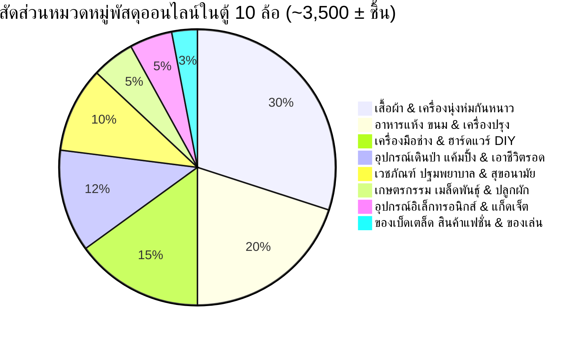

# คลังพัสดุและระบบแกะกล่องสุ่มสินค้าออนไลน์ (10-Wheel Parcel Manifest & Unboxing System) — 10000-BC

> 📦 **กฎเหล็กระบบ Unboxing:** ท้ายรถคือตู้คอนเทนเนอร์ขนาด 10 ล้อ (ปริมาตร ~55–60 ลบ.ม.) ที่อัดแน่นด้วย **พัสดุด่วนสินค้าออนไลน์ประมาณ 3,000 – 4,000 กล่อง/ซอง (เฉลี่ยประเมิน ~3,500 ± ชิ้น ไม่ต้องเป๊ะ 3,500 ชิ้น เนื่องจากมีหลายขนาดตั้งแต่ซองพลาสติก กล่องเล็ก กล่องจัมโบ้ จนถึงลังไม้)** ธามไม่รู้ของภายในล่วงหน้า ต้องคาดเดาจากขนาดกล่อง น้ำหนัก และใบปะหน้าพัสดุ (Waybill) ทุกครั้งที่แกะกล่อง จะต้องบันทึกรายการไอเทมที่ได้ลงในเอกสารนี้และตารางท้ายบทอย่างเคร่งครัด

---

## 🚛 1. สเปกยานพาหนะและปราการตรึงพื้นที่ (10-Wheel Fortress Specs)

| ส่วนประกอบ | สเปก / คุณสมบัติทางเทคนิค | สภาพความเสียหาย / ศักยภาพการใช้งาน |
| :--- | :--- | :--- |
| **รถบรรทุก 10 ล้อตู้ทึบงานหนัก** | เครื่องยนต์ดีเซลเทอร์โบ 6 สูบ 7.7L, ตู้เหล็กแผ่นหนา ยาว 9.5 ม. กว้าง 2.5 ม. สูง 2.6 ม. | **ช่วงล่างพังถาวร / ตัวตู้และแชสซี 100%** กลายเป็นปราการเหล็กตรึงพื้นที่ถาวร (พื้นที่ใช้สอย 24 ตร.ม.) แบ่ง 3 โซน |
| **น้ำมันดีเซลในถัง** | ถังอะลูมิเนียมความจุ 250 ลิตร (เหลือติดถังประมาณ 80%) | **200 ลิตร** สำรองสตาร์ทปั่นไฟ, ทำความร้อนหนาวจัด, และทำระเบิดเพลิง Molotov |
| **แบตเตอรี่รถยนต์** | ระบบไฟ 24V สำหรับงานหนัก (แบตเตอรี่ 12V 150Ah x 2 ลูก) | **100% เต็ม** ส่องสปอร์ตไลต์คู่หน้าตาพร่า และจ่ายไฟแตรลมไฟฟ้า |
| **แตรลมไฟฟ้าคู่ขนาดใหญ่** | แตรลมรถบรรทุก 10 ล้อ เสียงแหลมกึกก้องสะท้านหุบเขา (>130 dB) | **สมบูรณ์** อาวุธคลื่นเสียงข่มขวัญสัตว์ร้ายและชนเผ่าในความมืด |
| **ไฟหน้าสปอร์ตไลต์คู่** | โคมไฟฮาโลเจนคู่หน้าขนาดใหญ่ ส่องไกลทะลุม่านหมอก 200 เมตร | **สมบูรณ์** ส่องตาพร่าสยบสัตว์นักล่าและคนป่ายามวิกาล |
| **ระบบช่วงล่างที่พังยับเยิน** | แหนบหน้า 2 ตับ, แหนบหลังเพลาคู่ 2 ตับ, เพลาขับคู่, ยางเรเดียล 10 เส้น | **พังเสียหาย 100% (ขับเคลื่อนไม่ได้)** แหนบสปริงเหล็กกล้า 5160 หนักรวมกว่า 250 กก. กลายเป็น "เหมืองแร่เหล็กกล้า" ตีอาวุธ |
| **เครื่องมือประจำรถ** | แม่แรงไฮดรอลิก 10 ตัน, ประแจขันล้อ, ชะแลงเหล็กกล้ากู้ภัย, สลิงลาก 10 ม. | **สมบูรณ์** เครื่องมืองัดหินสร้างกำแพงค่าย และทำกับดักสะดุด |

---

## 📦 2. การประเมินหมวดหมู่กล่องพัสดุด่วน (~3,500 ± ชิ้น / 3,000 – 4,000 ชิ้น ยืดหยุ่นตามขนาด)

สินค้าทั้งหมดถูกบรรจุอยู่ในกล่องกระดาษลูกฟูก ซองพลาสติกกันน้ำ และลังไม้ มีใบปะหน้าพัสดุ (Waybill) ระบุรหัสติดตาม น้ำหนัก และชื่อผู้ส่งคร่าวๆ:

---

## 🗃️ 3. หมวดหมู่พัสดุและตัวอย่างไอเทมที่รอการสุ่มแกะ (The Blind Box Categories)

### ⛺ หมวดที่ 1: อุปกรณ์เดินป่า แค้มปิ้ง และเอาชีวิตรอด (~400 กล่อง)
* **ไอเทมเป้าหมาย:** มีดเดินป่าเหล็กคาร์บอน/ดามัสกัส, ขวานแคมปิ้งด้ามไฟเบอร์, คันธนูทดกำลัง (Compound Bow พร้อมลูกธนูคาร์บอน), แผ่นฟอยล์ฉุกเฉินกันหนาว (Space Blanket), เตาแก๊สปิกนิกกระป๋อง, ไฟแช็กพลาสม่าชาร์จไฟ, แท่งแมกนีเซียมจุดไฟ, เชือกพาราคอร์ด 550, หม้อสนามไททาเนียม

### 🧥 หมวดที่ 2: เสื้อผ้าและเครื่องนุ่งห่มกันหนาว (~1,000 กล่อง)
* **ไอเทมเป้าหมาย:** เสื้อโค้ตขนเป็ดแท้ (Goose Down Parka ทนความหนาวติดลบ 20 องศา), กางเกงสกีกันลม, ถุงมือหนังบุขนสัตว์, หมวกไหมพรม, รองเท้าบูตเดินป่ากันน้ำ Gore-Tex, ผ้าห่มนาโนหนาพิเศษ

### 🥩 หมวดที่ 3: อาหารแห้ง เครื่องปรุง และอาหารกึ่งสำเร็จรูป (~700 กล่อง)
* **ไอเทมเป้าหมาย:** เนื้อแดดเดียวและสเต๊กเนื้ออบแห้งสุญญากาศ (Beef Jerky), ถุงเกลือสมุทรบริสุทธิ์/เกลือหิมาลายัน, ถุงน้ำตาลทราย, พริกหม่าล่าบดละเอียด, ช็อกโกแลตบาร์พลังงานสูง, กาแฟดริป, บะหมี่กึ่งสำเร็จรูปพรีเมียม, ปลากระป๋องนำเข้า, ซอสเผ็ดเข้มข้น

### 🔨 หมวดที่ 4: เครื่องมือช่าง ฮาร์ดแวร์ และงาน DIY (~500 กล่อง)
* **ไอเทมเป้าหมาย:** สว่านกระแทกไร้สาย 20V พร้อมชุดดอกเจาะและสกรูไม้, เลื่อยโซ่ไร้สาย 21V (Cordless Mini Chainsaw), เลื่อยพับเดินป่าใบเลื่อย SK5 ญี่ปุ่น, ขวานด้ามไฟเบอร์กลาสเหล็กคาร์บอนสูง, กล่องกาวตราช้าง (Super Glue สมานแผล/ติดหอก), เคเบิลไทร์เหนียวพิเศษ, เทปผ้าดักท์เทปงานหนัก, เลื่อยพับตัดไม้, สายเอ็นตกปลาแรงดึงสูง (ทำสายธนู/กับดัก), มีดคัตเตอร์ใหญ่ SK5

### 💊 หมวดที่ 5: เวชภัณฑ์ ยา และสุขอนามัย (~350 กล่อง)
* **ไอเทมเป้าหมาย:** ชุดกล่องปฐมพยาบาลฉุกเฉิน, ยาปฏิชีวนะ Amoxicillin, ยาแก้ปวดพาราเซตามอล, แอลกอฮอล์ฆ่าเชื้อ, น้ำยาเบตาดีน, สำลีและผ้าก๊อซ, ทิชชูเปียกสูตรยับยั้งแบคทีเรีย, แผ่นอนามัยซับเลือด

### 🌱 หมวดที่ 6: เกษตรกรรม เมล็ดพันธุ์พืช และการเพาะปลูก (~180 กล่อง)
* **ไอเทมเป้าหมาย:** เมล็ดพันธุ์ผักสลัดทนหนาว, เมล็ดข้าวสาลี/บาร์เลย์อินทรีย์, เมล็ดมะเขือเทศ, เมล็ดถั่วแขก, เมล็ดพริกเผ็ดฮาลาปินโญ, ปุ๋ยอินทรีย์อัดเม็ด

### 🔋 หมวดที่ 7: อุปกรณ์อิเล็กทรอนิกส์และพลังงาน (~180 กล่อง)
* **ไอเทมเป้าหมาย:** แผงโซลาร์เซลล์พับได้ (Solar Charger 60W), พาวเวอร์แบงก์โซลาร์ 20,000 mAh (5 ตัว), ไฟฉายคาดศีรษะ LED ชาร์จไฟ, วิทยุสื่อสารวอล์กเกอร์ทอล์กเกอร์ (Walkie-Talkie), โดรนถ่ายภาพขนาดเล็ก

### 🎭 หมวดที่ 8: สินค้าเบ็ดเตล็ดสุดฮาที่ต้องดัดแปลง (MacGyver Comedy ~190 กล่อง)
* **ไอเทมเป้าหมาย:** ม้วนบับเบิ้ลกันกระแทก (ฉนวนบุผนังตู้กันหนาว), รองเท้าส้นสูง (เลาะหนังทำซองมีด), ลิปสติกสีแดง (สีทาหน้าศึกสงคราม), วิกผมแฟนซี, แผ่นมาสก์หน้า, ของเล่นพลาสติก

---

## 📝 4. บันทึกประวัติการแกะกล่องพัสดุ (Unboxing Log Master)

| บทที่ | รหัสพัสดุ (Tracking ID) | น้ำหนัก / ขนาด | รายการที่แกะได้ข้างใน | การนำไปประยุกต์ใช้ / ผลลัพธ์ |
| :---: | :--- | :---: | :--- | :--- |
| **001** | *(ยังไม่ได้เปิดกล่องพัสดุ)* | - | - | ซ่อนตัวอยู่ในตู้ท่ามกลางภูเขากล่องพัสดุ |
| **002** | `#TH-994201` (กล่องยาว) | 2.4 กก. | เสื้อโค้ตขนเป็ดแท้สีเข้ม (Goose Down Parka) | สวมใส่ป้องกันลมหนาวเฉียบพลันติดลบ |
| **002** | `#TH-118492` (กล่องเล็ก) | 0.8 กก. | มีดเดินป่าใบตายเหล็กคาร์บอน (Bushcraft Knife) | อาวุธประจำกายคมกริบเล่มแรก |
| **002** | `#TH-773019` (ซองพลาสติก) | 0.5 กก. | พาวเวอร์แบงก์โซลาร์เซลล์ 20,000 mAh | หล่อเลี้ยงแบตเตอรี่โทรศัพท์รับสัญญาณ |
