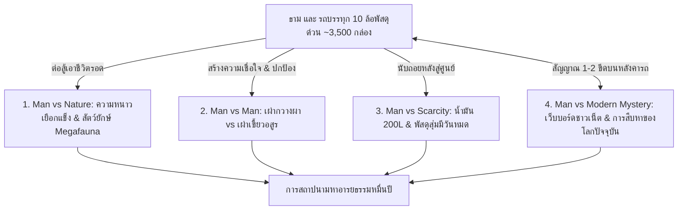

# โครงเรื่องแม่บทและ Story Outline — 10000-BC (พลิกยุคหินด้วยรถพัสดุหมื่นชิ้น)

> 📖 **คำชี้แจง:** เอกสารฉบับนี้รวบรวม **โครงสร้างโครงเรื่องหลัก (Master Plot Architecture)** และ **Story Chapters Outline รายบทแบบละเอียด (บทที่ 1 - 30)** โดยผสานแนวทางนวนิยายเอาชีวิตรอดระดับสากล (Gritty Cinematic Survival Thriller) เข้ากับกลไก **"ระบบแกะกล่องสุ่มพัสดุสินค้าออนไลน์ (The Blind Box Unboxing Survival)"** และ **"การเชื่อมต่อเว็บบอร์ด/โซเชียลสากลผ่านสัญญาณมือถือลึกลับ (The Mystery Signal & Global Crowdsourced War Room)"** เพื่อสร้างทั้งความบันเทิง (Humor), ความระทึกขวัญ (Survival Stakes), และพลังระดมสมองของมนุษยชาติ (Crowdsourcing Wisdom)

---

# ภาคที่ 1: โครงสร้างโครงเรื่องแม่บท (Master Plot Architecture)

## 🎯 1. แก่นเรื่องหลักและแนวคิด (Core Premise & Themes)
* **Logline:** เมื่อพนักงานขับรถบรรทุก 10 ล้อขนส่งพัสดุด่วนสินค้าออนไลน์ประสบอุบัติเหตุตกกระแทกทะลุมิติมายังยุค 10,000 ปีก่อนคริสตกาล เขาต้องใช้ "ปราการเหล็กกล้าตรึงพื้นที่" การสุ่มแกะกล่องพัสดุลึกลับกว่า 3,500 กล่อง และ **สัญญาณมือถือ 2G ติดๆ ดับๆ บนหลังคารถที่เชื่อมต่อเว็บบอร์ดโลกปัจจุบัน** เพื่อระดมสมองชาวเน็ตและผู้เชี่ยวชาญมาช่วยวางแผนเอาชีวิตรอดจากสัตว์ยักษ์ เอาชนะสงครามชนเผ่า และสถาปนาปฐมอารยธรรมมนุษย์
* **สภาพยานพาหนะ (Permanent Immobilization):** จากแรงตกกระแทกมหาศาลของรถหนัก 25 ตันผ่านรอยแยกมิติ **ช่วงล่างพังยับเยิน แหนบหน้า 2 ตับและแหนบหลังเพลาคู่หักสะบั้น เพลาขับกลางบิดคดงอ ล้อหน้าและล้อหลังฉีกขาด จมลึกในหล่มโคลนแข็ง ทำให้รถไม่สามารถขับเคลื่อนได้โดยสิ้นเชิง** รถบรรทุก 10 ล้อตู้ทึบจึงกลายสภาพเป็น **"ปราการเหล็กตรึงพื้นที่ถาวร (Static Fortress / Keep)"** ตั้งแต่วันแรก ธามไม่สามารถขับรถหนีภัยได้ ต้องปักหลักสร้างฐานและตั้งรับ ณ หุบเขาแห่งนี้เท่านั้น แต่ชิ้นส่วนช่วงล่างที่พัง (โดยเฉพาะแหนบสปริงเหล็กกล้าคาร์บอนสูง 5160 หนักกว่า 250 กก.) จะกลายเป็น "เหมืองแร่เหล็กกล้า" ที่ล้ำค่าที่สุดในการตีอาวุธและเครื่องมือในยุคหิน
* **ระบบเอาชีวิตรอดสุ่มพัสดุ (Blind Box Unboxing Survival):** ท้ายรถคือตู้คอนเทนเนอร์เหล็กยาว 9.5 เมตร อัดแน่นด้วยพัสดุออนไลน์กว่า 3,500 กล่อง ธามไม่รู้ของข้างในล่วงหน้า ต้องคาดเดาจากขนาดกล่อง น้ำหนัก รหัสติดตาม และใบปะหน้าพัสดุ (Waybill) การแก้ปัญหาในแต่ละบทจึงเต็มไปด้วยความลุ้นระทึก สนุกสนาน และการดัดแปลงอุปกรณ์สมัยใหม่อย่างชาญฉลาด (MacGyver Adaptations)
* **ธีมหลัก (Central Theme):** *"เทคโนโลยีสมัยใหม่อาจหมดสิ้นไปตามกาลเวลา แต่การเชื่อมโยงทางปัญญา องค์ความรู้ทางวิทยาศาสตร์ และการร่วมมือกันของมนุษยชาติ คือพลังที่ไม่มีวันสูญสลาย"*
* **โทนเรื่อง (Tone):** สมจริง ดิบเถื่อน ตึงเครียด ลุ้นระทึกของปลายยุคน้ำแข็ง (International Survival Thriller) ผสมผสานอารมณ์ขันและเสน่ห์ของการปะทะทางวัฒนธรรมระหว่าง "ชาวเน็ตโลกปัจจุบัน" กับ "การเอาชีวิตรอดในยุคหิน"

---

## ⚡ 2. ปมขัดแย้ง 4 มิติ (Four-Tier Conflict)

1. **มนุษย์ vs ธรรมชาติ (Man vs Nature):** สภาพอากาศหนาวจัดทุ่งทุนดราปลายยุคน้ำแข็ง (-15°C ถึง -25°C), สัตว์ยักษ์ Megafauna (หมีถ้ำยักษ์ Cave Bear, เสือเขี้ยวดาบ Smilodon, หมาป่าไดร์วูล์ฟ Dire Wolf)
2. **มนุษย์ vs มนุษย์ (Man vs Man):** ความหวาดระแวงแรกเริ่มกับเผ่ากวางผา (Cliff Deer Tribe) vs มหาสงครามล้างเผ่าพันธุ์จากกองทัพเผ่ากินคนเขี้ยวอสูร (Beast Fang Tribe)
3. **มนุษย์ vs ทรัพยากรจำกัด (Man vs Finite Technology):** น้ำมันดีเซล 200 ลิตร, ระบบไฟแบตเตอรี่ 24V, และพัสดุ 3,500 กล่องที่แกะแล้วหมดไป ต้องถ่ายทอดองค์ความรู้และสร้างเทคโนโลยีทดแทนก่อนทุกอย่างจะหมดสิ้น
4. **มนุษย์ vs ปริศนาเชื่อมโลก (Man vs Modern Mystery):** กระทู้ที่เริ่มจากความตลกขบขันและสงสัยว่าเป็น ARG Game กลายมาเป็นคดีสะเทือนขวัญระดับชาติในโลกปัจจุบัน เมื่อตำรวจและนักวิทยาศาสตร์พบว่ารถพัสดุ 10 ล้อหายสาบสูญไปพร้อมคนขับจริงๆ

---

## 📡 3. กลไกสัญญาณมือถือลึกลับและวอร์รูมระดมสมอง (The Mystery Signal Mechanics)

* **ข้อจำกัดทางกายภาพ (Physics & Constraints):**
  * สัญญาณเด้งขึ้นมา 1-2 ขีด เฉพาะเวลาที่ธาม **ปีนขึ้นไปยืนบนหลังคาตู้ทึบของรถช่วงหัวค่ำ หรือช่วงที่มีม่านหมอกหนาจัด** เท่านั้น
  * ความเร็วเทียบเท่า 2G: **ส่งได้เฉพาะข้อความและรูปถ่ายบีบอัดความละเอียดต่ำ (Low-Res)** ไม่สามารถโทรศัพท์ วิดีโอคอล หรือเปิดสตรีมมิงได้
* **วินัยการบริหารพลังงาน (Solar Power Discipline):**
  * โทรศัพท์ชาร์จด้วยพาวเวอร์แบงก์โซลาร์เซลล์ 20,000 mAh ที่แกะได้จากพัสดุ มีโควตาพลังงานจำกัด เปิดใช้งานเฉพาะโหมด Ultra Power Saving วันละ 1-2 ครั้ง ครั้งละไม่เกิน 15-20 นาที
* **วิวัฒนาการ 4 ระยะของกระทู้ (The 4-Phase Evolution):**
  * **ระยะที่ 1: Troll & ARG Era (บทที่ 2 - 6):** ชาวเน็ตคิดว่าเป็นการจัดฉาก โปรโมตเกม หรือแต่งเรื่องแนว ARG แนะนำกวนๆ เช่น "บีบแตรเพลงสามช่าไล่คนป่า" หรือ "ปาของกินใส่หน้ามัน" แต่คำแนะนำเรื่องบีบแตรและสาดไฟสูงดันใช้ได้ผลจริง!
  * **ระยะที่ 2: Specialist Awakening (บทที่ 7 - 16):** ภาพถ่ายกิ่งไม้โบราณ พืชสูญพันธุ์ (*Dryas octopetala*) รอยเขี้ยวหมาป่าดึกดำบรรพ์ และกะโหลกมนุษย์ยุคหิน ดึงดูดผู้เชี่ยวชาญเฉพาะทาง (`@BioArch_Oxford`, `@CombatMedic_US`, `@VikingBushcraft`) เข้ามาแนะนำวิธีผ่าตัดเย็บแผล สัดส่วนคันธนูหมุนไฟ และสูตรเตาหลอมโลหะ
  * **ระยะที่ 3: The Global War Room (บทที่ 17 - 26):** กระทู้กลายเป็นศูนย์บัญชาการยุทธวิธีข้ามมิติ ชาวเน็ตช่วยกันสเก็ตช์แผนที่ค่ายกล คำนวณปรากฏการณ์ดาราศาสตร์ (สุริยุปราคาเต็มดวงล่วงหน้า) ขณะที่โลกปัจจุบันเริ่มระดมกำลังสืบหาตัวตนของธามและรอยแยกมิติ
  * **ระยะที่ 4: The Final Transmission (บทที่ 27 - 30):** การส่งสัญญาณครั้งสุดท้ายก่อนรอยแยกมิติจะปิดสนิท ทิ้งมรดกอารยธรรมไว้ในอดีตและตำนานที่ไม่มีวันไขกระจ่างในโลกปัจจุบัน

---

## 📦 4. ระบบการสุ่มแกะพัสดุ (The Blind Box Unboxing Survival Rules)

* **ความหลากหลายของสินค้า 8 หมวดหมู่ (~3,500 ชิ้น):**
  1. เสื้อผ้าและเครื่องนุ่งห่มกันหนาว (30%)
  2. อาหารแห้ง ขนม ข้าวสาร & เครื่องปรุงรส (20%)
  3. เครื่องมือช่าง ฮาร์ดแวร์ & งาน DIY (15%)
  4. อุปกรณ์เดินป่า แค้มปิ้ง & เอาชีวิตรอด (12%)
  5. เวชภัณฑ์ ยา ปฐมพยาบาล & สุขอนามัย (10%)
  6. เกษตรกรรม เมล็ดพันธุ์พืช & การเพาะปลูก (5%)
  7. อุปกรณ์อิเล็กทรอนิกส์ & แก็ดเจ็ต (5%)
  8. สินค้าเบ็ดเตล็ดสุดแปลกที่ต้องดัดแปลง (MacGyver 3%)
* **กฎการสุ่ม:** ธามไม่รู้ของข้างใน ต้องอ่าน Waybill คลำน้ำหนัก ฟังเสียง และตัดสินใจแกะกล่องตามสถานการณ์วิกฤต กล่องที่เปิดอาจได้ของตรงเป้า (Jackpot) หรือได้ของประหลาดที่ต้องใช้สมองประยุกต์ใช้งาน
* **การบันทึกท้ายบท:** ทุกบทที่มีการเปิดกล่อง จะต้องลงตารางสรุป Tracking ID, รายละเอียดของที่ได้, และการนำไปใช้งานจริงอย่างเคร่งครัด

---

## 🏛️ 5. โครงสร้าง 4 องก์ (The 4-Act Arc)

* **Act 1: The Arrival & First Contact (บทที่ 1 - 10):** ตกกระแทกข้ามมิติ, หมีถ้ำบุกคืนแรก, ยืนยันช่วงล่างพังถาวร, สัญญาณ 1 ขีดบนหลังคารถ, กระทู้แรกถือกำเนิด, แกะเสื้อขนเป็ด-มีดเดินป่า-พาวเวอร์แบงก์, แตรลมคู่ 130dB สยบชนเผ่า, ปาฏิหาริย์เกลือบริสุทธิ์, การผ่าตัดรักษาพรานสาวตามคำสั่งแพทย์สนามออนไลน์
* **Act 2: Fortification & The Scarcity Crucible (บทที่ 11 - 20):** สถาปนารถ 10 ล้อเป็นปราการหลัก (Keep), ใช้แม่แรงไฮดรอลิกและสลิงสร้างค่ายกลหิน, แกะสว่านไร้สาย-เลื่อยพับ-สายเอ็นตกปลา, ถอดแหนบ 5160 ทำหอกเหล็กชุดแรก, แกะกระเป๋าพริกหม่าล่าทำสเปรย์ตาบอด, รับผู้อพยพ, พายุหิมะบุผนังตู้ด้วยบับเบิ้ลกันกระแทก, ไฟฉายสโตรบจับสายสืบ, กระทู้เริ่มเป็นข่าวดังในโลกปัจจุบัน
* **Act 3: Megafauna & The Great Siege (บทที่ 21 - 26):** หมีถ้ำยักษ์หวนกลับมา, สปอร์ตไลต์คู่หน้า + ธนูทดกำลัง Compound Bow + หอกแหนบเหล็กกล้าปลิดชีพ, กองทัพเขี้ยวอสูร 100 นายบุกค่าย, ระเบิดเพลิงดีเซล Molotov, เสียงแตรลมสยบขวัญ, คำทำนายสุริยุปราคาจากนักดาราศาสตร์มิวนิก, ยิงพลุสัญญาณฉุกเฉินสังหารหัวหน้าเผ่ากราก
* **Act 4: Dawn of the New Age & The Eternal Monument (บทที่ 27 - 30):** ข่าวโลกปัจจุบันยืนยันจุดเกิดเหตุ, พัสดุเริ่มหมดลง, แกะเมล็ดพันธุ์ข้าวสาลี-บาร์เลย์เริ่มการปฏิวัติเกษตรกรรม, สร้างเตาหลอมโลหะแห่งแรกจากเพลาขับและกระทะล้อรถ 10 ล้อ, สัญญาณมือถือดับมอดลงถาวร, สถาปนามหานครแห่งแรกของมนุษยชาติ

---

# ภาคที่ 2: Story Chapters Outline (รายละเอียดรายบท 1 - 30)

---

### องค์ที่ 1: การมาถึงและการเผชิญหน้าครั้งแรก (Act 1: The Arrival & First Contact)

#### บทที่ 1: พายุหมอกทมิฬและปราการเหล็กนิรนาม (The Black Fog and the Iron Bastion)
* **Scene Goal:** เปิดตัวธาม อุบัติเหตุข้ามมิติบนช่องเขาตอนเหนือ การสำรวจปราการ 10 ล้อตู้ทึบที่อัดแน่นด้วยพัสดุ 3,500 กล่อง และการเผชิญหน้าหมีถ้ำคืนแรก
* **Conflict:** รถบรรทุก 10 ล้อหนัก 25 ตันตกกระแทกอย่างรุนแรงผ่านรอยแยกมิติ **ช่วงล่างพังยับเยิน แหนบหน้า 2 ตับและแหนบหลังเพลาคู่หักสะบั้น เพลาขับคดงอ ล้อหน้าบิดเบี้ยวจนขับเคลื่อนไม่ได้โดยสิ้นเชิง** รถติดหล่มเลนแข็ง อุณหภูมิต่ำกว่าจุดเยือกแข็ง โทรศัพท์ขึ้น No Service หมีถ้ำยักษ์หนัก 1 ตันเข้าขูดกรีดตู้เหล็ก
* **Resolution:** ตู้เหล็กกล้าคอนเทนเนอร์รับแรงกระแทกได้ ธามตระหนักว่าตนเองหลุดมาอยู่ในยุคดึกดำบรรพ์ในสภาพที่ "รถพังถาวร ไร้ทางหนี" ท่ามกลางภูเขากล่องพัสดุที่ยังไม่ได้เปิด
* **Cargo Log:** น้ำมันดีเซล 0.5L (ทดสอบสตาร์ท เหลือ 199.5L), ถ่านไฟฉาย 10 นาที
* **Cliffhanger:** เสียงคำรามของหมีถ้ำจางไป ทิ้งรอยกรงเล็บลึก 3 รอยบนแผ่นเหล็ก ธามกำชะแลงเหล็กกู้ภัยรอคอยรุ่งสางในความมืด

#### บทที่ 2: รุ่งอรุณสีเลือดและสัญญาณหนึ่งขีด (Blood Dawn and the One-Bar Anomaly)
* **Scene Goal:** มุดสำรวจความเสียหายช่วงล่าง ยืนยันว่ารถขับไม่ได้ถาวร สุ่มแกะพัสดุ 3 กล่องแรก และการค้นพบสัญญาณปริศนาบนหลังคารถ
* **Conflict:** ธามมุดตรวจใต้ท้องรถพบความจริงอันโหดร้าย: แหนบสปริงหนาพิเศษหักสะบั้น เพลาขับกลางบิดงอ ยางเรเดียลฉีกขาด จมลึกในหล่มโคลน รถขับเคลื่อนไม่ได้ 100%! เขาต้องปักหลักสร้างฐานที่นี่ถาวร! ความหนาวติดลบกัดกินจนตัวสั่น ธามต้องเริ่มแกะพัสดุกล่องแรก
* **Unboxing Beat:**
  * `#TH-994201` (กล่องยาว 2.4 กก.): แกะได้ **เสื้อโค้ตขนเป็ดแท้ (Goose Down Parka)** สวมใส่ป้องกันลมหนาวเฉียบพลันได้ทันท่วงที
  * `#TH-118492` (กล่องเล็ก 0.8 กก.): แกะได้ **มีดเดินป่าเหล็กคาร์บอนสูง (Bushcraft Knife)** คมกริบพร้อมปลอกพกพา
  * `#TH-773019` (ซองพลาสติก 0.5 กก.): แกะได้ **พาวเวอร์แบงก์โซลาร์เซลล์ 20,000 mAh** ช่วยต่อลมหายใจให้โทรศัพท์มือถือ
* **The Forum Beat:** เมื่อปีนขึ้นไปตรวจบนหลังคาตู้ทึบในม่านหมอกเช้า จู่ๆ โทรศัพท์สั่นเตือน: *สัญญาณเด้งขึ้นมา 1 ขีด!* ธามเปิดเว็บบอร์ดสากลตั้งกระทู้ด้วยมือสั่นเทา: *"ช่วยด้วยครับ รถบรรทุก 10 ล้อขนพัสดุตกเขาหลุดมาที่ไหนไม่รู้ หมอกหนา หนาวจัด ช่วงล่างพังยับ ล้อแตก ขับไม่ได้ มีตัวอะไรไม่รู้เท่าหมีควายแต่ใหญ่กว่าสามเท่าเพิ่งมาตะกุยตู้ทึบ"*
* **Cliffhanger:** กระทู้มีคอมเมนต์แรกเด้งขึ้นมา: `@TrollMaster_99: "เปิดตัวเกมเอาชีวิตรอดใหม่เหรอพี่? ภาพตู้เหล็กโคตรเนียน ขอพิกัดเซิร์ฟเวอร์หน่อย!"` พร้อมกับเงาร่างมนุษย์หนังสัตว์ 3 ร่างโผล่บนสันเขา!

#### บทที่ 3: เงาร่างแห่งขุนเขาและเสียงแตรสะท้านไพร (Shadows and the Thunder Horn)
* **Scene Goal:** การเผชิญหน้ากลุ่มนักล่าเผ่ากวางผา (คูราน และ เอลยา)
* **Conflict:** คนป่าเล็งคันธนูไม้ดัดและเงื้อหอกหินใส่หน้ารถ ธามอ่านคอมเมนต์ในมือถือที่แนะนำกวนๆ: `@ChillGamer_X: "ถ้าเป็นสัตว์ป่าหรือคนเถื่อน ลองกดแตรยาวๆ สาดไฟสูงดูสิ มันไม่เคยเห็นเครื่องจักร รับรองเผ่นป่าราบ"`
* **Resolution:** ธามตัดสินใจบิดสวิตช์กด **แตรลมคู่ 10 ล้อ (>130 dB)** ดังกึกก้องสะท้านหุบเขา พร้อมสาดไฟหน้าฮาโลเจนคู่ สยบประสาทจนคนป่าทรุดตัวลงกราบด้วยความยำเกรง
* **Unboxing Beat:** แกะ `#TH-401923` ได้ **นกหวีดเดินป่าโลหะเสียงแหลมสูง** ใช้คล้องคอเป็นอุปกรณ์ส่งสัญญาณฉุกเฉิน
* **Cargo Log:** ไฟแบตเตอรี่ 24V (กดแตร 3 วินาที + สาดไฟ 10 วินาที)
* **Cliffhanger:** เอลยายังคงเกร็งธนูไม้ดัดเล็งมาที่ห้องโดยสาร ธามถ่ายรูปม่านหมอกและชนเผ่าติดมาในภาพ 1 ใบก่อนสัญญาณจะตัดไป

#### บทที่ 4: เปลวไฟในเสี้ยววินาทีและรสชาติของพระเจ้า (The Instant Flame and the White Gold)
* **Scene Goal:** เจรจาด้วยภาษากาย มอบเปลวไฟจากไฟแช็กและเกลือบริสุทธิ์
* **Conflict:** ชนเผ่ายังระแวดระวัง ธามก้าวลงจากรถพร้อมส่งสัญญาณสันติภาพ
* **Unboxing Beat:**
  * `#TH-552104` (กล่องเล็ก): แกะได้ **ไฟแช็กแก๊สกันลมพรีเมียม 2 ชิ้น**
  * `#TH-881205` (กล่องอาหาร): แกะได้ **เกลือสมุทรบริสุทธิ์ 1 กก.** และ **เนื้อแดดเดียวอบแห้ง (Beef Jerky) 3 ซอง**
* **Resolution:** เปลวไฟที่จุดติดในเสี้ยววินาทีทำให้หมอผีโมกาตกตะลึง รสชาติเค็มเข้มข้นของเกลือบริสุทธิ์และเนื้อแดดเดียวทำให้คูรานน้ำตาคลอ ยกย่องธามเป็นผู้นำแห่งเพลิงและเสบียง
* **Cliffhanger:** เอลยาล้มพับลงกับพื้น เลือดสีคล้ำไหลซึมจากต้นขา—แผลเขี้ยวหมาป่าติดเชื้อรุนแรงจนเนื้อเริ่มเน่า!

#### บทที่ 5: แพทย์สนามข้ามมิติและการรักษาปาฏิหาริย์ (The Trauma Medic of Two Worlds)
* **Scene Goal:** รักษาแผลติดเชื้อของเอลยาด้วยคำแนะนำของผู้เชี่ยวชาญออนไลน์
* **Unboxing Beat:** ธามคุ้ยกองพัสดุหมวดเวชภัณฑ์อย่างบ้าคลั่ง เจอกล่อง `#TH-339102`: แกะได้ **ชุดกล่องปฐมพยาบาลฉุกเฉิน, ยา Amoxicillin 500mg (2 แผง), ยาพาราเซตามอล, เบตาดีน, ใบมีดผ่าตัดสเตอร์ไรล์ และผ้าก๊อซ**
* **The Forum Beat:** ธามปีนขึ้นหลังคารถช่วงหัวค่ำ โพสต์ภาพแผลเน่าและรายการยา: `@CombatMedic_US` โผล่เข้ามาพิมพ์คำสั่งฉุกเฉิน: *"อย่าเพิ่งเย็บปิดสนิท! แผลหมาป่ากัดเชื้อแอนแอโรบิกเพียบ ต้องใช้ใบมีดกรีดระบายหนอง ล้างด้วยเบตาดีนเจือจาง ให้ Amoxicillin ทันที 1,000mg โดสแรก แล้วตามด้วย 500mg ทุก 8 ชั่วโมง ไม่งั้นติดเชื้อในกระแสเลือดตายแน่!"*
* **Resolution:** ธามปฏิบัติตามคำแนะนำอย่างเคร่งครัด กรีดระบายหนอง ป้อนยา พยาบาลเอลยาในตู้ทึบจนพิษไข้ลดลงอย่างน่าอัศจรรย์
* **Cliffhanger:** เอลยาฟื้นขึ้นมา สบตากับธามด้วยความเคารพเทิดทูน ขณะที่ในกระทู้ `@BioArch_Oxford` เริ่มทัก: *"เดี๋ยวนะ... สร้อยกระดูกสัตว์ที่คอผู้หญิงในรูป... นั่นมันฟันของ Canis dirus (ไดร์วูล์ฟ) ชัดๆ!"*

#### บทที่ 6: คมมีดเหล็กกล้าและพันธสัญญาแรก (The Carbon Steel Pact)
* **Scene Goal:** สาธิตการใช้มีดเหล็กกล้า และทำข้อตกลงอพยพเผ่ามาตั้งหลักรอบรถ
* **Conflict:** มีดหินของคนป่าทื่อและบิ่นง่าย ธามสาธิตมีดเดินป่าเหล็กคาร์บอนและคัตเตอร์ SK5
* **Unboxing Beat:** แกะ `#TH-662301`: ได้ **มีดคัตเตอร์งานช่างด้ามเหล็ก SK5 พร้อมใบมีดสำรอง 20 ใบ, เคเบิลไทร์ขนาดใหญ่ 100 เส้น, เทปผ้า Duct Tape 2 ม้วน**
* **Resolution:** ธามใช้มีดกรีดแล่หนังสัตว์และเหลาหอกไม้ในพริบตา คูรานตกลงนำคนในเผ่า 30 ชีวิตอพยพมาตั้งแคมป์ล้อมรอบรถ 10 ล้อเพื่อพึ่งพาปราการเหล็ก
* **Cliffhanger:** ขบวนผู้อพยพเดินทางมาถึง แต่บนยอดเขามีสายตาดุร้ายของสอดแนมจากเผ่าเขี้ยวอสูรจับจ้องอยู่

#### บทที่ 7: หม้อไททาเนียมและภาพถ่ายสะเทือนวงการ (The Titanium Pot and Extinct Flora)
* **Scene Goal:** งานเลี้ยงสตูว์เนื้อในหม้อแคมปิ้ง และการจุดประเด็นทางวิทยาศาสตร์ในโลกปัจจุบัน
* **Unboxing Beat:** แกะ `#TH-710492`: ได้ **ชุดหม้อสนามไททาเนียมเดินป่า, ช็อกโกแลตบาร์พลังงานสูง 5 แท่ง, ซุปก้อนเข้มข้น 1 กล่อง**
* **The Forum Beat:** ธามโพสต์ภาพหม้อต้มเนื้อบนกองไฟ โดยมีเด็กน้อยทาร่าและพุ่มไม้รอบค่ายติดในฉาก: `@BioArch_Oxford` โพสต์ข้อความตัวหนา: *"ทุกคนหยุดเล่นมุกก่อน! พืชใบหยักสีเทาหลังหม้อคือ Dryas octopetala สายพันธุ์ดึกดำบรรพ์ที่สูญพันธุ์แถบนี้ไปเกือบหมื่นปีแล้ว เจ้าของกระทู้อยู่ที่ไหนกันแน่?!"*
* **Resolution:** มื้ออาหารร้อนรสเลิศทำให้ความผูกพันในค่ายแน่นแฟ้น ทาร่ามอบหินนำโชคให้ธาม
* **Cliffhanger:** เสียงหอนโหยหวนของฝูงหมาป่าไดร์วูล์ฟดังประสานขึ้นรอบค่ายในคืนเดือนมืด

#### บทที่ 8: กฎเหล็กแห่งการสงวนเสบียง (The Law of the Rations)
* **Scene Goal:** วางระบบควบคุมทรัพยากร สุขอนามัย และการแบ่งงาน
* **Conflict:** คนในเผ่าเริ่มพึ่งพาของแจก ธามตั้งกฎเหล็ก "ทำงานแลกทรัพยากร" ห้ามใครเปิดกล่องพัสดุโดยไม่ได้รับอนุญาต
* **Unboxing Beat:** แกะ `#TH-192844`: ได้ **ทิชชูเปียกสูตรฆ่าเชื้อแบคทีเรีย 5 ห่อ, ถุงขยะดำหนาพิเศษ 50 ใบ, ผืนผ้ายางฟลายชีตกันฝน 4x6 เมตร**
* **Resolution:** ธามสอนการขุดหลุมสุขาห่างจากแหล่งน้ำ ขึงผ้ายางรองน้ำฝน และจัดเวรยาม
* **Cliffhanger:** อุณหภูมิลดวูบลงอย่างรวดเร็ว ลมกรรโชกแรงส่งสัญญาณพายุหิมะลูกแรก

#### บทที่ 9: คืนล่าของไดร์วูล์ฟและยุทธวิธีสปอร์ตไลต์ (The Spotlight Hunt)
* **Scene Goal:** ขับไล่ฝูงหมาป่าดึกดำบรรพ์ด้วยระบบไฟรถยนต์และอุปกรณ์แคมปิ้ง
* **Conflict:** หมาป่าไดร์วูล์ฟ 10 ตัวล้อมค่าย หอกหินเอาไม่อยู่
* **Unboxing Beat:** แกะ `#TH-883109`: ได้ **ไฟฉายคาดศีรษะ LED ปรับซูมได้ 2 อัน, เชือกพาราคอร์ด 550 ยาว 50 เมตร**
* **Resolution:** ธามสตาร์ทเครื่องยนต์ สาดไฟสปอร์ตไลต์คู่หน้าตาพร่า กดแตรลมคำรามลั่น เอลยายิงธนูสังหารจ่าฝูง ฝูงหมาป่าแตกตื่นเตลิดหนี
* **Cargo Log:** น้ำมันดีเซล 1 ลิตร (คงเหลือ 198.5 ลิตร), ไฟแบตเตอรี่ 24V (5 นาที)
* **Cliffhanger:** หมาป่าตัวที่ตายมีปลอกคอหนังสัตว์และหอกกระดูกมนุษย์ปักอยู่—พวกมันถูกฝึกมาโดยเผ่าเขี้ยวอสูร!

#### บทที่ 10: สัญญาณควันทมิฬและคำเตือนข้ามมิติ (The Black Smoke Warning)
* **Scene Goal:** รับรู้ภัยสงครามจากเผ่ากินคนเขี้ยวอสูร
* **Conflict:** ควันไฟสีดำพวยพุ่งทางทิศเหนือ ค่ายเผ่าเพื่อนบ้านถูกเผาราบ เอลยาพาธามดูภาพเขียนผนังถ้ำ
* **Unboxing Beat:** แกะ `#TH-441092`: ได้ **สมุดโน้ตกันน้ำ All-Weather, ปากกายุทธวิธี, ไฟฉายเลเซอร์พอยเตอร์สีเขียวแรงสูง**
* **The Forum Beat:** ธามโพสต์ภาพเขียนผนังถ้ำและรอยแผลหอกกระดูก: ชาวเน็ตสรุปตรงกัน: *"นี่คือชนเผ่ากินคนเร่ร่อนในยุคหินใหม่ตอนต้น พวกมันโหดเหี้ยมมาก นายต้องเตรียมค่ายกลป้องกันเดี๋ยวนี้!"*
* **Cliffhanger:** กระทู้เริ่มติดเทรนด์คนอ่านหลักหมื่นคน โลกปัจจุบันเริ่มตามหาพิกัดรถบรรทุกที่หายสาบสูญ!

---

### องค์ที่ 2: การสร้างป้อมปราการและการถ่ายทอดปัญญา (Act 2: Fortification & Knowledge Transfer)

#### บทที่ 11: ป้อมปราการรถบรรทุกและค่ายกลหิน (The Crowdsourced Bastion)
* **Scene Goal:** สถาปนาตัวถังรถ 10 ล้อเป็น Keep ถาวร และสร้างแนวกำแพงหินซิกแซกตามแบบสเก็ตช์ของวิศวกรออนไลน์
* **The Forum Beat:** วิศวกรในบอร์ดสเก็ตช์แปลนค่ายกลคอขวด (Chokepoint) ให้ตัวรถ 10 ล้อเป็นป้อมปราการหลัก
* **Unboxing Beat:** แกะ `#TH-512093`: ได้ **สว่านกระแทกไร้สาย 20V พร้อมดอกเจาะ, เลื่อยพับตัดไม้งานหนัก 2 ปื้น**
* **Resolution:** ธามใช้แม่แรงไฮดรอลิก 10 ตัน ชะแลงเหล็ก และสายสลิงลากรถ ช่วยชนเผ่างัดหินก้อนโตเรียงเป็นแนวกำแพงซิกแซก
* **Cargo Log:** แม่แรงไฮดรอลิก 10 ตัน (ใช้งาน), สายสลิง 10 ม.

#### บทที่ 12: การกำเนิดคันธนูหมุนไฟ (The Bow Drill by VikingBushcraft)
* **Scene Goal:** ถ่ายทอดวิชาการจุดไฟโบราณก่อนไฟแช็กจะหมด
* **Unboxing Beat:** แกะ `#TH-229104`: ได้ **สายเอ็นตกปลาถัก PE 8 เส้น แรงดึง 100 ปอนด์ (เหนียวทนทานที่สุด)**
* **The Forum Beat:** `@VikingBushcraft` อธิบายสูตรคันธนูหมุนไม้ (Bow Drill) ละเอียดทุกขั้นตอน: ใช้สายเอ็นตกปลาทำสายธนูหมุนไม้ ธามสอนเอลยาจนจุดไฟติดสำเร็จด้วยมือตนเองโดยไม่ต้องพึ่งไฟแช็ก
* **Resolution:** ชนเผ่าได้ไฟที่ยั่งยืน ความมั่นคงทางพลังงานเริ่มต้นขึ้น

#### บทที่ 13: ศาสตร์แห่งการถนอมอาหาร: คลังเนื้อเค็มและโรงรมควัน (The Salt Vault)
* **Scene Goal:** ถนอมเนื้อกวางและไบซอนยักษ์เพื่อรับมือฤดูหนาว
* **Unboxing Beat:** แกะ `#TH-631029`: ได้ **ถุงสูญญากาศใส่อาหาร, เกลือสมุทร 10 กก., ผงพริกไทยดำและเครื่องเทศหมักเนื้อ**
* **The Forum Beat:** เชฟและผู้เชี่ยวชาญถนอมอาหารแนะนำสัดส่วนเกลือ 3% ต่อน้ำหนักเนื้อ และวิธีควบคุมควันไม้สนไม่ให้ขม
* **Resolution:** โรงรมควันแห่งแรกถูกสร้างขึ้นข้างรถบรรทุก เสบียงเนื้อเค็มเพียงพอเลี้ยงคนทั้งค่ายตลอดฤดูหนาว

#### บทที่ 14: อาวุธเคมีพริกหม่าล่าและเกราะยางรถยนต์ (Chemical Defense and Tire Armor)
* **Scene Goal:** ประดิษฐ์อาวุธป้องกันตัวระยะประชิดจากของในตู้พัสดุ
* **Unboxing Beat:** แกะ `#TH-901238`: ได้ **พริกหม่าล่าและพริกป่นฮาลาปินโญเข้มข้น 5 ถุงใหญ่, กระบอกฉีดน้ำแรงดันมือ 2 กระบอก**
* **The Forum Beat:** ชาวเน็ตสาย DIY เสนอไอเดีย: ผสมผงพริกกับน้ำส้มสายชูทำกระบอกฉีดตาบอด และนำเศษยางเรเดียลจากยางอะไหล่ที่ฉีกขาดมาตัดเย็บเป็นเกราะหน้าอกกันคมหอกหิน
* **Resolution:** เอลยาและคูรานได้เกราะยางเหนียวพิเศษที่หอกหินแทงไม่ทะลุ

#### บทที่ 15: ผู้อพยพใต้เพลิงสงคราม (Refugees and Triage)
* **Scene Goal:** รับมือผู้อพยพ 30 คนจากเผ่ากวางขาวที่ถูกเผาทำลาย
* **Unboxing Beat:** แกะ `#TH-310492`: ได้ **ผ้าห่มฟอยล์ฉุกเฉินกู้ภัย (Space Blankets) 20 ผืน, ขี้ผึ้งทาแผลไฟไหม้, ยาปฏิชีวนะสำรอง**
* **The Forum Beat:** `@CombatMedic_US` ช่วยคัดกรองผู้บาดเจ็บ (Triage) ผ่านภาพถ่าย ธามใช้ยาและผ้าห่มฟอยล์รักษาผู้รอดชีวิต ได้กำลังพลเพิ่มเป็น 60 คน
* **Resolution:** ชุมชนเติบโตเป็นป้อมปราการขนาดย่อมที่เปี่ยมด้วยความหวัง

#### บทที่ 16: หอกแหนบเหล็กกล้าและยุทธวิธีฟาแลงก์ (The First Phalanx & Leaf Spring Steel)
* **Scene Goal:** สกัดเหล็กกล้าจากช่วงล่างรถ 10 ล้อ และฝึกกระบวนทัพรับศึก
* **Unboxing Beat:** แกะ `#TH-882194`: ได้ **หินลับมีดกากเพชรความละเอียดสองหน้า 3 ก้อน, ลูกธนูคาร์บอนหัวเหล็ก 12 ดอก**
* **The Forum Beat:** อดีตนายทหารแนะนำยุทธวิธีตั้งแถวโล่ไม้และหอกยาว ขณะที่ `@VikingBushcraft` แนะนำให้ถอดชิ้นส่วน **แหนบสปริงหน้า 5160 (High-Carbon Spring Steel)** จากช่วงล่างที่หัก นำมาเผาไฟแล้วตีขึ้นรูปเป็นปลายหอกเหล็กกล้า 5 เล่มแรก
* **Resolution:** กองทหารราบหอกเหล็กกล้าแห่งแรกของยุคหินถือกำเนิดขึ้น

#### บทที่ 17: ประมวลกฎหมายแห่งปราการเหล็ก (The Code of the Bastion)
* **Scene Goal:** สถาปนาระบบสังคม ระเบียบสุขอนามัย และการจัดสรรเสบียง
* **The Forum Beat:** นักมานุษยวิทยาช่วยร่างธรรมนูญง่ายๆ สำหรับสังคมมนุษย์ยุคหิน: การแบ่งปันผลผลิต การรักษาความสะอาด และบทลงโทษผู้ละเมิด
* **Unboxing Beat:** แกะ `#TH-102948`: ได้ **โทรโข่งพกพาพร้อมไซเรน (Megaphone)** ใช้ประกาศคำสั่งและแจ้งเตือนภัยทั่วค่าย

#### บทที่ 18: พายุหิมะทมิฬและฉนวนบับเบิ้ลกันกระแทก (The White Blizzard & Bubble Wrap Insulation)
* **Scene Goal:** เอาชีวิตรอดจากพายุหิมะขั้วโลกติดลบ 20 องศาเซลเซียส
* **Unboxing Beat:** แกะพัสดุขนาดยักษ์ `#TH-492019`: พบ **ม้วนบับเบิ้ลพลาสติกกันกระแทก 5 ม้วนใหญ่ และผ้าห่มนาโนหนา 10 ผืน**
* **Resolution:** วิศวกรแนะนำให้นำบับเบิ้ลกันกระแทกบุซ้อนผนังตู้คอนเทนเนอร์ด้านใน กลายเป็นห้องฉนวนความร้อนที่อุ่นสบาย เดินเครื่องยนต์ทำความร้อนเป็นช่วงๆ เด็กและคนชรารอดชีวิตยกค่ายโดยไม่มีใครสูญเสีย
* **Cargo Log:** น้ำมันดีเซล 2 ลิตร (คงเหลือ 195.5 ลิตร)

#### บทที่ 19: ลำแสงสโตรบจับสายสืบ (The Strobe Interrogation)
* **Scene Goal:** จับกุมสายสืบของเผ่าเขี้ยวอสูรที่ลอบเข้ามาสำรวจค่าย
* **Unboxing Beat:** แกะ `#TH-771920`: ได้ **ไฟฉายยุทธวิธี LED แสงสโตรบ 2,000 ลูเมนส์, สายรัดข้อมือซิปไทร์สำหรับควบคุมตัว**
* **Conflict:** สายสืบลอบเข้ามา ธามสาดไฟกระพริบถี่สูงใส่ดวงตาจนสายสืบช็อกตาพร่าล้มลง ถูกมัดตัวสอบสวนก่อนปล่อยกลับไปพร้อมสารเตือนภัย

#### บทที่ 20: วอร์รูมข้ามมิติคืนก่อนศึกใหญ่ (The Eve of War & Modern Investigation)
* **Scene Goal:** เตรียมรับศึกใหญ่จากกองทัพเผ่าเขี้ยวอสูร 100 นาย
* **The Forum Beat:** ข่าวในโลกปัจจุบันแตกตื่น! บริษัทขนส่งและตำรวจยืนยันว่ารถบรรทุก 10 ล้อ ทะเบียนและสินค้าตรงกับที่ธามโพสต์หายสาบสูญไปจริง วอร์รูมชาวเน็ตทำงานข้ามวันข้ามคืนช่วยสเก็ตช์แผนผังรับศึก
* **Unboxing Beat:** แกะ `#TH-990128`: ได้ **สายยางดูดน้ำมันกึ่งอัตโนมัติ, เทปกันน้ำฟอยล์อะลูมิเนียม**
* **Resolution:** ธามดูดน้ำมันดีเซล 5 ลิตรใส่ขวดแก้วเตรียมทำระเบิดเพลิง Molotov
* **Cargo Log:** น้ำมันดีเซลดูดใส่ขวด 5 ลิตร (คงเหลือในถัง 190.5 ลิตร)

---

### องค์ที่ 3: หมีถ้ำยักษ์และสงครามเผ่าเขี้ยวอสูร (Act 3: Megafauna & The Great Siege)

#### บทที่ 21: อสูรตื่นจากจำศีล (Awakening of the Cave Bear)
* **Scene Goal:** หมีถ้ำยักษ์บาดเจ็บและหิวโซหวนกลับมาถล่มค่าย
* **Conflict:** หมีถ้ำหนัก 1.2 ตันพังแนวกำแพงหินชั้นนอก หอกหินแทงไม่ระคายผิว มุ่งตรงมายังตู้สินค้า
* **Unboxing Beat:** ธามแกะกล่องขนาดยาว `#TH-119283`: แจ็กพอตแตก! พบ **คันธนูทดกำลัง (Compound Bow 70 lbs) พร้อมลูกธนูคาร์บอนหัวเหล็กเจาะเกราะ**

#### บทที่ 22: ลำแสงสปอร์ตไลต์และคมเขี้ยวคาร์บอน (Blinding High Beams and Steel)
* **Scene Goal:** สังหารหมีถ้ำยักษ์ด้วยการผสานเทคโนโลยีและอาวุธสมัยใหม่
* **The Forum Beat:** สมาชิกบอร์ดแนะนำจุดตาย: ธามสตาร์ทเครื่องยนต์ สาดไฟสูงสปอร์ตไลต์คู่หน้าเข้าตาหมีถ้ำจนมองไม่เห็น เอลยาและธามใช้คันธนูทดกำลังและหอกแหนบเหล็กกล้า 5160 แทงทะลวงใต้คอหอย ปลิดชีพสัตว์ยักษ์ลงได้สำเร็จ
* **Cargo Log:** น้ำมันดีเซล 0.5L (คงเหลือ 190.0L), ไฟแบตเตอรี่ 24V

#### บทที่ 23: คลื่นมนุษย์คนเถื่อนบุกค่าย (The Screaming Onslaught)
* **Scene Goal:** กองทัพเขี้ยวอสูร 100 นายบุกจู่โจมยามวิกาล
* **Conflict:** แนวกำแพงซิกแซกและสายสลิงลากรถทำงาน ชะลอข้าศึกและทำให้แนวหน้าล้มระเนระนาด กองทัพคนเถื่อนกรีดร้องบุกประชิด

#### บทที่ 24: เปลวเพลิงสีส้มและเสียงกัมปนาท (Molotov and the Thunder Roar)
* **Scene Goal:** พลิกสถานการณ์ด้วยระเบิดเพลิงดีเซลและคลื่นเสียงข่มขวัญ
* **Unboxing Beat:** แกะ `#TH-772819`: ได้ **กล่องของขวัญวิสกี้ซิงเกิลมอลต์ 40 ดีกรี 2 ขวด** นำแอลกอฮอล์มาเสริมฤทธิ์ระเบิดเพลิง
* **Resolution:** ธามขว้างระเบิดเพลิง Molotov ปิดคอหอยทางแคบ เปลวไฟลุกท่วมหิมะ พร้อมเหยียบคันเร่งเครื่องยนต์คำรามและกดแตรลมคู่ 10 ล้อสะท้านป่า ข้าศึกขวัญหนีดีฝ่อ
* **Cargo Log:** น้ำมันดีเซล 3 ลิตร (คงเหลือ 187.0 ลิตร)

#### บทที่ 25: คำทำนายสุริยุปราคาและศึกตัดสินหน้าค่าย (The Eclipse Prophecy & The Flare)
* **Scene Goal:** เผด็จศึกกรากด้วยความรู้ดาราศาสตร์และพลุสัญญาณ
* **The Forum Beat:** `@AstroNerd_Munich` คำนวณตำแหน่งดาวแจ้งด่วน: *"อีก 10 นาทีจะเกิดสุริยุปราคาเต็มดวง นาน 3 นาที!"* ธามประกาศคำทำนายกลางสนามรบ เมื่อท้องฟ้ามืดมิดลง กองทัพคนเถื่อนทรุดลงกรีดร้องด้วยความหวาดกลัว
* **Unboxing Beat:** แกะกล่องนิรภัย `#TH-001928`: ได้ **ปืนยิงพลุสัญญาณฉุกเฉินทางทะเล (Marine Flare Gun) พร้อมกระสุนแดงส่องสว่าง 3 นัด**
* **Resolution:** ธามลั่นไกยิงพลุสัญญาณฉุกเฉินอัดกลางอกหัวหน้าเผ่ากราก ร่างลุกไหม้ดับดิ้น กองทัพเขี้ยวอสูรยอมจำนนทั้งสิ้น

#### บทที่ 26: อวสานเขี้ยวอสูรและการรวมแผ่นดิน (The Unification of Tribes)
* **Scene Goal:** จัดระเบียบหลังสงคราม รวมเผ่าพันธุ์ และวางรากฐานการผลิต
* **Unboxing Beat:** แกะ `#TH-482910`: ได้ **พลั่วสนามพับได้, มีดพร้าด้ามยาง, ถุงมือทำสวนหนาพิเศษ 10 คู่**
* **Resolution:** ธามไม่สังหารเชลยศึก แต่ริบอาวุธและจัดสรรแรงงานถางป่าปรับหน้าดิน รวมคนกว่า 150 ชีวิตเข้าด้วยกันเป็นปฐมชุมชน

---

### องค์ที่ 4: รุ่งอรุณแห่งอารยธรรมและมรดกนิรันดร์ (Act 4: Dawn of the New Age)

#### บทที่ 27: พัสดุกล่องสุดท้ายและความจริงจากโลกเดิม (The Empty Manifest & The Modern Hunt)
* **Scene Goal:** พัสดุในตู้เริ่มร่อยหรอ ทางการในโลกปัจจุบันแถลงข่าวคดียานพาหนะทะลุมิติ
* **The Forum Beat:** รัฐบาลและสถาบันวิจัยนานาชาติแถลงข่าวยืนยันการตรวจพบคลื่นแม่เหล็กไฟฟ้าแปลกประหลาดที่เชื่อมต่อกับสัญญาณโทรศัพท์ของธาม กระทู้กลายเป็นประวัติศาสตร์หน้าใหม่ของโลก ธามพิมพ์ตอบครั้งสุดท้ายว่าตนและผู้คนปลอดภัย
* **Resolution:** กล่องพัสดุกระดาษลูกฟูกที่แกะหมดแล้วถูกนำไปทำเชื้อไฟและปุ๋ยหมัก ธามจัดระเบียบตู้คอนเทนเนอร์เป็นห้องบัญชาการถาวร

#### บทที่ 28: เมล็ดพันธุ์แห่งอนาคตและการปฏิวัติเกษตรกรรม (The First Harvest & Seed Manifest)
* **Scene Goal:** เริ่มต้นการเพาะปลูกธัญพืชแห่งแรกของโลก
* **Unboxing Beat:** แกะกล่องพัสดุหมวดเกษตรที่เก็บรักษาไว้อย่างดี `#TH-582910`: พบ **เมล็ดพันธุ์ข้าวสาลีอินทรีย์, ข้าวบาร์เลย์, เมล็ดถั่วแขก, มะเขือเทศทนหนาว และปุ๋ยอินทรีย์อัดเม็ด**
* **The Forum Beat:** นักปฐพีวิทยาแนะนำวิธีปรับหน้าดิน การไถพรวน และการทำคลองส่งน้ำ ธามนำเมล็ดพันธุ์ลงแปลงเพาะปลูก เกิดทุ่งเกษตรกรรมแห่งแรกในยุค 10,000 ปีก่อนคริสตกาล

#### บทที่ 29: เตาหลอมโลหะแห่งแรกจากซากช่วงล่าง 10 ล้อ (The Primitive Blast Furnace)
* **Scene Goal:** การก้าวกระโดดสู่ยุคโลหกรรมก่อนประวัติศาสตร์จริง
* **The Forum Beat:** แบบแปลนเตาหลอมดินเหนียวอุณหภูมิสูงจาก `@VikingBushcraft` ใช้เครื่องเป่าลมหนังสัตว์
* **Resolution:** ธามและช่างในเผ่าถอดชิ้นส่วนช่วงล่างรถ 10 ล้อที่พังเสียหาย—เพลาขับคู่ที่คดงอ, กระทะล้อเหล็กหนา, และแหนบสปริง 5160 ทั้งหมด—มาหลอมและตีขึ้นรูปเป็นหัวคันไถ ขวานถากไม้ และเคียวเกี่ยวข้าวเหล็กกล้าชุดแรกของมวลมนุษยชาติ

#### บทที่ 30: สัญญาณสุดท้ายและแท่นบูชาหมื่นปี (The Final Transmission & Eternal Bastion)
* **Scene Goal:** สัญญาณมือถือดับลงอย่างถาวร และบทสรุปแห่งตำนาน
* **The Forum Beat:** แบตเตอรี่โทรศัพท์เหลือ 1% รอยแยกมิติกำลังจะปิดตัวลง ธามปีนขึ้นหลังคารถ 10 ล้อเป็นครั้งสุดท้าย โพสต์ภาพมุมกว้าง: ทุ่งข้าวสาลีสีทองกว้างใหญ่ เคียงข้างกำแพงหินมหึมา และโครงสร้างตู้รถบรรทุก 10 ล้อที่ถูกยกขึ้นเป็นเทวสถานศักดิ์สิทธิ์ใจกลางเมือง พร้อมข้อความ: *"ถึงทุกคนที่ช่วยผม... พวกเรารอดแล้ว และกำลังสร้างอนาคต ลาก่อนครับ"*
* **Resolution:** กระทู้ถูกล็อกและบันทึกเป็นมรดกโลก โครงเหล็กรถบรรทุก 10 ล้อยืนหยัดข้ามหมื่นปี กลายเป็นแท่นบูชาเทวะที่ให้กำเนิดอารยธรรมแรกของมนุษยชาติอย่างสมบูรณ์แบบ
