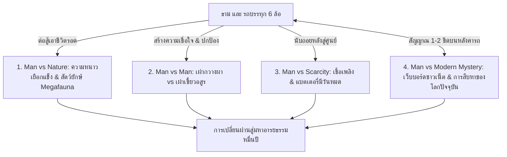

# โครงเรื่องแม่บทและ Story Outline — 10000-BC (พลิกยุคหินด้วยรถบรรทุกสะดวกซื้อ)

> 📖 **คำชี้แจง:** เอกสารฉบับนี้รวบรวม **โครงสร้างโครงเรื่องหลัก (Master Plot Architecture)** และ **Story Chapters Outline รายบทแบบละเอียด** โดยผสานแนวทางนวนิยายเอาชีวิตรอดระดับสากล (Gritty Cinematic Survival Thriller) เข้ากับกลไก **"การเชื่อมต่อเว็บบอร์ด/โซเชียลสากลผ่านสัญญาณมือถือลึกลับ (The Mystery Signal & Global Crowdsourced War Room)"** เพื่อสร้างทั้งความบันเทิง (Humor), ความระทึกขวัญ (Survival Stakes), และพลังระดมสมองของมนุษยชาติ (Crowdsourcing Wisdom)

---

# ภาคที่ 1: โครงสร้างโครงเรื่องแม่บท (Master Plot Architecture)

## 🎯 1. แก่นเรื่องหลักและแนวคิด (Core Premise & Themes)
* **Logline:** เมื่อพนักงานขับรถขนส่งสินค้าสายเทือกเขาเขตหนาวพร้อมรถบรรทุกหกล้อตู้ทึบที่อัดแน่นด้วยสินค้ามินิมาร์ตประสบอุบัติเหตุทะลุมิติมายังยุค 10,000 ปีก่อนคริสตกาล เขาต้องใช้ "ปราการเหล็ก" สิ่งของสมัยใหม่ที่มีจำกัด และ **สัญญาณมือถือติดๆ ดับๆ ที่เชื่อมต่อเว็บบอร์ดโลกปัจจุบัน** เพื่อระดมสมองชาวเน็ตและผู้เชี่ยวชาญมาช่วยวางแผนเอาชีวิตรอดจากสัตว์ยักษ์ เอาชนะสงครามชนเผ่า และสถาปนาปฐมอารยธรรมมนุษย์
* **สภาพยานพาหนะ (Permanent Immobilization):** จากแรงตกกระแทกผ่านรอยแยกมิติ **ช่วงล่างของรถบรรทุกพังยับเยิน แหนบหน้าหักสะบั้น เพลาขับคดงอ และยางหน้าฉีกขาด ทำให้รถไม่สามารถขับเคลื่อนได้โดยสิ้นเชิง** รถบรรทุกจึงกลายสภาพเป็น **"ปราการเหล็กตรึงพื้นที่ถาวร (Static Fortress)"** ตั้งแต่วันแรก ธามไม่สามารถขับรถหนีภัยได้ ต้องปักหลักสร้างฐานและตั้งรับ ณ หุบเขาแห่งนี้เท่านั้น แต่ชิ้นส่วนช่วงล่างที่พัง (เช่น แหนบสปริงเหล็กกล้าคาร์บอนสูง 5160) จะกลายเป็นวัตถุดิบตีอาวุธโลหะที่ล้ำค่าที่สุดในยุคหิน
* **ธีมหลัก (Central Theme):** *"เทคโนโลยีสมัยใหม่อาจหมดสิ้นไป แต่การเชื่อมโยงทางปัญญา องค์ความรู้ทางวิทยาศาสตร์ และการร่วมมือกันของมนุษยชาติ คือพลังที่ไม่มีวันสูญสลาย"*
* **โทนเรื่อง (Tone):** สมจริง ดิบเถื่อน ตึงเครียด ลุ้นระทึกของปลายยุคน้ำแข็ง ผสมผสานอารมณ์ขันและเสน่ห์ของการปะทะทางวัฒนธรรมระหว่าง "ชาวเน็ตโลกปัจจุบัน" กับ "การเอาชีวิตรอดในยุคหิน"

---

## ⚡ 2. ปมขัดแย้ง 4 มิติ (Four-Tier Conflict)

1. **มนุษย์ vs ธรรมชาติ (Man vs Nature):** สภาพอากาศหนาวจัดทุ่งทุนดราปลายยุคน้ำแข็ง, สัตว์ยักษ์ Megafauna (หมีถ้ำ, เสือเขี้ยวดาบ, หมาป่าไดร์วูล์ฟ)
2. **มนุษย์ vs มนุษย์ (Man vs Man):** ความหวาดระแวงแรกเริ่มกับเผ่ากวางผา (Cliff Deer Tribe) vs สงครามล้างเผ่าพันธุ์จากเผ่ากินคนเขี้ยวอสูร (Beast Fang Tribe)
3. **มนุษย์ vs ทรัพยากรจำกัด (Man vs Finite Technology):** น้ำมันดีเซล (74.5L), ยาปฏิชีวนะ, และแบตเตอรี่รถยนต์ที่ลดลงเรื่อยๆ ต้องถ่ายทอดวิทยาการทดแทนก่อนหมดสิ้น
4. **มนุษย์ vs ปริศนาเชื่อมโลก (Man vs Modern Mystery):** กระทู้ที่เริ่มจากความตลกขบขัน กลายมาเป็นคดีสะเทือนขวัญในโลกปัจจุบันที่นักวิทยาศาสตร์และทางการเริ่มตามสืบหาร่องรอยของรถบรรทุกที่หายสาบสูญ

---

## 📡 3. กลไกสัญญาณมือถือลึกลับและวอร์รูมระดมสมอง (The Mystery Signal Mechanics)

* **ข้อจำกัดทางกายภาพ (Physics & Constraints):**
  * สัญญาณขึ้นเพียง 1-2 ขีด เฉพาะเวลาที่ธาม **ปีนขึ้นไปยืนบนหลังคาตู้ทึบของรถช่วงหัวค่ำ หรือช่วงที่มีหมอกหนาจัด** เท่านั้น
  * ความเร็วเทียบเท่า 2G: **ส่งได้เฉพาะข้อความและรูปถ่ายความละเอียดต่ำ (Low-Res)** ไม่สามารถโทรศัพท์ วิดีโอคอล หรือสตรีมมิงสดได้
* **การจัดการพลังงาน (Solar Power Discipline):**
  * ชาร์จด้วย **Solar Power Bank (20,000 mAh)** ที่ติดมาในลังสินค้า มีโควตาชาร์จจำกัด เปิดโทรศัพท์เฉพาะโหมด Ultra Power Saving วันละ 1-2 ครั้ง ครั้งละไม่เกิน 20 นาที
* **วิวัฒนาการ 3 ระยะของกระทู้ (The 3-Phase Evolution):**
  * **ระยะที่ 1: Troll & ARG Era (บทที่ 2 - 6):** ชาวเน็ตคิดว่าเป็นการจัดฉาก โปรโมตเกม หรือไวรัลมาร์เก็ตติง ตอบกวนๆ เช่น "เอาไส้กรอกปาใส่หน้ามัน" หรือ "บีบแตรเพลงสามช่า" แต่คำแนะนำเรื่องบีบแตรและส่องไฟดันใช้ได้ผลจริง!
  * **ระยะที่ 2: Specialist Awakening (บทที่ 7 - 16):** ภาพถ่ายพืชโบราณ รอยเขี้ยวสัตว์ยักษ์ และกะโหลกมนุษย์ยุคหิน ดึงดูดผู้เชี่ยวชาญเฉพาะทาง (`@BioArch_Oxford`, `@CombatMedic_US`, `@VikingBushcraft`) เข้ามาแนะนำวิธีเย็บแผล สัดส่วนคันธนู และสูตรเตาหลอมดินเหนียว
  * **ระยะที่ 3: The Global War Room (บทที่ 17 - 26):** กระทู้กลายเป็นศูนย์บัญชาการยุทธวิธีข้ามมิติ ชาวเน็ตช่วยกันสเก็ตช์แผนที่ค่ายกล คำนวณปรากฏการณ์ดาราศาสตร์ (สุริยุปราคาเต็มดวง) และโลกปัจจุบันเริ่มระดมกำลังสืบหาตัวตนของธาม
  * **ระยะที่ 4: The Final Transmission (บทที่ 27 - 30):** การส่งสัญญาณครั้งสุดท้ายก่อนรอยแยกมิติจะปิดสนิท ทิ้งมรดกอารยธรรมไว้ในอดีตและตำนานที่ไม่มีวันไขกระจ่างในโลกปัจจุบัน

---

## 🏛️ 4. โครงสร้าง 4 องก์ (The 4-Act Arc)

* **Act 1: The Arrival & First Contact (บทที่ 1 - 10):** ข้ามมิติ, เผชิญหน้าหมีถ้ำคืนแรก, สัญญาณ 1 ขีดบนหลังคารถ, กระทู้แรกถือกำเนิด, แตรลมสยบชนเผ่า, การรักษาพรานสาวด้วยคำแนะนำแพทย์ออนไลน์
* **Act 2: Fortification & The Scarcity Crucible (บทที่ 11 - 20):** ตั้งป้อมปราการรถบรรทุก, ระดมสมองสูตรคันธนูหมุนไฟและเกราะยางรถยนต์, ช่วยเหลือผู้อพยพ, ส่องไฟฉายจับสายสืบ, กระทู้เริ่มไวรัลในโลกปัจจุบัน
* **Act 3: Megafauna & The Great Siege (บทที่ 21 - 26):** ล้มหมีถ้ำด้วยสปอร์ตไลต์ + หอกเหล็กกล้า, แผนผังค่ายกลต้านเผ่าเขี้ยวอสูร, คำเตือนสุริยุปราคาล่วงหน้า, ระเบิดเพลิงดีเซลและพลุสัญญาณสังหารกราก
* **Act 4: Dawn of the New Age & The Eternal Monument (บทที่ 27 - 30):** ข่าวโลกปัจจุบันสืบพบจุดเกิดเหตุ, การเพาะปลูกธัญพืชและตีเหล็กชุดแรก, สัญญาณมือถือดับมอดลงอย่างถาวร, สถาปนามหานครแห่งแรกของมนุษยชาติ

---

# ภาคที่ 2: Story Chapters Outline (รายละเอียดรายบท 1 - 30)

---

### องค์ที่ 1: การมาถึงและการเผชิญหน้าครั้งแรก (Act 1: The Arrival & First Contact)

#### บทที่ 1: พายุหมอกทมิฬและปราการเหล็กนิรนาม (The Black Fog and the Iron Bastion)
* **Scene Goal:** เปิดตัวธาม อุบัติเหตุข้ามมิติบนช่องเขาตอนเหนือ การสำรวจปราการตู้ทึบ และการเผชิญหน้าหมีถ้ำคืนแรก
* **Conflict:** รถบรรทุก 6 ล้อตกกระแทกอย่างรุนแรงผ่านรอยแยกมิติ **ช่วงล่างพังยับเยิน แหนบหน้าหักสะบั้น เพลาขับคดงอ ล้อหน้าบิดเบี้ยวจนขับเคลื่อนไม่ได้โดยสิ้นเชิง** รถติดหล่มเลน อุณหภูมิต่ำกว่าจุดเยือกแข็ง โทรศัพท์ขึ้น No Service หมีถ้ำหนัก 1 ตันเข้าขูดกรีดตู้เหล็ก
* **Resolution:** ตู้ทึบเหล็กกล้าป้องกันไว้ได้ ธามตระหนักว่าตนเองหลุดมาอยู่ในยุคก่อนประวัติศาสตร์ในสภาพที่ "ไร้ทางหนีด้วยยานพาหนะ"
* **Cargo Log:** น้ำมันดีเซล 0.5L, แครกเกอร์ 1 ซอง, ถ่านไฟฉาย 10 นาที
* **Cliffhanger:** เสียงคำรามของหมีถ้ำจางไป ทิ้งรอยกรงเล็บลึก 3 รอย ธามกำชะแลงรอคอยรุ่งสาง

#### บทที่ 2: รุ่งอรุณสีเลือดและสัญญาณหนึ่งขีด (Blood Dawn and the One-Bar Anomaly)
* **Scene Goal:** สำรวจความเสียหายของตัวรถอย่างละเอียด ยืนยันว่าช่วงล่างพังถาวร และการค้นพบสัญญาณปริศนาบนหลังคารถ
* **Conflict:** ธามมุดตรวจใต้ท้องรถพบความจริงอันโหดร้าย: **แหนบสปริงหน้าหักสองท่อน เพลาขับบิดคด ยางหน้าซ้ายฉีกขาดจนถึงขอบกะทะล้อ** ตัวรถไม่สามารถขับเคลื่อนหนีภัยได้อีกต่อไป เขาต้องปักหลักสู้และสร้างฐานที่นี่ถาวร! เมื่อปีนขึ้นไปตรวจหลังคารถในม่านหมอกเช้า จู่ๆ โทรศัพท์สั่นเตือน: *สัญญาณเด้งขึ้นมา 1 ขีด!*
* **The Forum Beat:** ธามเปิดเว็บบอร์ดสากล (Global Anonymous Forum) ตั้งกระทู้ด้วยมือสั่นเทา: *"ช่วยด้วยครับ รถบรรทุกตกเขาหลุดมาที่ไหนไม่รู้ หมอกหนา หนาวจัด ช่วงล่างพังยับ ล้อหน้าแตก ขับไม่ได้ มีตัวอะไรไม่รู้เท่าหมีควายแต่ใหญ่กว่าสามเท่าเพิ่งมาตะกุยตู้ทึบ"*
* **Cargo Log:** ข้าวโอ๊ต 1 ถ้วย, แอลกอฮอล์จุดไฟ 50 มล., Solar Power Bank (เริ่มชาร์จแดดอ่อน)
* **Cliffhanger:** กระทู้มีคอมเมนต์แรกเด้งขึ้นมา: `@TrollMaster_99: "เปิดตัวเกมใหม่เหรอพี่? กราฟิกตู้เหล็กโคตรเนียน ขอพิกัดเซิร์ฟเวอร์หน่อย!"` พร้อมกับเงาร่างมนุษย์หนังสัตว์บนสันเขา!

#### บทที่ 3: เงาร่างแห่งขุนเขาและเสียงแตรสะท้านไพร (Shadows and the Thunder Horn)
* **Scene Goal:** การเผชิญหน้ากลุ่มนักล่าเผ่ากวางผา (คูราน และ เอลยา)
* **Conflict:** ชนเผ่าเตรียมซัดหอกหินใส่กระจกรถ ธามอ่านคอมเมนต์ในมือถือที่แนะนำกวนๆ: `@ChillGamer_X: "ถ้าเป็นสัตว์ป่าหรือคนเถื่อน ลองกดแตรยาวๆ สาดไฟสูงดูสิ มันไม่เคยเห็นเครื่องจักร รับรองเผ่นป่าราบ"`
* **Resolution:** ธามตัดสินใจบิดสวิตช์กด **แตรลมคู่ (Dual Air Horn)** ดังกึกก้องสะท้านหุบเขา ช็อกประสาทจนคนป่าทรุดตัวลงกราบด้วยความยำเกรง
* **Cargo Log:** ไฟแบตเตอรี่รถยนต์ (กดแตรลม 3 วินาที)
* **Cliffhanger:** เอลยายังคงเกร็งธนูไม้ดัดเล็งมาที่ห้องโดยสาร ธามถ่ายรูปม่านหมอกและชนเผ่าติดมาในภาพ 1 ใบก่อนสัญญาณจะตัดไป

#### บทที่ 4: เปลวไฟในเสี้ยววินาทีและรสชาติของพระเจ้า (The Instant Flame and the White Gold)
* **Scene Goal:** เจรจาด้วยภาษากาย มอบเปลวไฟจากไฟแช็กและเกลือบริสุทธิ์
* **Conflict:** ชนเผ่ายังระแวดระวัง ธามก้าวลงจากรถพร้อมไฟแช็กแก๊สและแครกเกอร์แตะเกลือ
* **Resolution:** เปลวไฟที่จุดติดในเสี้ยววินาทีทำให้หมอผีโมกาตกตะลึง รสชาติเค็มเข้มข้นของเกลือบริสุทธิ์ทำให้คูรานน้ำตาคลอ ยกย่องธามเป็นผู้นำแห่งเพลิงและเสบียง
* **Cargo Log:** ไฟแช็กแก๊ส (จุด 2 ครั้ง), แครกเกอร์ 2 ชิ้น, เกลือบริสุทธิ์ 5 กรัม
* **Cliffhanger:** เอลยาล้มพับลงกับพื้น เลือดสีคล้ำไหลซึมจากต้นขา—แผลเขี้ยวหมาป่าติดเชื้อรุนแรง

#### บทที่ 5: แพทย์สนามข้ามมิติและการรักษาปาฏิหาริย์ (The Trauma Medic of Two Worlds)
* **Scene Goal:** รักษาแผลติดเชื้อของเอลยาด้วยคำแนะนำของผู้เชี่ยวชาญออนไลน์
* **The Forum Beat:** ธามปีนขึ้นหลังคารถช่วงหัวค่ำ โพสต์ภาพแผลเน่าและรายการยาในรถ: `@CombatMedic_US` โผล่เข้ามาพิมพ์คำสั่งฉุกเฉิน: *"อย่าเพิ่งเย็บปิดสนิท! ต้องกรีดระบายหนอง ล้างด้วยเบตาดีนเจือจาง ให้ Amoxicillin ทันที 1,000mg โดสแรก แล้วตามด้วย 500mg ทุก 8 ชั่วโมง ไม่งั้นติดเชื้อในกระแสเลือดตายแน่!"*
* **Resolution:** ธามปฏิบัติตามคำแนะนำอย่างเคร่งครัด ล้างแผล ป้อนยา พยาบาลเอลยาจนพิษไข้ลดลง
* **Cargo Log:** Amoxicillin 4 แคปซูล, พาราเซตามอล 1 เม็ด, เบตาดีน 20 มล., ผ้าก๊อซ 1 ม้วน
* **Cliffhanger:** เอลยาฟื้นขึ้นมาในตู้ทึบ สบตากับธามด้วยความจงรักภักดี ขณะที่ในกระทู้ `@BioArch_Oxford` เริ่มทัก: *"เดี๋ยวนะ... สร้อยกระดูกสัตว์ที่คอผู้หญิงในรูป... นั่นมันฟันของ Canis dirus (ไดร์วูล์ฟ) ชัดๆ!"*

#### บทที่ 6: คมมีดเหล็กกล้าและพันธสัญญาแรก (The Carbon Steel Pact)
* **Scene Goal:** สาธิตการใช้มีดคัตเตอร์เหล็กกล้า และทำข้อตกลงอพยพเผ่า
* **Conflict:** มีดหินของคนป่าทื่อช้า ธามใช้คัตเตอร์ SK5 กรีดแล่หนังสัตว์และเหลาหอกไม้ในพริบตา
* **Resolution:** คูรานตกลงนำคนในเผ่า 30 ชีวิตมาตั้งแคมป์ล้อมรอบรถบรรทุกเพื่อพึ่งพาปราการเหล็ก
* **Cargo Log:** ใบมีดคัตเตอร์ 1 ใบ, พลาสเตอร์ปิดแผล 2 ชิ้น
* **Cliffhanger:** ขบวนผู้อพยพเดินทางมาถึง แต่บนยอดเขามีสายตาดุร้ายของสอดแนมจากเผ่าเขี้ยวอสูรจับจ้องอยู่

#### บทที่ 7: หม้อสเตนเลสและภาพถ่ายสะเทือนวงการ (The Stainless Pot and Extinct Flora)
* **Scene Goal:** งานเลี้ยงสตูว์เนื้อในหม้อสเตนเลส และการจุดประเด็นทางวิทยาศาสตร์ในโลกปัจจุบัน
* **The Forum Beat:** ธามโพสต์ภาพหม้อสเตนเลสกำลังต้มเนื้อบนกองไฟ โดยมีเด็กน้อยทาร่าและพุ่มไม้รอบค่ายติดในฉาก: `@BioArch_Oxford` โพสต์ข้อความตัวหนา: *"ทุกคนหยุดเล่นมุกก่อน! พืชใบหยักสีเทาหลังหม้อคือ Dryas octopetala สายพันธุ์ดึกดำบรรพ์ที่สูญพันธุ์แถบนี้ไปเกือบหมื่นปีแล้ว เจ้าของกระทู้อยู่ที่ไหนกันแน่?!"*
* **Resolution:** มิตรภาพแน่นแฟ้นขึ้นจากมื้ออาหารร้อน ทาร่าผูกพันกับธาม
* **Cargo Log:** เกลือ 30 กรัม, พริกไทยดำ 5 กรัม, ซุปก้อน 1 ก้อน, น้ำดื่ม 3 ลิตร
* **Cliffhanger:** เสียงหอนของฝูงหมาป่าไดร์วูล์ฟดังประสานขึ้นรอบค่ายในคืนเดือนมืด

#### บทที่ 8: กฎเหล็กแห่งการสงวนเสบียง (The Law of the Rations)
* **Scene Goal:** วางระบบควบคุมทรัพยากรและสุขอนามัย
* **Conflict:** คนในเผ่าเริ่มพึ่งพาของแจก ธามตั้งกฎ "ทำงานแลกทรัพยากร" สอนขุดคันดินและหลุมสุขา
* **The Forum Beat:** ชาวเน็ตเริ่มแตกเป็นสองฝ่าย: ฝ่ายหนึ่งเชื่อว่าเป็นโปรดักชันหนังฟอร์มยักษ์ อีกฝ่ายเริ่มวิเคราะห์เชิงลึก
* **Cargo Log:** สบู่ก้อน 1 ก้อน, ถุงขยะดำ 1 ใบ
* **Cliffhanger:** อุณหภูมิลดวูบลงอย่างรวดเร็ว ลมกรรโชกแรงส่งสัญญาณพายุหิมะลูกแรก

#### บทที่ 9: คืนล่าของไดร์วูล์ฟและยุทธวิธีสปอร์ตไลต์ (The Spotlight Hunt)
* **Scene Goal:** ขับไล่ฝูงหมาป่าดึกดำบรรพ์ด้วยระบบไฟรถยนต์
* **Conflict:** หมาป่าไดร์วูล์ฟ 10 ตัวล้อมค่าย ธามสตาร์ทเครื่องยนต์ สาดไฟสปอร์ตไลต์และแตรลมตามแผนที่ชาวเน็ตแนะนำ
* **Resolution:** ฝูงหมาป่าตาพร่าและแตกตื่นเตลิดหนี คนในเผ่ายิ่งศรัทธาในอำนาจของรถเหล็ก
* **Cargo Log:** น้ำมันดีเซล 1 ลิตร, ไฟแบตเตอรี่ 24V (5 นาที)
* **Cliffhanger:** หมาป่าตัวหนึ่งที่ถูกเอลยายิงตาย มีปลอกคอหนังสัตว์และหอกกระดูกมนุษย์ปักอยู่—พวกมันถูกฝึกมาโดยเผ่าเขี้ยวอสูร!

#### บทที่ 10: สัญญาณควันทมิฬและคำเตือนข้ามมิติ (The Black Smoke Warning)
* **Scene Goal:** รับรู้ภัยสงครามจากเผ่าเขี้ยวอสูร
* **Conflict:** ควันไฟสีดำพวยพุ่งทางทิศเหนือ ค่ายเผ่าเพื่อนบ้านถูกเผาราบ เอลยาพาธามดูภาพเขียนผนังถ้ำ
* **The Forum Beat:** ธามโพสต์ภาพเขียนผนังถ้ำและรอยแผลจากหอกกระดูก: ชาวเน็ตสรุปตรงกัน: *"นี่คือชนเผ่ากินคนเร่ร่อนในยุคหินใหม่ตอนต้น พวกมันโหดเหี้ยมมาก นายต้องเตรียมค่ายกลป้องกันเดี๋ยวนี้!"*
* **Cargo Log:** สมุดโน้ตและปากกา, แครกเกอร์ 1 ซอง
* **Cliffhanger:** กระทู้เริ่มติดเทรนด์ คนตามอ่านหลักหมื่นคน โลกปัจจุบันเริ่มตามหาเจ้าของบัญชี!

---

### องค์ที่ 2: การสร้างป้อมปราการและการถ่ายทอดปัญญา (Act 2: Fortification & Knowledge Transfer)

#### บทที่ 11: ป้อมปราการรถบรรทุกและค่ายกลหิน (The Crowdsourced Bastion)
* **Scene Goal:** สถาปนาตัวถังรถที่ช่วงล่างพังให้เป็น "ปราการถาวร" และสร้างแนวป้องกันค่ายตามแบบแปลนที่ชาวเน็ตช่วยสเก็ตช์
* **The Forum Beat:** เมื่อชาวเน็ตรู้ว่ารถขับหนีไม่ได้ วิศวกรในกระทู้จึงแนะนำให้ใช้ตัวถังรถเป็นแกนกลางหลัก (Keep) แล้วสร้างแนวกำแพงหินซิกแซก (Chokepoint) โอบล้อม ธามใช้แม่แรงไฮดรอลิก 5 ตันและชะแลงช่วยชนเผ่างัดหินก้อนโต ขึงสายสลิงลากรถดักสะดุด
* **Cargo Log:** แม่แรงไฮดรอลิก (ใช้งาน), สายสลิง 10 ม.

#### บทที่ 12: การกำเนิดคันธนูหมุนไฟ (The Bow Drill by VikingBushcraft)
* **Scene Goal:** ถ่ายทอดการจุดไฟก่อนไฟแช็กจะหมด
* **The Forum Beat:** `@VikingBushcraft` อธิบายสูตรคันธนูหมุนไม้ (Bow Drill) ละเอียดทุกขั้นตอน: ความแข็งของไม้นิ่ง, ร่องรับขี้เถ้า, เชื้อไฟรังนก ธามสอนเอลยาจนจุดไฟติดด้วยมือตนเองสำเร็จ
* **Cargo Log:** ไฟแช็กแก๊สหมดไป 1 อัน (ตัดยอดเหลือ 49 อัน)

#### บทที่ 13: ศาสตร์แห่งการถนอมอาหาร: คลังเนื้อเค็มและโรงรมควัน (The Salt Vault)
* **Scene Goal:** ถนอมเนื้อวัวไบซอนยักษ์เพื่อรับมือหน้าหนาว
* **The Forum Beat:** เชฟและผู้เชี่ยวชาญถนอมอาหารแนะนำสัดส่วนเกลือ 3% ต่อน้ำหนักเนื้อ และวิธีควบคุมควันไม้สนไม่ให้ขม
* **Cargo Log:** เกลือบริสุทธิ์ 5 กก., ถุงขยะดำ 2 ใบ

#### บทที่ 14: อาวุธเคมีพริกไทยและเกราะยางรถยนต์ (Chemical Defense and Tire Armor)
* **Scene Goal:** ผลิตอุปกรณ์ป้องกันตัวจากของในรถ
* **The Forum Beat:** ชาวเน็ตสายเกรียนเสนอไอเดียจนกลายเป็นจริง: ผสมพริกป่นคาเยนน์กับซอสเผ็ดในขวดพลาสติกทำกระบอกฉีดตาบอด ตัดยางอะไหล่ทำเกราะหน้าอกให้เอลยา
* **Cargo Log:** พริกป่น 1 ขวด, ซอสเผ็ด 1 ขวด, ยางอะไหล่ (เริ่มตัดชิ้นส่วน)

#### บทที่ 15: ผู้อพยพใต้เพลิงสงคราม (Refugees and Triage)
* **Scene Goal:** รับมือผู้อพยพ 30 คนจากเผ่ากวางขาว
* **The Forum Beat:** `@CombatMedic_US` ช่วยคัดกรองผู้บาดเจ็บ (Triage) ผ่านภาพถ่าย ธามใช้ยาปฏิชีวนะรักษาแผลไฟลวก ได้กำลังพลเพิ่มเป็น 60 ชีวิต
* **Cargo Log:** Amoxicillin 6 แคปซูล, เบตาดีน 50 มล., ผ้าก๊อซ 3 ม้วน

#### บทที่ 16: หอกปลายเหล็กกล้าและยุทธวิธีฟาแลงก์ (The First Phalanx)
* **Scene Goal:** สร้างอาวุธเหล็กกล้าและฝึกแถวรบ
* **The Forum Beat:** อดีตนายทหารในบอร์ดแนะนำยุทธวิธีตั้งแถวโล่และหอกยาว ขณะที่ `@VikingBushcraft` แนะนำให้ถอดชิ้นส่วนแหนบสปริงหน้าคู่ที่หักสะบั้น (High-Carbon Spring Steel 5160) จากช่วงล่างที่พัง นำมาประกอบร่วมกับใบมีดคัตเตอร์และแกนเหล็ก ได้หอกปลายเหล็กกล้า 5 เล่มแรก
* **Cargo Log:** ใบมีดคัตเตอร์ 10 ใบ, เทปผ้า Duct Tape 1 ม้วน, แหนบรถยนต์ที่หัก (ถอดแปรรูป)

#### บทที่ 17: ประมวลกฎหมายแห่งปราการเหล็ก (The Code of the Bastion)
* **Scene Goal:** สถาปนาระบบสังคมและกฎระเบียบชุมชน
* **The Forum Beat:** นักมานุษยวิทยาช่วยร่างธรรมนูญง่ายๆ สำหรับคนยุคหิน: การแบ่งส่วนอาหาร การรักษาแหล่งน้ำ และการเวรยาม

#### บทที่ 18: พายุหิมะทมิฬและการจำลองพลศาสตร์ความร้อน (The White Blizzard)
* **Scene Goal:** เอาชีวิตรอดจากพายุหิมะติดลบ 15 องศา
* **The Forum Beat:** วิศวกรคำนวณการหมุนเวียนความร้อนในตู้ทึบ ผลัดเปลี่ยนเด็กและคนชราเข้ามาผิงไออุ่น รอดชีวิตยกค่ายโดยไม่มีใครตาย
* **Cargo Log:** น้ำมันดีเซล 2 ลิตร (เดินเครื่องทำความร้อนเป็นช่วงๆ)

#### บทที่ 19: ลำแสงสโตรบจับสายสืบ (The Strobe Interrogation)
* **Scene Goal:** จับกุมสายสืบของเผ่าเขี้ยวอสูร
* **Conflict:** สายสืบลอบเข้ามา ธามใช้ไฟฉาย LED กดโหมดไฟกะพริบถี่ (Strobe 1,000 Lumens) ส่องตาจนสายสืบช็อกล้มลง ปล่อยตัวกลับไปพร้อมคำเตือน
* **Cargo Log:** ถ่านไฟฉาย AAA

#### บทที่ 20: วอร์รูมข้ามมิติคืนก่อนศึกใหญ่ (The Eve of War & Modern Investigation)
* **Scene Goal:** เตรียมรับศึกใหญ่จากกองทัพเผ่าเขี้ยวอสูร 100 นาย
* **The Forum Beat:** โลกปัจจุบันข่าวเริ่มแตก: สำนักข่าวเริ่มลงข่าวคนขับรถบรรทุกหายสาบสูญตรงกับชื่อและสินค้าที่ธามโพสต์! ในขณะเดียวกัน วอร์รูมชาวเน็ตช่วยกันวางแผนตั้งรับขั้นสุดท้าย
* **Cargo Log:** น้ำมันดีเซล (เหลือ 60 ลิตร), ขวดแก้วเปล่าทำระเบิดเพลิง 4 ขวด

---

### องค์ที่ 3: หมีถ้ำยักษ์และสงครามเผ่าเขี้ยวอสูร (Act 3: Megafauna & The Great Siege)

#### บทที่ 21: อสูรตื่นจากจำศีล (Awakening of the Cave Bear)
* **Scene Goal:** หมีถ้ำยักษ์บุกพังแนวกำแพงหินชั้นนอก
* **Conflict:** หอกหินแทงไม่เข้ากะโหลกหนา หมีถ้ำมุ่งตรงมายังโรงรมควัน ธามต้องปีนขึ้นหลังคารถบรรทุก

#### บทที่ 22: ลำแสงสปอร์ตไลต์และคมเขี้ยวคาร์บอน (Blinding High Beams and Steel)
* **Scene Goal:** สังหารหมีถ้ำยักษ์ด้วยการผสานเทคโนโลยี
* **The Forum Beat:** ตามคำแนะนำของบอร์ด: ธามเปิดสปอร์ตไลต์ส่องตาให้บอดชั่วขณะ สาดกระบอกพริกไทยใส่จมูก เอลยาพุ่งซัดหอกปลายเหล็กกล้าเจาะใต้ลำคอดับอนาถ
* **Cargo Log:** ไฟแบตเตอรี่ 24V, กระบอกพริกไทย 1 ขวด

#### บทที่ 23: คลื่นมนุษย์คนเถื่อนบุกค่าย (The Screaming Onslaught)
* **Scene Goal:** กองทัพเขี้ยวอสูร 100 นายบุกจู่โจมยามวิกาล
* **Conflict:** แนวกำแพงซิกแซกและสายสลิงลากรถทำงาน ชะลอข้าศึกและทำให้แนวหน้าล้มระเนระนาดตามการคำนวณของชาวเน็ต

#### บทที่ 24: เปลวเพลิงสีส้มและเสียงกัมปนาท (Molotov and the Thunder Roar)
* **Scene Goal:** พลิกสถานการณ์ด้วยระเบิดเพลิงดีเซล
* **Resolution:** ธามขว้างระเบิดเพลิงดีเซล (Molotov) ปิดทางแคบ เปลวไฟสีส้มลุกท่วมหิมะ ธามเหยียบคันเร่งเครื่องยนต์คำรามพร้อมกดแตรลมประสานเสียง ศัตรูขวัญกระเจิง
* **Cargo Log:** น้ำมันดีเซล 2 ลิตร, แอลกอฮอล์ 200 มล., ขวดแก้ว 2 ใบ

#### บทที่ 25: คำทำนายสุริยุปราคาและศึกตัดสินหน้าค่าย (The Eclipse Prophecy & Duel)
* **Scene Goal:** เผด็จศึกกรากด้วยความรู้ดาราศาสตร์และพลุสัญญาณ
* **The Forum Beat:** `@AstroNerd_Munich` คำนวณตำแหน่งดาวและแจ้งด่วน: *"อีก 10 นาทีจะเกิดสุริยุปราคาเต็มดวง นาน 3 นาที!"* ธามประกาศคำทำนายกลางสนามรบ เมื่อท้องฟ้ามืดมิดลง กองทัพคนเถื่อนทรุดลงกรีดร้องด้วยความกลัว ธามยิงพลุสัญญาณฉุกเฉิน (Flare) ท้ายรถอัดกลางอกกรากดับดิ้น
* **Cargo Log:** พลุสัญญาณฉุกเฉิน 1 ด้าม

#### บทที่ 26: อวสานเขี้ยวอสูรและการรวมแผ่นดิน (The Unification of Tribes)
* **Scene Goal:** จัดระเบียบหลังสงครามและรวมเผ่าพันธุ์
* **Resolution:** ธามไม่สังหารเชลยศึก แต่ริบอาวุธและจัดสรรเป็นแรงงานไถพรวนดิน รวมคนกว่า 150 ชีวิตเข้าด้วยกัน

---

### องค์ที่ 4: รุ่งอรุณแห่งอารยธรรมและมรดกนิรันดร์ (Act 4: Dawn of the New Age)

#### บทที่ 27: คลังสินค้าที่ว่างเปล่าและความจริงจากโลกเดิม (The Empty Shelves & The Modern Hunt)
* **Scene Goal:** สินค้าสมัยใหม่เริ่มหมดสิ้น และทางการในโลกปัจจุบันแถลงข่าว
* **The Forum Beat:** รัฐบาลและสถาบันวิจัยยืนยันว่าพิกัดสัญญาณมือถือมาจากหลุมดำมิติบนเทือกเขา กระทู้กลายเป็นประวัติศาสตร์หน้าใหม่ของมนุษยชาติ ธามรายงานว่าสินค้าหมดแล้ว แต่ผู้คนรอดตาย
* **Cargo Log:** ยาปฏิชีวนะหมด, บะหมี่กึ่งสำเร็จรูปหมด

#### บทที่ 28: เมล็ดพันธุ์แห่งอนาคตและการปฏิวัติเกษตรกรรม (The First Harvest)
* **Scene Goal:** เริ่มต้นการเพาะปลูกธัญพืชแห่งแรกของโลก
* **The Forum Beat:** นักปฐพีวิทยาแนะนำวิธีปรับหน้าดินและการทำปุ๋ยหมักจากมูลสัตว์ ธามนำเมล็ดข้าวสาลี บาร์เลย์ และถั่วแห้งลงแปลงเพาะปลูก
* **Cargo Log:** เมล็ดข้าวสาลี บาร์เลย์ และเมล็ดถั่วทั้งหมดถูกนำลงดิน

#### บทที่ 29: เตาหลอมโลหะแห่งแรกจากซากช่วงล่าง (The Primitive Blast Furnace)
* **Scene Goal:** การก้าวกระโดดสู่ยุคโลหกรรมก่อนประวัติศาสตร์จริง
* **The Forum Beat:** แบบแปลนเตาหลอมอุณหภูมิสูงจาก `@VikingBushcraft` ใช้เครื่องเป่าลมหนังสัตว์ ถอดชิ้นส่วนช่วงล่างที่พังทั้งหมด—ทั้งแหนบสปริง เพลาขับที่คดงอ และกระทะล้อเหล็กหนา—มาหลอมตีเป็นขวาน มีดพร้า และหัวคันไถเหล็กกล้าชุดแรกของมนุษยชาติ

#### บทที่ 30: สัญญาณสุดท้ายและแท่นบูชาหมื่นปี (The Final Transmission & Eternal Bastion)
* **Scene Goal:** สัญญาณมือถือดับลงอย่างถาวร และบทสรุปแห่งตำนาน
* **The Forum Beat:** แบตเตอรี่โทรศัพท์เหลือ 1% รอยแยกมิติเริ่มปิดตัว ธามโพสต์ภาพสุดท้าย: ทุ่งข้าวสาลีสีทองสะพรั่ง เคียงข้างหมู่บ้านที่มีกำแพงหิน และโครงรถบรรทุก 6 ล้อที่ถูกยกขึ้นเป็นเทวสถานศักดิ์สิทธิ์ พร้อมข้อความ: *"ถึงทุกคนที่ช่วยผม... พวกเรารอดแล้ว และกำลังสร้างอนาคต ลาก่อนครับ"*
* **Resolution:** กระทู้ถูกล็อกและบันทึกเป็นมรดกโลก โครงเหล็กรถบรรทุกยืนหยัดข้ามหมื่นปี กลายเป็นแท่นบูชาเทวะที่ให้กำเนิดอารยธรรมแรกของมนุษยชาติ
