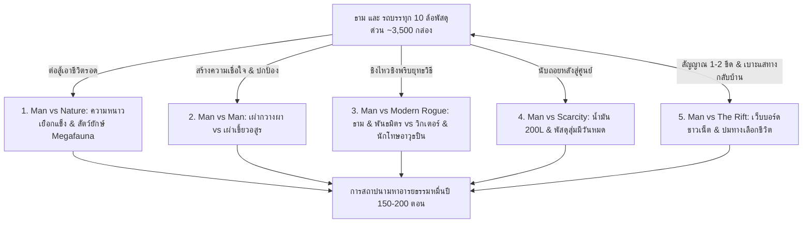
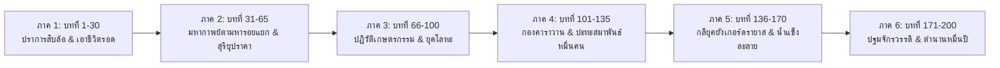

# โครงเรื่องแม่บทและ Story Outline — 10000-BC (พลิกยุคหินด้วยรถพัสดุหมื่นชิ้น)

> 📖 **คำชี้แจง:** เอกสารฉบับนี้รวบรวม **โครงสร้างโครงเรื่องหลัก (Master Plot Architecture)** และ **Story Chapters Outline รายบทแบบละเอียด (บทที่ 1 - 30)** โดยผสานแนวทางนวนิยายเอาชีวิตรอดระดับสากล (Gritty Cinematic Survival Thriller) เข้ากับกลไก **"ระบบแกะกล่องสุ่มพัสดุสินค้าออนไลน์ (The Blind Box Unboxing Survival)"**, **"การเชื่อมต่อเว็บบอร์ด/โซเชียลสากลผ่านสัญญาณมือถือลึกลับ (The Mystery Signal & Global Crowdsourced War Room)"**, **"กฎความสนุกสนาน อารมณ์ขัน และความหลากหลายไม่ซ้ำซาก (Entertainment, Humor & Anti-Repetition Architecture)"**, และ **"ภารกิจออกเดินทางตามหารอยแยกมิติเพื่อหาทางกลับยุคปัจจุบัน (The Temporal Rift Expedition Quest)"** เพื่อสร้างวรรณกรรมที่ตื่นเต้น ดิบเถื่อน ชวนติดตาม มีรอยยิ้ม และวางไม่ลง

---

# ภาคที่ 1: โครงสร้างโครงเรื่องแม่บท (Master Plot Architecture)

## 🎯 1. แก่นเรื่องหลักและแนวคิด (Core Premise & Themes)
## 🎯 1. แก่นเรื่องหลักและแนวคิด (Core Premise & Themes)
* **Logline:** เมื่อพายุหมอกทมิฬลึกลับกลืนกินทางหลวงช่องเขาตอนเหนือระยะ 1-2 กิโลเมตร ส่งผลให้รถบรรทุก 10 ล้อพัสดุสินค้าออนไลน์กว่า 3,500 ชิ้นของ "ธาม" บัณฑิตจบใหม่วัย 24-25 ปี พร้อมด้วยยานพาหนะร่วมทางหลวงอีก 3 คัน หลุดข้ามมิติตกกระแทกกระจัดกระจายสู่ยุค 10,000 ปีก่อนคริสตกาล ธามต้องใช้ "ปราการเหล็กกล้าตรึงพื้นที่" การสุ่มแกะกล่องพัสดุลึกลับ และ **สัญญาณมือถือ 2G ติดๆ ดับๆ บนหลังคารถที่เชื่อมต่อเว็บบอร์ดโลกปัจจุบัน** เพื่อระดมสมองชาวเน็ตมาเอาชีวิตรอดจากสัตว์ยักษ์ พัฒนาชนเผ่ากวางผา ร่วมมือกับพันธมิตรยุคใหม่อย่าง "พญ. ณิชา" และทำสงครามชิงไหวชิงพริบกับ "วิกเตอร์" อดีตทหารรับจ้างสุดอำมหิตที่ตั้งตนเป็นเทพอสูรปกครองเผ่ากินคน สู่มหากาพย์การสร้างเมือง การรับมือมหาภัยพิบัติปลายยุคน้ำแข็ง และการสถาปนาปฐมอารยธรรมมนุษย์ (150 – 200 ตอน)
* **สภาพยานพาหนะและการตรึงพื้นที่ (Permanent Immobilization & Roadless Prehistoric Wilderness):** จากแรงตกกระแทกมหาศาลของรถหนัก 25 ตันผ่านรอยแยกมิติ **ช่วงล่างพังยับเยิน แหนบหน้า 2 ตับและแหนบหลังเพลาคู่หักสะบั้น เพลาขับกลางบิดคดงอ ล้อหน้าและล้อหลังฉีกขาด จมลึกในหล่มโคลนหนืด ทำให้รถไม่สามารถขับเคลื่อนได้โดยสิ้นเชิง** และที่สำคัญที่สุดคือ **ภูมิประเทศยุค 10,000 ปีก่อนคริสตกาลไม่มีถนน ทางเกวียน หรือเส้นทางใดๆ สำหรับรถวิ่งทั้งสิ้น** มีเพียงหุบเขาหินปูนขรุขระ ป่าสนเขาและป่าเบญจพรรณดึกดำบรรพ์สลับลานทุ่งหญ้า หล่มโคลนดูด และหน้าผาสูงชัน แม้ตัวรถจะไม่เสียหาย รถบรรทุก 10 ล้อหนัก 25 ตันก็ไม่มีทางแล่นไปไหนได้ในสภาพแวดล้อมเช่นนี้ รถจึงกลายสภาพเป็น **"ปราการเหล็กตรึงพื้นที่ถาวร (Static Fortress / Keep)"** ตั้งแต่วันแรก ธามไม่สามารถขับรถหนีภัยได้ ต้องปักหลักสร้างฐานและตั้งรับ ณ หุบเขาแห่งนี้เท่านั้น แต่ชิ้นส่วนช่วงล่างที่พัง (โดยเฉพาะแหนบสปริงเหล็กกล้าคาร์บอนสูง 5160 หนักกว่า 250 กก.) จะกลายเป็น "เหมืองแร่เหล็กกล้า" ที่ล้ำค่าที่สุดในการตีอาวุธและเครื่องมือในยุคหิน
* **ระบบเอาชีวิตรอดสุ่มพัสดุ (Blind Box Unboxing Survival):** ท้ายรถคือตู้คอนเทนเนอร์เหล็กยาว 9.5 เมตร อัดแน่นด้วยพัสดุออนไลน์กว่า 3,500 กล่อง ธามไม่รู้ของข้างในล่วงหน้า ต้องคาดเดาจากขนาดกล่อง น้ำหนัก รหัสติดตาม และใบปะหน้าพัสดุ (Waybill) ตลอดมหากาพย์ 150-200 ตอน จะมีการแกะกล่องใช้งานจริงประมาณ 200-350 กล่อง (ไม่ถึง 10% ของตู้) ทำให้ความรู้สึกของการลุ้นเปิดกล่องกาชาพัสดุยังคงสดใหม่และมีทรัพยากรหล่อเลี้ยงการสร้างเมืองได้จนจบเรื่อง
* **ปรากฏการณ์ทางหลวงมิติและกลุ่มผู้รอดชีวิตร่วมชะตากรรม (The Multi-Vehicle Rift & Fellow Castaways):** อุบัติเหตุไม่ได้เกิดขึ้นกับธามเพียงลำพัง พายุหมอกดูดกลืนช่วงถนนทำให้มีรถหลุดมาพร้อมกัน 4 คัน ตกกระจายตัวห่างกัน 10-50 กม.: รถบรรทุกของธาม (คลังทรัพยากร), รถตู้เรือนจำของวิกเตอร์ (ฝ่ายปรปักษ์อาวุธปืน), รถกระบะ 4WD ของทีมวิจัยสัตว์ป่าหมอนิชา (ฝ่ายการแพทย์), และรถครอบครัวนักท่องเที่ยว (ฝ่ายพลเรือนที่ต้องคุ้มครอง) ก่อให้เกิดพลวัตความขัดแย้งของคนยุคปัจจุบันที่มีทั้งฝ่ายดีและฝ่ายเลว
* **ปมทางเลือกแห่งชีวิตและสายสัมพันธ์ข้ามหมื่นปีกับสองนางเอก (The Emotional Bond & Dual Heroines Dynamics):** แม้การตามหารอยแยกมิติจะมีเป้าหมายเพื่อหาทางกลับโลกปัจจุบัน แต่เมื่อเวลาผ่านไป ธามได้สร้างสายสัมพันธ์อันลึกซึ้งกับผู้คนในยุคนี้ โดยมีเสาหลักทางใจเป็น **"นางเอกคู่ (Dual Heroines)"** ได้แก่ **"เอลยา"** ยอดพรานสาวแห่งยุคหินผู้เคียงข้างร่วมเป็นร่วมตาย และ **"พญ. ณิชา"** แพทย์สาวแห่งศตวรรษที่ 21 คู่คิดทางปัญญาและจิตวิญญาณแห่งอารยธรรม พร้อมด้วย "คูราน" สหายนักล่าผู้พร้อมสละชีวิตปกป้องหลังให้เขา และชาวเผ่ากวางผาที่มองเขาเป็นเสาหลักและครอบครัว ในโลกเดิม ธามเป็นเพียงเด็กหนุ่มจบใหม่วัย 24-25 ปีที่เคว้งคว้างรองานประจำ โดดเดี่ยว ดิ้นรนในห้องเช่าแคบๆ ใต้แรงกดดันของระบบทุนนิยมและคะแนนดาว แต่ที่นี่ เขามีความหมาย มีครอบครัว และมีคนที่รักยิ่งชีวิต เมื่อรอยแยกมิติเปิดออกเป็นระลอก ธามยังคงชั่งน้ำหนักและยังไม่ได้ตัดสินใจตัดขาดจากโลกเดิม แต่ภารกิจสำคัญอันดับหนึ่งคือการยืนหยัดเคียงข้างเอลยา หมอณิชา และสร้างอารยธรรมใหม่ร่วมกับทุกคนที่นี่
* **ธีมหลัก (Central Theme):** *"เทคโนโลยีสมัยใหม่อาจหมดสิ้นไปตามกาลเวลา แต่การเชื่อมโยงทางปัญญา องค์ความรู้ทางวิทยาศาสตร์ และการร่วมมือกันของมนุษยชาติ คือพลังที่ไม่มีวันสูญสลาย"*
* **ฉากทัศน์สากลและภูมิศาสตร์ยุคดึกดำบรรพ์ (Neutral Setting & Ancient Untracked Topography):** จุดเกิดเหตุในโลกปัจจุบันเกิดขึ้น ณ ดินแดนแห่งใดแห่งหนึ่งในโลก (ไม่เจาะจงประเทศ) และเมื่อย้อนเวลามายัง 10,000 ปีก่อนคริสตกาล ธารน้ำแข็ง แผ่นเปลือกโลก และสภาพภูมิประเทศยุคก่อนประวัติศาสตร์ก็แตกต่างจนไม่อาจเทียบเคียงกับแผนที่หรือพรมแดนประเทศในปัจจุบันได้เลย เนื้อเรื่องดำเนินเรื่องด้วยโทนสากล ไม่เน้นความเป็นไทย เส้นทางขนส่งก่อนเกิดเหตุคือทางหลวงช่องเขาเขตหนาวตอนเหนือ (Highland Mountain Pass Highway) ของเครือข่ายโลจิสติกส์ข้ามชาติ และการสื่อสารทำผ่านเว็บบอร์ดสากล การตั้งชื่อสถานที่ทั้งในโลกปัจจุบันและยุคหินสามารถใช้ได้ทั้งชื่อไทย สากลภาษาอังกฤษ ทับศัพท์ หรือชื่อพรรณนาเชิงภูมิศาสตร์ (เช่น ช่องเขานอร์ธพาสส์ / North Pass, หุบเขากวางผา / Cliff Deer Valley, สันเขาเสาหินทมิฬ / Obsidian Monolith Ridge) อย่างอิสระโดยไม่ต้องเน้นความเป็นไทย
* **โทนเรื่อง (Tone):** สมจริง ดิบเถื่อน ตึงเครียด ลุ้นระทึกของปลายยุคน้ำแข็ง (International Survival Thriller) ผสมผสานอารมณ์ขันและเสน่ห์ของการปะทะทางวัฒนธรรมระหว่าง "ชาวเน็ตโลกปัจจุบัน" กับ "การเอาชีวิตรอดในยุคหิน"

---

## ⚡ 2. ปมขัดแย้ง 5 มิติ (Five-Tier Conflict)

1. **มนุษย์ vs ธรรมชาติ (Man vs Nature):** การไล่ระดับสภาพอากาศปลายยุคน้ำแข็ง 3 ระยะ (ไตรมาสแรกยังไม่ใช่หนาวสุดขั้ว แต่เป็นปลายฤดูใบไม้ร่วง 12°C–18°C กลางวัน / 5°C–8°C กลางคืน มีหน้าต่างเวลาเตรียมการ 4–5 เดือน ก่อนเผชิญคลื่นลมหนาวจัด Younger Dryas ต่ำกว่าจุดเยือกแข็งและพายุหิมะใหญ่ในเดือนที่ 5), สัตว์ยักษ์ Megafauna (หมีถ้ำยักษ์ Cave Bear, เสือเขี้ยวดาบ Smilodon, หมาป่าไดร์วูล์ฟ Dire Wolf, ช้างโบราณ) และมหาภัยพิบัติกลียุค Younger Dryas
2. **มนุษย์ vs มนุษย์ (Man vs Man):** ความหวาดระแวงแรกเริ่มกับเผ่ากวางผา (Cliff Deer Tribe) vs มหาสงครามล้างเผ่าพันธุ์จากกองทัพเผ่ากินคนเขี้ยวอสูร (Beast Fang Tribe) และสมาพันธ์ชนเผ่าเร่ร่อนนับหมื่นคน
3. **มนุษย์ vs คนยุคปัจจุบันฝ่ายปรปักษ์ (Man vs Modern Rogue):** การปะทะกันระหว่างธาม (ผู้ใช้เทคโนโลยีเพื่อการสร้างสรรค์และปกป้อง) กับวิกเตอร์ (อดีตทหารรับจ้าง/นักโทษโหดเหี้ยมที่ใช้ปืนและยุทธวิธีป่าเถื่อนครอบงำคนป่าเพื่อครองอำนาจ)
4. **มนุษย์ vs ทรัพยากรจำกัด (Man vs Finite Technology):** น้ำมันดีเซล 200 ลิตร, ระบบไฟแบตเตอรี่ 24V, กระสุนปืนพกฉุกเฉิน 43 นัดที่มีวันหมด และพัสดุ 3,500 กล่องที่ต้องใช้หล่อเลี้ยงการก้าวกระโดดสู่อารยธรรมใหม่
5. **มนุษย์ vs ปริศนาเชื่อมโลกและปมทางเลือกชีวิต (Man vs The Rift Quest & Internal Dilemma):** การเดินทางตามหารอยแยกมิติตามคำชี้แนะของชาวเน็ต นำไปสู่การเผชิญหน้ากับความจริงในหัวใจ ระหว่าง "การหนีกลับสู่โลกปัจจุบันที่สุขสบายแต่โดดเดี่ยว" หรือ "การปักหลักปกป้องเอลยาและชนเผ่าผู้เป็นครอบครัวแท้จริงเพื่อสร้างอนาคตใหม่ร่วมกัน"

---

## 📡 3. กลไกสัญญาณมือถือลึกลับและวอร์รูมระดมสมอง (The Mystery Signal Mechanics)

* **ข้อจำกัดทางกายภาพ (Physics & Constraints):**
  * สัญญาณเด้งขึ้นมา 1-2 ขีด เฉพาะเวลาที่ธาม **ปีนขึ้นไปยืนบนหลังคาตู้ทึบของรถช่วงหัวค่ำ หรือช่วงที่มีม่านหมอกหนาจัด** เท่านั้น
  * ความเร็วเทียบเท่า 2G: **ส่งได้เฉพาะข้อความและรูปถ่ายบีบอัดความละเอียดต่ำ (Low-Res)** ไม่สามารถโทรศัพท์ วิดีโอคอล หรือเปิดสตรีมมิงได้
* **วินัยการบริหารพลังงาน (Solar Power Discipline):**
  * โทรศัพท์ชาร์จด้วยพาวเวอร์แบงก์โซลาร์เซลล์ 20,000 mAh ที่แกะได้จากพัสดุ มีโควตาพลังงานจำกัด เปิดใช้งานเฉพาะโหมด Ultra Power Saving วันละ 1-2 ครั้ง ครั้งละไม่เกิน 15-20 นาที
* **วิวัฒนาการ 4 ระยะของกระทู้ (The 4-Phase Evolution):**
  * **ระยะที่ 1: Troll & ARG Era (บทที่ 2 - 6):** ชาวเน็ตคิดว่าเป็นการจัดฉาก โปรโมตเกม หรือแต่งเรื่องแนว ARG แนะนำกวนๆ เช่น "กดแตรลมเป็นจังหวะเพลงแดนซ์กวนๆ ไล่คนป่า" หรือ "ปาของกินใส่หน้ามัน" แต่คำแนะนำเรื่องบีบแตรและสาดไฟสูงดันใช้ได้ผลจริง!
  * **ระยะที่ 2: Specialist Awakening (บทที่ 7 - 16):** ภาพถ่ายกิ่งไม้โบราณ พืชสูญพันธุ์ (*Dryas octopetala*) รอยเขี้ยวหมาป่าดึกดำบรรพ์ และกะโหลกมนุษย์ยุคหิน ดึงดูดผู้เชี่ยวชาญเฉพาะทาง (`@BioArch_Oxford`, `@CombatMedic_US`, `@VikingBushcraft`) เข้ามาแนะนำวิธีผ่าตัดเย็บแผล สัดส่วนคันธนูหมุนไฟ และสูตรเตาหลอมโลหะ
  * **ระยะที่ 3: The Global War Room & Rift Hunt (บทที่ 17 - 26):** กระทู้ตรวจพบคลื่นแม่เหล็กมิติผันผวน แจ้งพิกัดรอยแยกมิติที่อาจเปิดออก ส่งผลให้ธามออกเดินทางสำรวจ พร้อมช่วยกันสเก็ตช์แผนที่ค่ายกล คำนวณปรากฏการณ์ดาราศาสตร์ (สุริยุปราคาเต็มดวง)
  * **ระยะที่ 4: The Strategic Knowledge Stream (บทที่ 27 เป็นต้นไป):** รอยแยกมิติเปิดขึ้นเป็นระลอกเรื่อยๆ แต่ไม่บ่อย โลกปัจจุบันไม่สามารถส่งสิ่งของทางกายภาพข้ามมาได้ จึงระดมส่งชุดข้อมูลความรู้ พิมพ์เขียว และการประสานงานทางยุทธวิธีสนับสนุนค่ายอย่างต่อเนื่อง

---

## 🌌 3.1 กลไกการเปิดของรอยแยกมิติ ปรากฏการณ์ฟ้าเปิด และวัฏจักรสัญญาณพุ่งสูง (The Dimensional Rift Lifecycle & Multi-Duration Surge Architecture)

* **พฤติกรรมและการเปิดของประตูมิติ (Periodic, Irregular & Infrequent Openings):**
  * **ประตูมิติยังเปิดเรื่อยๆ แต่ไม่บ่อย:** รอยแยกมิติ (Temporal Rift) ไม่ได้เปิดตามตารางเวลาที่ตายตัว และไม่ได้ปิดตายถาวร แต่จะกระเพื่อมเปิดขึ้นมาเรื่อยๆ เป็นระยะตลอดมหากาพย์ ทว่ามีความถี่ต่ำ (ไม่บ่อย) เกิดขึ้นตามความผันผวนของกาลอวกาศ (Spacetime Fluctuation)
  * **ความไม่แน่นอนของระยะเวลาเปิด (Unpredictable Multi-Duration Dynamics):**
    1. **รอบที่เปิดนาน (Extended Rift Window ~หลายชั่วโมง ถึง 1 – 2 วันเต็ม / 24 – 48 ชม.):** เกิดขึ้นนานๆ ครั้ง ท้องฟ้าเปิดกว้าง สัญญาณ 5G เสถียรสูงต่อเนื่อง สองโลกประสานงานกันได้เต็มที่ ดาวน์โหลดคลังข้อมูลวิชาการขนาดมหึมา (Wikipedia ออฟไลน์, พิมพ์เขียวเครื่องจักร, ตำราโลหะวิทยา, การแพทย์, เกษตรกรรม) เข้าสู่ SSD และสมาร์ตโฟน
    2. **รอบที่เปิดไม่นาน / เปิดสั้น (Flash Rift / Micro-Burst ~30 นาที – 2 ชั่วโมง):** เกิดขึ้นกะทันหันในยามคับขัน บีบให้ทำงานแข่งกับเวลา เช่น การ Video Call ปรึกษาอาจารย์แพทย์ผ่าตัดเคสด่วน หรือรีบกวาดดาวน์โหลดเอกสารจำเป็นเฉพาะหน้า ก่อนรอยแยกจะหดแคบลง
    3. **ช่วงมิติดับสนิท / เว้นว่าง (The Void / Radio Silence หลายสัปดาห์ – หลายเดือน):** ระหว่างรอบการเปิด ประตูมิติจะปิดลง สัญญาณตัดขาด ตัวเอกและชุมชนต้องพึ่งพาพลังตนเองและข้อมูลที่สะสมไว้ สร้างอารยธรรมด้วยสองมือ
* **กฎเหล็กการส่งสิ่งของข้ามมิติ (Physical Barrier vs. Data Only Transmission):**
  * **ส่งสิ่งของทางกายภาพข้ามมาไม่ได้เด็ดขาด:** แรงโน้มถ่วงและพลังงานมิติฉีกกระชากสสารทางกายภาพ (เช่น โดรน, แคปซูลเสบียง, พัสดุ) พังทลายทั้งหมด ไม่สามารถส่งสิ่งของข้ามมาช่วยเหลือได้
  * **ทำได้เพียงส่งคลื่นสัญญาณและข้อมูลดิจิทัลเท่านั้น:** โลกปัจจุบันทำหน้าที่เป็น "มันสมองและคลังปัญญา" ถ่ายทอดความรู้ พิมพ์เขียว และคำแนะนำยุทธวิธีผ่านสัญญาณวิทยุและเว็บบอร์ด
* **สถานะการกลับของตัวเอก (Thame Cannot Return Yet - No Physical Method Exists):**
  * **ธามยังกลับไม่ได้เด็ดขาด เพราะยังไม่มีวิธีที่สามารถทะลุมิติได้ทางกายภาพ:** แรงโน้มถ่วงและแรงกระชากมิติจะฉีกสลายสสาร สิ่งของ และสิ่งมีชีวิตจนแหลกละเอียด (ส่งผ่านได้เพียงคลื่นสัญญาณและข้อมูลดิจิทัลเท่านั้น) จึงยังไม่มีเทคโนโลยีหรือหนทางใดที่จะพามนุษย์ข้ามมิติกลับไปได้ในปัจจุบัน
  * ในระหว่างที่ยังไร้หนทางกลับนี้ ธามจึงมุ่งมั่นทุ่มเทสติปัญญาและหัวใจทั้งหมดไปกับการปกป้องและพัฒนาชุมชนให้อยู่รอดปลอดภัย โดยที่ใจจริงธามเองก็ยังไม่ได้ตัดสินใจเลือกหรือยึดติดว่าจะกลับหรือไม่กลับ มุ่งสร้างรากฐานชีวิตร่วมกับเอลยา หมอณิชา และทุกคนในค่าย
* **ปรากฏการณ์ทางธรรมชาติบอกเหตุบนท้องฟ้า (Visual Forewarning & Environmental Impact):**
  * **ก่อนและขณะเปิด:** ท้องฟ้าบิดเบี้ยวเป็นลอนคลื่น (Gravitational Lensing) แสงอาทิตย์และแสงดาวหักเหเป็นเกลียววงแหวนคล้ายมองผ่านผิวน้ำ เกิดแสงเรืองรองคล้าย **ออโรร่าสีม่วงครามและรุ้งแม่เหล็ก (Magnetic Ionization & Prismatic Halo)** สว่างนวลตาทั่วหุบเขา (หากเปิดนาน ท้องฟ้าจะสว่างไสวดั่งมีพระจันทร์เต็มดวง 3 ดวง)
  * **ผลกระทบทางกายภาพ:** กลิ่นโอโซนฉุนกึก ไฟฟ้าสถิตทำให้เส้นขนลุกชัน เข็มทิศหมุนควงไร้ทิศทาง สัตว์ป่าและไดร์วูล์ฟกระวนกระวายแหงนมองฟ้า
  * **สัญญาณเตือนการปิดตัว:** แสงออโรร่าเริ่มสั่นกระตุก แตกริ้ว สัญญาณโทรศัพท์วูบลงทีละขีดจาก 5G -> 4G -> 3G -> 2G สร้างความกดดันของการนับถอยหลัง (Countdown Drama)
* **คุณค่าต่อวรรณศิลป์และเนื้อเรื่อง (Narrative Value):**
  * แก้ปัญหาความสมจริงทางวิทยาศาสตร์: อธิบายได้ว่าทำไม Fortress Alpha ถึงพัฒนาเทคโนโลยีได้ก้าวกระโดด เพราะอาศัยช่วงที่ฟ้าเปิดรอบที่เปิดนานในการดาวน์โหลดพิมพ์เขียวและตำรามาศึกษาแบบออฟไลน์
  * มุมมองของคนโบราณ: ชนเผ่ากวางผามองปรากฏการณ์ฟ้าเปิดว่าเป็น *"วันระบำแห่งดวงวิญญาณฟ้า"* และมองหน้าจอ Video Call ว่าเป็น *"กระจกส่องโลกสวรรค์"*

---

## 📦 4. ระบบการสุ่มแกะพัสดุ (The Blind Box Unboxing Survival Rules)

* **ความหลากหลายของสินค้า 8 หมวดหมู่ (~3,500 ชิ้น):**
  1. เสื้อผ้าและเครื่องนุ่งห่มกันหนาว (30%)
  2. อาหารแห้ง ขนม ข้าวสาร & เครื่องปรุงรส (20%)
  3. เครื่องมือช่าง ฮาร์ดแวร์ & งาน DIY (15%)
  4. อุปกรณ์เดินป่า แค้มปิ้ง & เอาชีวิตรอด (12%)
  5. เวชภัณฑ์ ยา ปฐมพยาบาล & สุขอนามัย (10%)
  6. เกษตรกรรม เมล็ดพันธุ์พืช & การเพาะปลูก (5%)
  7. อุปกรณ์อิเล็กทรอนิกส์ & แก็ดเจ็ต (5%)
  8. สินค้าเบ็ดเตล็ดสุดแปลกที่ต้องดัดแปลง (MacGyver Comedy 3%)
* **กฎการสุ่ม:** ธามไม่รู้ของข้างใน ต้องอ่าน Waybill คลำน้ำหนัก ฟังเสียง และตัดสินใจแกะกล่องตามสถานการณ์วิกฤต กล่องที่เปิดอาจได้ของตรงเป้า (Jackpot) หรือได้ของประหลาดที่ต้องใช้สมองประยุกต์ใช้งาน
* **การบันทึกท้ายบท:** ทุกบทที่มีการเปิดกล่อง จะต้องลงตารางสรุป Tracking ID, รายละเอียดของที่ได้, และการนำไปใช้งานจริงอย่างเคร่งครัด

---

## 🎭 5. กฎความสนุกสนาน มุกตลก และความหลากหลายไม่ซ้ำซาก (Entertainment, Humor & Dynamic Variety)

* **อารมณ์ขัน 4 เลเยอร์ (The 4 Layers of Comedy):**
  1. *Deadpan & Dark Humor:* ธามสบถประชดโชคชะตาตัวเองในใจอย่างสุขุม เช่น การกลัวโดนหักดาวในแอปขนส่งเพราะส่งพัสดุเลทไปหนึ่งหมื่นปี หรือรอดจากหมีถ้ำแต่เกือบตายเพราะลืมรูดซิปเสื้อโค้ต
  2. *Culture Clash Humor:* คนยุคหินเข้าใจผิดเรื่องของใช้สมัยใหม่อย่างไร้เดียงสา เช่น คิดว่าแตรลมคือเสียงบรรพบุรุษ, ฟองสบู่คือเสมหะภูตหิมะ, บับเบิ้ลกันกระแทกคือไข่สัตว์ศักดิ์สิทธิ์ที่กดแล้วแตกเปรี๊ยะชวนหัวเราะ
  3. *The Gacha & MacGyver Comedy:* ช่วงหน้าสิ่วหน้าขวาน ดันแกะกล่องได้สินค้าประหลาด (รองเท้าส้นสูง, วิกผมคอสเพลย์, เครื่องนวดคอ) แล้วต้องแถดัดแปลงเป็นอาวุธและกับดักได้อย่างอัจฉริยะ
  4. *Internet Troll Banter:* ความกวนของชาวเน็ต (`@TrollMaster_99`) ที่เปิดประเด็นฮาๆ แต่ดันให้ไอเดียหลุดโลกที่ใช้งานได้จริง
* **ระบบ 6 รูปแบบบทหมุนเวียน (The 6 Rotating Episode Archetypes):**
  - **Type A:** Primal Combat & Thriller (แอ็กชันเอาชีวิตรอด / ล่าสัตว์ยักษ์ / ปะทะศัตรู)
  - **Type B:** Engineering & Crafting (วิศวกรรม / ถอดชิ้นส่วนรถ 10 ล้อ / ตีเหล็ก 5160 / ค่ายกล)
  - **Type C:** Culture Shock, Feasting & Wholesome (กระชับมิตร / มุกตลก / งานเลี้ยงเนื้อย่าง / รอยยิ้ม)
  - **Type D:** Mystery, Exploration & Expeditions (การเดินทางสำรวจ / ตามหารอยแยกมิติ / พืชสูญพันธุ์)
  - **Type E:** Modern World & The War Room (สืบสวนโลกปัจจุบัน / วอร์รูมชาวเน็ต / คำนวณดาราศาสตร์)
  - **Type F:** Medical Miracle & Crisis (วิกฤตพยาบาลฉุกเฉิน / พายุหิมะถล่ม / โรคระบาด)

---

## 🏛️ 6. โครงสร้าง 4 องก์ (The 4-Act Arc)

* **Act 1: The Arrival & First Contact (บทที่ 1 - 10):** ตกกระแทกข้ามมิติ, หมีถ้ำบุกคืนแรก, ยืนยันช่วงล่างพังถาวร, สัญญาณ 1 ขีดบนหลังคารถ, กระทู้แรกถือกำเนิด, แกะเสื้อขนเป็ด-มีดเดินป่า-พาวเวอร์แบงก์, แตรลมคู่ 130dB สยบชนเผ่า, ปาฏิหาริย์เกลือบริสุทธิ์, การผ่าตัดรักษาพรานสาวตามคำสั่งแพทย์สนามออนไลน์
* **Act 2: Fortification & The Rift Expedition (บทที่ 11 - 20):** สถาปนารถ 10 ล้อเป็น Keep ถาวร, สร้างค่ายกลหิน, ตีหอกแหนบ 5160, โพสต์เบาะแสช่องมิติเปิดจากชาวเน็ต, จัดกองคาราวานสำรวจฝ่าพายุหิมะตามหารอยแยกมิติบนยอดเขาเสาหินทมิฬ, ค้นพบเงื่อนไขสุริยุปราคาและกองทัพเขี้ยวอสูร, การควบตะบึงกลับค่ายเพื่อเตรียมรับศึกใหญ่
* **Act 3: Megafauna & The Great Siege (บทที่ 21 - 26):** หมีถ้ำยักษ์หวนกลับมา, สปอร์ตไลต์คู่หน้า + ธนูทดกำลัง Compound Bow + หอกแหนบเหล็กกล้าปลิดชีพ, กองทัพเขี้ยวอสูร 100 นายบุกค่าย, ระเบิดเพลิงดีเซล Molotov, เสียงแตรลมสยบขวัญ, คำทำนายสุริยุปราคาจากนักดาราศาสตร์มิวนิก, ยิงพลุสัญญาณฉุกเฉินสังหารหัวหน้าเผ่ากราก
* **Act 4: Dawn of the New Age & The Eternal Monument (บทที่ 27 - 30):** ข่าวโลกปัจจุบันยืนยันจุดเกิดเหตุ, พัสดุเริ่มหมดลง, แกะเมล็ดพันธุ์ข้าวสาลี-บาร์เลย์เริ่มการปฏิวัติเกษตรกรรม, สร้างเตาหลอมโลหะแห่งแรกจากเพลาขับและกระทะล้อรถ 10 ล้อ, สัญญาณมือถือดับมอดลงถาวร, สถาปนามหานครแห่งแรกของมนุษยชาติ

---

## 🗺️ 7. โครงสร้างภูมิศาสตร์และระบบการตั้งชื่อสถานที่ (The Prehistoric Toponymy & Cartography Outline)

### 📌 หลักการพื้นฐาน: แผ่นดินไร้นามกับระบบชื่อ 2 มิติ (The Dual Toponymy Philosophy)
ในยุค 10,000 ปีก่อนคริสตกาล แผ่นเปลือกโลกและธารน้ำแข็งยังคงปกคลุม **ไม่มีแผนที่ ไม่มีเส้นแบ่งพรมแดนประเทศ และไม่มีชื่อสากลที่จดบันทึกไว้ในประวัติศาสตร์ใดๆ ทั้งสิ้น** ภูมิประเทศทุกแห่งเดิมทีเป็น "พื้นที่ไร้นาม (Unnamed Wilderness)" 
การเกิดขึ้นของชื่อสถานที่ในเรื่องจึงถูกขับเคลื่อนผ่าน **2 แหล่งกำเนิดคู่ขนาน (Dual Naming System)**:
1. **ชื่อดั้งเดิมที่คนท้องถิ่นตั้งไว้ (Indigenous Tribal Toponyms):**
   - ชนเผ่าพื้นเมือง (เผ่ากวางผา, เผ่าเขี้ยวอสูร) ตั้งชื่อสถานที่ตามสิ่งที่ประสาทสัมผัสรับรู้: รูปลักษณ์ธรรมชาติ, เสียง, ภัยอันตราย, สัตว์ประจำถิ่น, บรรพชน, หรือความเชื่อทางจิตวิญญาณ
   - ส่งต่อกันผ่านมุขปาฐะ (Oral Tradition) ถ้อยคำในบทสวด และนิทานรอบกองไฟ
2. **ชื่อที่ตัวเอก (ธาม) บัญญัติขึ้นเอง (Protagonist Tactical / Modern Functional Toponyms):**
   - ธามมาจากโลกปัจจุบันที่คุ้นเคยกับการใช้พิกัด แผนที่ทางยุทธวิธี และการระดมสมองกับชาวเน็ตในเว็บบอร์ด
   - เขาใช้กระดาษลูกฟูกจากกล่องพัสดุและปากกามาร์กเกอร์ (รวมถึงถ่านไม้บนหนังสัตว์) วาด **"แผนที่แผ่นแรกของประวัติศาสตร์มนุษยชาติ (The First Cartography)"**
   - ตั้งชื่อตามฟังก์ชันการเอาชีวิตรอด, ประโยชน์ใช้สอย, สภาพโครงสร้างทางวิศวกรรม, หรือรหัสทางยุทธวิธี
3. **การหลอมรวมและการแลกเปลี่ยนทางภาษา (Bilingual Hybrid Toponymy):**
   - ในแผนที่และสมุดบันทึกของธาม เขาจะบันทึกทั้งสองชื่อคู่กันเสมอ เช่น `[ป้อมอัลฟ่า / หุบผาสัตว์เหล็กหลับใหล]`
   - ตัวละครทั้งสองฝ่ายค่อยๆ ซึมซับชื่อของกันและกัน: ธามเรียกชื่อสถานที่ตามที่เอลยาบอกเพื่อเคารพเจ้าของถิ่น ขณะที่ชาวเผ่าก็เริ่มเรียกสิ่งก่อสร้างสมัยใหม่ตามที่ธามบัญญัติ

---

### 📍 สารบัญภูมิศาสตร์และบัญชีรายชื่อสถานที่สำคัญ (Master Prehistoric Location Directory)

| ลำดับ | ชื่อที่ธาม/ชาวเน็ตตั้ง (Protagonist / Tactical Name) | ชื่อดั้งเดิมที่ชนเผ่าเรียก (Indigenous Tribal Name) | ลักษณะภูมิประเทศและจุดเด่นทางกายภาพ (Terrain & Physical Traits) | บทบาทในเนื้อเรื่องและยุทธศาสตร์ (Narrative & Strategic Role) | ปรากฏครั้งแรก |
| :---: | :--- | :--- | :--- | :--- | :---: |
| 1 | **ป้อมอัลฟ่า / แคมป์สิบล้อ** *(Fortress Alpha / Base Keep)* | **หุบเขาสัตว์เหล็กหลับใหล** *(Plain of the Sleeping Beast)* | แอ่งกระทะธรรมชาติ ดินโคลนเพอร์มาฟรอสต์แข็งตัว ขนาบด้วยสันหินโมเรน | ฐานที่มั่นหลัก, จุดที่รถ 10 ล้อ 25 ตันปักหลักถาวร, คลังเก็บพัสดุ ~3,500 ชิ้น | บทที่ 1 |
| 2 | **เนินสองขีด / ผาสัญญาณ** *(Two-Bar Ridge / Ping Rock)* | **แท่นสดับเสียงวิญญาณฟ้า** *(Altar of the Sky Whispers)* | ชะง่อนหินแกรนิตสูงชัน 8 เมตร ด้านหลังรถบรรทุก ลมพัดแรงตลอดเวลา | จุดเดียวที่โทรศัพท์มือถือจับสัญญาณ 2G ได้ 1-2 ขีดช่วงหัวค่ำเพื่อโพสต์กระทู้ | บทที่ 2 |
| 3 | **ป้อมปราการถ้ำชั้นใน / ถ้ำผาสวรรค์และบ่อน้ำแร่ร้อน** *(The High Redoubt / Vault Alpha & Thermal Spring)* | **ถ้ำนิทราแห่งจิตวิญญาณผา** *(Cavern of the Rock Ancestors)* | โพรงถ้ำหินปูนบนผาสูง 15 ม. เหนือหลังคารถ ซ่อนหลังม่านเถาวัลย์ มีบ่อน้ำแร่ร้อนมรกต 38–42°C คุมอุณหภูมิถ้ำอบอุ่น 22–25°C, ปล่องหินระบายไอน้ำและรับแสงแดด (Natural Skylight Chimney), ตาน้ำผุดใส และภาพเขียนสีโบราณ | ป้อมปราการสำรองชั้นในสุด, หลุมหลบภัยหนาวขั้วโลก Younger Dryas, สปาน้ำแร่อุ่นฟื้นฟูแผลผ่าตัด, แปลงเพาะชำเรือนกระจกใต้ดิน, คลังเก็บเมล็ดพันธุ์/ยา และแหล่งมูลค้างคาว (ดินประสิวธรรมชาติ) | บทที่ 11 |
| 4 | **หุบเขาพันธมิตร** *(Alliance Valley / Sector 1)* | **หุบผากวางผา** *(Cliff Deer Gorge / El-Karan)* | หุบเขาหินปูน มีเพิงผาและโพรงถ้ำธรรมชาติ ปลอดภัยจากลมพายุหิมะ | ถิ่นฐานและหมู่บ้านถ้ำของเผ่ากวางผา (เผ่าของเอลยาและคูราน) ห่างจากรถ 2 กม. | บทที่ 3 |
| 5 | **แนวกันชนป่าสนเหนือ** *(North Taiga Buffer)* | **ป่าเงาหนาว / ป่าเขี้ยวดาบ** *(Shadow-Cold Forest / Smilodon Taiga)* | ป่าสนไทกาโบราณทึบ ต้นสนไพน์ยักษ์สูง 20 เมตร หิมะปกคลุมหนาทึบ | แหล่งตัดไม้ทำเชื้อเพลิง, ถิ่นหากินของฝูงหมาป่าไดร์วูล์ฟและเสือเขี้ยวดาบ | บทที่ 4 |
| 6 | **ลำธารเกล็ดน้ำแข็ง** *(Ice-Melt Stream / Filter Creek)* | **ธารน้ำหินขาว** *(White Stone Brook / Mel-Runa)* | ลำธารน้ำละลายจากธารน้ำแข็ง ใสบริสุทธิ์ ไหลผ่านแก่งหินกรวดมน | แหล่งน้ำจืดบริสุทธิ์ประจำค่าย, จุดติดตั้งระบบกรองน้ำด้วยสารส้มและถ่านกัมมันต์ | บทที่ 5 |
| 7 | **ช่องแคบเทอร์โมพิลี** *(Thermopylae Chokepoint)* | **ช่องเขากลืนวิญญาณ** *(Gullet of the Dead)* | ซอกผาหินโมเรนแคบกว้างเพียง 4-5 เมตร ขนาบด้วยหน้าผาสูงชันสองด้าน | ชัยภูมิคอขวดทางยุทธวิธี จุดวางกับดักขวดเพลิง Molotov และลวดสลิงต้านศึก | บทที่ 8 |
| 8 | **ริฟต์พีค / พิกัดโอเมก้า** *(Rift Peak / Sector Omega)* | **ยอดผาเสาหินทมิฬ** *(The Obsidian Monolith Ridge)* | ยอดเขาหินแก้วออบซิเดียนสีดำมะเมื่อม สูง 1,800 ม. เกิดประจุไฟฟ้าสถิต | พิกัดที่ชาวเน็ตตรวจพบรอยแยกมิติ, จุดนัดพบสุริยุปราคา และสนามรบตัดสินใจชีวิต | บทที่ 18 |
| 9 | **แดนข้าศึกเขตใต้** *(South Sector / Raider's Crag)* | **ผาหัวกะโหลกทมิฬ** *(Crag of the Blood Fangs)* | เทือกเขาหินแหลมคม แห้งแล้ง เต็มไปด้วยซากกะโหลกสัตว์ยักษ์ที่ถูกล่า | ฐานที่มั่นใหญ่ของชนเผ่ากินคนเขี้ยวอสูรและหัวหน้าเผ่ากราก | บทที่ 19 |
| 10 | **ลานเตาหลอมและแปลงเกษตร 1** *(Foundry Flats & Agri-Plot 1)* | **ทุ่งดินอุ่น** *(Warm-Earth Meadow / Talan-Mor)* | ลานดินตะกอนปากหุบเขาที่ได้รับแดดอุ่น ดินร่วนปนทรายไม่เป็นน้ำแข็ง | จุดสร้างเตาหลอมโลหะจากแหนบ 5160 และแปลงเพาะปลูกข้าวสาลี-บาร์เลย์แห่งแรก | บทที่ 28 |

---

## 🏛️ 8. โครงสร้างมหากาพย์ 6 ภาค (The 6-Saga Epic Master Roadmap: 150 – 200 ตอน)

มหากาพย์การสร้างอารยธรรมข้ามหมื่นปีถูกจัดแบ่งออกเป็น **6 ภาคหลัก (Sagas)** แต่ละภาคมีความยาวประมาณ **25 – 35 ตอน** (รวมทั้งสิ้น 150 – 200 ตอน, ความยาวรวม ~400,000 – 550,000 คำ) เพื่อสร้างความต่อเนื่อง พัฒนาการทางอารยธรรมที่สมเหตุสมผล และการใช้พัสดุ 3,500 กล่องอย่างคุ้มค่าสูงสุด:

### 🏔️ ภาคที่ 1: ปราการสิบล้อและการเอาชีวิตรอดแรกเริ่ม (The Iron Bastion & Primal Survival — บทที่ 1 - 30)
* **แก่นเรื่องหลัก:** ตกกระแทกข้ามมิติ, ช่วงล่างพังถาวรในแผ่นดินไร้ถนน, เผชิญหน้าหมีถ้ำคืนแรก, สัญญาณ 2G ขีดแรกบนหลังคารถ
* **การแกะพัสดุ (~20-30 กล่อง):** เสื้อโค้ตขนเป็ดแท้, มีดเดินป่าเหล็กคาร์บอน, พาวเวอร์แบงก์โซลาร์, แผ่นฟอยล์อวกาศ, สารส้มกวนน้ำ, เกลือสมุทรบริสุทธิ์, ยาปฏิชีวนะ Amoxicillin
* **ไฮไลต์สำคัญ:** แตรลมคู่ 130dB สยบชนเผ่า, การผ่าตัดช่วยชีวิตเอลยาตามคำแนะนำแพทย์สนามออนไลน์, พบร่องรอยปริศนาของคนยุคปัจจุบันคนอื่น (ปลอกกระสุน 9mm และรอยล้อรถ 4WD บนหิมะ)

### 🏹 ภาคที่ 2: ร่องรอยผู้ข้ามมิติและเสียงเพรียกจากผืนป่า (The Rift Expedition & Settlement Fortification Arc — บทที่ 31 - 65)
* **แก่นเรื่องหลัก:** การจัดระเบียบคลังพัสดุแม่บทเพื่อการประดิษฐ์ (Grand Cargo Sorting), การปฏิวัติสร้างค่ายและยกระดับคุณภาพชีวิต/สุขอนามัย (Citadel Base Building, Cave Living & Sanitation), การแกะรอยปริศนาผู้รอดชีวิตคนอื่น และการกู้ภัยครอบครัวพลเรือน
* **การจัดระเบียบคลังพัสดุและกฎการเล่าเรื่อง (The Grand Cargo Cataloging & Narrative Suspense Doctrine):**
  * ในช่วงเปิดภาคที่ 2 ธาม เอลยา หมอณิชา และชาวเผ่า ร่วมกันรื้อสำรวจตู้คอนเทนเนอร์ 25 ตัน แกะกล่องพัสดุออกมาสำรวจและจัดหมวดหมู่ไว้อย่างเป็นระเบียบ พบขุมทรัพย์มหาศาล: เครื่องมือช่าง (จอบ เสียม พลั่ว ขวาน ค้อน กุญแจ/ประแจ คีม เลื่อย ชะแลง สว่าน ดอกสว่านเจาะเหล็ก/ไม้/คอนกรีต อุปกรณ์ก่อสร้าง), ของกิน/เสบียงแห้ง, อาวุธ/คันธนู/ปืน, ปุ๋ย, พันธุ์พืช, ของใช้, อุปกรณ์ไฟฟ้า, อุปกรณ์การแพทย์ (ครีม ยาขี้ผึ้ง เวชภัณฑ์), อุปกรณ์การเกษตร และอื่นๆ ซึ่งสามารถนำไปประดิษฐ์เป็นสิ่งของใหม่ๆ ที่มีประโยชน์ต่อการดำรงชีวิตของชาวเผ่า พร้อมทั้งพบ **"กล่องพัสดุลับบางกล่องที่ยังไม่แกะ"** (หีบเหล็กล็อกแน่น/ลังไม้ซีลพิเศษ) ซึ่งอาจเป็น **Items ลับ** หรืออุปกรณ์เทคโนโลยีระดับไพ่ตายที่ธามเก็บรักษาไว้ด้านในสุด
  * **กฎเหล็กการเล่าเรื่องเพื่อรักษาความตื่นเต้น:** *ไม่ต้องบอกคนอ่านทั้งหมด บอกแค่หมวดของที่เจอ* เพื่อให้คนอ่านได้ร่วมลุ้นว่าธามจะประดิษฐ์อะไรใหม่ๆ มีอะไรให้หยิบมาใช้แก้ไขวิกฤต หรือเมื่อไหร่จะถึงเวลาเปิด "กล่องลับปริศนา" เหล่านั้น!
* **การปฏิวัติสร้างค่าย การตั้งถิ่นฐานถาวร และวิถีชีวิตคนโบราณ (Perimeter Expansion, Sedentary Living & Division of Labor):**
  * *การขยายอาณาเขตรั้วปราการ (Outer Perimeter Expansion):* ขยายแนวรั้วไม้ซุงคู่ 2 ชั้นสูง 3.5 เมตร อัดหิน-ดิน และขดลวดหนาม 3 ระดับให้กว้างขวางขึ้น โอบล้อมลานค่าย ทุ่งปศุสัตว์ และแปลงเกษตรกรรม
  * *คนยุคโบราณสร้างที่พักถาวรภายในรั้ว (Permanent Clan Cabins):* ชนเผ่าร่วมกันสร้างกระท่อมไม้ซุงผสมหินปูนถาวรขนาดกะทัดรัด 10 – 15 หลัง (~40 – 60 คน) เพื่อการดูแลที่ทั่วถึงและไม่วุ่นวายแออัด เรียงรายใกล้รถ 10 ล้อ ภายใต้รั้วคุ้มกัน ไม่ต้องอยู่เพิงหนังสัตว์ชั่วคราว
  * *บทบาทหน้าที่ของคนในเผ่าตามคำแนะนำของธาม (Tribal Division of Labor):*
    - *เวรยามและป้องกันภัย:* ผลัดเปลี่ยนเฝ้าระวังบนกำแพง ตรวจสอบลวดหนามและระบบเตือนภัย
    - *งานช่างและก่อสร้าง:* ช่วยลำเลียงหิน ตัดซุง สร้างบันไดหน้าผา 15 เมตร สู่ถ้ำลับผาสวรรค์
    - *งานปศุสัตว์:* ดูแลทุ่งล้อมสัตว์ ป้อนหญ้า รีดนม ตัดขนกวางผาและแพะภูเขา
    - *งานเกษตรกรรม:* ขุดดิน ใส่ปุ๋ยมูลค้างคาว Guano รดน้ำ ดูแลแปลงผักขั้นบันไดตามคำแนะนำของธาม
  * *ที่พักถ้ำน้ำอุ่นและสุขอนามัย (Thermal Sanctuary & Sanitation):* ที่พักถ้ำน้ำอุ่น 22°C–25°C หลบพายุหนาว ต่อท่อน้ำแร่อุ่นทำห้องอาบน้ำ และสร้างห้องสุขาหลุมซึมกรุหินปูนใต้ลม 80 เมตร
  * *การตั้งถิ่นฐานถาวรไม่ต้องย้ายถิ่นอีกต่อไป (The Sedentary Revolution):* ปลดแอกชนเผ่าจากวงจรเร่ร่อนตามล่าสัตว์ที่ต้องเสี่ยงภัยหนาวตาย สู่ชุมชนลงหลักปักฐานถาวรที่มั่นคงและมีกินตลอดทั้งปี
* **การแกะพัสดุ (~40-50 กล่อง):** อุปกรณ์ช่าง/ดอกสว่าน, เต็นท์เดินป่าโฟร์ซีซัน, เชือกพาราคอร์ด 550, คันธนูทดกำลัง Compound Bow 70 ปอนด์, วิทยุสื่อสารมือถือ, กล้องส่องทางไกล
* **ไฮไลต์สำคัญ:** การจัดระเบียบคลังพัสดุครั้งใหญ่และรุ่งอรุณแห่งการประดิษฐ์, การขยายรั้ว/สร้างที่พักถาวรของชนเผ่า/ถ้ำน้ำอุ่น/ห้องน้ำ/ทุ่งสัตว์/แปลงผัก, พบปลอกกระสุน 9 มม. และซากกวางถูกยิงด้วยลูกซอง 00 Buckshot, ปะทะฝูงเสือเขี้ยวดาบ (Smilodon) ค่ายกลรั้วหนาแน่นและลวดหนามแสดงอานุภาพ, สองนางเอก (เอลยา & หมอณิชา) ร่วมเคียงข้างธามวางแผนรับสัญญาณขอความช่วยเหลือและจัดทัพกู้ภัยครอบครัวลุงสมบูรณ์และหนูน้อยมีนา

### 🌾 ภาคที่ 3: รุ่งอรุณแห่งการปฏิวัติเกษตรกรรมและยุคโลหกรรมแรก (The Neolithic & Metallurgy Revolution — บทที่ 66 - 100)
* **แก่นเรื่องหลัก:** การเปลี่ยนผ่านจากสังคมล่าสัตว์สู่การสร้างเมือง (Sedentary Settlement & Agriculture) และการพบกับ "พญ. ณิชา"
* **การแกะพัสดุ (~50-60 กล่อง):** เมล็ดพันธุ์ข้าวสาลี บาร์เลย์ ถั่วแขก มะเขือเทศทนหนาว, ปุ๋ยอินทรีย์อัดเม็ด, สว่านไร้สายและดอกสว่านไฮสปีด, พลั่วสนามพับได้, อุปกรณ์ช่างไม้ DIY
* **ไฮไลต์สำคัญ:** ถอดแหนบสปริง 5160 และเพลาขับรถ 10 ล้อสร้างเตาหลอมอุณหภูมิสูง ตีหัวคันไถ ขวาน และเคียวเหล็กกล้าชุดแรก, หมอนิชาเข้าร่วมค่ายก่อตั้งสุขอนามัยและโรงพยาบาลสนาม, ขุดคลองส่งน้ำชลประทาน, ประดิษฐ์เกวียนล้อเลื่อนเทียมสัตว์และกังหันน้ำ, คุ้มครองผู้ลี้ภัยพลเรือน (ลุงสมบูรณ์และหนูน้อยมีนา)

### 🛶 ภาคที่ 4: คาราวานการค้าพันลี้และการปะทะสมาพันธ์ชนเผ่า (The Silk Road of 10000 BC & Continental Clash — บทที่ 101 - 135)
* **แก่นเรื่องหลัก:** การค้าขายข้ามภูมิภาคและการเผชิญหน้ากับมหาอำนาจยุคหินโบราณ
* **การแกะพัสดุ (~40-50 กล่อง):** ขวานตัดไม้, เลื่อยพับ, ตะขอเบ็ดและสายเอ็นตกปลาแรงดึงสูง, กล้องส่องทางไกล, เทปผ้าดักท์เทปและกาวตราช้าง
* **ไฮไลต์สำคัญ:** กองคาราวานเกวียนเหล็กเดินทางข้ามทุ่งหญ้าสู่ชายฝั่งทะเล แลกเปลี่ยนเกลือและเครื่องมือเหล็กกับทองแดงและหนังสัตว์, เผชิญหน้ากับ "สมาพันธ์ชนเผ่าเร่ร่อนนับหมื่นคน" จากทุ่งหญ้าสเตปป์, ชัยชนะทางยุทธวิธีด้วยหน้าไม้กลและค่ายกลสนามรบ, สถาปนาพันธมิตรห้าเผ่า

### ❄️ ภาคที่ 5: มหาภัยพิบัติกลียุคปลายยุคน้ำแข็ง (The Younger Dryas Cataclysm & Great Ark — บทที่ 136 - 170)
* **แก่นเรื่องหลัก:** ภัยพิบัติทางสภาพอากาศที่รุนแรงที่สุดในประวัติศาสตร์โลก (Younger Dryas Impact & Megaflood)
* **การแกะพัสดุ (~40-50 กล่อง):** อุปกรณ์จุดไฟพลาสม่า, เสื้อชูชีพทางทะเล, ผ้าใบกันน้ำหนาพิเศษ (Tarp), เชือกกู้ภัย, เมล็ดพันธุ์สำรองชุดสุดท้าย
* **ไฮไลต์สำคัญ:** หนาวจัดฉับพลันและมหาอุทกภัยน้ำแข็งละลายถล่มหุบเขา, วอร์รูมชาวเน็ตและนักอุตุนิยมวิทยาช่วยคำนวณแนวทางน้ำท่วม, สร้างแนวกั้นหินผันน้ำและเรืออพยพขนาดยักษ์ (The Great Ark), ช่วยเหลือผู้รอดชีวิตกว่าสองพันคนรอดพ้นการสูญพันธุ์

### 👑 ภาคที่ 6: ปฐมจักรวรรดิแห่งมนุษยชาติและมรดกนิรันดร์หมื่นปี (The Dawn of Empire & The Eternal Monument — บทที่ 171 - 200)
* **แก่นเรื่องหลัก:** การวางรากฐานอารยธรรมถาวร, การส่งสัญญาณสุดท้าย, และบทสรุปข้ามหมื่นปี
* **การแกะพัสดุ (~30-40 กล่อง):** กล่องพัสดุสุดท้าย—หนังสือพจนานุกรมภาพ สารานุกรมวิทยาศาสตร์ และชุดเครื่องมือวัดละเอียด
* **ไฮไลต์สำคัญ:** สถาปนานครหลวง "บาสเตียนโพลิส (Bastionpolis)" มีสภา มีโรงเรียนช่าง และการเกษตรกรรมยั่งยืน, แบตเตอรี่โทรศัพท์และสัญญาณ 2G อ่อนแรงลงสู่ระดับศูนย์, ธามส่งข้อความและภาพถ่ายชุดสุดท้ายบอกลาเว็บบอร์ดโลกเดิมอย่างซาบซึ้ง, โครงสร้างรถ 10 ล้อตู้ทึบถูกยกขึ้นเป็นมหาเทวสถานศักดิ์สิทธิ์ใจกลางเมืองหลวง, บทส่งท้ายหมื่นปีต่อมาที่นักโบราณคดียุคปัจจุบันขุดค้นพบซากรถ 10 ล้อในฐานะสิ่งมหัศจรรย์ของโลก!

---

## 👥 9. ระบบผู้รอดชีวิตร่วมมิติและเบาะแสโลกปัจจุบัน (The Fellow Castaways & Modern Relics System)

### 📌 กลไกการเกิดเหตุ (The 2km Highway Rift Zone)
พายุหมอกทมิฬไม่ได้กลืนกินเฉพาะรถของธาม แต่ดูดกลืนช่วงถนนทางหลวงช่องเขาตอนเหนือระยะทางราว 1.5 - 2 กิโลเมตร ส่งผลให้มียานพาหนะหลุดข้ามมิติมาพร้อมกัน 4 คัน แต่แรงบิดของมิติเหวี่ยงแต่ละคันไปตกคนละพิกัด:

| ยานพาหนะ | บุคคลบนรถ | สภาพรถ / อาวุธและอุปกรณ์ | พิกัดตกกระแทก / สถานะปัจจุบัน | บทบาทในเนื้อเรื่อง |
| :--- | :--- | :--- | :--- | :--- |
| **1. รถ 10 ล้อตู้ทึบ 25 ตัน** *(คันตัวเอก)* | **ธาม (Thame)** | ตู้เหล็ก 9.5 ม. แข็งแกร่ง 100%, ช่วงล่างพังถาวร, พัสดุ 3,500 กล่อง, สัญญาณ 2G บนหลังคา | หุบเขาสัตว์เหล็กหลับใหล (ป้อมอัลฟ่า) | ฐานที่มั่นหลัก, คลังทรัพยากร, ผู้นำพันธมิตรสร้างอารยธรรม |
| **2. รถตู้เรือนจำพิเศษหุ้มเกราะ** *(คันฝ่ายศัตรู)* | **วิกเตอร์ (Victor)** + นักโทษคดีอุกฉกรรจ์ | รถตู้กระจกกันกระสุน ชนหินพังยับเยิน, ปืนพก Glock 17, ปืนลูกซอง Remington 870 | แดนใต้ห่างออกไป 25 กม. (ถิ่นเผ่าเขี้ยวอสูร) | ผู้นำทรราชฝ่ายเลว, ตั้งตนเป็นเทพอสูร ฝึกคนป่าบุกชิงรถ 10 ล้อ |
| **3. รถกระบะ 4WD ยกสูง** *(คันฝ่ายการแพทย์)* | **พญ. ณิชา (Dr. Nicha)** + เจ้าหน้าที่วิจัย | รถคว่ำในซอกหินหิมะ, กล่องยาและเวชภัณฑ์สัตว์ป่า, ปืนยาสลบ, แผงโซลาร์ 40W | ช่องเขาตะวันตกห่างออกไป 18 กม. (ถิ่นเผ่าแกะภูเขา) | พันธมิตรคนสำคัญ, ก่อตั้งโรงพยาบาลสนามและวิจัยสมุนไพร |
| **4. รถเก๋งครอสโอเวอร์ครอบครัว** *(คันพลเรือน)* | **ลุงสมบูรณ์ & หลานสาว (หนูน้อยมีนา)** | รถพังติดขอบธารน้ำแข็ง ไร้อาวุธ มีเพียงเครื่องมือช่างไม้และของใช้ส่วนตัว | สันเขาธารน้ำแข็งห่างออกไป 8 กม. | ฝ่ายบริสุทธิ์ที่ธามช่วยเหลือ, ถ่ายทอดงานไม้และสร้างความอบอุ่นในค่าย |

### 🔍 การสืบสวนและร่องรอยวัตถุโบราณสมัยใหม่ (The Modern Relics Trail)
ก่อนที่ธามจะได้พบกับผู้รอดชีวิตคนอื่นๆ เนื้อเรื่องจะวางเบาะแส (Breadcrumbs) ให้ผู้อ่านและธามได้ลุ้นระทึกทีละขั้น:
1. **บทที่ 8:** พบปลอกกระสุนทองเหลือง 9 มม. ตกอยู่ข้างซากกวางที่ถูกยิงตาย ธามตระหนักทันทีว่า "มีคนอื่นหลุดมาพร้อมอาวุธปืน!"
2. **บทที่ 12:** พบรอยดอกยางรถยนต์ออฟโรด 4WD บนทุ่งหิมะ พร้อมกับซองยาฆ่าเชื้อที่ใช้แล้ว
3. **บทที่ 16:** วิทยุสื่อสารวอล์กเกอร์ทอล์กเกอร์ที่แกะได้จากพัสดุ จู่ๆ มีเสียงสัญญาณซ่าๆ แว่วเข้ามาพร้อมเสียงลมหายใจของมนุษย์
4. **บทที่ 20:** การเผชิญหน้าครั้งแรกกับกองโจรคนป่าที่ถือโล่ไม้เสริมโครงเหล็กสมัยใหม่และมีแบบแผนยุทธวิธีที่ผ่านการฝึกฝนโดยวิกเตอร์

---

# ภาคที่ 2: Story Chapters Outline (รายละเอียดรายบทของภาคที่ 1: บทที่ 1 - 30)

---

### องค์ที่ 1: การมาถึงและการเผชิญหน้าครั้งแรก (Act 1: The Arrival & First Contact)

#### บทที่ 1: พายุหมอกทมิฬและปราการเหล็กนิรนาม (The Black Fog and the Iron Bastion)
* **Archetype:** Type A (Primal Combat & Thriller)
* **Scene Goal:** เปิดตัวธาม บัณฑิตจบใหม่วัย 24-25 ปีที่มารับจ็อบขับรถ 10 ล้อส่งของกะดึกชั่วคราวเนื่องจาก "ลุงเดช" คนขับประจำป่วยฉุกเฉิน (ไส้ติ่งอักเสบกะทันหันก่อนออกรถไม่กี่ชั่วโมง), อุบัติเหตุข้ามมิติบนช่องเขาตอนเหนือ, การสำรวจห้องโดยสาร (Sleeper Cab) ค้นพบของลับของคนขับเก่าใต้เบาะนอน: ถุงนอนกันหนาวติดลบ (Sub-zero Sleeping Bag) ช่วยชีวิตจากความหนาวเฉียบพลันในคืนแรก, มีดโบวี่เหน็บหลังเบาะ, และปืนพกลูกโม่ .38 Special พร้อมกระสุน 43 นัด (กล่อง 50 นัด ลุงคนขับเก่าเคยยิงซ้อมไป 7 นัด) ซึ่งกลายเป็นอาวุธไพ่ตายฉุกเฉินใบสุดท้าย, การสำรวจตู้ทึบที่อัดแน่นด้วยพัสดุ 3,500 กล่อง และการเผชิญหน้าหมีถ้ำคืนแรก
* **Conflict:** รถบรรทุก 10 ล้อหนัก 25 ตันตกกระแทกอย่างรุนแรงผ่านรอยแยกมิติ **ช่วงล่างพังยับเยิน แหนบหน้า 2 ตับและแหนบหลังเพลาคู่หักสะบั้น เพลาขับคดงอ ล้อหน้าบิดเบี้ยวจนขับเคลื่อนไม่ได้โดยสิ้นเชิง** รถติดหล่มเลนแข็ง อุณหภูมิต่ำกว่าจุดเยือกแข็ง โทรศัพท์ขึ้น No Service หมีถ้ำยักษ์หนัก 1 ตันเข้าขูดกรีดตู้เหล็ก
* **Resolution:** ธามใช้ถุงนอนของคนขับเก่าห่อตัวป้องกันภาวะ Hypothermia มือขวากุมด้ามปืนพก .38 ที่บรรจุ 5 นัดในโม่ไว้แน่นอย่างมีสติ ไม่ผลีผลามยิงเพราะรู้ว่ากระสุน 43 นัดนี้คือไพ่ตายชีวิตที่จะเสียเปล่าไม่ได้เด็ดขาด ตู้เหล็กกล้าคอนเทนเนอร์รับแรงกระแทกได้ ปักหลักเป็นปราการถาวรใจกลางยุคหิน
* **Cargo Log:** น้ำมันดีเซล 0.5L (ทดสอบสตาร์ท เหลือ 199.5L), ถ่านไฟฉาย 10 นาที, กระสุนปืนพก .38 ตรวจนับได้ 43 นัด (ยังไม่ได้ยิง)
* **Cliffhanger (Stakes):** เสียงคำรามของหมีถ้ำจางไป ทิ้งรอยกรงเล็บลึก 3 รอยบนแผ่นเหล็ก ธามกุมปืนพกและชะแลงเหล็กกู้ภัยรอคอยรุ่งสางในความมืด

#### บทที่ 2: รุ่งอรุณสีเลือดและสัญญาณหนึ่งขีด (Blood Dawn and the One-Bar Anomaly)
* **Archetype:** Type D & E (Mystery, Exploration & First Forum Anomaly)
* **Scene Goal:** มุดสำรวจความเสียหายช่วงล่าง ยืนยันว่ารถขับไม่ได้ถาวร สุ่มแกะพัสดุ 3 กล่องแรก และการค้นพบสัญญาณปริศนาบนหลังคารถ
* **Humor & Beats:** มุก Deadpan ธามบ่นเรื่องเป็นเด็กจบใหม่ยังไม่ได้งานประจำแถมต้องมาติดค้างในยุคหิน ส่งของเลทข้ามหมื่นปีจะโดนตัดเกรดคนขับและหักดาวในแอป, ความลุ้นเปิดกล่องกาชาพัสดุ
* **Unboxing Beat:**
  * `#TH-994201` (กล่องยาว 2.4 กก.): แกะได้ **เสื้อโค้ตขนเป็ดแท้ (Goose Down Parka)** สวมใส่ป้องกันลมหนาวเฉียบพลันได้ทันท่วงที
  * `#TH-118492` (กล่องเล็ก 0.8 กก.): แกะได้ **มีดเดินป่าเหล็กคาร์บอนสูง (Bushcraft Knife)** คมกริบพร้อมปลอกพกพา
  * `#TH-773019` (ซองพลาสติก 0.5 กก.): แกะได้ **พาวเวอร์แบงก์โซลาร์เซลล์ 20,000 mAh** ช่วยต่อลมหายใจให้โทรศัพท์มือถือ
* **The Forum Beat:** เมื่อปีนขึ้นไปตรวจบนหลังคาตู้ทึบในม่านหมอกเช้า จู่ๆ โทรศัพท์สั่นเตือน: *สัญญาณเด้งขึ้นมา 1 ขีด!* ธามเปิดเว็บบอร์ดสากลตั้งกระทู้ด้วยมือสั่นเทา: *"ช่วยด้วยครับ รถบรรทุก 10 ล้อขนพัสดุตกเขาหลุดมาที่ไหนไม่รู้ หมอกหนา หนาวจัด ช่วงล่างพังยับ ล้อแตก ขับไม่ได้ มีตัวอะไรไม่รู้เท่าหมีควายแต่ใหญ่กว่าสามเท่าเพิ่งมาตะกุยตู้ทึบ"*
* **Cliffhanger (Forum & Stakes):** คอมเมนต์แรกเด้งขึ้นมา: `@TrollMaster_99: "เปิดตัวเกมเอาชีวิตรอดใหม่เหรอพี่? ภาพตู้เหล็กโคตรเนียน ขอพิกัดเซิร์ฟเวอร์หน่อย!"` พร้อมกับเงาร่างมนุษย์หนังสัตว์ 3 ร่างโผล่บนสันเขา!

#### บทที่ 3: ลำธารหินขาวและรอยเท้าแห่งอดีตกาล (The White Stone Stream & Prehistoric Tracks)
* **Archetype:** Type D & E (Wilderness Recon, Survival Logistics & Prehistoric Ecology)
* **Scene Goal:** ออกสำรวจพื้นที่รอบฐานที่มั่น ค้นหาแหล่งน้ำจืดธรรมชาติ และตรวจพบร่องรอยสัตว์ดึกดำบรรพ์
* **Recon Beats:**
  * ธามเตรียมพร้อมยุทธภัณฑ์ EDC: เสื้อโค้ตขนเป็ดแท้, มีด 1095, ชะแลงเหล็กกู้ภัย 3.5 กก., กระติกน้ำสุญญากาศสเตนเลส 1.5L ของลุงเดช, และปืนพก .38 โครงสเตนเลสในกระเป๋าเสื้อโค้ต
  * ตรวจรอยแผลกรงเล็บ 3 รอยบนประตูเหล็ก และพบรอยอุ้งตีนสัตว์นักล่ายักษ์ (หมีถ้ำ *Ursus spelaeus*) กว้างเกือบ 40 ซม. ประทับลึกในดินเลนแข็ง
  * เดินลัดเลาะซอกหินปูน 150 เมตร ค้นพบ **ลำธารหินขาว** น้ำใสราวกระจก อุณหภูมิ 2-3°C ไหลผ่านชั้นหินปูนโดโลไมต์ มีกุ้งน้ำจืดดึกดำบรรพ์ ตักน้ำใส่กระติกเต็ม 1.5L
  * ตรวจพบรอยหากินของกวางยักษ์ไอริช และรอยอุ้งตีนสดใหม่ของสัตว์ตระกูลแมวยักษ์ (เสือเขี้ยวดาบ/สิงโตถ้ำ) พร้อมเสียงกิ่งไม้หักในป่าสน ธามถอยร่นเชิงยุทธวิธีกลับมายังรถอย่างปลอดภัย
* **Unboxing Beat:** แกะ `#TH-401923` (ชุดอุปกรณ์ยังชีพเดินป่าของเจ้าหน้าที่อุทยานดอยอินทนนท์): ได้ **นกหวีดเดินป่าโลหะไททาเนียมแรงดันเสียงสูง (High-Pitch Titanium Survival Whistle 120dB)**, **ไฟแช็กแก๊สกันลมเปลวไฟเจ็ทเทอร์โบ 2 อัน**, แท่งจุดไฟเฟอร์โรเซเรียม, ผ้าห่มฟอยล์กู้ภัยฉุกเฉิน, และเชือกพาราคอร์ด 550
* **Resolution:** กลับถึงป้อมปราการรถ 10 ล้ออย่างปลอดภัย ได้น้ำจืดธรรมชาติสำรองไว้ต้ม และได้อุปกรณ์ส่งสัญญาณเสียงเตือนภัยคล้องคอ ส่วนไฟแช็กเจ็ทนำไปวางไว้บนคอนโซลหน้ารถ
* **Cliffhanger (Mystery & Stakes):** ปีนขึ้นหลังคารถรับสัญญาณ 2G และตรวจสายตา พลันเหลือบเห็นมนุษย์โบราณ 3 คนถือหอกหินและธนูยืนจ้องลงมาจากสันเขาหินปูน 200 เมตร!

#### บทที่ 4: เงาร่างแห่งขุนเขาและเสียงแตรสะท้านไพร (Shadows and the Thunder Horn)
* **Archetype:** Type A & C (First Contact & Primal Misunderstanding)
* **Scene Goal:** การเผชิญหน้ากลุ่มนักล่าเผ่ากวางผา (คูราน และ เอลยา) ที่สะกดรอยตามหมีถ้ำมา
* **Humor & Beats:** ชาวเน็ตสายเกรียนแนะให้กดแตรไล่ แต่แพทย์สนามและผู้เชี่ยวชาญบุชคราฟต์เตือนสติว่าคนท้องถิ่นคือทางรอดเดียว ห้ามขับไล่เด็ดขาด! แต่เมื่อเอลยาตกใจเงื้อธนูจะยิงใส่ ธามจึงต้องใช้แตรสั้น 1 จังหวะและไฟหน้าเพื่อ Shock & Halt หยุดยั้งลูกศร
* **Resolution:** ธามบิดสวิตช์กด **แตรลมคู่ 10 ล้อ (>130 dB)** สั้นๆ หนักแน่น 1 ครั้ง พร้อมสาดไฟหน้าฮาโลเจนคู่ สยบลูกศรของเอลยาจนชะงักค้างและคูรานคุกเข่าลงตกตะลึง ธามไม่บีบไล่ซ้ำ แต่ก้าวลงมายกมือเปล่าแสดงไมตรีจิต และใช้นกหวีดไททาเนียม `#TH-401923` ส่งสัญญาณสงบศึก
* **Unboxing Beat:** (ใช้นกหวีดไททาเนียมที่แกะแล้วในบทที่ 3)
* **Cargo Log:** ไฟแบตเตอรี่ 24V (กดแตร 1 วินาที + สาดไฟ 5 วินาที), ลมเบรกลดลง 0.4 บาร์ (เหลือ 7.1 บาร์)
* **Cliffhanger (Mystery):** เอลยายังคงเกร็งธนูไม้ดัดคุมเชิงด้วยความหวาดระแวงแต่ไม่ยิง ธามกางมือเปล่าส่งสัญญาณสันติภาพและถ่ายรูปไว้ 1 ใบก่อนสัญญาณ 2G ดับลง

#### บทที่ 5: เปลวไฟในเสี้ยววินาทีและรสชาติของพระเจ้า (The Instant Flame and the White Gold)
* **Archetype:** Type C (Culture Shock, Food & Instant Flame)
* **Scene Goal:** เจรจาด้วยภาษากาย มอบเปลวไฟจากไฟแช็กและเกลือบริสุทธิ์
* **Humor & Wholesome:** หมอผีโมกากลัวไฟแช็กจนแทบหงายหลัง พอแตะเกลือบริสุทธิ์กับเนื้อเค็ม คูรานซาบซึ้งจนน้ำตาซึม ยกย่องเป็น "รสชาติของพระเจ้า"
* **Unboxing Beat:**
  * `#TH-881205` (กล่องอาหาร): แกะได้ **เกลือสมุทรบริสุทธิ์ 1 กก.** และ **เนื้อแดดเดียวอบแห้ง (Beef Jerky) 3 ซอง**
  * (ไฟแช็กแก๊สกันลมเจ็ทเทอร์โบ 2 ชิ้น มาจากกล่องชุดอุปกรณ์เดินป่ายังชีพ `#TH-401923` ที่แกะไว้แล้วในบทที่ 3 วางอยู่บนคอนโซลหน้ารถ)
* **Resolution:** เปลวไฟในเสี้ยววินาทีและเกลือบริสุทธิ์สร้างไมตรีจิต มิตรภาพเริ่มต้นขึ้น
* **Cliffhanger (Stakes):** เอลยาล้มพับลงกับพื้น เลือดสีคล้ำไหลซึมจากต้นขา—แผลเขี้ยวสัตว์ติดเชื้อรุนแรงจนเนื้อเริ่มเน่า (Severe Sepsis)!

#### บทที่ 6: แพทย์สนามข้ามมิติและการรักษาปาฏิหาริย์ (The Trauma Medic of Two Worlds)
* **Archetype:** Type F (Medical Miracle & Crowdsourced Trauma Surgery)
* **Scene Goal:** รักษาแผลติดเชื้อของเอลยาด้วยคำแนะนำของผู้เชี่ยวชาญออนไลน์
* **Unboxing Beat:** แกะ `#TH-339102`: ได้ **ชุดกล่องปฐมพยาบาลฉุกเฉิน, ยา Amoxicillin 500mg, ยาพาราเซตามอล, เบตาดีน, ใบมีดผ่าตัดสเตอร์ไรล์ และผ้าก๊อซ**
* **The Forum Beat:** `@CombatMedic_US` สั่งการฉุกเฉิน: *"อย่าเพิ่งเย็บปิดสนิท! ต้องกรีดระบายหนอง ล้างเบตาดีนเจือจาง ให้ Amoxicillin ทันที 1,000mg แล้วตามด้วย 500mg ทุก 8 ชม.!"*
* **Resolution:** ธามปฏิบัติตามอย่างเคร่งครัด กรีดระบายหนอง ล้างแผล พยาบาลเอลยาในตู้ทึบจนไข้ลดลง
* **Cliffhanger (Forum Bomb):** เอลยาฟื้นขึ้นมา สบตาด้วยความศรัทธา ในกระทู้ `@BioArch_Oxford` เริ่มทัก: *"เดี๋ยวนะ... สร้อยกระดูกสัตว์ที่คอผู้หญิงในรูป... นั่นมันฟันของ Canis dirus (ไดร์วูล์ฟ) ชัดๆ!"* พร้อมกับเสาควันสงครามของเผ่าเขี้ยวอสูรพุ่งขึ้นทางทิศใต้!

#### บทที่ 7: คมมีดเหล็กกล้าและพันธสัญญาแรก (The Carbon Steel Pact)
* **Archetype:** Type B & C (Engineering, Cutters & Clan Migration Pact)
* **Scene Goal:** สาธิตการใช้มีดเหล็กกล้า และทำข้อตกลงอพยพเผ่ามาตั้งหลักรอบรถ
* **Humor & Beats:** คนป่ามองมีดคัตเตอร์ SK5 ด้ามเหล็กเป็น "กรงเล็บอสูรพับได้" ธามกรีดแล่หนังสัตว์โชว์อย่างชิลล์ๆ
* **Unboxing Beat:** แกะ `#TH-662301`: ได้ **มีดคัตเตอร์งานช่าง SK5 พร้อมใบมีด 20 ใบ, เคเบิลไทร์ขนาดใหญ่ 100 เส้น, เทปผ้า Duct Tape 2 ม้วน**
* **Resolution:** คูรานตกลงนำคนในเผ่า 30 ชีวิตอพยพมาตั้งแคมป์ล้อมรอบรถ 10 ล้อเพื่อพึ่งพาปราการเหล็ก
* **Cliffhanger (Stakes):** ขบวนผู้อพยพเดินทางมาถึง แต่บนยอดเขามีสายตาดุร้ายของสอดแนมจากเผ่าเขี้ยวอสูรจับจ้องอยู่

#### บทที่ 8: หม้อไททาเนียมและภาพถ่ายสะเทือนวงการ (The Titanium Pot and Extinct Flora)
* **Archetype:** Type C & E (Titanium Pot Feast, Extinct Flora Viral Post)
* **Scene Goal:** งานเลี้ยงสตูว์เนื้อในหม้อแคมปิ้ง และการจุดประเด็นทางวิทยาศาสตร์ในโลกปัจจุบัน
* **Humor & Wholesome:** เด็กหญิงทาร่าตาโตเมื่อได้ชิมซุปต้มสุกอุ่นๆ มิตรภาพรอบกองไฟ
* **Unboxing Beat:** แกะ `#TH-710492`: ได้ **ชุดหม้อสนามไททาเนียมเดินป่า, ช็อกโกแลตบาร์พลังงานสูง 5 แท่ง, ซุปก้อนเข้มข้น 1 กล่อง**
* **The Forum Beat:** ภาพถ่ายหม้อต้มเนื้อติดพืชใบหยักสีเทา: `@BioArch_Oxford` โพสต์เตือนสติชาวเน็ต: *"พืชข้างหลังคือ Dryas octopetala สายพันธุ์ดึกดำบรรพ์ที่สูญพันธุ์แถบนี้ไปเกือบหมื่นปีแล้ว เจ้าของกระทู้อยู่ที่ไหนกันแน่?!"*
* **Cliffhanger (Stakes):** เสียงหอนโหยหวนของฝูงหมาป่าไดร์วูล์ฟดังประสานขึ้นรอบค่ายในคืนเดือนมืด

#### บทที่ 9: กฎเหล็กแห่งการสงวนเสบียงและปลอกกระสุนปริศนา (The Law of the Rations & The Brass Clue)
* **Archetype:** Type B & D (Camp Sanitation, Rations & The First Modern Relic)
* **Scene Goal:** วางระบบควบคุมทรัพยากร สุขอนามัย สเก็ตช์แผนผังที่ตั้งค่าย และการค้นพบเบาะแสผู้รอดชีวิตคนอื่นชิ้นแรก
* **The Camp Blueprint & Cartography Beat:** ธามใช้ถ่านไฟสเก็ตช์ **"แผนที่ยุทธวิธีฉบับแรกของมนุษยชาติ (Tactical Map of Fortress Alpha)"** ลงบนกระดาษลังลูกฟูก: กำหนดผังแอ่งเกือกม้าหินปูน (Horseshoe Amphitheater), ทางเข้าคอขวด 4-5 เมตรทิศใต้ (Thermopylae Chokepoint), ลำธารหินขาวทิศตะวันตกเฉียงเหนือ 150 ม., จุดขุดหลุมสุขาใต้ลมทิศใต้ 80 ม., และสังเกตเห็นแนวหน้าผาหินปูนสูง 30-40 เมตรด้านหลังรถที่มีม่านเถาวัลย์บังรอยแยกหิน
* **The Forum Season Query Beat:** สัมผัสลมหนาวกลางดึก (7°C–8°C) ทำให้ธามเริ่มวิตกกังวลว่าตนไม่รู้เลยว่าตอนนี้คือเดือนหรือฤดูกาลใด และฤดูหนาวใหญ่จะมาเยือนเมื่อไหร่ จึงตั้งกระทู้ถามโซเชียล: *"ช่วยด้วยครับ จะรู้ได้ยังไงว่าตอนนี้อยู่ในเดือนหรือฤดูอะไรในโลกดึกดำบรรพ์?"* มีนักดาราศาสตร์ `@AstroNerd_Munich` มาแนะนำให้ปักไม้วัดความยาวและองศาเงาตอนเที่ยงวัน (Gnomon) เพื่อคำนวณตำแหน่งดวงอาทิตย์และนับถอยหลังสู่ฤดูหนาว
* **The Modern Relic Hook:** พรานเอลยานำซากกวางที่พบในแนวรอยเลื่อนธารน้ำแข็งมาให้ธามดู... ปรากฏว่ามี **ปลอกกระสุนทองเหลือง 9 มม. (Spent 9mm Casing)** ตกค้างอยู่! ธามใจเต้นระทึก ตระหนักว่าไม่ได้มีแค่ตนคนเดียวที่หลุดมิติมา!
* **Humor & Beats:** คนป่าได้ลองใช้ทิชชูเปียกกลิ่นแอปเปิ้ลเขียว ดมกันทั้งค่ายคิดว่าเป็นใบไม้วิเศษ
* **Unboxing Beat:** แกะ `#TH-192844`: ได้ **ทิชชูเปียกสูตรฆ่าเชื้อแบคทีเรีย 5 ห่อ, ถุงขยะดำหนาพิเศษ 50 ใบ, ผืนผ้ายางฟลายชีตกันฝน 4x6 เมตร**
* **Resolution:** ธามสอนการขุดหลุมสุขาห่างจากแหล่งน้ำ ขึงผ้ายางรองน้ำฝน และจัดเวรยามป้องกันค่าย
* **Cliffhanger (Mystery):** ลมหนาวกรรโชกและน้ำค้างแข็งระลอกแรก (First Frost Warning) พร้อมเสียงขู่คำรามของฝูงไดร์วูล์ฟที่เริ่มคืบคลานเข้าประชิดแนวค่าย

#### บทที่ 10: คืนล่าของไดร์วูล์ฟและยุทธวิธีสปอร์ตไลต์ (The Spotlight Hunt)
* **Archetype:** Type A (Primal Combat & Thriller)
* **Scene Goal:** ขับไล่ฝูงหมาป่าดึกดำบรรพ์ด้วยระบบไฟรถยนต์และอุปกรณ์แคมปิ้ง
* **Conflict:** หมาป่าไดร์วูล์ฟ 10 ตัวล้อมค่าย หอกหินเอาไม่อยู่
* **Unboxing Beat:** แกะ `#TH-883109`: ได้ **ไฟฉายคาดศีรษะ LED ปรับซูมได้ 2 อัน, เชือกพาราคอร์ด 550 ยาว 50 เมตร**
* **Resolution:** ธามสตาร์ทเครื่อง สาดสปอร์ตไลต์คู่หน้าตาพร่า กดแตรลมคำรามลั่น เอลยายิงธนูสังหารจ่าฝูง ฝูงหมาป่าแตกตื่นเตลิดหนี
* **Cargo Log:** น้ำมันดีเซล 1 ลิตร (คงเหลือ 198.5 ลิตร), ไฟแบตเตอรี่ 24V (5 นาที)
* **Cliffhanger (Discovery Hook):** หมาป่าตัวที่ตายมีปลอกคอหนังสัตว์และหอกกระดูกมนุษย์ปักอยู่—พวกมันถูกฝึกมาโดยเผ่าเขี้ยวอสูร!

#### บทที่ 11: ถ้ำลับศิลาจารึกฟ้าและสัญญาณควันทมิฬ (The Secret Cliff Sanctuary & The Black Smoke Warning)
* **Archetype:** Type D & E (The Secret Cave Sanctuary, Cave Paintings, Forum Alarm)
* **Scene Goal:** การค้นพบถ้ำลับบนหน้าผาหลังค่าย ป้อมปราการสำรอง หลุมหลบภัยหนาวขั้วโลก และรับรู้ภัยสงครามจากเผ่ากินคนเขี้ยวอสูร
* **The Secret Cave Discovery Beat:** ธามกับเอลยาปีนสำรวจแนวผาหินปูนด้านหลังรถ 10 ล้อ สังเกตเห็นลมไออุ่นพัดโชยออกมาจากซอกเถาวัลย์ดึกดำบรรพ์สูง 15 เมตร เหนือหลังคารถ:
  * บุกเบิกทางขึ้นค้นพบ **"ถ้ำลับผาสวรรค์ / ถ้ำนิทราแห่งจิตวิญญาณผา"**: ภายในโถงถ้ำโอ่โถง อบอุ่นสบาย 22°C – 25°C ด้วย **"บ่อน้ำแร่ร้อนธรรมชาติมรกต (Geothermal Hot Spring 38°C – 42°C)"** ที่ทำหน้าที่เสมือนฮีตเตอร์ยักษ์หล่อเลี้ยงถ้ำสู้ลมหนาวขั้วโลก
  * ธามใช้ทักษะวิศวกรตรวจการหมุนเวียนอากาศ ค้นพบ **ปล่องหินระบายอากาศธรรมชาติ (Natural Chimney / Skylight)** ทะลุยอดผา ดูดระบายไอน้ำและก๊าซออกสู่ฟ้าด้วย Stack Effect ทำให้มีแสงแดดส่องกระทบผิวน้ำมรกตและมีอากาศหายใจบริสุทธิ์
  * เอลยาได้แช่น้ำแร่บำบัดกล้ามเนื้อและแผลผ่าตัดฟื้นตัวรวดเร็ว, มีแปลงดินอุ่นริมบ่อพร้อมทำเรือนเพาะชำใต้ดิน, ป้อมปราการสำรองชั้นในสุด (The High Redoubt) และคลังเก็บเมล็ดพันธุ์/ยา
  * ค้นพบกองมูลค้างคาวดึกดำบรรพ์ (แหล่งดินประสิว/ไนเตรตธรรมชาติ สำหรับปุ๋ยและดินปืนในอนาคต)
  * ที่ผนังถ้ำด้านใน ค้นพบ **ภาพเขียนสีโบราณ (Cave Art):** รอยพิมพ์ฝ่ามือสีแดง (Hand Stencils), สัตว์ยักษ์ดึกดำบรรพ์ และสัญลักษณ์วงกลมมืดมิดคล้ายสุริยุปราคา/รอยแยกมิติ
* **Unboxing Beat:** แกะ `#TH-441092`: ได้ **สมุดโน้ตกันน้ำ All-Weather, ปากกายุทธวิธี, ไฟฉายเลเซอร์พอยเตอร์สีเขียวแรงสูง** (นำมาใช้วัดพิกัดและสเก็ตช์แผนผังภายในถ้ำลับ)
* **The Forum Beat:** ธามโพสต์ภาพถ่ายภาพเขียนผนังถ้ำและรอยแผลหอกกระดูกขึ้นกระทู้: `@BioArch_Oxford` สั่นสะเทือนวงการ ยืนยันภาพเขียนโบราณหมื่นปี พร้อมคำเตือนภัยสงครามด่วนจากผู้เชี่ยวชาญสนาม: *"ควันดำทางทิศเหนือนั่นคือสัญญาณเผ่ากินคนเร่ร่อน พวกมันกำลังเคลื่อนพล นายต้องเตรียมค่ายกลป้องกันเดี๋ยวนี้!"*
* **Cliffhanger (Modern Mystery):** กระทู้เริ่มติดเทรนด์คนอ่านหลักหมื่นคน โลกปัจจุบันเริ่มตามหาพิกัดรถบรรทุกที่หายสาบสูญ ขณะที่บนยอดผาสูง ลมพายุหิมะเริ่มคำรามก้อง!

---

### องค์ที่ 2: การสร้างป้อมปราการและการเดินทางตามหารอยแยกมิติ (Act 2: Fortification & The Rift Expedition)

#### บทที่ 12: ค่ายกลรั้วไม้ซุง ลวดหนามเหล็ก และดวงตาแห่งสุริยเทพ (The Timber Stockade, Barbed Wire & Solar Revolution)
* **Archetype:** Type B & C (Engineering, Heavy Construction, Barbed Wire, Solar Electrification & Modern Tool Culture Shock)
* **Scene Goal:** สถาปนาค่ายปราการถาวร (The Bastion Camp), ปฏิวัติการตัดไม้ด้วยเครื่องมือช่างไร้สายสมัยใหม่, สร้างเรือนไม้ซุงยาวต้านหนาวอิงผาหินปูน, ขึงรั้วลวดหนามเหล็กป้องกันโซนที่พักและแนวกั้นค่าย, ติดตั้งระบบไฟสปอร์ตไลต์โซลาร์เซลล์ส่องสว่างค่ายและสถานีชาร์จพลังงานแสงอาทิตย์, และวางระบบเวรยามป้องกัน 24 ชั่วโมง สกัดกั้นภัยคุกคามจากเผ่ากินคนเขี้ยวอสูร
* **Unboxing Beat:**
  * แกะพัสดุ `#TH-512093`:
    * **เลื่อยโซ่ไร้สาย 21V มอเตอร์ไร้แปรงถ่าน (Cordless Mini Chainsaw 6 นิ้ว)** พร้อมแบตเตอรี่ลิเธียมไอออน 2 ก้อน และโซ่สำรอง
    * **เลื่อยพับเดินป่างานหนักใบเลื่อยเหล็กกล้า SK5 ญี่ปุ่น 2 ปื้น** (ฟันเลื่อย 3 คม ตัดแต่งกิ่งและซอยไม้เร็วขึ้น 5 เท่า)
    * **ขวานด้ามไฟเบอร์กลาสเหล็กคาร์บอนสูง (High-Carbon Forged Steel Axe) 1 เล่ม**
    * **สว่านกระแทกไร้สาย 20V พร้อมชุดดอกสว่านเจาะไม้และสกรูเกลียวปล่อยงานไม้ 2 กล่อง (รวม 200 ตัว)**
  * แกะพัสดุ `#TH-319082`:
    * **ม้วนลวดหนามเหล็กกล้าชุบสังกะสีทนสนิม (Galvanized Barbed Wire) 2 ม้วนใหญ่ (ยาวรวม 150 เมตร)**
    * **ถุงมือหนังแท้สำหรับงานช่างและขึงลวดหนาม 2 คู่** (หนาพิเศษป้องกันลวดบาดทะลุ)
    * **คีมตัดลวด/ผูกเหล็กงานหนัก 1 อัน**
  * แกะพัสดุ `#TH-782104`:
    * **ชุดโคมไฟสปอร์ตไลต์โซลาร์เซลล์สนาม 200W (Solar LED Floodlights) 2 ชุด:** พร้อมแผงโซลาร์โมโนคริสตัลไลน์แยกชิ้น, แบตเตอรี่ LiFePO4 ในตัว, เซนเซอร์ตรวจจับความเคลื่อนไหว (PIR Motion Sensor), และรีโมตควบคุม
    * **โคมไฟแคมปิ้งโซลาร์เซลล์พกพา (Solar Camping Lanterns) 4 ตัว:** มีแผงโซลาร์และพอร์ต USB จ่ายไฟ แขวนให้แสงสว่างในเรือนไม้ซุงยาว
    * **ชุดแผงโซลาร์เซลล์พับได้ 100W พร้อมแท่นชาร์จแบตเตอรี่สากล (Universal Battery Solar Charger):** รองรับการชาร์จแบตเตอรี่ 20V/21V ของเลื่อยโซ่และสว่านกระแทก ช่วยให้ค่ายมีพลังงานไฟฟ้าหมุนเวียนถาวรโดยไม่ต้องพึ่งน้ำมันดีเซลในถังรถ 10 ล้อ
* **The Modern Woodcutting Miracle Beat (ปาฏิหาริย์การตัดไม้ข้ามหมื่นปี):**
  * ในยุคหิน การโค่นต้นสนยักษ์ 1 ต้นต้องใช้พราน 3-4 คน ผลัดกันเอาก้อนหินกะเทาะหรือจุดไฟสุมโคนต้นนาน 2-3 วัน
  * ธามเสียบแบตเตอรี่ 21V กดสวิตช์เลื่อยโซ่ไร้สาย เสียงหวีดร้องความเร็วรอบสูงของมอเตอร์ทำให้ชนเผ่าสะดุ้งโหยง นึกว่าเป็น "เสียงคำรามของปีศาจเหล็กกล้าตัวจิ๋ว"
  * ธามจรดคมโซ่เข้ากับลำต้นสนยักษ์—เศษขี้เลื่อยวูบกระจายเป็นสาย เพียงไม่ถึง 2 นาที ลำต้นสนสูงเสียดฟ้าล้มครืนเสียงสนั่นป่า!
  * ชนเผ่าตกตะลึงตาค้าง คูรานกับเหล่านักรบถึงกับเข่าอ่อนทรุดลงกราบ มองเลื่อยโซ่เป็น "เขี้ยวปีศาจกลืนกินต้นไม้"
  * ธามส่งมอบเลื่อยพับ SK5 ให้คูรานและพรานหนุ่มทดลองใช้ ฟันเลื่อยสามมิติกัดเนื้อไม้อย่างลื่นไหล พรานป่าส่งเสียงเฮลั่น รูดตัดแต่งกิ่งไม้ด้วยความเร็วเหนือกว่าขวานหินร้อยเท่า
* **The Winter Longhouse Construction Beat (การสร้างเรือนไม้ซุงยาวต้านหนาว):**
  * สถาปนิกและผู้เชี่ยวชาญ Bushcraft ออนไลน์ `@TacticalBuilder` และ `@VikingBushcraft` วาดผังค่ายกลและแบบเรือนพัก:
    * สร้าง **เรือนไม้ซุงยาว (Winter Longhouses)** 2 หลัง ขนาด 6x10 เมตร อิงแนวกำแพงผาหินปูนทิศเหนือ (ขนาบข้างรถ 10 ล้อ) ใช้หน้าผาเป็นผนังกันพายุหนาวธรรมชาติ
    * เสาและคานเข้าเดือยบากไม้ (Saddle Notch) ยึดแน่นด้วยสว่านไร้สายและสกรูเหล็กกล้า
    * หลังคาลาดเทมุงด้วยผ้าใบกันน้ำ PE ผืนใหญ่ปูทับด้วยเปลือกไม้สนและกิ่งสนหนาแน่น กันหิมะถล่ม
    * อุดร่องระหว่างซุงสนด้วยดินเหนียวผสมแกลบหญ้าแห้งและขี้เถ้า (Chinking & Daubing) ตัดลมหนาวได้สนิท
    * ภายในสร้าง **"เตาผิงดินเหนียวระบบ Rocket Stove"** ก่อด้วยหินปูนและดินเหนียว พ่วงท่อระบายควันออกสู่แนวผา ท่อความร้อนเลื้อยใต้แคร่นอนยกพื้นดินอัด พร้อมแขวนโคมไฟแคมปิ้งโซลาร์เซลล์ส่องสว่างไร้ควันไฟ ให้ความอบอุ่นแก่เด็ก คนชรา และคนเจ็บในค่าย
* **The Barbed Wire Perimeter Beat (การขึงรั้วลวดหนามเหล็กป้องกันที่พักและค่ายกล):**
  * ธามและคูรานสวมถุงมือหนังหนา ขึงลวดหนามป้องกัน 3 จุดยุทธศาสตร์:
    1. **ขึงล้อมกรอบโซนที่พัก (Living Quarters Perimeter):** ปักเสาไม้สนขึงลวดหนาม 3 ระดับ (ระดับแข้ง เอว อก) ล้อมรอบเรือนไม้ซุงยาว 2 หลัง และปากทางขึ้นสู่ถ้ำลับผาสวรรค์ ป้องกันไม่ให้สัตว์นักล่าหรือหน่วยสอดแนมเผ่ากินคนย่องเข้ามาทำร้ายเด็ก ผู้หญิง และคนเจ็บยามค่ำคืน
    2. **ขึงเสริมบนยอดแนวรั้วไม้ซุงปลายแหลม (Palisade Crest):** ขึงพาดตามแนวด้านบนของรั้วไม้ซุงตรงช่องคอขวด 4-5 เมตร ปิดกั้นการปีนป่ายข้ามแนวกั้น
    3. **แนวขวากลวดหนามเตี้ยหน้าประตูกล (Entanglement Trap):** ขึงลวดหนามระดับเข่าสลับฟันปลาซ่อนในพุ่มไม้แห้ง ดักเกี่ยวขาผู้บุกรุก
  * **Primal Culture Shock & "เถาวัลย์เขี้ยวอสูร":** พรานหนุ่มเผลอเอามือเปล่าแตะถูกหนามเหล็กจนเลือดซิบ คูรานทดลองโยนท่อนไม้ติดหนังสัตว์ใส่ ปรากฏว่าหนามเหล็กเหนียวเกี่ยวหนังสัตว์ขาดวิ่นดึงไม่ออก ชนเผ่าพากันตื่นกลัวและยำเกรง เรียกมันว่า **"เถาวัลย์เขี้ยวอสูร"** หรือ **"เถาวัลย์เหล็กกลืนเนื้อ"**
* **The Solar Sun-Eye & Electrification Beat (ระบบไฟโซลาร์เซลล์และ "ดวงตาแห่งสุริยเทพ"):**
  * ธามติดตั้งแผงโซลาร์เซลล์ไว้บนหลังคาตู้ทึบรถ 10 ล้อเพื่อรับแดดเต็มวัน ชนเผ่ามองแผ่นผลึกสีน้ำเงินเข้มเป็น *"ศิลาดูดกลืนดวงตะวัน"*
  * ติดตั้งโคมสปอร์ตไลต์ 200W ตัวแรกไว้บนหลังคารถ (เล็งคุมลานกลางค่าย) และตัวที่สองไว้ที่ยอดเสารั้วไม้ซุงตรงช่องคอขวด (เล็งส่องทุ่งหญ้าหน้าค่าย) ตั้งโหมดเซนเซอร์ตรวจจับความเคลื่อนไหว (PIR)
  * ยามค่ำคืน เมื่อคูรานเดินตรวจเวรยามผ่านหน้าช่องคอขวด โคมไฟ LED สว่างวาบขึ้นมาเองโดยอัตโนมัติ แสงสีขาวจ้า 6,500K สาดส่องสว่างไกล 50 เมตร ชนเผ่าสะดุ้งตกใจกรูดลงกราบ นึกว่าเป็น **"ดวงตาแห่งสุริยเทพ"** หรือ **"เพลิงสวรรค์ไร้ควัน"** ที่คอยจับจ้องคุ้มครองค่าย
  * ในเรือนไม้ซุงยาว เด็กๆ และคนชรานั่งล้อมวงใต้โคมไฟโซลาร์เซลล์แสงสีนวลตา อบอุ่น ปลอดควันไฟสำลัก ไม่ต้องกลัวไฟไหม้เพิงหญ้า
  * ธามนำแบตเตอรี่เลื่อยโซ่ 21V เสียบเข้าแท่นชาร์จโซลาร์เซลล์ ไฟสถานะสีแดงเปลี่ยนเป็นเขียว ยืนยันการมีพลังงานไฟฟ้าหมุนเวียนใช้ตัดไม้และสร้างค่ายได้อย่างยั่งยืนโดยไม่ต้องสตาร์ทเครื่องยนต์สูบน้ำมันดีเซล
* **The Perimeter Defense & Guard Deployment Beat (การวางกำลังป้องกันและจัดเวรยาม 24 ชั่วโมง):**
  * **แนวรั้วไม้ซุงปลายแหลม (Timber Spike Palisade สูง 3 เมตร):** ตั้งเรียงรายประสานกับ **แนวกำแพงหินซิกแซก** ที่ช่องคอขวด 4-5 เมตร (Thermopylae Chokepoint) เสริมด้วยแม่แรงไฮดรอลิก 10 ตัน ชะแลงเหล็ก และสายสลิงลากรถ ช่วยงัดหินก้อนยักษ์ปิดมุมอับ ขุดหลุมขวากไม้ปลายแหลมลนไฟดักหน้าแนวกั้น มีสปอร์ตไลต์โซลาร์เซลล์ช่วยส่องสว่างทุ่งหญ้าเบื้องล่าง
  * ธามวางระบบป้องกันและสายการบังคับบัญชาแบบทหารร่วมกับคูราน:
    * จัดนักรบ 12 นาย แบ่งเป็น **3 กะ กะละ 4 นาย (หมุนเวียนเวรยามทุก 8 ชั่วโมง ตลอด 24 ชม.)**
    * **จุดตรวจการณ์ที่ 1 (หลังคารถ 10 ล้อ):** พลธนูตรวจการณ์มุมสูง คอยสังเกตการณ์ สแตนด์บายสปอร์ตไลต์และแตรลม มีนกหวีดไททาเนียมเป่าเตือนภัย
    * **จุดตรวจการณ์ที่ 2 (ชะง่อนหินเนินสองขีด / จุดรับสัญญาณ 2G):** จุดซุ่มยิงตรวจการณ์ระยะไกล มองเห็นความเคลื่อนไหวจากทิศเหนือและทุ่งหญ้าเบื้องล่าง
    * **จุดตรวจการณ์ที่ 3 (แนวกั้นหน้าช่องคอขวด):** พลหอก 2 นาย ยืนเฝ้าหลังประตูกลรั้วไม้ซุงและแนวกำแพงหิน คอยคัดกรองคนเข้า-ออก โดยมีไฟสปอร์ตไลต์โซลาร์เซลล์คอยส่องตรวจตรา
* **The Forum Beat:** ธามส่งรูปมุมกว้างของค่ายที่มีไฟโซลาร์เซลล์สว่างไสวท่ามกลางความมืดมิดของหุบเขายุคหินขึ้นกระทู้: สมาชิกสาย Bushcraft และดาราศาสตร์ `@OffGrid_Prepper` และ `@AstroNerd_Munich` ตื่นเต้นมาก ชี้ว่านี่คือการก้าวกระโดดของอารยธรรมจากยุคหินสู่ยุคพลังงานหมุนเวียน (Type 0 Civilization Leap) พร้อมแนะนำการดูแลแผงโซลาร์ไม่ให้หิมะและน้ำแข็งเกาะผิว
* **Resolution & Morale Boost:** แสงสว่างจากโซลาร์เซลล์เปลี่ยนค่ายกวางผาให้กลายเป็น "โอเอซิสแห่งแสงสว่าง" ท่ามกลางคืนอันมืดมิดและหนาวเหน็บ ชนเผ่ากวางผามีขวัญกำลังใจสูงสุด รู้สึกว่าสุริยเทพสถิตอยู่เคียงข้างค่ายของตน พร้อมรับมือภัยสงคราม Younger Dryas
* **Cargo Log:** เลื่อยโซ่ไร้สาย 21V (ใช้งาน แบตเตอรี่ชาร์จเต็ม 100% จากโซลาร์เซลล์), สว่านกระแทกไร้สาย 20V (ใช้งาน แบต 100%), สกรูไม้ใช้ไป 48 ตัว (เหลือ 152 ตัว), เลื่อยพับ SK5 2 ปื้น (แจกจ่ายใช้งาน), ขวานคาร์บอน (ใช้งาน), แม่แรงไฮดรอลิก 10 ตัน (ใช้งาน), สายสลิง 10 ม. (ใช้งาน), ลวดหนามชุบสังกะสีใช้ไป 120 ม. (เหลือ 30 ม.), ถุงมือหนัง 2 คู่ (ใช้งาน), คีมตัดลวด (ใช้งาน), สปอร์ตไลต์โซลาร์เซลล์ 200W (ติดตั้ง 2 ชุด แบต 100%), โคมไฟแคมปิ้งโซลาร์ (ติดตั้ง 4 ตัวในเรือนพัก), แท่นชาร์จโซลาร์ 100W (ติดตั้งบนหลังคารถ)

#### บทที่ 13: คันธนูหมุนไฟและโรงรมควันเนื้อ (The Bow Drill & The Salt Vault)
* **Archetype:** Type B & C (Friction Fire Knowledge Transfer & Food Preservation)
* **Scene Goal:** ถ่ายทอดวิชาการจุดไฟโบราณก่อนไฟแช็กจะหมด และการสร้างโรงรมควันถนอมเนื้อรับมือฤดูหนาว
* **Unboxing Beat:** แกะ `#TH-229104` (สายเอ็นตกปลาถัก PE 8 เส้น แรงดึง 100 ปอนด์) และ `#TH-631029` (ถุงสูญญากาศใส่อาหาร, เกลือสมุทร 10 กก., ผงพริกไทยดำและเครื่องเทศ)
* **The Forum Beat:** `@VikingBushcraft` สอนสูตรคันธนูหมุนไม้ (Bow Drill) ละเอียดทุกขั้นตอน ใช้สายเอ็นตกปลาทำสายธนู ธามสอนเอลยาจนจุดไฟติดสำเร็จด้วยมือตนเองโดยไม่ต้องพึ่งไฟแช็ก พร้อมคำแนะนำเชฟออนไลน์เรื่องสัดส่วนเกลือ 3% ต่อน้ำหนักเนื้อ และการคุมควันไม้สนไม่ให้ขม
* **Resolution:** ชนเผ่าได้ไฟที่ยั่งยืน และโรงรมควันแห่งแรกถูกสร้างขึ้น เสบียงเนื้อเค็มเพียงพอเลี้ยงคนทั้งค่ายตลอดฤดูหนาว

#### บทที่ 14: อาวุธเคมีพริกหม่าล่าและเกราะยางรถยนต์ (Chemical Defense and Tire Armor)
* **Archetype:** Type B & C (MacGyver Comedy & Primal Innovation)
* **Scene Goal:** ประดิษฐ์อาวุธป้องกันตัวระยะประชิดจากของในตู้พัสดุ
* **Humor & Beats:** ธามสำลักผงพริกหม่าล่าจนน้ำตาไหล คนป่านึกว่าเป็นผงเวทมนตร์ พอลองฉีดใส่ลม คนเถื่อนจามสนั่นทั้งหุบเขา
* **Unboxing Beat:** แกะ `#TH-901238`: ได้ **พริกหม่าล่าและพริกป่นฮาลาปินโญเข้มข้น 5 ถุงใหญ่, กระบอกฉีดน้ำแรงดันมือ 2 กระบอก**
* **Resolution:** นำเศษยางเรเดียลจากยางอะไหล่ที่ฉีกขาดมาตัดเย็บเป็นเกราะหน้าอกกันคมหอกหินให้เอลยาและคูราน

#### บทที่ 15: ผู้อพยพใต้เพลิงสงคราม (Refugees and Triage)
* **Archetype:** Type F & C (Refugees Triage, Space Blankets, Community Growth)
* **Scene Goal:** รับมือผู้อพยพ 30 คนจากเผ่ากวางขาวที่ถูกเผาทำลาย
* **Unboxing Beat:** แกะ `#TH-310492`: ได้ **ผ้าห่มฟอยล์ฉุกเฉินกู้ภัย (Space Blankets) 20 ผืน, ขี้ผึ้งทาแผลไฟไหม้, ยาปฏิชีวนะสำรอง**
* **Humor & Wholesome:** ผู้อพยพห่มผ้าฟอยล์สีเงินวาววับ ดูเหมือนกองทัพมนุษย์อวกาศยุคหิน มิตรภาพและการรักษาเยียวยา
* **Resolution:** ชุมชนเติบโตเป็นป้อมปราการขนาดย่อมที่เปี่ยมด้วยกำลังพล 60 คน

#### บทที่ 16: ตำนานสัตว์เหล็กตัวที่สองและการจัดทัพสำรวจ (The Legend of the Second Iron Beast & The Expedition Pack)
* **Archetype:** Type D & B (Prehistoric Lore, Trekking Gear & Expedition Setup)
* **Scene Goal:** คนเฒ่าคนแก่/พรานรุ่นเก่าในเผ่าเล่าเรื่อง "สัตว์เหล็กตัวที่สอง" ที่หลับใหลอยู่กลางหุบเขาหิมะไกลลิบทางทิศตะวันตก ต้องเดินเท้าหลายวัน, ธามตรวจเช็กสัญญาณ 2G พบชาวเน็ตตรวจพบคลิกแม่เหล็กในพิกัดเดียวกัน, จัดทัพสำรวจร่วมกับเอลยา
* **The Clue & Lore:** พรานเฒ่าโมกาและคูรานเล่าเรื่องสัตว์เหล็กยักษ์ตัวที่สองที่ส่งเสียงร้องสะท้อนฟ้าก่อนแน่นิ่งไปในช่องเขาหิมะตะวันตก เดินเท้า 3-4 วัน มีกลิ่นประหลาดและรอยล้อ ธามตื่นเต้นจัดเพราะอาจเป็นยานพาหนะคันอื่นที่หลุดมาพร้อมกัน! วอร์รูมชาวเน็ต `@AstroNerd_Munich` ร่วมยืนยันว่าพิกัดนั้นมีรอยกระเพื่อมของสนามแม่เหล็กมิติ (The Temporal Rift Anomaly)
* **Preparation Beat:** คูรานรับหน้าที่คุมค่ายใหญ่ ธามนำแหนบสปริง 5160 ตีหัวหอกเหล็กและมีดเดินป่า พร้อมจัดเป้สัมภาระฉุกเฉิน (Bug-Out Bag)
* **Unboxing Beat:** แกะ `#TH-882194` & `#TH-559102`: ได้ **เป้เดินป่า 65L, รองเท้าเทรคกิ้งพื้นหนึบ Vibram, เข็มทิศแมกนีเซียม, หน้าไม้ล่าสัตว์คอมพาวด์ 175 ปอนด์ + ลูกดอก 6 ดอก (สำหรับธาม), และลูกธนูคาร์บอนหัวเหล็ก 12 ดอก (สำหรับเอลยา)**
* **Resolution:** ธามและเอลยาก้าวเท้าออกจากเซฟโซนของปราการรถ 10 ล้อ เริ่มต้นการเดินทางสำรวจไกลหลายวันสู่ดินแดนที่ไม่เคยมีใครเหยียบย่าง

#### บทที่ 17: สู่พงไพรหมื่นปีและกองไฟใต้แสงดาว (Into the Paleolithic Wild & Campfire Bonding)
* **Archetype:** Type D & C (Wilderness Trekking, Prehistoric Flora/Fauna & Campfire Bonding)
* **Scene Goal:** การผจญภัยวันแรกๆ ลุยป่าสนไทกาโบราณ ข้ามธารน้ำแข็งแตกร้าว และความผูกพันลึกซึ้งริมกองไฟ
* **Wilderness Adventure:** ธามและเอลยาเดินป่าลัดเลาะหน้าผาหินปูนและป่าสนไทกาดึกดำบรรพ์ เผชิญรอยเท้ากวางยักษ์ไอริชและฝูงแร้งดึกดำบรรพ์ การเดินทางข้ามลำธารน้ำแข็งเชี่ยวกราก ธามใช้เชือกพาราคอร์ดและไม้เท้าเดินป่าช่วยพยุงกันข้ามอย่างทุลักทุเล
* **Campfire Bonding:** ยามค่ำคืนกลางป่าเปลี่ยว ก่อไฟด้วยแท่งแมกนีเซียมและคันธนูหมุนไม้ ธามใช้หม้อไททาเนียมต้มสตูว์เนื้อเค็มและชงกาแฟร้อนแบ่งกับเอลยา เอลยาทึ่งในรสชาติ ทั้งสองคุยเปิดอกใต้ท้องฟ้าดวงดาวหมื่นปีก่อน ธามสอนเรื่องดาวเหนือและระบบดวงดาว ส่วนเอลยาสอนสัญชาตญาณฟังเสียงลมและดมกลิ่นสัตว์นักล่า
* **Unboxing Beat:** แกะพัสดุพกพา `#TH-102948`: ได้ **กล้องส่องทางไกลตาเดียว (Monocular Telescope 12x50) พร้อมเข็มทิศเลนส์และไฟฉาย LED ฉุกเฉิน** ช่วยส่องสำรวจเส้นทางข้ามสันเขาหินปูน
* **Cliffhanger:** กล้องส่องทางไกลจับภาพควันไฟลอยขึ้นจากหุบเขาลึกข้างหน้า พร้อมลมหนาวที่พัดแรงขึ้นอย่างผิดปกติ

#### บทที่ 18: พายุหิมะขั้วโลกและรังหมีถ้ำ (The Subzero Blizzard & The Ice Cave Survival)
* **Archetype:** Type D & F (Extreme Weather Survival, Subzero Blizzard & Bubble Wrap Miracle)
* **Scene Goal:** เอาชีวิตรอดจากพายุลมหนาวและเกล็ดหิมะฉับพลันบนช่องเขาสูง (Alpine Freeze) อุณหภูมิดิ่งติดลบ (-10°C ถึง -15°C ลมกรรโชก Wind Chill เยือกแข็ง) ในถ้ำหินร่วมกับภัยหมีถ้ำ
* **Conflict & Extreme Cold:** พายุหิมะขาวโพลน (Whiteout) พัดถล่มฉับพลัน อุณหภูมิดิ่งลงต่ำกว่าจุดเยือกแข็ง ลมกรรโชกแรงจนก้าวเดินไม่ได้ ธามและเอลยาต้องรีบหาที่หลบภัยในโพรงถ้ำหิน แต่กลับพบรอยเล็บและกลิ่นสาบของหมีถ้ำจำศีลอยู่ด้านในลึก
* **Tactical Survival:** ธามใช้ผงพริกหม่าล่าโปรยสกัดกลิ่นและปิดกั้นโพรงด้านในของหมีถ้ำ จากนั้นแกะพัสดุยังชีพ `#TH-492019`: พบ **ม้วนบับเบิ้ลพลาสติกกันกระแทก 5 ม้วนใหญ่, เต็นท์โดมเดินป่า 4 ฤดู, ถุงนอนขนเป็ดติดลบ, และผ้าห่มฟอยล์กู้ภัย Space Blanket**
* **The Insulation Miracle:** ธามนำบับเบิ้ลกันกระแทกมาบุผนังหินและปูพื้น กักเก็บความร้อนร่วมกับผ้าห่มฟอยล์และถุงนอนขนเป็ด ทั้งสองกอดประคองกันต้านทานลมหนาวสุดขั้วจนรอดชีวิตมาได้อย่างปาฏิหาริย์ เอลยาทึ่งในวิทยาการ "ฟองอากาศกักความอบอุ่น"
* **Resolution:** พายุหิมะสงบลง ทิ้งแผ่นดินขาวโพลนสุดลูกหูลูกตา ทั้งสองก้าวออกจากถ้ำเตรียมมุ่งหน้าสู่ช่องเขาเป้าหมาย

#### บทที่ 19: ซากสัตว์เหล็กตัวที่สองและการกู้ภัย พญ. ณิชา (The Fallen Iron Beast & The Rescue of Dr. Nicha)
* **Archetype:** Type D & A (Discovery of the Second Wreckage, Dr. Nicha Extraction & Beast Fang Infiltration)
* **Scene Goal:** บุกถึงช่องเขาเป้าหมาย ค้นพบซากรถกระบะ 4WD ยกสูง และปฏิบัติการกู้ภัยฉุกเฉินช่วยชีวิต พญ. ณิชา จากวงล้อมสัตว์ร้าย
* **The Grand Discovery & Rescue Beat:**
  * ในซอกธารน้ำแข็งแตกร้าว ธามและเอลยาค้นพบ **ซากรถกระบะ 4WD ยกสูง** พลิกคว่ำติดคาซอกหิน ตรวจพบรอยล้อยางและรอยสัญลักษณ์ฉุกเฉินบนแผ่นหินนำทางสู่หลืบถ้ำหินหิมะ
  * ณ ปากถ้ำ **พญ. ณิชา (สัตวแพทย์และนักระบาดวิทยาสัตว์ป่า วัย 29 ปี)** กำลังถือปืนยาสลบสัตว์ยิงสกัดฝูงไดร์วูล์ฟหิวโซและหน่วยสอดแนมที่ปิดล้อมอยู่อย่างสิ้นหวัง กระสุนยาสลบเหลือเพียงนัดเดียว!
  * ธามและเอลยาเปิดฉากจู่โจมฉับพลัน ธามแกะพัสดุ `#TH-771920`: ได้ **ไฟฉายยุทธวิธี LED แสงสโตรบ 2,000 ลูเมนส์ และสายรัดซิปไทร์** สาดแสงสโตรบเข้าตาฝูงสัตว์ร้ายจนตาพร่ามัวแตกตื่น เอลยายิงธนูคาร์บอนคุ้มกัน หมอณิชาลั่นไกยาสลบปลิดชีพจ่าฝูง กู้ชีวิตหมอณิชาและยึดกระเป๋าเวชภัณฑ์สัตว์ป่าสำคัญได้อย่างปาฏิหาริย์
  * **The Emotional Meeting:** น้ำตาและความโล่งอกของคนยุคปัจจุบันสองคนที่ได้พบกันกลางโลกหมื่นปีก่อน หมอณิชาส่งมอบกล่องยาและปืนยาสลบเข้าร่วมทัพ
* **The Monolith Anomaly & Raider Threat:**
  * บนยอดผาเสาหินทมิฬใกล้กัน ธามตรวจพบสนามพลังงานประจุไฟฟ้าสีม่วงครามตกค้างของ **รอยแยกมิติ (Temporal Rift)** และกลิ่นโอโซน สัญญาณมือถือพุ่งเป็น 4G ชั่วขณะ ท้องฟ้าบิดเบี้ยวเป็นลอนคลื่นสีรุ้ง ยืนยันว่ารอยแยกมิติเปิดกระเพื่อมเป็นระลอกในชั้นบรรยากาศโดยไม่อาจคาดเดาวันเวลาเปิดที่แน่นอนได้ล่วงหน้า!
  * ขณะเดียวกัน เอลยาส่องกล้องมองหุบเขาเบื้องล่าง—กลุ่มนักรบ **เผ่ากินคนเขี้ยวอสูรยี่สิบกว่าคน** กำลังประกอบพิธีบูชายัญเตรียมเคลื่อนพลบุกถล่มค่ายในอีกไม่กี่วัน!
* **Resolution:** ค้นพบความจริงสองด้าน: ความหวังในการติดต่อกลับบ้านและรอยแยกมิติมีอยู่จริง แต่ค่าย Fortress Alpha กำลังจะถูกบุกโจมตี!

#### บทที่ 20: ควบตะบึงกลับค่าย สถาปนาคลินิกสนาม และการมาเยือนของชนเผ่ากลุ่มเล็ก (The Desperate Race, Dr. Nicha's Clinic & First Peaceful Contact)
* **Archetype:** Type B & F (Engineering Innovation, Sentry Optimization & Emergency Medical Refugee)
* **Scene Goal:** ธาม เอลยา และหมอณิชาเร่งเดินทางกลับ Fortress Alpha ตรวจความพร้อมของรั้วลวดหนามอุปกรณ์หลักป้องกันค่าย สถาปนาระบบตรวจจับความเคลื่อนไหว PIR พ่วงแตรลม 10 ล้อเพื่อลดภาระเวรยาม ตั้งห้องพยาบาลสนามปลอดเชื้อ และรับมือสัญญาณเตือนภัยแรกจากการมาเยือนของชนเผ่าเล็กๆ ที่หนีหนาวมา
* **The Return & Camp Welcome:**
  * ธาม เอลยา และหมอณิชาเดินทางฝ่าลมหนาวกลับมาถึง Fortress Alpha ทันเวลา
  * **Barbed Wire Perimeter Check:** ธามและคูรานสวมถุงมือหนังเดินตรวจแนวรั้วลวดหนาม 3 ระดับรอบคอขวดและที่พักทันที ตรวจความตึงของลวดหนามสังกะสีและแนวดักสะดุดเตี้ย ยืนยันความพร้อม 100% ในฐานะ "อุปกรณ์หลักป้องกันค่าย" ทั้งดักสัตว์ป่าและสกัดกั้นคนบุกรุก
  * ชนเผ่ากวางผาต้อนรับหมอณิชาอย่างอบอุ่น คูรานและทาร่าเข้ามาทักทาย หมอณิชาตะลึงกับแสงไฟโซลาร์เซลล์ ประปาไม้ไผ่ และเตาผิง Rocket Stove ในค่าย
  * หมอณิชาตรวจแผลคูรานและผู้บาดเจ็บในค่าย ใช้ยาชาเฉพาะที่และชุดผ่าตัดปลอดเชื้อรักษาเศษหินที่ฝังในแผลได้สำเร็จ ได้รับการแต่งตั้งเป็น **หัวหน้าฝ่ายการแพทย์และสาธารณสุข (Chief Medical Officer)**
  * จัดตั้ง **"ห้องพยาบาลสนามปลอดเชื้อ"** ในตู้คอนเทนเนอร์รถ 10 ล้อ และศูนย์วารีบำบัดในถ้ำลับผาสวรรค์
* **MacGyver Engineering: ระบบตรวจจับความเคลื่อนไหว PIR พ่วงแตรลม 10 ล้อ และการลดภาระเวรยาม (Automated PIR-to-Horn Perimeter Alarm & Sentry Optimization):**
  * ธามสังเกตเห็นเหล่านักรบเวรยามต้องยืนตากลมหนาวเหน็บติดลบ (-5°C ถึง -10°C) อ่อนล้าและเสี่ยงต่อการเจ็บป่วย จึงลงมือดัดแปลงวงจรไฟฟ้าข้ามมิติ:
  * นำโมดูลตรวจจับอินฟราเรด (PIR Motion Sensor) ของโคมไฟโซลาร์เซลล์ 200W บนเสารั้วคอขวด ต่อสายพ่วงสัญญาณทริกเกอร์ผ่านรีเลย์สวิตช์ ลากสายไฟข้ามค่ายมาเชื่อมเข้ากับ **โซลินอยด์วาล์วแตรลมคู่ 24V ของรถบรรทุก 10 ล้อ Hino 500**
  * เมื่อมีสิ่งมีชีวิตเข้ามาในรัศมี 8–10 เมตร ระบบจะจุดระเบิด 2 สัมผัสอัตโนมัติ: ไฟ 200W Daylight 6,500K สว่างวาบทำลายสายตา (Flashblind) + แตรลม 130 dB ลั่นสะท้านไพรเป็นจังหวะ Pulse Blast ขับไล่สัตว์ร้ายและข้าศึก
  * **การปฏิวัติลดภาระเวรยาม:** ปรับลดเวรยาม 12 นาย (3 กะ กะละ 4 นาย) เหลือเพียงเวรตรวจการณ์บนหลังคารถ **1 นาย** หรือปรับเป็น **ระบบเตรียมพร้อมรบในเรือนพัก (Standby Quick Reaction Force - QRF)** ช่วยให้นักรบและชาวเผ่าได้นอนหลับพักผ่อนข้างเตา Rocket Stove อย่างอบอุ่นเต็มอิ่ม ฟื้นฟูกำลังวังชาได้อย่างเต็มที่
* **Strategic Situation & First Alarm Trigger (สัญญาณเตือนภัยแรก & ชนเผ่าแกะภูเขา):**
  * ข่าวกรองยืนยันว่า ทัพใหญ่เผ่าเขี้ยวอสูรยังคงติดพายุหิมะในช่องเขาแดนใต้ห่างไกล (วิกเตอร์และกองกำลังหลักยังอยู่ห่างออกไป ไม่มีการเผชิญหน้าในตอนนี้ เก็บไว้ช่วงกลางเรื่อง)
  * ยามพลบค่ำ ระบบเตือนภัย PIR พ่วงแตรลมลั่นกึกก้องสะท้านหุบเขาเป็นครั้งแรก! ปลุกทั้งค่ายให้ตื่นคว้าอาวุธพร้อมรบใน 5 วินาที
  * แต่เมื่อส่องไฟตรวจสอบ พบว่าไม่ใช่สัตว์ร้าย แต่เป็น **"ชนเผ่าแกะภูเขา (Mountain Sheep Clan)"** ชนเผ่าเร่ร่อนขนาดเล็ก 10-12 ชีวิต (คนแก่ ผู้หญิง เด็ก) ที่หนาวสั่น อดอยาก ตกใจเสียงแตรจนคุกเข่าหมอบกราบขอลี้ภัยและขอพึ่งพิง
* **Unboxing Beat:** แกะ `#TH-990128`: ได้ **กล่องเวชภัณฑ์เสริม, ผ้าห่มฟอยล์กู้ภัย 10 ผืน, และชุดเครื่องมือทำแผลปลอดเชื้อ** ช่วยกู้ชีพคนป่วยของชนเผ่าเล็ก
* **Resolution:** Fortress Alpha สถาปนาระบบป้องกันอัตโนมัติสำเร็จ และแสดงบทบาทเป็น "โอเอซิสแห่งมนุษยธรรม" ช่วยเหลือชนเผ่าเล็กๆ สร้างมิตรภาพข้ามเผ่าพันธุ์อย่างงดงาม

---

### องค์ที่ 3: หมีถ้ำยักษ์และสงครามเผ่าเขี้ยวอสูร (Act 3: Megafauna & The Great Siege)

#### บทที่ 21: ปาฏิหาริย์เสื้อกาวน์ขาว ฟ้าเปิดข้ามมิติ และสายโทรศัพท์หมื่นปี (The White Shaman Miracle, The Sky Rift & The Ten-Millennium Call)
* **Archetype:** Type F & E (Medical Integration, Telemedicine Video Call & Offline Data Archiving)
* **Scene Goal:** หมอณิชารักษาคนป่วยวิกฤตของชนเผ่าแกะภูเขาและค่าย เกิดปรากฏการณ์รอยแยกมิติกระเพื่อมบนท้องฟ้า สัญญาณ 5G พุ่งสูง ทำ Video Call ปรึกษาอาจารย์แพทย์ผ่าตัดสดๆ และดาวน์โหลดฐานข้อมูลออฟไลน์
* **The Medical Miracle & Shaman Synergy:**
  * หมอณิชาและหมอผีโมการ่วมมือกันรักษาเด็กหญิงและคนชราเผ่าแกะภูเขาที่ติดเชื้อทางเดินหายใจและแผลหิมะกัด (Frostbite)
  * มีคนไข้วิกฤตหนึ่งรายที่ต้องรับการผ่าตัดช่องท้อง/แผลลึกฉุกเฉิน ซึ่งอุปกรณ์และยาในยุคหินมีจำกัด
* **The Bizarre Sky & The 5G Surge:**
  * ยามค่ำคืนเหนือ Fortress Alpha จู่ๆ ท้องฟ้าเกิดการบิดเบี้ยวของมวลอากาศ แสงดาวสั่นไหวและมีแสงออโรร่าสีม่วงครามหมุนวนเป็นเกลียววงแหวนประหลาด กลิ่นโอโซนและไฟฟ้าสถิตฟุ้งกระจาย สัตว์ป่าแหงนมองฟ้า
  * เสาสัญญาณมือถือของธามและหมอณิชาพุ่งปรี๊ดเป็น **5G เต็มเปี่ยมทุกขีด!** เสียงแจ้งเตือนข้อความรัวระงมดั่งปืนกล
* **The Video Call of the Century (การผ่าตัดผ่านวิดีโอคอลข้ามหมื่นปี):**
  * หมอณิชาตัดสินใจต่อ **Video Call** ไปยังอาจารย์แพทย์/ศัลยแพทย์รุ่นพี่ในโรงพยาบาลยุคปัจจุบัน ปลายสายตกตะลึงที่เห็นหมอณิชายังมีชีวิตอยู่!
  * อาจารย์แพทย์ช่วยวิเคราะห์ภาพแผลผ่านกล้องมือถือและให้คำแนะนำขั้นตอนการดัดแปลงเครื่องมือผ่าตัดฉุกเฉินแบบเรียลไทม์ ทำให้หมอณิชาผ่าตัดช่วยชีวิตคนไข้ได้สำเร็จท่ามกลางความตื่นตะลึงของคนโบราณ
* **Offline Data Archiving & Emotional Peak:**
  * ธามรีบฉวยโอกาสทอง 20 นาที สั่งดาวน์โหลดฐานข้อมูลสารานุกรม Wikipedia ฉบับสมบูรณ์แบบออฟไลน์, คู่มือโลหะวิทยา, ยาสมุนไพร และแผนที่ลงเครื่อง
  * ธามและหมอณิชาได้พูดคุยสั้นๆ กับคนในโลกปัจจุบัน ยืนยันว่าพวกเขายังปลอดภัย ก่อนที่แสงออโรร่าบนฟ้าจะค่อยๆ สลายตัว สัญญาณโทรศัพท์วูบดับลง ทิ้งไว้ซึ่งความหวังและความรู้ล้ำค่า
* **Unboxing Beat:** แกะ `#TH-331829`: ได้ **ฮาร์ดดิสก์พกพา/แฟลชไดรฟ์ความจุสูง, พาวเวอร์แบงก์ความจุสูง และสายชาร์จถักไนลอน** ไว้สำรองข้อมูลล้ำค่า
* **Resolution:** ค่าย Fortress Alpha ได้รับความรู้ทางการแพทย์และฐานข้อมูลวิทยาการสมัยใหม่อย่างเต็มรูปแบบ ความศรัทธาต่อแม่หมอเสื้อขาวและธามพุ่งแตะจุดสูงสุด

#### บทที่ 22: อสูรตื่นจากจำศีลและการปกป้องค่ายพันธมิตร (Awakening of the Megafauna & Perimeter Defense)
* **Archetype:** Type A (Megafauna Monster Defense & Cooperative Combat)
* **Scene Goal:** ปกป้องค่ายและผู้คนสองเผ่าจากสัตว์นักล่ายักษ์ดึกดำบรรพ์ที่หิวโซ โดยสำแดงประสิทธิภาพสูงสุดของ "ยุทธศาสตร์รั้วลวดหนามสยบสัตว์ป่า (Anti-Megafauna Barbed Wire Doctrine)"
* **Conflict:** เสือเขี้ยวดาบ (Smilodon) หรือหมีถ้ำที่ตื่นจากจำศีลเพราะกลิ่นอาหาร พุ่งชาร์จเข้าใส่ปากทางเข้าค่ายด้วยความเร็วสูง
* **Tactical Coordination & Anti-Beast Barbed Wire in Action:**
  * สัตว์ร้ายพุ่งชนแนวดักสะดุดและรั้วลวดหนามชุบสังกะสี เงี่ยงหนามเหล็ก 4 แฉกเกี่ยวทะลุขนแทงลึกเข้าปลายจมูกและอุ้งเท้า ความเจ็บปวดรุนแรงเฉับพลันกระตุ้นสัญชาตญาณเอาชีวิตรอด สัตว์ร้ายชะงักร้องโหยหวนและเกิดอาการตื่นตระหนก (Panic Reflex) ยิ่งดิ้นยิ่งรัดแน่น
  * ธามเปิดไฟสปอร์ตไลต์ 200W สาดเข้าตา Flashblind ซ้ำ และลั่นแตรลมคู่ 130 dB ทำลายขวัญ
  * เอลยาและหมอณิชาประจำการหลังแนวกำแพงหิน ยิงลูกธนูคาร์บอนและกระสุนยาสลบเข้าจุดตายอย่างแม่นยำ สยบสัตว์ร้ายได้โดยไม่มีนักรบคนใดต้องเสี่ยงเข้าปะทะระยะประชิด (Zero Melee Casualties)
* **Resolution:** ค่ายพิสูจน์ให้เห็นว่า "รั้วลวดหนามคืออุปกรณ์หลักป้องกันค่ายจากสัตว์ป่าอย่างแท้จริง" สองชนเผ่าเล็กๆ ประทับใจในความปลอดภัยและหลอมรวมใจเป็นหนึ่งเดียว

#### บทที่ 23: คลื่นมนุษย์คนเถื่อนบุกค่าย (The Screaming Onslaught)
* **Archetype:** Type A & B (Siege Warfare & Trap Activation)
* **Scene Goal:** กองทัพเขี้ยวอสูร 100 นายบุกจู่โจมยามวิกาล
* **Conflict:** แนวกำแพงซิกแซกและสายสลิงลากรถทำงาน ชะลอข้าศึกและทำให้แนวหน้าล้มระเนระนาด กองทัพคนเถื่อนกรีดร้องบุกประชิด

#### บทที่ 24: เปลวเพลิงสีส้มและเสียงกัมปนาท (Molotov and the Thunder Roar)
* **Archetype:** Type A (Pyrotechnic Defense & Shock-and-Awe)
* **Scene Goal:** พลิกสถานการณ์ด้วยระเบิดเพลิงดีเซลและคลื่นเสียงข่มขวัญ
* **Unboxing Beat:** แกะ `#TH-772819`: ได้ **กล่องของขวัญวิสกี้ซิงเกิลมอลต์ 40 ดีกรี 2 ขวด** นำแอลกอฮอล์มาเสริมฤทธิ์ระเบิดเพลิง
* **Resolution:** ธามขว้างระเบิดเพลิง Molotov ปิดคอหอยทางแคบ เปลวไฟลุกท่วมหิมะ พร้อมเหยียบคันเร่งเครื่องยนต์คำรามและกดแตรลมคู่ 10 ล้อสะท้านป่า ข้าศึกขวัญหนีดีฝ่อ
* **Cargo Log:** น้ำมันดีเซล 3 ลิตร (คงเหลือ 187.0 ลิตร)

#### บทที่ 25: คำทำนายสุริยุปราคาและศึกตัดสินหน้าค่าย (The Eclipse Prophecy & The Flare)
* **Archetype:** Type E & A (Astrophysics Prophecy & Decisive Flare Duel)
* **Scene Goal:** เผด็จศึกกรากด้วยความรู้ดาราศาสตร์และพลุสัญญาณในเวลาที่รอยแยกมิติบนฟ้าเปิดออก
* **The Climax & Rift Resonance:** ท้องฟ้ามืดมิดลงจากสุริยุปราคาเต็มดวง รอยแยกมิติบิดหมุนสะท้อนแสงประจุไฟฟ้าบนยอดเขาเสาหินทมิฬ ลำแสงวังวนมิติฉายภาพสะท้อนของโลกปัจจุบัน—แสงไฟนีออน ตึกระฟ้า และเสียงเมืองใหญ่ที่ธามเคยจากมา
* **The Emotional Climax & The Ultimate Choice:** เอลยาน้ำตาคลอเบ้า เธอรู้ว่านี่คือทางกลับบ้านของธามและพยายามผลักไสให้เขาวิ่งไปที่รอยแยกเพื่อความปลอดภัย แต่เมื่อหัวหน้าเผ่ากรากเงื้อขวานศึกจะพุ่งเข้าสังหารพวกพ้อง ธามไม่ลังเลแม้แต่วินาทีเดียว เขาหันหลังให้ช่องมิติที่กำลังหมุนวน สลัดความโหยหาโลกเก่าทิ้งไปอย่างเด็ดเดี่ยว
* **Unboxing Beat:** แกะกล่องนิรภัย `#TH-001928`: ได้ **ปืนยิงพลุสัญญาณฉุกเฉินทางทะเล (Marine Flare Gun) พร้อมกระสุนแดงส่องสว่าง 3 นัด**
* **Resolution:** ธามลั่นไกยิงพลุสัญญาณฉุกเฉินอัดกลางอกหัวหน้าเผ่ากราก ร่างลุกไหม้ดับดิ้น กองทัพเขี้ยวอสูรยอมจำนนทั้งสิ้น ขณะที่รอยแยกมิติค่อยๆ หดตัวและสลายไป ธามกุมมือเอลยาไว้แน่น สถาปนาพันธสัญญาแห่งชีวิตว่าจะอยู่สร้างอนาคตและปกป้องแผ่นดินนี้ตลอดไป

#### บทที่ 26: อวสานเขี้ยวอสูรและการรวมแผ่นดิน (The Unification of Tribes)
* **Archetype:** Type C & B (Post-War Unification & Agricultural Mobilization)
* **Scene Goal:** จัดระเบียบหลังสงคราม รวมเผ่าพันธุ์ และวางรากฐานการผลิต
* **Unboxing Beat:** แกะ `#TH-482910`: ได้ **พลั่วสนามพับได้, มีดพร้าด้ามยาง, ถุงมือทำสวนหนาพิเศษ 10 คู่**
* **Resolution:** ธามไม่สังหารเชลยศึก แต่ริบอาวุธและจัดสรรแรงงานถางป่าปรับหน้าดิน รวมคนกว่า 150 ชีวิตเข้าด้วยกันเป็นปฐมชุมชน

---

### องค์ที่ 4: รุ่งอรุณแห่งอารยธรรมและมรดกนิรันดร์ (Act 4: Dawn of the New Age)

#### บทที่ 27: พยายามส่งของข้ามมิติ คลื่นข้อมูล และความจริงจากโลกเดิม (The Failed Airdrop, Data Stream & Modern Reality)
* **Archetype:** Type E & D (Modern Scientific Coordination, Failed Physical Airdrop & Data Transmission)
* **Scene Goal:** รัฐบาลและทีมนักวิทยาศาสตร์ในโลกปัจจุบันพยายามส่งเสบียงและความช่วยเหลือข้ามมิติมายังหุบเขา แต่ประสบความล้มเหลวทางฟิสิกส์ ส่งมาได้เพียง "ข้อมูลดิจิทัลและพิมพ์เขียว"
* **The Forum & Failed Airdrop Beat:** 
  * รัฐบาลและสถาบันวิจัยนานาชาติประสานงานผ่านกระทู้วอร์รูม แถลงข่าวอย่างเป็นทางการถึงการตรวจพบความผันผวนของสนามแม่เหล็กโลกเหนือช่องเขา
  * ทีมวิจัยพยายามส่งโดรนขนาดเล็กและแคปซูลเสบียงบรรจุยาผ่านจุดศูนย์กลางรอยแยกมิติ แต่สนามพลังงานโน้มถ่วงฉีกกระชากสสารทางกายภาพจนพังทลาย วัตถุไม่สามารถข้ามผ่านได้—พิสูจน์ให้เห็นว่า **"ไม่สามารถส่งสิ่งของข้ามมิติมาได้ในขั้นตอนนี้ สิ่งเดียวที่ทะลุผ่านมวลคลื่นได้คือสัญญาณและข้อมูลเท่านั้น"**
  * โลกปัจจุบันจึงเปลี่ยนยุทธวิธีเป็นการเร่งส่ง "ชุดข้อมูลความรู้ทางวิศวกรรม การเกษตรกรรมโบราณ และพิมพ์เขียวเครื่องจักรกลปฐมภูมิ" ผ่านคลื่นความถี่วิทยุมาให้แทน
  * **สถานะการกลับของตัวเอก (Cannot Return Yet - No Method Exists):** สมาชิกในกระทู้ถามถึงความเป็นไปได้ในการข้ามมิติกลับมา แต่ข้อเท็จจริงทางฟิสิกส์พิสูจน์แล้วว่า **ธามยังกลับไม่ได้เด็ดขาด เพราะยังไม่มีวิธีที่สามารถทะลุมิติได้ทางกายภาพ** (สิ่งมีชีวิตจะถูกแรงโน้มถ่วงมิติฉีกสลาย) และธามเองก็ยังไม่ได้ตัดสินใจเลือกหรือยึดติดว่าจะกลับหรือไม่กลับ ภารกิจเร่งด่วนตรงหน้าคือการใช้คลังความรู้ที่ได้รับมา พัฒนาค่ายและพาผู้คนเอาชีวิตรอดจากภัยสงคราม Younger Dryas ให้ได้
* **Resolution:** ค่ายตระหนักว่าไม่สามารถพึ่งพาของแจกจากโลกปัจจุบันได้อีกต่อไป ต้องยืนหยัดด้วยลำแข้งตนเอง ธามจัดระเบียบตู้คอนเทนเนอร์เป็นศูนย์บัญชาการคลังปัญญาถาวร

#### บทที่ 28: เมล็ดพันธุ์แห่งอนาคตและการปฏิวัติเกษตรกรรม (The First Harvest & Seed Manifest)
* **Archetype:** Type B & D (Agricultural Revolution, Heirloom Seeds, Irrigation Channels)
* **Scene Goal:** เริ่มต้นการเพาะปลูกธัญพืชแห่งแรกของโลก
* **Unboxing Beat:** แกะกล่องพัสดุหมวดเกษตรที่เก็บรักษาไว้อย่างดี `#TH-582910`: พบ **เมล็ดพันธุ์ข้าวสาลีอินทรีย์, ข้าวบาร์เลย์, เมล็ดถั่วแขก, มะเขือเทศทนหนาว และปุ๋ยอินทรีย์อัดเม็ด**
* **The Forum Beat:** นักปฐพีวิทยาแนะนำวิธีปรับหน้าดิน การไถพรวน และการทำคลองส่งน้ำ ธามนำเมล็ดพันธุ์ลงแปลงเพาะปลูก เกิดทุ่งเกษตรกรรมแห่งแรกในยุค 10,000 ปีก่อนคริสตกาล

#### บทที่ 29: เตาหลอมโลหะแห่งแรกจากซากช่วงล่าง 10 ล้อ (The Primitive Blast Furnace)
* **Archetype:** Type B (High-Tech Primitive Metallurgy & Industrial Leap)
* **Scene Goal:** การก้าวกระโดดสู่ยุคโลหกรรมก่อนประวัติศาสตร์จริง
* **The Forum Beat:** แบบแปลนเตาหลอมดินเหนียวอุณหภูมิสูงจาก `@VikingBushcraft` ใช้เครื่องเป่าลมหนังสัตว์
* **Resolution:** ธามและช่างในเผ่าถอดชิ้นส่วนช่วงล่างรถ 10 ล้อที่พังเสียหาย—เพลาขับคู่ที่คดงอ, กระทะล้อเหล็กหนา, และแหนบสปริง 5160 ทั้งหมด—มาหลอมและตีขึ้นรูปเป็นหัวคันไถ ขวานถากไม้ และเคียวเกี่ยวข้าวเหล็กกล้าชุดแรกของมวลมนุษยชาติ

#### บทที่ 30: สัญญาณสุดท้ายและแท่นบูชาหมื่นปี (The Final Transmission & Eternal Bastion)
* **Archetype:** Type E & C (Grand Finale, The Closing Rift & The Monument of Eternity)
* **Scene Goal:** สัญญาณมือถือดับลงอย่างถาวร และบทสรุปแห่งตำนาน
* **The Forum Beat:** แบตเตอรี่โทรศัพท์เหลือ 1% สัญญาณรอบ 10,000 ปีกำลังจะขาดหายถาวร ธามยืนเคียงข้างเอลยาบนหลังคารถบรรทุก 10 ล้อ ทอดสายตามองดูชุมชนที่เติบโต ทุ่งข้าวสาลีสีทองกว้างใหญ่ เคียงข้างกำแพงหินมหึมา และโครงสร้างตู้รถบรรทุก 10 ล้อที่ถูกยกขึ้นเป็นเทวสถานศักดิ์สิทธิ์ ธามโพสต์ภาพและข้อความอำลาสุดท้าย: *"ถึงทุกคนที่ต่อสู้เคียงข้างผมมาตลอดหนึ่งปีเต็ม... ไม่ต้องออกตามหาผมอีกต่อไป ผมไม่ได้หลงทาง แต่ผมได้พบบ้านที่แท้จริงของผมแล้ว ลาก่อนโลกเก่า... ยินดีต้อนรับสู่อนาคต"*
* **Resolution:** กระทู้ถูกล็อกและบันทึกเป็นมรดกโลก โครงเหล็กรถบรรทุก 10 ล้อยืนหยัดข้ามหมื่นปี กลายเป็นแท่นบูชาเทวะที่ให้กำเนิดอารยธรรมแรกของมนุษยชาติอย่างสมบูรณ์แบบ
