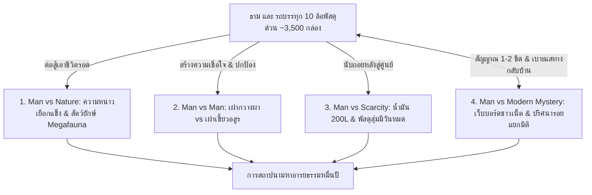

# โครงเรื่องแม่บทและ Story Outline — 10000-BC (พลิกยุคหินด้วยรถพัสดุหมื่นชิ้น)

> 📖 **คำชี้แจง:** เอกสารฉบับนี้รวบรวม **โครงสร้างโครงเรื่องหลัก (Master Plot Architecture)** และ **Story Chapters Outline รายบทแบบละเอียด (บทที่ 1 - 30)** โดยผสานแนวทางนวนิยายเอาชีวิตรอดระดับสากล (Gritty Cinematic Survival Thriller) เข้ากับกลไก **"ระบบแกะกล่องสุ่มพัสดุสินค้าออนไลน์ (The Blind Box Unboxing Survival)"**, **"การเชื่อมต่อเว็บบอร์ด/โซเชียลสากลผ่านสัญญาณมือถือลึกลับ (The Mystery Signal & Global Crowdsourced War Room)"**, **"กฎความสนุกสนาน อารมณ์ขัน และความหลากหลายไม่ซ้ำซาก (Entertainment, Humor & Anti-Repetition Architecture)"**, และ **"ภารกิจออกเดินทางตามหารอยแยกมิติเพื่อหาทางกลับยุคปัจจุบัน (The Temporal Rift Expedition Quest)"** เพื่อสร้างวรรณกรรมที่ตื่นเต้น ดิบเถื่อน ชวนติดตาม มีรอยยิ้ม และวางไม่ลง

---

# ภาคที่ 1: โครงสร้างโครงเรื่องแม่บท (Master Plot Architecture)

## 🎯 1. แก่นเรื่องหลักและแนวคิด (Core Premise & Themes)
* **Logline:** เมื่อเด็กหนุ่มวัย 24-25 ปี เพิ่งเรียนจบมหาวิทยาลัยและกำลังอยู่ในช่วงหางาน มารับจ็อบขับรถบรรทุก 10 ล้อขนส่งพัสดุด่วนสินค้าออนไลน์ชั่วคราวระหว่างรองานประจำ แต่กลับประสบอุบัติเหตุตกกระแทกทะลุมิติมายังยุค 10,000 ปีก่อนคริสตกาล เขาต้องใช้ "ปราการเหล็กกล้าตรึงพื้นที่" การสุ่มแกะกล่องพัสดุลึกลับกว่า 3,500 กล่อง และ **สัญญาณมือถือ 2G ติดๆ ดับๆ บนหลังคารถที่เชื่อมต่อเว็บบอร์ดโลกปัจจุบัน** เพื่อระดมสมองชาวเน็ตและผู้เชี่ยวชาญมาช่วยวางแผนเอาชีวิตรอดจากสัตว์ยักษ์ เอาชนะสงครามชนเผ่า **และออกเดินทางตามหารอยแยกมิติที่อาจเปิดออกตามเบาะแสในเว็บบอร์ดเพื่อหาทางกลับบ้าน** สู่การสถาปนาปฐมอารยธรรมมนุษย์
* **สภาพยานพาหนะและการตรึงพื้นที่ (Permanent Immobilization & Roadless Prehistoric Wilderness):** จากแรงตกกระแทกมหาศาลของรถหนัก 25 ตันผ่านรอยแยกมิติ **ช่วงล่างพังยับเยิน แหนบหน้า 2 ตับและแหนบหลังเพลาคู่หักสะบั้น เพลาขับกลางบิดคดงอ ล้อหน้าและล้อหลังฉีกขาด จมลึกในหล่มโคลนแข็ง ทำให้รถไม่สามารถขับเคลื่อนได้โดยสิ้นเชิง** และที่สำคัญที่สุดคือ **ภูมิประเทศยุค 10,000 ปีก่อนคริสตกาลไม่มีถนน ทางเกวียน หรือเส้นทางใดๆ สำหรับรถวิ่งทั้งสิ้น** มีเพียงทุ่งทุนดราขรุขระ หนองน้ำโคลนเพอร์มาฟรอสต์ ก้อนหินโมเรนธารน้ำแข็ง และป่าสนไทกาดึกดำบรรพ์ แม้ตัวรถจะไม่เสียหาย รถบรรทุก 10 ล้อหนัก 25 ตันก็ไม่มีทางแล่นไปไหนได้ในสภาพแวดล้อมเช่นนี้ รถจึงกลายสภาพเป็น **"ปราการเหล็กตรึงพื้นที่ถาวร (Static Fortress / Keep)"** ตั้งแต่วันแรก ธามไม่สามารถขับรถหนีภัยได้ ต้องปักหลักสร้างฐานและตั้งรับ ณ หุบเขาแห่งนี้เท่านั้น แต่ชิ้นส่วนช่วงล่างที่พัง (โดยเฉพาะแหนบสปริงเหล็กกล้าคาร์บอนสูง 5160 หนักกว่า 250 กก.) จะกลายเป็น "เหมืองแร่เหล็กกล้า" ที่ล้ำค่าที่สุดในการตีอาวุธและเครื่องมือในยุคหิน
* **ระบบเอาชีวิตรอดสุ่มพัสดุ (Blind Box Unboxing Survival):** ท้ายรถคือตู้คอนเทนเนอร์เหล็กยาว 9.5 เมตร อัดแน่นด้วยพัสดุออนไลน์กว่า 3,500 กล่อง ธามไม่รู้ของข้างในล่วงหน้า ต้องคาดเดาจากขนาดกล่อง น้ำหนัก รหัสติดตาม และใบปะหน้าพัสดุ (Waybill) การแก้ปัญหาในแต่ละบทจึงเต็มไปด้วยความลุ้นระทึก สนุกสนาน และการดัดแปลงอุปกรณ์สมัยใหม่อย่างชาญฉลาด (MacGyver Adaptations)
* **ภารกิจออกเดินทางตามหารอยแยกมิติ (The Temporal Rift Quest):** หลังสร้างค่ายและใช้ชีวิตอยู่ระยะหนึ่ง ชาวเน็ตสายฟิสิกส์ดาราศาสตร์ตรวจพบคลื่นแม่เหล็กไฟฟ้าผิดปกติและโพสต์แจ้งพิกัดว่า รอยแยกมิติอาจเปิดออกชั่วคราว ณ ยอดเขาเสาหินทมิฬ (The Obsidian Monolith Ridge) ธามต้องจัดกองคาราวานสำรวจก้าวออกจากเซฟโซนเพื่อตามหาหนทางกลับโลกเดิม นำไปสู่การเผชิญหน้าดินแดนต้องห้ามและกองทัพคนเถื่อน
* **ปมทางเลือกแห่งชีวิตและสายสัมพันธ์ข้ามหมื่นปี (The Emotional Bond & The Ultimate Choice):** แม้การตามหารอยแยกมิติจะมีเป้าหมายเพื่อหาทางกลับโลกปัจจุบัน แต่เมื่อเวลาผ่านไป ธามได้สร้างสายสัมพันธ์อันลึกซึ้งกับผู้คนในยุคนี้—โดยเฉพาะ "เอลยา" หญิงสาวผู้เคียงข้างและมอบความไว้วางใจบริสุทธิ์, "คูราน" สหายนักล่าผู้พร้อมสละชีวิตปกป้องหลังให้เขา, และชาวเผ่ากวางผาที่มองเขาเป็นเสาหลักและครอบครัว ในโลกเดิม ธามเป็นเพียงเด็กหนุ่มจบใหม่วัย 24-25 ปีที่เคว้งคว้างรองานประจำ โดดเดี่ยว ดิ้นรนในห้องเช่าแคบๆ ใต้แรงกดดันของระบบทุนนิยมและคะแนนดาว แต่ที่นี่ เขามีความหมาย มีครอบครัว และมีคนที่รักยิ่งชีวิต เมื่อรอยแยกมิติเปิดออกพร้อมกับศึกแตกหักในคืนสุริยุปราคา ธามจึงต้องเผชิญหน้ากับการตัดสินใจครั้งสำคัญที่สุดในชีวิต: ระหว่างการกลับไปใช้ชีวิตสุขสบายในโลกเดิมที่ว่างเปล่า หรือการหันหลังให้ประตูมิติเพื่อสู้เคียงบ่าเคียงไหล่และลงหลักปักฐานสร้างอารยธรรมใหม่ร่วมกับผู้คนที่เขารัก
* **ธีมหลัก (Central Theme):** *"เทคโนโลยีสมัยใหม่อาจหมดสิ้นไปตามกาลเวลา แต่การเชื่อมโยงทางปัญญา องค์ความรู้ทางวิทยาศาสตร์ และการร่วมมือกันของมนุษยชาติ คือพลังที่ไม่มีวันสูญสลาย"*
* **ฉากทัศน์สากลและภูมิศาสตร์ยุคดึกดำบรรพ์ (Neutral Setting & Ancient Untracked Topography):** จุดเกิดเหตุในโลกปัจจุบันเกิดขึ้น ณ ดินแดนแห่งใดแห่งหนึ่งในโลก (ไม่เจาะจงประเทศ) และเมื่อย้อนเวลามายัง 10,000 ปีก่อนคริสตกาล ธารน้ำแข็ง แผ่นเปลือกโลก และสภาพภูมิประเทศยุคก่อนประวัติศาสตร์ก็แตกต่างจนไม่อาจเทียบเคียงกับแผนที่หรือพรมแดนประเทศในปัจจุบันได้เลย เนื้อเรื่องดำเนินเรื่องด้วยโทนสากล ไม่เน้นความเป็นไทย เส้นทางขนส่งก่อนเกิดเหตุคือทางหลวงช่องเขาเขตหนาวตอนเหนือ (Highland Mountain Pass Highway) ของเครือข่ายโลจิสติกส์ข้ามชาติ และการสื่อสารทำผ่านเว็บบอร์ดสากล การตั้งชื่อสถานที่ทั้งในโลกปัจจุบันและยุคหินสามารถใช้ได้ทั้งชื่อไทย สากลภาษาอังกฤษ ทับศัพท์ หรือชื่อพรรณนาเชิงภูมิศาสตร์ (เช่น ช่องเขานอร์ธพาสส์ / North Pass, หุบเขากวางผา / Cliff Deer Valley, สันเขาเสาหินทมิฬ / Obsidian Monolith Ridge) อย่างอิสระโดยไม่ต้องเน้นความเป็นไทย
* **โทนเรื่อง (Tone):** สมจริง ดิบเถื่อน ตึงเครียด ลุ้นระทึกของปลายยุคน้ำแข็ง (International Survival Thriller) ผสมผสานอารมณ์ขันและเสน่ห์ของการปะทะทางวัฒนธรรมระหว่าง "ชาวเน็ตโลกปัจจุบัน" กับ "การเอาชีวิตรอดในยุคหิน"

---

## ⚡ 2. ปมขัดแย้ง 4 มิติ (Four-Tier Conflict)

1. **มนุษย์ vs ธรรมชาติ (Man vs Nature):** สภาพอากาศหนาวจัดทุ่งทุนดราปลายยุคน้ำแข็ง (-15°C ถึง -25°C), สัตว์ยักษ์ Megafauna (หมีถ้ำยักษ์ Cave Bear, เสือเขี้ยวดาบ Smilodon, หมาป่าไดร์วูล์ฟ Dire Wolf)
2. **มนุษย์ vs มนุษย์ (Man vs Man):** ความหวาดระแวงแรกเริ่มกับเผ่ากวางผา (Cliff Deer Tribe) vs มหาสงครามล้างเผ่าพันธุ์จากกองทัพเผ่ากินคนเขี้ยวอสูร (Beast Fang Tribe)
3. **มนุษย์ vs ทรัพยากรจำกัด (Man vs Finite Technology):** น้ำมันดีเซล 200 ลิตร (ถัง 250L), ระบบไฟแบตเตอรี่ 24V, และพัสดุ 3,500 กล่องที่แกะแล้วหมดไป ต้องถ่ายทอดองค์ความรู้และสร้างเทคโนโลยีทดแทนก่อนทุกอย่างจะหมดสิ้น
4. **มนุษย์ vs ปริศนาเชื่อมโลกและปมทางเลือกชีวิต (Man vs The Rift Quest & Internal Dilemma):** การเดินทางตามหารอยแยกมิติตามคำชี้แนะของชาวเน็ต นำไปสู่การเผชิญหน้ากับความจริงในหัวใจ ระหว่าง "การหนีกลับสู่โลกปัจจุบันที่สะดวกสบายแต่โดดเดี่ยว" หรือ "การปักหลักปกป้องเอลยาและชนเผ่าผู้เป็นครอบครัวแท้จริงเพื่อสร้างอนาคตใหม่ร่วมกัน"

---

## 📡 3. กลไกสัญญาณมือถือลึกลับและวอร์รูมระดมสมอง (The Mystery Signal Mechanics)

* **ข้อจำกัดทางกายภาพ (Physics & Constraints):**
  * สัญญาณเด้งขึ้นมา 1-2 ขีด เฉพาะเวลาที่ธาม **ปีนขึ้นไปยืนบนหลังคาตู้ทึบของรถช่วงหัวค่ำ หรือช่วงที่มีม่านหมอกหนาจัด** เท่านั้น
  * ความเร็วเทียบเท่า 2G: **ส่งได้เฉพาะข้อความและรูปถ่ายบีบอัดความละเอียดต่ำ (Low-Res)** ไม่สามารถโทรศัพท์ วิดีโอคอล หรือเปิดสตรีมมิงได้
* **วินัยการบริหารพลังงาน (Solar Power Discipline):**
  * โทรศัพท์ชาร์จด้วยพาวเวอร์แบงก์โซลาร์เซลล์ 20,000 mAh ที่แกะได้จากพัสดุ มีโควตาพลังงานจำกัด เปิดใช้งานเฉพาะโหมด Ultra Power Saving วันละ 1-2 ครั้ง ครั้งละไม่เกิน 15-20 นาที
* **วิวัฒนาการ 4 ระยะของกระทู้ (The 4-Phase Evolution):**
  * **ระยะที่ 1: Troll & ARG Era (บทที่ 2 - 6):** ชาวเน็ตคิดว่าเป็นการจัดฉาก โปรโมตเกม หรือแต่งเรื่องแนว ARG แนะนำกวนๆ เช่น "กดแตรลมเป็นจังหวะเพลงแดนซ์กวนๆ ไล่คนป่า" หรือ "ปาของกินใส่หน้ามัน" แต่คำแนะนำเรื่องบีบแตรและสาดไฟสูงดันใช้ได้ผลจริง!
  * **ระยะที่ 2: Specialist Awakening (บทที่ 7 - 16):** ภาพถ่ายกิ่งไม้โบราณ พืชสูญพันธุ์ (*Dryas octopetala*) รอยเขี้ยวหมาป่าดึกดำบรรพ์ และกะโหลกมนุษย์ยุคหิน ดึงดูดผู้เชี่ยวชาญเฉพาะทาง (`@BioArch_Oxford`, `@CombatMedic_US`, `@VikingBushcraft`) เข้ามาแนะนำวิธีผ่าตัดเย็บแผล สัดส่วนคันธนูหมุนไฟ และสูตรเตาหลอมโลหะ
  * **ระยะที่ 3: The Global War Room & Rift Hunt (บทที่ 17 - 26):** กระทู้ตรวจพบคลื่นแม่เหล็กมิติผันผวน แจ้งพิกัดรอยแยกมิติที่อาจเปิดออก ส่งผลให้ธามออกเดินทางสำรวจ พร้อมช่วยกันสเก็ตช์แผนที่ค่ายกล คำนวณปรากฏการณ์ดาราศาสตร์ (สุริยุปราคาเต็มดวง)
  * **ระยะที่ 4: The Final Transmission (บทที่ 27 - 30):** การส่งสัญญาณครั้งสุดท้ายก่อนรอยแยกมิติจะปิดสนิท ทิ้งมรดกอารยธรรมไว้ในอดีตและตำนานที่ไม่มีวันไขกระจ่างในโลกปัจจุบัน

---

## 📦 4. ระบบการสุ่มแกะพัสดุ (The Blind Box Unboxing Survival Rules)

* **ความหลากหลายของสินค้า 8 หมวดหมู่ (~3,500 ชิ้น):**
  1. เสื้อผ้าและเครื่องนุ่งห่มกันหนาว (30%)
  2. อาหารแห้ง ขนม ข้าวสาร & เครื่องปรุงรส (20%)
  3. เครื่องมือช่าง ฮาร์ดแวร์ & งาน DIY (15%)
  4. อุปกรณ์เดินป่า แค้มปิ้ง & เอาชีวิตรอด (12%)
  5. เวชภัณฑ์ ยา ปฐมพยาบาล & สุขอนามัย (10%)
  6. เกษตรกรรม เมล็ดพันธุ์พืช & การเพาะปลูก (5%)
  7. อุปกรณ์อิเล็กทรอนิกส์ & แก็ดเจ็ต (5%)
  8. สินค้าเบ็ดเตล็ดสุดแปลกที่ต้องดัดแปลง (MacGyver Comedy 3%)
* **กฎการสุ่ม:** ธามไม่รู้ของข้างใน ต้องอ่าน Waybill คลำน้ำหนัก ฟังเสียง และตัดสินใจแกะกล่องตามสถานการณ์วิกฤต กล่องที่เปิดอาจได้ของตรงเป้า (Jackpot) หรือได้ของประหลาดที่ต้องใช้สมองประยุกต์ใช้งาน
* **การบันทึกท้ายบท:** ทุกบทที่มีการเปิดกล่อง จะต้องลงตารางสรุป Tracking ID, รายละเอียดของที่ได้, และการนำไปใช้งานจริงอย่างเคร่งครัด

---

## 🎭 5. กฎความสนุกสนาน มุกตลก และความหลากหลายไม่ซ้ำซาก (Entertainment, Humor & Dynamic Variety)

* **อารมณ์ขัน 4 เลเยอร์ (The 4 Layers of Comedy):**
  1. *Deadpan & Dark Humor:* ธามสบถประชดโชคชะตาตัวเองในใจอย่างสุขุม เช่น การกลัวโดนหักดาวในแอปขนส่งเพราะส่งพัสดุเลทไปหนึ่งหมื่นปี หรือรอดจากหมีถ้ำแต่เกือบตายเพราะลืมรูดซิปเสื้อโค้ต
  2. *Culture Clash Humor:* คนยุคหินเข้าใจผิดเรื่องของใช้สมัยใหม่อย่างไร้เดียงสา เช่น คิดว่าแตรลมคือเสียงบรรพบุรุษ, ฟองสบู่คือเสมหะภูตหิมะ, บับเบิ้ลกันกระแทกคือไข่สัตว์ศักดิ์สิทธิ์ที่กดแล้วแตกเปรี๊ยะชวนหัวเราะ
  3. *The Gacha & MacGyver Comedy:* ช่วงหน้าสิ่วหน้าขวาน ดันแกะกล่องได้สินค้าประหลาด (รองเท้าส้นสูง, วิกผมคอสเพลย์, เครื่องนวดคอ) แล้วต้องแถดัดแปลงเป็นอาวุธและกับดักได้อย่างอัจฉริยะ
  4. *Internet Troll Banter:* ความกวนของชาวเน็ต (`@TrollMaster_99`) ที่เปิดประเด็นฮาๆ แต่ดันให้ไอเดียหลุดโลกที่ใช้งานได้จริง
* **ระบบ 6 รูปแบบบทหมุนเวียน (The 6 Rotating Episode Archetypes):**
  - **Type A:** Primal Combat & Thriller (แอ็กชันเอาชีวิตรอด / ล่าสัตว์ยักษ์ / ปะทะศัตรู)
  - **Type B:** Engineering & Crafting (วิศวกรรม / ถอดชิ้นส่วนรถ 10 ล้อ / ตีเหล็ก 5160 / ค่ายกล)
  - **Type C:** Culture Shock, Feasting & Wholesome (กระชับมิตร / มุกตลก / งานเลี้ยงเนื้อย่าง / รอยยิ้ม)
  - **Type D:** Mystery, Exploration & Expeditions (การเดินทางสำรวจ / ตามหารอยแยกมิติ / พืชสูญพันธุ์)
  - **Type E:** Modern World & The War Room (สืบสวนโลกปัจจุบัน / วอร์รูมชาวเน็ต / คำนวณดาราศาสตร์)
  - **Type F:** Medical Miracle & Crisis (วิกฤตพยาบาลฉุกเฉิน / พายุหิมะถล่ม / โรคระบาด)

---

## 🏛️ 6. โครงสร้าง 4 องก์ (The 4-Act Arc)

* **Act 1: The Arrival & First Contact (บทที่ 1 - 10):** ตกกระแทกข้ามมิติ, หมีถ้ำบุกคืนแรก, ยืนยันช่วงล่างพังถาวร, สัญญาณ 1 ขีดบนหลังคารถ, กระทู้แรกถือกำเนิด, แกะเสื้อขนเป็ด-มีดเดินป่า-พาวเวอร์แบงก์, แตรลมคู่ 130dB สยบชนเผ่า, ปาฏิหาริย์เกลือบริสุทธิ์, การผ่าตัดรักษาพรานสาวตามคำสั่งแพทย์สนามออนไลน์
* **Act 2: Fortification & The Rift Expedition (บทที่ 11 - 20):** สถาปนารถ 10 ล้อเป็น Keep ถาวร, สร้างค่ายกลหิน, ตีหอกแหนบ 5160, โพสต์เบาะแสช่องมิติเปิดจากชาวเน็ต, จัดกองคาราวานสำรวจฝ่าพายุหิมะตามหารอยแยกมิติบนยอดเขาเสาหินทมิฬ, ค้นพบเงื่อนไขสุริยุปราคาและกองทัพเขี้ยวอสูร, การควบตะบึงกลับค่ายเพื่อเตรียมรับศึกใหญ่
* **Act 3: Megafauna & The Great Siege (บทที่ 21 - 26):** หมีถ้ำยักษ์หวนกลับมา, สปอร์ตไลต์คู่หน้า + ธนูทดกำลัง Compound Bow + หอกแหนบเหล็กกล้าปลิดชีพ, กองทัพเขี้ยวอสูร 100 นายบุกค่าย, ระเบิดเพลิงดีเซล Molotov, เสียงแตรลมสยบขวัญ, คำทำนายสุริยุปราคาจากนักดาราศาสตร์มิวนิก, ยิงพลุสัญญาณฉุกเฉินสังหารหัวหน้าเผ่ากราก
* **Act 4: Dawn of the New Age & The Eternal Monument (บทที่ 27 - 30):** ข่าวโลกปัจจุบันยืนยันจุดเกิดเหตุ, พัสดุเริ่มหมดลง, แกะเมล็ดพันธุ์ข้าวสาลี-บาร์เลย์เริ่มการปฏิวัติเกษตรกรรม, สร้างเตาหลอมโลหะแห่งแรกจากเพลาขับและกระทะล้อรถ 10 ล้อ, สัญญาณมือถือดับมอดลงถาวร, สถาปนามหานครแห่งแรกของมนุษยชาติ

---

## 🗺️ 7. โครงสร้างภูมิศาสตร์และระบบการตั้งชื่อสถานที่ (The Prehistoric Toponymy & Cartography Outline)

### 📌 หลักการพื้นฐาน: แผ่นดินไร้นามกับระบบชื่อ 2 มิติ (The Dual Toponymy Philosophy)
ในยุค 10,000 ปีก่อนคริสตกาล แผ่นเปลือกโลกและธารน้ำแข็งยังคงปกคลุม **ไม่มีแผนที่ ไม่มีเส้นแบ่งพรมแดนประเทศ และไม่มีชื่อสากลที่จดบันทึกไว้ในประวัติศาสตร์ใดๆ ทั้งสิ้น** ภูมิประเทศทุกแห่งเดิมทีเป็น "พื้นที่ไร้นาม (Unnamed Wilderness)" 
การเกิดขึ้นของชื่อสถานที่ในเรื่องจึงถูกขับเคลื่อนผ่าน **2 แหล่งกำเนิดคู่ขนาน (Dual Naming System)**:
1. **ชื่อดั้งเดิมที่คนท้องถิ่นตั้งไว้ (Indigenous Tribal Toponyms):**
   - ชนเผ่าพื้นเมือง (เผ่ากวางผา, เผ่าเขี้ยวอสูร) ตั้งชื่อสถานที่ตามสิ่งที่ประสาทสัมผัสรับรู้: รูปลักษณ์ธรรมชาติ, เสียง, ภัยอันตราย, สัตว์ประจำถิ่น, บรรพชน, หรือความเชื่อทางจิตวิญญาณ
   - ส่งต่อกันผ่านมุขปาฐะ (Oral Tradition) ถ้อยคำในบทสวด และนิทานรอบกองไฟ
2. **ชื่อที่ตัวเอก (ธาม) บัญญัติขึ้นเอง (Protagonist Tactical / Modern Functional Toponyms):**
   - ธามมาจากโลกปัจจุบันที่คุ้นเคยกับการใช้พิกัด แผนที่ทางยุทธวิธี และการระดมสมองกับชาวเน็ตในเว็บบอร์ด
   - เขาใช้กระดาษลูกฟูกจากกล่องพัสดุและปากกามาร์กเกอร์ (รวมถึงถ่านไม้บนหนังสัตว์) วาด **"แผนที่แผ่นแรกของประวัติศาสตร์มนุษยชาติ (The First Cartography)"**
   - ตั้งชื่อตามฟังก์ชันการเอาชีวิตรอด, ประโยชน์ใช้สอย, สภาพโครงสร้างทางวิศวกรรม, หรือรหัสทางยุทธวิธี
3. **การหลอมรวมและการแลกเปลี่ยนทางภาษา (Bilingual Hybrid Toponymy):**
   - ในแผนที่และสมุดบันทึกของธาม เขาจะบันทึกทั้งสองชื่อคู่กันเสมอ เช่น `[ป้อมอัลฟ่า / หุบผาสัตว์เหล็กหลับใหล]`
   - ตัวละครทั้งสองฝ่ายค่อยๆ ซึมซับชื่อของกันและกัน: ธามเรียกชื่อสถานที่ตามที่เอลยาบอกเพื่อเคารพเจ้าของถิ่น ขณะที่ชาวเผ่าก็เริ่มเรียกสิ่งก่อสร้างสมัยใหม่ตามที่ธามบัญญัติ

---

### 📍 สารบัญภูมิศาสตร์และบัญชีรายชื่อสถานที่สำคัญ (Master Prehistoric Location Directory)

| ลำดับ | ชื่อที่ธาม/ชาวเน็ตตั้ง (Protagonist / Tactical Name) | ชื่อดั้งเดิมที่ชนเผ่าเรียก (Indigenous Tribal Name) | ลักษณะภูมิประเทศและจุดเด่นทางกายภาพ (Terrain & Physical Traits) | บทบาทในเนื้อเรื่องและยุทธศาสตร์ (Narrative & Strategic Role) | ปรากฏครั้งแรก |
| :---: | :--- | :--- | :--- | :--- | :---: |
| 1 | **ป้อมอัลฟ่า / แคมป์สิบล้อ** *(Fortress Alpha / Base Keep)* | **หุบเขาสัตว์เหล็กหลับใหล** *(Plain of the Sleeping Beast)* | แอ่งกระทะธรรมชาติ ดินโคลนเพอร์มาฟรอสต์แข็งตัว ขนาบด้วยสันหินโมเรน | ฐานที่มั่นหลัก, จุดที่รถ 10 ล้อ 25 ตันปักหลักถาวร, คลังเก็บพัสดุ 3,500 กล่อง | บทที่ 1 |
| 2 | **เนินสองขีด / ผาสัญญาณ** *(Two-Bar Ridge / Ping Rock)* | **แท่นสดับเสียงวิญญาณฟ้า** *(Altar of the Sky Whispers)* | ชะง่อนหินแกรนิตสูงชัน 8 เมตร ด้านหลังรถบรรทุก ลมพัดแรงตลอดเวลา | จุดเดียวที่โทรศัพท์มือถือจับสัญญาณ 2G ได้ 1-2 ขีดช่วงหัวค่ำเพื่อโพสต์กระทู้ | บทที่ 2 |
| 3 | **หุบเขาพันธมิตร** *(Alliance Valley / Sector 1)* | **หุบผากวางผา** *(Cliff Deer Gorge / El-Karan)* | หุบเขาหินปูน มีเพิงผาและโพรงถ้ำธรรมชาติ ปลอดภัยจากลมพายุหิมะ | ถิ่นฐานและหมู่บ้านถ้ำของเผ่ากวางผา (เผ่าของเอลยาและคูราน) ห่างจากรถ 2 กม. | บทที่ 3 |
| 4 | **แนวกันชนป่าสนเหนือ** *(North Taiga Buffer)* | **ป่าเงาหนาว / ป่าเขี้ยวดาบ** *(Shadow-Cold Forest / Smilodon Taiga)* | ป่าสนไทกาโบราณทึบ ต้นสนไพน์ยักษ์สูง 20 เมตร หิมะปกคลุมหนาทึบ | แหล่งตัดไม้ทำเชื้อเพลิง, ถิ่นหากินของฝูงหมาป่าไดร์วูล์ฟและเสือเขี้ยวดาบ | บทที่ 4 |
| 5 | **ลำธารเกล็ดน้ำแข็ง** *(Ice-Melt Stream / Filter Creek)* | **ธารน้ำหินขาว** *(White Stone Brook / Mel-Runa)* | ลำธารน้ำละลายจากธารน้ำแข็ง ใสบริสุทธิ์ ไหลผ่านแก่งหินกรวดมน | แหล่งน้ำจืดบริสุทธิ์ประจำค่าย, จุดติดตั้งระบบกรองน้ำด้วยสารส้มและถ่านกัมมันต์ | บทที่ 5 |
| 6 | **ช่องแคบเทอร์โมพิลี** *(Thermopylae Chokepoint)* | **ช่องเขากลืนวิญญาณ** *(Gullet of the Dead)* | ซอกผาหินโมเรนแคบกว้างเพียง 4-5 เมตร ขนาบด้วยหน้าผาสูงชันสองด้าน | ชัยภูมิคอขวดทางยุทธวิธี จุดวางกับดักขวดเพลิง Molotov และลวดสลิงต้านศึก | บทที่ 8 |
| 7 | **ริฟต์พีค / พิกัดโอเมก้า** *(Rift Peak / Sector Omega)* | **ยอดผาเสาหินทมิฬ** *(The Obsidian Monolith Ridge)* | ยอดเขาหินแก้วออบซิเดียนสีดำมะเมื่อม สูง 1,800 ม. เกิดประจุไฟฟ้าสถิต | พิกัดที่ชาวเน็ตตรวจพบรอยแยกมิติ, จุดนัดพบสุริยุปราคา และสนามรบตัดสินใจชีวิต | บทที่ 18 |
| 8 | **แดนข้าศึกเขตใต้** *(South Sector / Raider's Crag)* | **ผาหัวกะโหลกทมิฬ** *(Crag of the Blood Fangs)* | เทือกเขาหินแหลมคม แห้งแล้ง เต็มไปด้วยซากกะโหลกสัตว์ยักษ์ที่ถูกล่า | ฐานที่มั่นใหญ่ของชนเผ่ากินคนเขี้ยวอสูรและหัวหน้าเผ่ากราก | บทที่ 19 |
| 9 | **ลานเตาหลอมและแปลงเกษตร 1** *(Foundry Flats & Agri-Plot 1)* | **ทุ่งดินอุ่น** *(Warm-Earth Meadow / Talan-Mor)* | ลานดินตะกอนปากหุบเขาที่ได้รับแดดอุ่น ดินร่วนปนทรายไม่เป็นน้ำแข็ง | จุดสร้างเตาหลอมโลหะจากแหนบ 5160 และแปลงเพาะปลูกข้าวสาลี-บาร์เลย์แห่งแรก | บทที่ 28 |

---

# ภาคที่ 2: Story Chapters Outline (รายละเอียดรายบท 1 - 30)

---

### องค์ที่ 1: การมาถึงและการเผชิญหน้าครั้งแรก (Act 1: The Arrival & First Contact)

#### บทที่ 1: พายุหมอกทมิฬและปราการเหล็กนิรนาม (The Black Fog and the Iron Bastion)
* **Archetype:** Type A (Primal Combat & Thriller)
* **Scene Goal:** เปิดตัวธาม บัณฑิตจบใหม่วัย 24-25 ปีที่มารับจ็อบขับรถ 10 ล้อชั่วคราวระหว่างรอผลสัมภาษณ์งานประจำ, อุบัติเหตุข้ามมิติบนช่องเขาตอนเหนือ, การสำรวจปราการ 10 ล้อตู้ทึบที่อัดแน่นด้วยพัสดุ 3,500 กล่อง และการเผชิญหน้าหมีถ้ำคืนแรก
* **Conflict:** รถบรรทุก 10 ล้อหนัก 25 ตันตกกระแทกอย่างรุนแรงผ่านรอยแยกมิติ **ช่วงล่างพังยับเยิน แหนบหน้า 2 ตับและแหนบหลังเพลาคู่หักสะบั้น เพลาขับคดงอ ล้อหน้าบิดเบี้ยวจนขับเคลื่อนไม่ได้โดยสิ้นเชิง** รถติดหล่มเลนแข็ง อุณหภูมิต่ำกว่าจุดเยือกแข็ง โทรศัพท์ขึ้น No Service หมีถ้ำยักษ์หนัก 1 ตันเข้าขูดกรีดตู้เหล็ก
* **Resolution:** ตู้เหล็กกล้าคอนเทนเนอร์รับแรงกระแทกได้ ธามตระหนักว่าตนเองหลุดมาอยู่ในยุคดึกดำบรรพ์ในสภาพที่ "รถพังถาวร ไร้ทางหนี" ท่ามกลางภูเขากล่องพัสดุที่ยังไม่ได้เปิด
* **Cargo Log:** น้ำมันดีเซล 0.5L (ทดสอบสตาร์ท เหลือ 199.5L), ถ่านไฟฉาย 10 นาที
* **Cliffhanger (Stakes):** เสียงคำรามของหมีถ้ำจางไป ทิ้งรอยกรงเล็บลึก 3 รอยบนแผ่นเหล็ก ธามกำชะแลงเหล็กกู้ภัยรอคอยรุ่งสางในความมืด

#### บทที่ 2: รุ่งอรุณสีเลือดและสัญญาณหนึ่งขีด (Blood Dawn and the One-Bar Anomaly)
* **Archetype:** Type D & E (Mystery, Exploration & First Forum Anomaly)
* **Scene Goal:** มุดสำรวจความเสียหายช่วงล่าง ยืนยันว่ารถขับไม่ได้ถาวร สุ่มแกะพัสดุ 3 กล่องแรก และการค้นพบสัญญาณปริศนาบนหลังคารถ
* **Humor & Beats:** มุก Deadpan ธามบ่นเรื่องเป็นเด็กจบใหม่ยังไม่ได้งานประจำแถมต้องมาติดค้างในยุคหิน ส่งของเลทข้ามหมื่นปีจะโดนตัดเกรดคนขับและหักดาวในแอป, ความลุ้นเปิดกล่องกาชาพัสดุ
* **Unboxing Beat:**
  * `#TH-994201` (กล่องยาว 2.4 กก.): แกะได้ **เสื้อโค้ตขนเป็ดแท้ (Goose Down Parka)** สวมใส่ป้องกันลมหนาวเฉียบพลันได้ทันท่วงที
  * `#TH-118492` (กล่องเล็ก 0.8 กก.): แกะได้ **มีดเดินป่าเหล็กคาร์บอนสูง (Bushcraft Knife)** คมกริบพร้อมปลอกพกพา
  * `#TH-773019` (ซองพลาสติก 0.5 กก.): แกะได้ **พาวเวอร์แบงก์โซลาร์เซลล์ 20,000 mAh** ช่วยต่อลมหายใจให้โทรศัพท์มือถือ
* **The Forum Beat:** เมื่อปีนขึ้นไปตรวจบนหลังคาตู้ทึบในม่านหมอกเช้า จู่ๆ โทรศัพท์สั่นเตือน: *สัญญาณเด้งขึ้นมา 1 ขีด!* ธามเปิดเว็บบอร์ดสากลตั้งกระทู้ด้วยมือสั่นเทา: *"ช่วยด้วยครับ รถบรรทุก 10 ล้อขนพัสดุตกเขาหลุดมาที่ไหนไม่รู้ หมอกหนา หนาวจัด ช่วงล่างพังยับ ล้อแตก ขับไม่ได้ มีตัวอะไรไม่รู้เท่าหมีควายแต่ใหญ่กว่าสามเท่าเพิ่งมาตะกุยตู้ทึบ"*
* **Cliffhanger (Forum & Stakes):** คอมเมนต์แรกเด้งขึ้นมา: `@TrollMaster_99: "เปิดตัวเกมเอาชีวิตรอดใหม่เหรอพี่? ภาพตู้เหล็กโคตรเนียน ขอพิกัดเซิร์ฟเวอร์หน่อย!"` พร้อมกับเงาร่างมนุษย์หนังสัตว์ 3 ร่างโผล่บนสันเขา!

#### บทที่ 3: เงาร่างแห่งขุนเขาและเสียงแตรสะท้านไพร (Shadows and the Thunder Horn)
* **Archetype:** Type A & C (First Contact & Primal Misunderstanding)
* **Scene Goal:** การเผชิญหน้ากลุ่มนักล่าเผ่ากวางผา (คูราน และ เอลยา)
* **Humor & Beats:** ชาวเน็ตแนะกวนๆ ให้กดแตรลมเป็นจังหวะรัวกระหน่ำ ธามตัดสินใจกดแตรลม 10 ล้อ คนป่าตกใจจนเข่าทรุดคิดว่าเป็นเสียงฟ้าร้องของเทพเจ้า
* **Resolution:** ธามบิดสวิตช์กด **แตรลมคู่ 10 ล้อ (>130 dB)** ดังกึกก้องสะท้านหุบเขา พร้อมสาดไฟหน้าฮาโลเจนคู่ สยบประสาทจนคนป่าทรุดตัวลงกราบด้วยความยำเกรง
* **Unboxing Beat:** แกะ `#TH-401923` ได้ **นกหวีดเดินป่าโลหะเสียงแหลมสูง** ใช้คล้องคอเป็นอุปกรณ์ส่งสัญญาณฉุกเฉิน
* **Cargo Log:** ไฟแบตเตอรี่ 24V (กดแตร 3 วินาที + สาดไฟ 10 วินาที)
* **Cliffhanger (Mystery):** เอลยายังคงเกร็งธนูไม้ดัดเล็งมาที่ห้องโดยสาร ธามถ่ายรูปม่านหมอกและชนเผ่าติดมาในภาพ 1 ใบก่อนสัญญาณจะตัดไป

#### บทที่ 4: เปลวไฟในเสี้ยววินาทีและรสชาติของพระเจ้า (The Instant Flame and the White Gold)
* **Archetype:** Type C (Culture Shock, Food & Instant Flame)
* **Scene Goal:** เจรจาด้วยภาษากาย มอบเปลวไฟจากไฟแช็กและเกลือบริสุทธิ์
* **Humor & Wholesome:** หมอผีโมกากลัวไฟแช็กจนแทบหงายหลัง พอแตะเกลือบริสุทธิ์กับเนื้อเค็ม คูรานซาบซึ้งจนน้ำตาซึม ยกย่องเป็น "รสชาติของพระเจ้า"
* **Unboxing Beat:**
  * `#TH-552104` (กล่องเล็ก): แกะได้ **ไฟแช็กแก๊สกันลมพรีเมียม 2 ชิ้น**
  * `#TH-881205` (กล่องอาหาร): แกะได้ **เกลือสมุทรบริสุทธิ์ 1 กก.** และ **เนื้อแดดเดียวอบแห้ง (Beef Jerky) 3 ซอง**
* **Resolution:** เปลวไฟในเสี้ยววินาทีและเกลือบริสุทธิ์สร้างไมตรีจิต มิตรภาพเริ่มต้นขึ้น
* **Cliffhanger (Stakes):** เอลยาล้มพับลงกับพื้น เลือดสีคล้ำไหลซึมจากต้นขา—แผลเขี้ยวหมาป่าติดเชื้อรุนแรงจนเนื้อเริ่มเน่า!

#### บทที่ 5: แพทย์สนามข้ามมิติและการรักษาปาฏิหาริย์ (The Trauma Medic of Two Worlds)
* **Archetype:** Type F (Medical Miracle & Crowdsourced Trauma Surgery)
* **Scene Goal:** รักษาแผลติดเชื้อของเอลยาด้วยคำแนะนำของผู้เชี่ยวชาญออนไลน์
* **Unboxing Beat:** แกะ `#TH-339102`: ได้ **ชุดกล่องปฐมพยาบาลฉุกเฉิน, ยา Amoxicillin 500mg, ยาพาราเซตามอล, เบตาดีน, ใบมีดผ่าตัดสเตอร์ไรล์ และผ้าก๊อซ**
* **The Forum Beat:** `@CombatMedic_US` สั่งการฉุกเฉิน: *"อย่าเพิ่งเย็บปิดสนิท! ต้องกรีดระบายหนอง ล้างเบตาดีนเจือจาง ให้ Amoxicillin ทันที 1,000mg แล้วตามด้วย 500mg ทุก 8 ชม.!"*
* **Resolution:** ธามปฏิบัติตามอย่างเคร่งครัด กรีดระบายหนอง ล้างแผล พยาบาลเอลยาในตู้ทึบจนไข้ลดลง
* **Cliffhanger (Forum Bomb):** เอลยาฟื้นขึ้นมา สบตาด้วยความศรัทธา ในกระทู้ `@BioArch_Oxford` เริ่มทัก: *"เดี๋ยวนะ... สร้อยกระดูกสัตว์ที่คอผู้หญิงในรูป... นั่นมันฟันของ Canis dirus (ไดร์วูล์ฟ) ชัดๆ!"*

#### บทที่ 6: คมมีดเหล็กกล้าและพันธสัญญาแรก (The Carbon Steel Pact)
* **Archetype:** Type B & C (Engineering, Cutters & Clan Migration Pact)
* **Scene Goal:** สาธิตการใช้มีดเหล็กกล้า และทำข้อตกลงอพยพเผ่ามาตั้งหลักรอบรถ
* **Humor & Beats:** คนป่ามองมีดคัตเตอร์ SK5 ด้ามเหล็กเป็น "กรงเล็บอสูรพับได้" ธามกรีดแล่หนังสัตว์โชว์อย่างชิลล์ๆ
* **Unboxing Beat:** แกะ `#TH-662301`: ได้ **มีดคัตเตอร์งานช่าง SK5 พร้อมใบมีด 20 ใบ, เคเบิลไทร์ขนาดใหญ่ 100 เส้น, เทปผ้า Duct Tape 2 ม้วน**
* **Resolution:** คูรานตกลงนำคนในเผ่า 30 ชีวิตอพยพมาตั้งแคมป์ล้อมรอบรถ 10 ล้อเพื่อพึ่งพาปราการเหล็ก
* **Cliffhanger (Stakes):** ขบวนผู้อพยพเดินทางมาถึง แต่บนยอดเขามีสายตาดุร้ายของสอดแนมจากเผ่าเขี้ยวอสูรจับจ้องอยู่

#### บทที่ 7: หม้อไททาเนียมและภาพถ่ายสะเทือนวงการ (The Titanium Pot and Extinct Flora)
* **Archetype:** Type C & E (Titanium Pot Feast, Extinct Flora Viral Post)
* **Scene Goal:** งานเลี้ยงสตูว์เนื้อในหม้อแคมปิ้ง และการจุดประเด็นทางวิทยาศาสตร์ในโลกปัจจุบัน
* **Humor & Wholesome:** เด็กหญิงทาร่าตาโตเมื่อได้ชิมซุปต้มสุกอุ่นๆ มิตรภาพรอบกองไฟ
* **Unboxing Beat:** แกะ `#TH-710492`: ได้ **ชุดหม้อสนามไททาเนียมเดินป่า, ช็อกโกแลตบาร์พลังงานสูง 5 แท่ง, ซุปก้อนเข้มข้น 1 กล่อง**
* **The Forum Beat:** ภาพถ่ายหม้อต้มเนื้อติดพืชใบหยักสีเทา: `@BioArch_Oxford` โพสต์เตือนสติชาวเน็ต: *"พืชข้างหลังคือ Dryas octopetala สายพันธุ์ดึกดำบรรพ์ที่สูญพันธุ์แถบนี้ไปเกือบหมื่นปีแล้ว เจ้าของกระทู้อยู่ที่ไหนกันแน่?!"*
* **Cliffhanger (Stakes):** เสียงหอนโหยหวนของฝูงหมาป่าไดร์วูล์ฟดังประสานขึ้นรอบค่ายในคืนเดือนมืด

#### บทที่ 8: กฎเหล็กแห่งการสงวนเสบียง (The Law of the Rations)
* **Archetype:** Type B & C (Camp Sanitation, Bubble Wrap & Ration Laws)
* **Scene Goal:** วางระบบควบคุมทรัพยากร สุขอนามัย และการแบ่งงาน
* **Humor & Beats:** คนป่าได้ลองใช้ทิชชูเปียกกลิ่นแอปเปิ้ลเขียว ดมกันทั้งค่ายคิดว่าเป็นใบไม้วิเศษ
* **Unboxing Beat:** แกะ `#TH-192844`: ได้ **ทิชชูเปียกสูตรฆ่าเชื้อแบคทีเรีย 5 ห่อ, ถุงขยะดำหนาพิเศษ 50 ใบ, ผืนผ้ายางฟลายชีตกันฝน 4x6 เมตร**
* **Resolution:** ธามสอนการขุดหลุมสุขาห่างจากแหล่งน้ำ ขึงผ้ายางรองน้ำฝน และจัดเวรยาม
* **Cliffhanger (Mystery):** อุณหภูมิลดวูบลงอย่างรวดเร็ว ลมกรรโชกแรงส่งสัญญาณพายุหิมะลูกแรก

#### บทที่ 9: คืนล่าของไดร์วูล์ฟและยุทธวิธีสปอร์ตไลต์ (The Spotlight Hunt)
* **Archetype:** Type A (Primal Combat & Thriller)
* **Scene Goal:** ขับไล่ฝูงหมาป่าดึกดำบรรพ์ด้วยระบบไฟรถยนต์และอุปกรณ์แคมปิ้ง
* **Conflict:** หมาป่าไดร์วูล์ฟ 10 ตัวล้อมค่าย หอกหินเอาไม่อยู่
* **Unboxing Beat:** แกะ `#TH-883109`: ได้ **ไฟฉายคาดศีรษะ LED ปรับซูมได้ 2 อัน, เชือกพาราคอร์ด 550 ยาว 50 เมตร**
* **Resolution:** ธามสตาร์ทเครื่อง สาดสปอร์ตไลต์คู่หน้าตาพร่า กดแตรลมคำรามลั่น เอลยายิงธนูสังหารจ่าฝูง ฝูงหมาป่าแตกตื่นเตลิดหนี
* **Cargo Log:** น้ำมันดีเซล 1 ลิตร (คงเหลือ 198.5 ลิตร), ไฟแบตเตอรี่ 24V (5 นาที)
* **Cliffhanger (Discovery Hook):** หมาป่าตัวที่ตายมีปลอกคอหนังสัตว์และหอกกระดูกมนุษย์ปักอยู่—พวกมันถูกฝึกมาโดยเผ่าเขี้ยวอสูร!

#### บทที่ 10: สัญญาณควันทมิฬและคำเตือนข้ามมิติ (The Black Smoke Warning)
* **Archetype:** Type D & E (Black Smoke Warning, Cave Paintings, Forum Alarm)
* **Scene Goal:** รับรู้ภัยสงครามจากเผ่ากินคนเขี้ยวอสูร
* **Conflict:** ควันไฟสีดำพวยพุ่งทางทิศเหนือ ค่ายเผ่าเพื่อนบ้านถูกเผาราบ เอลยาพาธามดูภาพเขียนผนังถ้ำ
* **Unboxing Beat:** แกะ `#TH-441092`: ได้ **สมุดโน้ตกันน้ำ All-Weather, ปากกายุทธวิธี, ไฟฉายเลเซอร์พอยเตอร์สีเขียวแรงสูง**
* **The Forum Beat:** ธามโพสต์ภาพเขียนผนังถ้ำและรอยแผลหอกกระดูก: วอร์รูมชาวเน็ตลั่นเตือน: *"นี่คือชนเผ่ากินคนเร่ร่อนในยุคหินใหม่ตอนต้น พวกมันโหดเหี้ยมมาก นายต้องเตรียมค่ายกลป้องกันเดี๋ยวนี้!"*
* **Cliffhanger (Modern Mystery):** กระทู้เริ่มติดเทรนด์คนอ่านหลักหมื่นคน โลกปัจจุบันเริ่มตามหาพิกัดรถบรรทุกที่หายสาบสูญ!

---

### องค์ที่ 2: การสร้างป้อมปราการและการเดินทางตามหารอยแยกมิติ (Act 2: Fortification & The Rift Expedition)

#### บทที่ 11: ป้อมปราการรถบรรทุกและค่ายกลหิน (The Crowdsourced Bastion)
* **Archetype:** Type B (Chokepoint Bastion, 10-Ton Hydraulic Jack, Cordless Drill)
* **Scene Goal:** สถาปนาตัวถังรถ 10 ล้อเป็น Keep ถาวร และสร้างแนวกำแพงหินซิกแซกตามแบบสเก็ตช์ของวิศวกรออนไลน์
* **Unboxing Beat:** แกะ `#TH-512093`: ได้ **สว่านกระแทกไร้สาย 20V พร้อมดอกเจาะ, เลื่อยพับตัดไม้งานหนัก 2 ปื้น**
* **Resolution:** ธามใช้แม่แรงไฮดรอลิก 10 ตัน ชะแลงเหล็ก และสายสลิงลากรถ ช่วยชนเผ่างัดหินก้อนโตเรียงเป็นแนวกำแพงซิกแซก
* **Cargo Log:** แม่แรงไฮดรอลิก 10 ตัน (ใช้งาน), สายสลิง 10 ม.

#### บทที่ 12: การกำเนิดคันธนูหมุนไฟ (The Bow Drill by VikingBushcraft)
* **Archetype:** Type B & C (Friction Fire Knowledge Transfer, Wholesome Breakthrough)
* **Scene Goal:** ถ่ายทอดวิชาการจุดไฟโบราณก่อนไฟแช็กจะหมด
* **Unboxing Beat:** แกะ `#TH-229104`: ได้ **สายเอ็นตกปลาถัก PE 8 เส้น แรงดึง 100 ปอนด์ (เหนียวทนทานที่สุด)**
* **The Forum Beat:** `@VikingBushcraft` อธิบายสูตรคันธนูหมุนไม้ (Bow Drill) ละเอียดทุกขั้นตอน ใช้สายเอ็นตกปลาทำสายธนู ธามสอนเอลยาจนจุดไฟติดสำเร็จด้วยมือตนเองโดยไม่ต้องพึ่งไฟแช็ก
* **Resolution:** ชนเผ่าได้ไฟที่ยั่งยืน ความมั่นคงทางพลังงานเริ่มต้นขึ้น

#### บทที่ 13: ศาสตร์แห่งการถนอมอาหาร: คลังเนื้อเค็มและโรงรมควัน (The Salt Vault)
* **Archetype:** Type C & B (Food Preservation, Primal Joy & Salt Magic)
* **Scene Goal:** ถนอมเนื้อกวางและไบซอนยักษ์เพื่อรับมือฤดูหนาว
* **Unboxing Beat:** แกะ `#TH-631029`: ได้ **ถุงสูญญากาศใส่อาหาร, เกลือสมุทร 10 กก., ผงพริกไทยดำและเครื่องเทศหมักเนื้อ**
* **The Forum Beat:** เชฟและผู้เชี่ยวชาญถนอมอาหารแนะนำสัดส่วนเกลือ 3% ต่อน้ำหนักเนื้อ และวิธีควบคุมควันไม้สนไม่ให้ขม
* **Resolution:** โรงรมควันแห่งแรกถูกสร้างขึ้นข้างรถบรรทุก เสบียงเนื้อเค็มเพียงพอเลี้ยงคนทั้งค่ายตลอดฤดูหนาว

#### บทที่ 14: อาวุธเคมีพริกหม่าล่าและเกราะยางรถยนต์ (Chemical Defense and Tire Armor)
* **Archetype:** Type B & C (MacGyver Comedy & Primal Innovation)
* **Scene Goal:** ประดิษฐ์อาวุธป้องกันตัวระยะประชิดจากของในตู้พัสดุ
* **Humor & Beats:** ธามสำลักผงพริกหม่าล่าจนน้ำตาไหล คนป่านึกว่าเป็นผงเวทมนตร์ พอลองฉีดใส่ลม คนเถื่อนจามสนั่นทั้งหุบเขา
* **Unboxing Beat:** แกะ `#TH-901238`: ได้ **พริกหม่าล่าและพริกป่นฮาลาปินโญเข้มข้น 5 ถุงใหญ่, กระบอกฉีดน้ำแรงดันมือ 2 กระบอก**
* **Resolution:** นำเศษยางเรเดียลจากยางอะไหล่ที่ฉีกขาดมาตัดเย็บเป็นเกราะหน้าอกกันคมหอกหินให้เอลยาและคูราน

#### บทที่ 15: ผู้อพยพใต้เพลิงสงคราม (Refugees and Triage)
* **Archetype:** Type F & C (Refugees Triage, Space Blankets, Community Growth)
* **Scene Goal:** รับมือผู้อพยพ 30 คนจากเผ่ากวางขาวที่ถูกเผาทำลาย
* **Unboxing Beat:** แกะ `#TH-310492`: ได้ **ผ้าห่มฟอยล์ฉุกเฉินกู้ภัย (Space Blankets) 20 ผืน, ขี้ผึ้งทาแผลไฟไหม้, ยาปฏิชีวนะสำรอง**
* **Humor & Wholesome:** ผู้อพยพห่มผ้าฟอยล์สีเงินวาววับ ดูเหมือนกองทัพมนุษย์อวกาศยุคหิน มิตรภาพและการรักษาเยียวยา
* **Resolution:** ชุมชนเติบโตเป็นป้อมปราการขนาดย่อมที่เปี่ยมด้วยกำลังพล 60 คน

#### บทที่ 16: หอกแหนบเหล็กกล้าและยุทธวิธีฟาแลงก์ (The First Phalanx & Leaf Spring Steel)
* **Archetype:** Type B & A (Heavy Metallurgy & Tactical Phalanx)
* **Scene Goal:** สกัดเหล็กกล้าจากช่วงล่างรถ 10 ล้อ และฝึกกระบวนทัพรับศึก
* **Unboxing Beat:** แกะ `#TH-882194`: ได้ **หินลับมีดกากเพชรความละเอียดสองหน้า 3 ก้อน, ลูกธนูคาร์บอนหัวเหล็ก 12 ดอก**
* **The Forum Beat:** อดีตนายทหารแนะนำยุทธวิธีตั้งแถวโล่ไม้และหอกยาว ขณะที่ `@VikingBushcraft` แนะนำให้ถอดชิ้นส่วน **แหนบสปริงหน้า 5160** จากช่วงล่างที่หัก นำมาเผาไฟแล้วตีขึ้นรูปเป็นปลายหอกเหล็กกล้า 5 เล่มแรก
* **Resolution:** กองทหารราบหอกเหล็กกล้าแห่งแรกของยุคหินถือกำเนิดขึ้น

#### บทที่ 17: ประมวลกฎหมายและเบาะแสช่องมิติเปิด (The Bastion Code & The Temporal Rift Clue)
* **Archetype:** Type C & E (Primal Governance & The Shocking Forum Clue)
* **Scene Goal:** สถาปนาระบบสังคม และการค้นพบโพสต์ช็อกโลกในเว็บบอร์ดเรื่องเบาะแสช่องมิติเปิดสู่ยุคปัจจุบัน
* **The Forum Beat:** `@AstroNerd_Munich` ร่วมกับแล็บวิจัยธรณีฟิสิกส์โพสต์ด่วน: *"เฮ้ย เจ้าของกระทู้! ทีมวิจัยดาวเทียมตรวจพบคลื่นแม่เหล็กโลกผันผวนผิดปกติแบบเดียวกับจุดที่คุณหายไป เกิดขึ้นซ้ำเป็นวงรอบที่ 'แนวสันเขาเสาหินทมิฬ' (The Obsidian Monolith Ridge) ห่างจากจุดที่คุณอยู่ออกไปทางเหนือราว 25 กิโลเมตร! มีความเป็นไปได้สูงมากว่ารอยแยกมิติจะเปิดออกชั่วคราวตามคาบดาราศาสตร์! นี่อาจเป็นโอกาสเดียวที่คุณจะได้กลับโลกปัจจุบัน!"*
* **Conflict & Resolution:** ธามตกตะลึง ความหวังกลับบ้านที่ริบหรี่ปะทุขึ้นมาอย่างรุนแรง เขาจัดประชุมค่าย มอบหมายให้คูรานและหมอผีโมกาดูแลค่ายใหญ่ ส่วนตัวเขาจะจัดทีมสำรวจออกเดินทางตามหารอยแยกมิติเพื่อหาทางกลับบ้าน
* **Unboxing Beat:** แกะ `#TH-102948`: ได้ **โทรโข่งพกพาพร้อมไซเรน (Megaphone)** มอบไว้ให้ค่ายใช้ส่งสัญญาณเตือนภัย

#### บทที่ 18: กองคาราวานสำรวจฝ่าพายุหิมะทมิฬ (The Rift Expedition & The Subzero Blizzard)
* **Archetype:** Type D & F (Expedition Trek, Subzero Blizzard & Bubble Wrap Insulation)
* **Scene Goal:** ออกเดินทางไกลสำรวจดินแดนรอยแยกมิติ และเอาชีวิตรอดจากพายุหิมะขั้วโลกติดลบ 25 องศา
* **Expedition Setup:** ธาม, เอลยา และพรานยอดฝีมือ 3 คน ก้าวออกจากเซฟโซน แบกเป้เดินทางไกลมุ่งหน้าสู่เทือกเขาเสาหินทมิฬ
* **Conflict & Beats:** พายุหิมะลูกใหญ่พัดถล่มกลางทาง อุณหภูมิดิ่งฮวบจนแทบแข็งตาย ธามและทีมต้องหลบเข้าไปในถ้ำหิน
* **Unboxing Beat:** แกะพัสดุสำหรับเดินทางไกล `#TH-492019`: พบ **ม้วนบับเบิ้ลพลาสติกกันกระแทก 5 ม้วนใหญ่, เต็นท์โดมเดินป่า 4 ฤดู, และถุงนอนบุขนเป็ดทนหนาวติดลบ**
* **Resolution:** ธามใช้บับเบิ้ลกันกระแทกบุผนังถ้ำหินและปูพื้น กักเก็บความอบอุ่น รอดชีวิตจากพายุหิมะมาได้อย่างปาฏิหาริย์ เด็กๆ และพรานที่ร่วมทางทึ่งในวิทยาการฉนวนกันความร้อน

#### บทที่ 19: ยอดเขาเสาหินทมิฬและแผนลับเขี้ยวอสูร (The Monolith Rift & The Beast Fang Infiltration)
* **Archetype:** Type D & A (Ancient Monolith Anomaly, Strobe Interrogation & Shocking Revelation)
* **Scene Goal:** บุกถึงยอดเขาเสาหินทมิฬ ตรวจพบร่องรอยช่องมิติ และค้นพบความจริงอันน่าสะพรึงกลัวของเผ่าเขี้ยวอสูร
* **The Discovery:** บนยอดเขาเสาหินทมิฬ ธามตรวจพบสนามพลังงานประจุไฟฟ้าสีม่วงครามตกค้างบนเสาหินโบราณ กลิ่นโอโซนฟุ้งกระจาย และมีเศษวัตถุโลหะสมัยใหม่ตกค้างอยู่จริง! แต่เมื่อนำการจำลองของชาวเน็ตมาตรวจสอบ พบว่า **ช่องมิติจะเปิดออกได้สมบูรณ์เฉพาะในวันที่เกิด "สุริยุปราคาเต็มดวง" เท่านั้น!**
* **Conflict:** ขณะที่ธามกำลังมีความหวัง เอลยาสะกิดให้มองลงไปที่หุบเขาเบื้องล่าง—มันคือที่ตั้งค่ายใหญ่ของ **เผ่ากินคนเขี้ยวอสูร** และพวกมันกำลังชุมนุมนักรบกว่า 100 นาย ประกอบพิธีบูชายัญเตรียมเคลื่อนทัพใหญ่เพื่อบุกถล่มค่ายรถบรรทุก!
* **Unboxing Beat:** แกะ `#TH-771920`: ได้ **ไฟฉายยุทธวิธี LED แสงสโตรบ 2,000 ลูเมนส์, สายรัดซิปไทร์**
* **Resolution:** สายสืบเขี้ยวอสูรลอบเข้ามา ธามสาดไฟสโตรบใส่จนสายสืบช็อกตาพร่า จับมัดด้วยซิปไทร์ เค้นข้อมูลจนรู้ว่าพวกมันจะบุกโจมตีค่ายรถบรรทุกในอีกไม่กี่วัน!

#### บทที่ 20: ควบตะบึงกลับค่ายและวอร์รูมคืนก่อนศึกใหญ่ (The Desperate Race & Eve of War)
* **Archetype:** Type E & A (The Race Against Time, Moral Dilemma & War Room Strategy)
* **Scene Goal:** แข่งกับเวลาเร่งเดินทางกลับมาเตือนภัยที่ค่ายรถบรรทุก พร้อมระดมสมองวอร์รูมชาวเน็ตเตรียมรับศึกชี้ชะตาทั้งสองโลก
* **Moral & Emotional Dilemma:** ธามรู้จุดและเวลาที่รอยแยกมิติจะเปิดออกเพื่อพาเขากลับบ้านแล้ว... แต่มันจะเปิดในคืนสุริยุปราคาซึ่งเป็นวันเดียวกับที่กองทัพเขี้ยวอสูรจะบุกถล่มค่าย! หากเขามุ่งหน้าไปที่รอยแยกมิติเพื่อรอข้ามกลับไป เขาจะรอดชีวิตคนเดียวอย่างแน่นอน แต่เอลยา คูราน และทุกคนในค่ายจะต้องถูกฆ่าล้างเผ่าพันธุ์ ธามสัมผัสได้ถึงสายตาเปี่ยมศรัทธาและความอบอุ่นที่เขาไม่เคยได้รับในโลกปัจจุบัน เขาตระหนักได้ทันทีว่าตนไม่สามารถทอดทิ้งครอบครัวแท้จริงนี้ได้ จึงตัดสินใจทิ้งโอกาสหนีเอาตัวรอดล่วงหน้า แล้วควบตะบึงกลับค่ายเพื่อสู้เคียงบ่าเคียงไหล่
* **The Forum Beat:** โลกปัจจุบันข่าวเรื่องรถบรรทุกหายสาบสูญแตกตื่นไปทั่วโลก วอร์รูมชาวเน็ตทำงานข้ามคืนช่วยสเก็ตช์ค่ายกลรับศึก 100 นาย
* **Unboxing Beat:** แกะ `#TH-990128`: ได้ **สายยางดูดน้ำมันกึ่งอัตโนมัติ, เทปกันน้ำฟอยล์อะลูมิเนียม** ธามดูดน้ำมันดีเซล 5 ลิตรใส่ขวดแก้วเตรียมทำระเบิดเพลิง Molotov
* **Cargo Log:** น้ำมันดีเซลดูดใส่ขวด 5 ลิตร (คงเหลือในถัง 190.5 ลิตร)

---

### องค์ที่ 3: หมีถ้ำยักษ์และสงครามเผ่าเขี้ยวอสูร (Act 3: Megafauna & The Great Siege)

#### บทที่ 21: อสูรตื่นจากจำศีล (Awakening of the Cave Bear)
* **Archetype:** Type A (Megafauna Monster Horror)
* **Scene Goal:** หมีถ้ำยักษ์บาดเจ็บและหิวโซหวนกลับมาถล่มค่าย
* **Conflict:** หมีถ้ำหนัก 1.2 ตันพังแนวกำแพงหินชั้นนอก หอกหินแทงไม่ระคายผิว มุ่งตรงมายังตู้สินค้า
* **Unboxing Beat:** ธามแกะกล่องขนาดยาว `#TH-119283`: แจ็กพอตแตก! พบ **คันธนูทดกำลัง (Compound Bow 70 lbs) พร้อมลูกธนูคาร์บอนหัวเหล็กเจาะเกราะ**

#### บทที่ 22: ลำแสงสปอร์ตไลต์และคมเขี้ยวคาร์บอน (Blinding High Beams and Steel)
* **Archetype:** Type A (High-Octane Boss Fight)
* **Scene Goal:** สังหารหมีถ้ำยักษ์ด้วยการผสานเทคโนโลยีและอาวุธสมัยใหม่
* **The Forum Beat:** สมาชิกบอร์ดแนะนำจุดตาย: ธามสตาร์ทเครื่องยนต์ สาดไฟสูงสปอร์ตไลต์คู่หน้าเข้าตาหมีถ้ำจนมองไม่เห็น เอลยาและธามใช้คันธนูทดกำลังและหอกแหนบเหล็กกล้า 5160 แทงทะลวงใต้คอหอย ปลิดชีพสัตว์ยักษ์ลงได้สำเร็จ
* **Cargo Log:** น้ำมันดีเซล 0.5L (คงเหลือ 190.0L), ไฟแบตเตอรี่ 24V

#### บทที่ 23: คลื่นมนุษย์คนเถื่อนบุกค่าย (The Screaming Onslaught)
* **Archetype:** Type A & B (Siege Warfare & Trap Activation)
* **Scene Goal:** กองทัพเขี้ยวอสูร 100 นายบุกจู่โจมยามวิกาล
* **Conflict:** แนวกำแพงซิกแซกและสายสลิงลากรถทำงาน ชะลอข้าศึกและทำให้แนวหน้าล้มระเนระนาด กองทัพคนเถื่อนกรีดร้องบุกประชิด

#### บทที่ 24: เปลวเพลิงสีส้มและเสียงกัมปนาท (Molotov and the Thunder Roar)
* **Archetype:** Type A (Pyrotechnic Defense & Shock-and-Awe)
* **Scene Goal:** พลิกสถานการณ์ด้วยระเบิดเพลิงดีเซลและคลื่นเสียงข่มขวัญ
* **Unboxing Beat:** แกะ `#TH-772819`: ได้ **กล่องของขวัญวิสกี้ซิงเกิลมอลต์ 40 ดีกรี 2 ขวด** นำแอลกอฮอล์มาเสริมฤทธิ์ระเบิดเพลิง
* **Resolution:** ธามขว้างระเบิดเพลิง Molotov ปิดคอหอยทางแคบ เปลวไฟลุกท่วมหิมะ พร้อมเหยียบคันเร่งเครื่องยนต์คำรามและกดแตรลมคู่ 10 ล้อสะท้านป่า ข้าศึกขวัญหนีดีฝ่อ
* **Cargo Log:** น้ำมันดีเซล 3 ลิตร (คงเหลือ 187.0 ลิตร)

#### บทที่ 25: คำทำนายสุริยุปราคาและศึกตัดสินหน้าค่าย (The Eclipse Prophecy & The Flare)
* **Archetype:** Type E & A (Astrophysics Prophecy & Decisive Flare Duel)
* **Scene Goal:** เผด็จศึกกรากด้วยความรู้ดาราศาสตร์และพลุสัญญาณในเวลาที่รอยแยกมิติบนฟ้าเปิดออก
* **The Climax & Rift Resonance:** ท้องฟ้ามืดมิดลงจากสุริยุปราคาเต็มดวง รอยแยกมิติบิดหมุนสะท้อนแสงประจุไฟฟ้าบนยอดเขาเสาหินทมิฬ ลำแสงวังวนมิติฉายภาพสะท้อนของโลกปัจจุบัน—แสงไฟนีออน ตึกระฟ้า และเสียงเมืองใหญ่ที่ธามเคยจากมา
* **The Emotional Climax & The Ultimate Choice:** เอลยาน้ำตาคลอเบ้า เธอรู้ว่านี่คือทางกลับบ้านของธามและพยายามผลักไสให้เขาวิ่งไปที่รอยแยกเพื่อความปลอดภัย แต่เมื่อหัวหน้าเผ่ากรากเงื้อขวานศึกจะพุ่งเข้าสังหารพวกพ้อง ธามไม่ลังเลแม้แต่วินาทีเดียว เขาหันหลังให้ช่องมิติที่กำลังหมุนวน สลัดความโหยหาโลกเก่าทิ้งไปอย่างเด็ดเดี่ยว
* **Unboxing Beat:** แกะกล่องนิรภัย `#TH-001928`: ได้ **ปืนยิงพลุสัญญาณฉุกเฉินทางทะเล (Marine Flare Gun) พร้อมกระสุนแดงส่องสว่าง 3 นัด**
* **Resolution:** ธามลั่นไกยิงพลุสัญญาณฉุกเฉินอัดกลางอกหัวหน้าเผ่ากราก ร่างลุกไหม้ดับดิ้น กองทัพเขี้ยวอสูรยอมจำนนทั้งสิ้น ขณะที่รอยแยกมิติค่อยๆ หดตัวและสลายไป ธามกุมมือเอลยาไว้แน่น สถาปนาพันธสัญญาแห่งชีวิตว่าจะอยู่สร้างอนาคตและปกป้องแผ่นดินนี้ตลอดไป

#### บทที่ 26: อวสานเขี้ยวอสูรและการรวมแผ่นดิน (The Unification of Tribes)
* **Archetype:** Type C & B (Post-War Unification & Agricultural Mobilization)
* **Scene Goal:** จัดระเบียบหลังสงคราม รวมเผ่าพันธุ์ และวางรากฐานการผลิต
* **Unboxing Beat:** แกะ `#TH-482910`: ได้ **พลั่วสนามพับได้, มีดพร้าด้ามยาง, ถุงมือทำสวนหนาพิเศษ 10 คู่**
* **Resolution:** ธามไม่สังหารเชลยศึก แต่ริบอาวุธและจัดสรรแรงงานถางป่าปรับหน้าดิน รวมคนกว่า 150 ชีวิตเข้าด้วยกันเป็นปฐมชุมชน

---

### องค์ที่ 4: รุ่งอรุณแห่งอารยธรรมและมรดกนิรันดร์ (Act 4: Dawn of the New Age)

#### บทที่ 27: พัสดุกล่องสุดท้ายและความจริงจากโลกเดิม (The Empty Manifest & The Modern Hunt)
* **Archetype:** Type E & C (Empty Manifest, Modern Scientific Confirmation, Final Legacy Prep)
* **Scene Goal:** พัสดุในตู้เริ่มร่อยหรอ ทางการในโลกปัจจุบันแถลงข่าวคดียานพาหนะทะลุมิติ
* **The Forum Beat:** รัฐบาลและสถาบันวิจัยนานาชาติแถลงข่าวยืนยันการตรวจพบคลื่นแม่เหล็กไฟฟ้าแปลกประหลาดที่เชื่อมต่อกับสัญญาณโทรศัพท์ของธาม กระทู้กลายเป็นประวัติศาสตร์หน้าใหม่ของโลก มีหน่วยงานเสนอแนวทางช่วยเหลือและถามว่าทำไมเขาไม่ข้ามช่องมิติกลับมา ธามพิมพ์ตอบกระทู้ด้วยถ้อยคำสงบและหนักแน่นว่า ตนได้เลือกแล้วที่จะอยู่ที่นี่ เพราะที่นี่มีครอบครัว มีคนที่เขารัก และมีอนาคตที่เขาสามารถสร้างด้วยสองมือ
* **Resolution:** กล่องพัสดุกระดาษลูกฟูกที่แกะหมดแล้วถูกนำไปทำเชื้อไฟและปุ๋ยหมัก ธามจัดระเบียบตู้คอนเทนเนอร์เป็นห้องบัญชาการถาวร

#### บทที่ 28: เมล็ดพันธุ์แห่งอนาคตและการปฏิวัติเกษตรกรรม (The First Harvest & Seed Manifest)
* **Archetype:** Type B & D (Agricultural Revolution, Heirloom Seeds, Irrigation Channels)
* **Scene Goal:** เริ่มต้นการเพาะปลูกธัญพืชแห่งแรกของโลก
* **Unboxing Beat:** แกะกล่องพัสดุหมวดเกษตรที่เก็บรักษาไว้อย่างดี `#TH-582910`: พบ **เมล็ดพันธุ์ข้าวสาลีอินทรีย์, ข้าวบาร์เลย์, เมล็ดถั่วแขก, มะเขือเทศทนหนาว และปุ๋ยอินทรีย์อัดเม็ด**
* **The Forum Beat:** นักปฐพีวิทยาแนะนำวิธีปรับหน้าดิน การไถพรวน และการทำคลองส่งน้ำ ธามนำเมล็ดพันธุ์ลงแปลงเพาะปลูก เกิดทุ่งเกษตรกรรมแห่งแรกในยุค 10,000 ปีก่อนคริสตกาล

#### บทที่ 29: เตาหลอมโลหะแห่งแรกจากซากช่วงล่าง 10 ล้อ (The Primitive Blast Furnace)
* **Archetype:** Type B (High-Tech Primitive Metallurgy & Industrial Leap)
* **Scene Goal:** การก้าวกระโดดสู่ยุคโลหกรรมก่อนประวัติศาสตร์จริง
* **The Forum Beat:** แบบแปลนเตาหลอมดินเหนียวอุณหภูมิสูงจาก `@VikingBushcraft` ใช้เครื่องเป่าลมหนังสัตว์
* **Resolution:** ธามและช่างในเผ่าถอดชิ้นส่วนช่วงล่างรถ 10 ล้อที่พังเสียหาย—เพลาขับคู่ที่คดงอ, กระทะล้อเหล็กหนา, และแหนบสปริง 5160 ทั้งหมด—มาหลอมและตีขึ้นรูปเป็นหัวคันไถ ขวานถากไม้ และเคียวเกี่ยวข้าวเหล็กกล้าชุดแรกของมวลมนุษยชาติ

#### บทที่ 30: สัญญาณสุดท้ายและแท่นบูชาหมื่นปี (The Final Transmission & Eternal Bastion)
* **Archetype:** Type E & C (Grand Finale, The Closing Rift & The Monument of Eternity)
* **Scene Goal:** สัญญาณมือถือดับลงอย่างถาวร และบทสรุปแห่งตำนาน
* **The Forum Beat:** แบตเตอรี่โทรศัพท์เหลือ 1% สัญญาณรอบ 10,000 ปีกำลังจะขาดหายถาวร ธามยืนเคียงข้างเอลยาบนหลังคารถบรรทุก 10 ล้อ ทอดสายตามองดูชุมชนที่เติบโต ทุ่งข้าวสาลีสีทองกว้างใหญ่ เคียงข้างกำแพงหินมหึมา และโครงสร้างตู้รถบรรทุก 10 ล้อที่ถูกยกขึ้นเป็นเทวสถานศักดิ์สิทธิ์ ธามโพสต์ภาพและข้อความอำลาสุดท้าย: *"ถึงทุกคนที่ต่อสู้เคียงข้างผมมาตลอดหนึ่งปีเต็ม... ไม่ต้องออกตามหาผมอีกต่อไป ผมไม่ได้หลงทาง แต่ผมได้พบบ้านที่แท้จริงของผมแล้ว ลาก่อนโลกเก่า... ยินดีต้อนรับสู่อนาคต"*
* **Resolution:** กระทู้ถูกล็อกและบันทึกเป็นมรดกโลก โครงเหล็กรถบรรทุก 10 ล้อยืนหยัดข้ามหมื่นปี กลายเป็นแท่นบูชาเทวะที่ให้กำเนิดอารยธรรมแรกของมนุษยชาติอย่างสมบูรณ์แบบ
