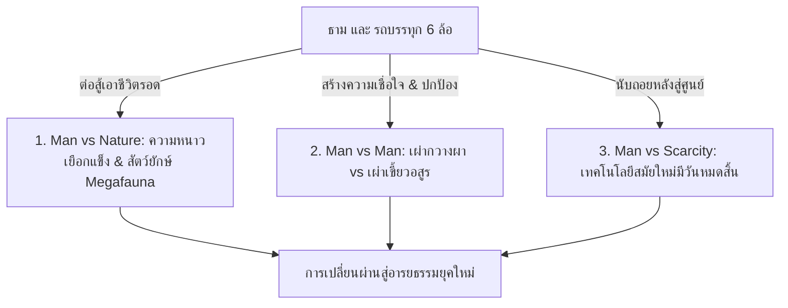

# โครงเรื่องแม่บทและ Story Outline — 10000-BC (พลิกยุคหินด้วยรถบรรทุกสะดวกซื้อ)

> 📖 **คำชี้แจง:** เอกสารฉบับนี้รวบรวม **โครงสร้างโครงเรื่องหลัก (Master Plot Architecture)** และ **Story Chapters Outline รายบทแบบละเอียด** โดยใช้แนวทางการเล่าเรื่องแบบนวนิยายแปลเอาชีวิตรอดระดับสากล (Gritty Cinematic Survival Thriller & Prehistoric Civilization Uplift) เพื่อใช้เป็นพิมพ์เขียวในการประพันธ์ตลอดทั้งเรื่อง

---

# ภาคที่ 1: โครงสร้างโครงเรื่องแม่บท (Master Plot Architecture)

## 🎯 1. แก่นเรื่องหลักและแนวคิด (Core Premise & Themes)
* **Logline:** เมื่อพนักงานขับรถขนส่งสินค้าสายเทือกเขาเขตหนาวพร้อมรถบรรทุกหกล้อตู้ทึบที่อัดแน่นด้วยสินค้ามินิมาร์ตประสบอุบัติเหตุทะลุมิติมายังยุค 10,000 ปีก่อนคริสตกาล เขาต้องใช้ "ปราการเหล็ก" และสิ่งของสมัยใหม่ที่มีอยู่อย่างจำกัดเพื่อเอาชีวิตรอดจากสัตว์ยักษ์ดึกดำบรรพ์ ผูกมิตรกับมนุษย์ยุคหิน และถ่ายทอดรากฐานอารยธรรมก่อนที่เทคโนโลยีจากอนาคตจะหมดสิ้นลง
* **ธีมหลัก (Central Theme):** *"สิ่งของสมัยใหม่มอบเพียงเวลาตั้งหลัก แต่ปัญญา วิทยาศาสตร์ และการร่วมมือกันของมนุษย์ คืออาวุธที่แท้จริงในการสร้างอารยธรรม"*
* **โทนเรื่อง (Tone):** สมจริง ดิบเถื่อน ตึงเครียด ลุ้นระทึก สัมผัสถึงความหนาวเหน็บของปลายยุคน้ำแข็งและอันตรายรอบด้าน สลับกับความหวังและการก้าวกระโดดทางปัญญา

---

## ⚡ 2. ปมขัดแย้ง 3 ระดับ (Three-Tier Conflict)

1. **มนุษย์ vs ธรรมชาติ (Man vs Nature):**
   * อุณหภูมิเยือกแข็งต่ำกว่าจุดเยือกแข็งของทุ่งทุนดราและพายุหิมะปลายยุคน้ำแข็ง
   * สัตว์ยักษ์ดึกดำบรรพ์ (Megafauna): หมีถ้ำยักษ์ (Cave Bear), เสือเขี้ยวดาบ (Smilodon), ฝูงหมาป่าไดร์วูล์ฟ (Dire Wolves)
   * การขาดแคลนแหล่งน้ำดื่มสะอาดและการติดเชื้อของบาดแผล
2. **มนุษย์ vs มนุษย์ (Man vs Man):**
   * กำแพงภาษาและความหวาดระแวงแรกเริ่มระหว่างธามกับชนเผ่ากวางผา (Cliff Deer Tribe)
   * การรุกรานอันโหดเหี้ยมของเผ่าเขี้ยวอสูร (Beast Fang Tribe) ชนเผ่าเร่ร่อนกินคนที่ต้องการแย่งชิง "กล่องเหล็กวิเศษ"
3. **มนุษย์ vs ทรัพยากรที่หมดสิ้นได้ (Man vs Finite Technology):**
   * น้ำมันดีเซลในถัง (74.5 ลิตร) มีแต่ลดลง ไม่มีการเติมเพิ่ม
   * ก๊าซในไฟแช็กและแบตเตอรี่รถยนต์มีอายุการใช้งานจำกัด
   * ธามต้อง "แข่งกับเวลา" ในการถ่ายทอดวิทยาการทดแทน (เช่น วิธีจุดไฟด้วยคันธนูหมุน, การทำเครื่องปั้นดินเผา, การถนอมอาหารด้วยเกลือ, การหลอมเศษเหล็ก) ก่อนที่เสบียงสมัยใหม่จะกลายเป็นศูนย์

---

## 🏛️ 3. โครงสร้าง 4 องก์ (The 4-Act Civilization Arc)

* **Act 1: The Arrival & First Contact (บทที่ 1 - 10):**
  * *วิกฤต:* อุบัติเหตุทะลุมิติ, คืนแรกเผชิญหน้าหมีถ้ำ, การเผชิญหน้าชนเผ่ากวางผา
  * *จุดเปลี่ยน:* ใช้แตรลม ไฟแช็ก เกลือ และยาปฏิชีวนะ เปลี่ยนสถานะจาก "คนแปลกหน้า/อสูร" เป็น "ผู้นำแห่งเพลิงและเสบียง"
* **Act 2: Fortification & The Scarcity Crucible (บทที่ 11 - 20):**
  * *วิกฤต:* อพยพเผ่ามาตั้งฐานรอบรถบรรทุก, ไฟแช็กเริ่มหมด, ฤดูหนาวคืบคลานเข้ามา
  * *จุดเปลี่ยน:* ถ่ายทอดความรู้คันธนูหมุนไฟ (Bow Drill), แปรรูปเกลือถนอมเนื้อรมควัน, ดัดแปลงขยะพลาสติกเป็นหลังคาและรางน้ำ, สังหารสายสืบศัตรูด้วยยุทธวิธีพรางตัว
* **Act 3: The Megafauna Hunt & The Great Siege (บทที่ 21 - 32):**
  * *วิกฤต:* หมีถ้ำบุกทำลายค่าย, กองทัพเผ่าเขี้ยวอสูร 100 นายยกทัพมาปิดล้อม
  * *จุดเปลี่ยน:* รถบรรทุกกลายเป็นป้อมปราการหน้าค่าย, ใช้ไฟสปอร์ตไลต์ส่องตาพร่า, ระเบิดเพลิงดีเซล (Molotov Cocktail) + หอกปลายคัตเตอร์เหล็กกล้า, ยิงพลุสัญญาณเผด็จศึกกราก
* **Act 4: Dawn of the New Age & The Sacred Altar (บทที่ 33 - 40+):**
  * *วิกฤต:* น้ำมันและแบตเตอรี่หมดสิ้น ตู้สินค้าว่างเปล่า
  * *จุดเปลี่ยน:* เริ่มต้นการเพาะปลูกข้าวสาลี บาร์เลย์ และพริก, หลอมแหนบรถยนต์เป็นเครื่องมือโลหะชุดแรก, รถบรรทุก 6 ล้อกลายเป็นแท่นบูชาเทวสถานและจุดกำเนิดมหานครแห่งแรกของมนุษยชาติ

---

# ภาคที่ 2: Story Chapters Outline (รายละเอียดรายบท)

---

### องค์ที่ 1: การมาถึงและการเผชิญหน้าครั้งแรก (Act 1: The Arrival & First Contact)

#### บทที่ 1: พายุหมอกทมิฬและปราการเหล็กนิรนาม (The Black Fog and the Iron Bastion)
* **เป้าหมายของบท:** เปิดตัวธาม อุบัติเหตุทะลุมิติ และการเผชิญหน้าคืนแรกในความมืด
* **ความขัดแย้ง/อุปสรรค:** รถบรรทุก 6 ล้อเสียหลักทะลุมิติมาติดหล่มโคลนในเขตหนาว ไร้สัญญาณสื่อสาร สัตว์ร้ายดึกดำบรรพ์เข้าจู่โจมตู้เหล็ก
* **การคลี่คลาย:** ตู้ทึบเหล็กกล้ากันกรงเล็บหมีถ้ำได้สำเร็จ ธามตระหนักว่าตนเองหลุดมาอยู่ในยุคก่อนประวัติศาสตร์
* **การใช้ทรัพยากร:** น้ำมันดีเซล 0.5L (ทดสอบสตาร์ท), แครกเกอร์ 1 ซอง, ถ่านไฟฉาย 10 นาที
* **ฉากทิ้งท้าย (Cliffhanger):** เสียงคำรามของหมีถ้ำจางหายไป ทิ้งรอยกรงเล็บลึก 3 รอยบนแผ่นเหล็ก ธามต้องรอให้ถึงรุ่งสาง

#### บทที่ 2: รุ่งอรุณสีเลือดและรอยเท้าบรรพกาล (Blood Dawn and the Ancient Tracks)
* **เป้าหมายของบท:** สำรวจพื้นที่รอบรถบรรทุกในยามเช้า ตรวจนับคลังสินค้าและประเมินสภาพแวดล้อม
* **ความขัดแย้ง/อุปสรรค:** อุณหภูมิดิ่งลงต่ำกว่าจุดเยือกแข็ง ลมหนาวพัดกระหน่ำ ล้อรถติดหล่มลึกเกินกว่าจะขับเคลื่อน
* **การคลี่คลาย:** ธามตรวจพบคลังอาหาร ยา และเครื่องมือในสภาพสมบูรณ์ พร้อมรอยเท้าขนาดยักษ์รอบรถที่ยืนยันการมีอยู่ของหมีถ้ำยุคน้ำแข็ง
* **การใช้ทรัพยากร:** ข้าวโอ๊ต 1 ชาม (ผสมน้ำต้ม), แอลกอฮอล์จุดไฟ 50 มล., ทิชชูเปียก 2 แผ่น
* **ฉากทิ้งท้าย (Cliffhanger):** เงาร่างมนุษย์หนังสัตว์กลุ่มแรกปรากฏขึ้นบนสันเขา กำลังเล็งหอกหินมายังตัวรถ

#### บทที่ 3: เงาร่างแห่งขุนเขาและเสียงแตรสะท้านไพร (Shadows on the Ridge)
* **เป้าหมายของบท:** การเผชิญหน้าครั้งแรกระหว่างธามกับนักล่าเผ่ากวางผา (คูราน และ เอลยา)
* **ความขัดแย้ง/อุปสรรค:** ชนเผ่าคิดว่ารถบรรทุกเป็นอสูรเปลือกเหล็ก เตรียมจะซัดหอกหินเข้าใส่กระจกหน้ารถ
* **การคลี่คลาย:** ธามตัดสินใจบิดสวิตช์กด **แตรลมไฟฟ้า (Air Horn)** เสียงแหลมก้องกัมปนาทสะท้านหุบเขา ช็อกประสาทจนคนป่าทรุดตัวลงกราบ
* **การใช้ทรัพยากร:** ไฟแบตเตอรี่รถยนต์ (กดแตรลม 3 วินาที)
* **ฉากทิ้งท้าย (Cliffhanger):** พรานสาวยังคงเกร็งธนูไม้ดัดเล็งมาที่ประตูรถ แม้ร่างกายจะสั่นสะท้านด้วยความกลัว

#### บทที่ 4: เปลวไฟในเสี้ยววินาทีและรสชาติของพระเจ้า (The Instant Flame and the White Gold)
* **เป้าหมายของบท:** การเปิดประตูเจรจาด้วยภาษากาย การมอบเปลวไฟและเกลือ
* **ความขัดแย้ง/อุปสรรค:** คนป่ายังไม่ยอมลดอาวุธและหวาดระแวงในตัวธามที่สวมชุดแปลกประหลาด
* **การคลี่คลาย:** ธามหยิบไฟแช็กแก๊สกดจุดไฟให้ดูในพริบตา ทำให้หมอผีโมกาตกตะลึง จากนั้นแบ่งแครกเกอร์แตะเกลือบริสุทธิ์ให้คูรานชิม รสชาติเค็มเข้มข้นสร้างความตกตะลึงระดับพลิกโลก
* **การใช้ทรัพยากร:** ไฟแช็กแก๊ส (จุด 2 ครั้ง), แครกเกอร์ 2 ชิ้น, เกลือบริสุทธิ์ 5 กรัม
* **ฉากทิ้งท้าย (Cliffhanger):** เอลยาทรุดฮวบลงกับพื้น เลือดสีคล้ำไหลซึมจากบาดแผลเน่าเปื่อยที่ต้นขา

#### บทที่ 5: แผลเน่าของพรานสาวและการรักษาปาฏิหาริย์ (The Wounded Huntress and the Healing Miracle)
* **เป้าหมายของบท:** ใช้เวชภัณฑ์สมัยใหม่รักษาแผลติดเชื้อของเอลยา
* **ความขัดแย้ง/อุปสรรค:** แผลถูกเขี้ยวหมาป่ากัดจนเป็นหนอง พิษไข้ขึ้นสูง หากปล่อยไว้เธอจะตายภายในสองวัน
* **การคลี่คลาย:** ธามใช้มีดคัตเตอร์กรีดเปิดปากแผล ล้างด้วยน้ำเกลือและเบตาดีน ป้อนยา Amoxicillin และพาราเซตามอล พร้อมพันผ้าก๊อซปลอดเชื้อ
* **การใช้ทรัพยากร:** Amoxicillin 500mg 2 แคปซูล, พาราเซตามอล 1 เม็ด, เบตาดีน 20 มล., ผ้าก๊อซ 1 ม้วน
* **ฉากทิ้งท้าย (Cliffhanger):** ตกดึก เอลยาฟื้นคืนสติ พิษไข้ลดลง ดวงตาคู่นั้นมองธามด้วยความเลื่อมใสระคนตกตะลึง

#### บทที่ 6: คมมีดเหล็กกล้าและพันธสัญญาแรก (The Steel Blade and the Pact)
* **เป้าหมายของบท:** แสดงอำนาจของโลหะกล้า และการสร้างข้อตกลงแรกระหว่างสองโลก
* **ความขัดแย้ง/อุปสรรค:** อาวุธหินของคนป่าทื่อและเปราะบาง แล่หนังสัตว์ได้ช้ามาก
* **การคลี่คลาย:** ธามใช้มีดคัตเตอร์ช่างกรีดแล่หนังสัตว์และเหลาหอกไม้ได้อย่างคมกริบ คูรานตัดสินใจทำข้อตกลงนำเผ่ามาตั้งค่ายข้างรถบรรทุก
* **การใช้ทรัพยากร:** ใบมีดคัตเตอร์ 1 ใบ (ใช้งาน), แผ่นพลาสเตอร์ยา 2 ชิ้น (ปิดแผลให้เด็กในเผ่า)
* **ฉากทิ้งท้าย (Cliffhanger):** ขบวนชนเผ่ากวางผา 30 กว่าชีวิตเริ่มอพยพมายังรถบรรทุก ท่ามกลางสายตาของเงาร่างลึกลับบนยอดเขา

#### บทที่ 7: หม้อสเตนเลสและงานเลี้ยงสตูว์เนื้อครั้งแรก (The Stainless Pot and the First Feast)
* **เป้าหมายของบท:** การทำอาหารปรุงรสในภาชนะโลหะ และการสร้างความผูกพัน
* **ความขัดแย้ง/อุปสรรค:** อาหารของคนป่าคือเนื้อย่างไหม้เกรียม ขาดสารอาหารและรสชาติ
* **การคลี่คลาย:** ธามนำหม้อสเตนเลสสต็อกพ็อตมาต้มสตูว์เนื้อกวาง ใส่เกลือ พริกไทยดำ และซุปก้อนเข้มข้น กลิ่นหอมฟุ้งดึงดูดทุกคนในเผ่า ทาร่าได้กินอาหารอุ่นอร่อยเป็นครั้งแรก
* **การใช้ทรัพยากร:** เกลือ 30 กรัม, พริกไทยดำ 5 กรัม, ซุปก้อน 1 ก้อน, น้ำสะอาด 3 ลิตร
* **ฉากทิ้งท้าย (Cliffhanger):** เสียงหอนประสานเสียงของฝูงหมาป่ายุคน้ำแข็งดังขึ้นรอบทิศทาง กลิ่นเนื้อต้มล่อพวกมันเข้ามา

#### บทที่ 8: กฎเหล็กแห่งการสงวนเสบียง (Discipline of Scarcity)
* **เป้าหมายของบท:** ธามวางระบบควบคุมทรัพยากร ป้องกันการพึ่งพาเทคโนโลยีจนเกินไป
* **ความขัดแย้ง/อุปสรรค:** คนในเผ่าเริ่มร้องขอ "ไฟวิเศษ" และอาหารสำเร็จรูป
* **การคลี่คลาย:** ธามล็อกตู้ทึบแน่นหนา ตั้งกฎว่าสิ่งของคือรางวัลสำหรับการทำงาน (ขนฟืน กักตุนหิน สร้างคันดิน) พร้อมสอนสุขอนามัยการขุดหลุมสุขา
* **การใช้ทรัพยากร:** สบู่ก้อน 1 ก้อน (สอนล้างมือ), ถุงขยะดำ 1 ใบ (กักเก็บเศษขยะ)
* **ฉากทิ้งท้าย (Cliffhanger):** ลมกรรโชกแรงพัดพาไอหนาวเหน็บ ดัชนีความเย็นลดฮวบลงสู่พายุหิมะลูกแรก

#### บทที่ 9: คืนล่าของฝูงไดร์วูล์ฟและลำแสงผ่าความมืด (Night of the Dire Wolves)
* **เป้าหมายของบท:** การปะทะกับฝูงสัตว์นักล่ายามค่ำคืนด้วยเทคโนโลยียานยนต์
* **ความขัดแย้ง/อุปสรรค:** ฝูงหมาป่าไดร์วูล์ฟกว่า 10 ตัวล้อมค่าย หอกหินของคนป่าต้านไม่อยู่
* **การคลี่คลาย:** ธามสตาร์ทเครื่องยนต์ดีเซล 4.0L เสียงคำรามและควันดำทำให้หมาป่าชะงัก ก่อนที่เขาจะเปิดไฟหน้าสปอร์ตไลต์ส่องตาพร่าและกดแตรลมซ้ำ ฝูงหมาป่าเตลิดหนี
* **การใช้ทรัพยากร:** น้ำมันดีเซล 1 ลิตร, ไฟแบตเตอรี่ 24V (ส่องไฟ 5 นาที)
* **ฉากทิ้งท้าย (Cliffhanger):** หนึ่งในหมาป่าที่ตายทิ้งรอยแผลจาก "หอกกระดูกมนุษย์"—หลักฐานว่ามีชนเผ่าอื่นควบคุมพวกมัน

#### บทที่ 10: คำเตือนจากผนังถ้ำและเงาของเผ่าเขี้ยวอสูร (The Bone Spear and the Red Threat)
* **เป้าหมายของบท:** สรุปบทเรียนสัปดาห์แรกและการรับรู้ถึงภัยคุกคามจากเผ่าเขี้ยวอสูร
* **ความขัดแย้ง/อุปสรรค:** เอลยาพาธามไปดูภาพเขียนสีเลือดบนผนังถ้ำ เล่าเรื่องเผ่ากินคนเขี้ยวอสูรที่จะออกปล้นก่อนหน้าหนาว
* **การคลี่คลาย:** ธามรู้ว่าลำพังแตรลมและไฟหน้าไม่พอหยุดกองทัพมนุษย์ เขาต้องเริ่มเปลี่ยนรถบรรทุกเป็น "ป้อมปราการสงคราม"
* **การใช้ทรัพยากร:** สมุดโน้ตและปากกา (บันทึกผังค่าย), แครกเกอร์ 1 ซอง
* **ฉากทิ้งท้าย (Cliffhanger):** ควันไฟสีดำลอยขึ้นจากขอบฟ้าทางเหนือ ค่ายของเผ่าเพื่อนบ้านถูกเผาทำลายแล้ว!

---

### องค์ที่ 2: การสร้างป้อมปราการและการถ่ายทอดปัญญา (Act 2: Fortification & Knowledge Transfer)

#### บทที่ 11: ป้อมปราการรถบรรทุกและกำแพงขวากหิน (The Mobile Fortress)
* **เป้าหมาย:** สร้างแนวป้องกันร่วมระหว่างตัวถังรถกับวัสดุธรรมชาติ
* **เนื้อหาสำคัญ:** ใช้แม่แรงไฮดรอลิก 5 ตันและชะแลงช่วยงัดหินก้อนโตทำแนวกำแพง ขึงสายสลิงลากรถ 10 เมตรเป็นแนวดักสะดุด ดัดแปลงถุงขยะดำเป็นรางรับน้ำฝน

#### บทที่ 12: การกำเนิดคันธนูหมุนไฟ (The Bow Drill Revolution)
* **เป้าหมาย:** ถ่ายทอดวิทยาการจุดไฟก่อนแก๊สในไฟแช็กจะหมด
* **เนื้อหาสำคัญ:** ไฟแช็กหมดไป 2 อัน ธามใช้มีดพกสอนเอลยาและคูรานทำคันธนูหมุนไม้ (Bow Drill) หาเชื้อไฟแห้ง เมื่อควันแรกพวยพุ่ง คนทั้งเผ่าก้มลงกราบแผ่นดิน

#### บทที่ 13: ศาสตร์แห่งการถนอมอาหาร: คลังเนื้อเค็มและโรงรมควัน (The Salt and Smoke Vault)
* **เป้าหมาย:** สอนการถนอมอาหารด้วยเกลือและควันไฟ
* **เนื้อหาสำคัญ:** ล่าวัวไบซอนยักษ์ได้ 1 ตัว ใช้เกลือบริสุทธิ์ 5 กก. หมักเนื้อ และสร้างโรงรมควันไม้สน สามารถเก็บเนื้อได้นับร้อยกิโลกรัม รอดพ้นวิกฤตอดอยาก

#### บทที่ 14: สเปรย์พริกไทยโบราณและเกราะยางรถยนต์ (Chemical Defense and Rubber Armor)
* **เป้าหมาย:** ประดิษฐ์อาวุธป้องกันตัวจากสิ่งของในรถ
* **เนื้อหาสำคัญ:** ผสมผงพริกป่นคาเยนน์กับซอสเผ็ดในขวดพลาสติก ทำกระบอกฉีดสกัดสัตว์ร้าย ตัดยางอะไหล่และสายพานทำเกราะเสริมหน้าอกและรองเท้ากันน้ำแข็งให้เอลยา

#### บทที่ 15: ผู้อพยพใต้เพลิงสงคราม (Refugees of the Ashen Sky)
* **เป้าหมาย:** การขยายขนาดของชุมชนและการทูตระหว่างเผ่า
* **เนื้อหาสำคัญ:** ผู้รอดชีวิตจากเผ่ากวางขาวหนีตายมาขอพึ่งพิง ธามใช้ยาปฏิชีวนะรักษาบาดแผลไฟลวก ได้กำลังคนเพิ่มขึ้นเป็น 60 ชีวิต

#### บทที่ 16: หอกปลายเหล็กกล้าและยุทธวิธีตั้งแถว (The First Steel Spears)
* **เป้าหมาย:** อัปเกรดอาวุธและฝึกยุทธวิธีทางทหาร
* **เนื้อหาสำคัญ:** สละใบมีดคัตเตอร์สำรองและแกนเหล็ก ประกอบเข้ากับด้ามไม้เนื้อแข็ง พันด้วยเทปผ้า Duct Tape กลายเป็นหอกปลายเหล็กกล้า 5 เล่มแรกของโลก

#### บทที่ 17: ประมวลกฎหมายแห่งปราการเหล็ก (The Code of the Iron Camp)
* **เป้าหมาย:** การสร้างระบบสังคม กฎระเบียบ และการแบ่งหน้าที่
* **เนื้อหาสำคัญ:** ธามกับคูรานร่างกฎการอยู่ร่วมกัน การเข้าเวรยาม การแจกจ่ายอาหารตามส่วน และการรักษาความสะอาดของแหล่งน้ำ

#### บทที่ 18: พายุหิมะทมิฬและการทดสอบความเยือกแข็ง (The White Oblivion)
* **เป้าหมาย:** เผชิญหน้ากับพายุหิมะลูกใหญ่ที่สุด
* **เนื้อหาสำคัญ:** อุณหภูมิดิ่งลงลบ 15 องศา ธามเปิดเครื่องทำความร้อนในห้องโดยสารสลับดับเครื่องเพื่อประหยัดน้ำมัน นำเด็กและคนชราผลัดกันเข้ามาหลบในตู้ทึบ รอดตายยกเผ่า

#### บทที่ 19: สายสืบในความมืดและลำแสงตาบอด (The Blinding Flash)
* **เป้าหมาย:** การเผชิญหน้าแรกกับเผ่าเขี้ยวอสูร
* **เนื้อหาสำคัญ:** สายสืบของเผ่าเขี้ยวอสูรลอบเข้ามาสอดแนม ธามใช้ไฟฉายยุทธวิธีกดสโตรบ (Strobe Flash) ส่องเข้าตาจนตาพร่าและจับกุมได้ ปล่อยตัวกลับไปเพื่อส่งสารเตือน

#### บทที่ 20: คลื่นลมสงบก่อนพายุรบ (The Eve of War)
* **เป้าหมาย:** การเตรียมพร้อมขั้นสุดท้ายสำหรับสงครามเต็มรูปแบบ
* **เนื้อหาสำคัญ:** กราก ขุนศึกเขี้ยวอสูรระดมนักรบกว่า 100 นาย ธามตรวจเช็กน้ำมันดีเซล (เหลือ 60 ลิตร) เตรียมขวดระเบิดเพลิงและบรรจุกระสุนพลุสัญญาณฉุกเฉิน

---

### องค์ที่ 3: หมีถ้ำยักษ์และสงครามเผ่าเขี้ยวอสูร (Act 3: Megafauna & The Great Siege)

#### บทที่ 21: อสูรตื่นจากจำศีล (Awakening of the Cave Bear)
* **เป้าหมาย:** การต่อสู้ขั้นแตกหักกับหมีถ้ำยักษ์น้ำหนัก 1 ตันที่ถูกกลิ่นเนื้อรมควันดึงดูด
* **เนื้อหาสำคัญ:** หมีถ้ำพังแนวกำแพงหินชั้นนอก หอกหินแทงไม่เข้า ธามต้องปีนขึ้นหลังคารถบรรทุก

#### บทที่ 22: ลำแสงสปอร์ตไลต์และคมเขี้ยวโลหะ (Blinding Light and Carbon Steel)
* **เป้าหมาย:** กำจัดหมีถ้ำด้วยการประสานเทคโนโลยีกับความกล้าหาญ
* **เนื้อหาสำคัญ:** ธามเปิดไฟสปอร์ตไลต์กำลังสูงส่องเบ้าตาหมีถ้ำจนตาบอดชั่วขณะ สาดกระบอกพริกไทยใส่จมูก เอลยาพุ่งซัดหอกปลายเหล็กกล้าเจาะเข้าใต้ลำคอปลิดชีพสำเร็จ

#### บทที่ 23: คลื่นมนุษย์คนเถื่อนบุกค่าย (The Screaming Swarm)
* **เป้าหมาย:** กองทัพเผ่าเขี้ยวอสูร 100 นายเปิดฉากบุกจู่โจมยามค่ำคืน
* **เนื้อหาสำคัญ:** แนวกำแพงหินและสายสลิงดักสะดุดทำให้ระลอกแรกสะดุดล้มลงอย่างระเนระนาด

#### บทที่ 24: เปลวเพลิงสีส้มและเสียงกัมปนาท (The Bottled Fire and Thunder)
* **เป้าหมาย:** พลิกสถานการณ์สงครามด้วยระเบิดเพลิงดีเซล
* **เนื้อหาสำคัญ:** ธามขว้างระเบิดเพลิงขวดแก้ว (Molotov) ใส่แนวหน้า เปลวไฟดีเซลลุกท่วมพื้นหิมะ ธามเหยียบคันเร่งเครื่องยนต์คำรามและบีบแตรลม ศัตรูขวัญกระเจิง

#### บทที่ 25: ศึกตัดสินหน้าปราการเหล็ก (The Duel of Iron and Bone)
* **เป้าหมาย:** การปะทะตัวต่อตัวระหว่างธามกับกราก
* **เนื้อหาสำคัญ:** กรากบ้าคลั่งฝ่าเปลวเพลิงเข้ามาเงื้อค้อนหินยักษ์ ธามใช้ชะแลงเหล็กกล้ารับแรงกระแทก ก่อนจะยิงพลุไฟฉุกเฉิน (Flare) ท้ายรถอัดเข้ากลางอกของกรากจนล้มลง

#### บทที่ 26: อวสานเขี้ยวอสูรและการรวมเผ่าพันธุ์ (The Fall of Fangs)
* **เป้าหมาย:** บทสรุปของสงครามและการจัดการผู้แพ้
* **เนื้อหาสำคัญ:** กองทัพเขี้ยวอสูรยอมจำนน ธามไม่สั่งประหาร แต่สั่งริบอาวุธและจัดระเบียบให้ทำงานสร้างค่ายร่วมกัน รวมดินแดนเข้าเป็นหนึ่งเดียว

---

### องค์ที่ 4: รุ่งอรุณแห่งอารยธรรมและมรดกนิรันดร์ (Act 4: Dawn of the New Age)

#### บทที่ 27: คลังสินค้าที่ว่างเปล่า (The Empty Container)
* **เป้าหมาย:** เผชิญหน้ากับความจริงเมื่อสิ่งของสมัยใหม่หมดสิ้นลง
* **เนื้อหาสำคัญ:** น้ำมันหมดถัง แบตเตอรี่เสื่อมสภาพ ยาปฏิชีวนะหมดเกลี้ยง ตู้สินค้าว่างเปล่า แต่ผู้คนมีอาหาร มีความรู้ และมีระเบียบวินัย

#### บทที่ 28: เมล็ดพันธุ์แห่งอนาคต (The First Sowing)
* **เป้าหมาย:** จุดเริ่มต้นของการปฏิวัติเกษตรกรรม (Neolithic Revolution)
* **เนื้อหาสำคัญ:** นำเมล็ดข้าวบาร์เลย์ ข้าวสาลี และถั่วแห้งที่เก็บไว้ก้นตู้มาเพาะปลูก สอนการทำคันไถไม้ปลายหินและระบบชลประทานผันน้ำ

#### บทที่ 29: เตาหลอมโลหะแห่งแรกจากเศษเหล็ก (The First Forge)
* **เป้าหมาย:** การเปลี่ยนผ่านสู่ยุคโลหะก่อนเวลาในประวัติศาสตร์
* **เนื้อหาสำคัญ:** สร้างเตาเผาดินเหนียวอุณหภูมิสูง ถอดแหนบรถยนต์และเหล็กตู้ทึบที่ไม่ใช้แล้วมาตีขึ้นรูปเป็นขวานและหัวคันไถเหล็กกล้า

#### บทที่ 30: แท่นบูชาศักดิ์สิทธิ์และบทสรุปตำนานหมื่นปี (The Eternal Monument)
* **เป้าหมาย:** สรุปมหากาพย์และการสถาปนามหานครแห่งแรก
* **เนื้อหาสำคัญ:** โครงเหล็กของรถบรรทุก 6 ล้อตู้ทึบถูกยกขึ้นตั้งเป็นศูนย์กลางมหานคร ธามมองดูทุ่งข้าวสาลีสีทองที่กำลังออกรวงข้างเอลยาและผู้คน มรดกแห่งอนาคตได้หยั่งรากลึกแล้ว
